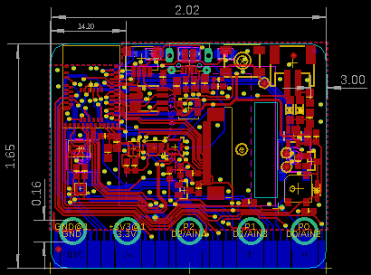

Contents
========

* [PRA4500 > Adafruit CLUE PCB](#pra4500--adafruit-clue-pcb)
	* [Schematic](#schematic)
	* [PCB](#pcb)
	* [Interactive BOM](#interactive-bom)
	* [OOMP Parts](#oomp-parts)
	* [Images](#images)
	* [Tags](#tags)
  
![][im]
# PRA4500 > Adafruit CLUE PCB

- ID: PROJ-ADAF-4500-STAN-01
- Hex ID: PRA4500
- Name: Adafruit
- Description: Adafruit
- Long Link: [http://oom.lt/PROJ-ADAF-4500-STAN-01](http://oom.lt/PROJ-ADAF-4500-STAN-01)
- Short Link: [http://oom.lt/PRA4500](http://oom.lt/PRA4500)

## Schematic
  

## PCB
  

## Interactive BOM

- Interactive BOM page: [ibom.html](https://htmlpreview.github.io/?https://github.com/oomlout/oomlout_OOMP_projects/blob/main/PROJ-ADAF-4500-STAN-01/kicad/bom/ibom.html)

## OOMP Parts
  

|OOMP Parts|
| :---: |
|BTNA BTNA,UNMATCHED-UNMATCHED-X-UNMATCHED-01|
|BTNB BTNB,UNMATCHED-UNMATCHED-X-UNMATCHED-01|
|C3 C3,CAPC-0603-X-UF1D-01|
|C4 C4,CAPC-0603-X-UF1D-01|
|[C5 CAPC-0805-X-UF10-V10 SMD (0805) 10 uF Capacitor (Ceramic) 10v](https://github.com/oomlout/oomlout_OOMP_parts/tree/main/CAPC-0805-X-UF10-V10/)|
|[C6 CAPC-0805-X-UF10-V10 SMD (0805) 10 uF Capacitor (Ceramic) 10v](https://github.com/oomlout/oomlout_OOMP_parts/tree/main/CAPC-0805-X-UF10-V10/)|
|[C7 CAPC-0805-X-UF10-V10 SMD (0805) 10 uF Capacitor (Ceramic) 10v](https://github.com/oomlout/oomlout_OOMP_parts/tree/main/CAPC-0805-X-UF10-V10/)|
|[C8 CAPC-0805-X-UF10-V10 SMD (0805) 10 uF Capacitor (Ceramic) 10v](https://github.com/oomlout/oomlout_OOMP_parts/tree/main/CAPC-0805-X-UF10-V10/)|
|[C9 CAPC-0805-X-UF10-V10 SMD (0805) 10 uF Capacitor (Ceramic) 10v](https://github.com/oomlout/oomlout_OOMP_parts/tree/main/CAPC-0805-X-UF10-V10/)|
|C10 C10,CAPC-0603-X-UF1D-01|
|C11 C11,CAPC-0603-X-UF1D-01|
|C12 C12,CAPC-0603-X-UF1D-01|
|[C13 CAPC-0805-X-UF10-V10 SMD (0805) 10 uF Capacitor (Ceramic) 10v](https://github.com/oomlout/oomlout_OOMP_parts/tree/main/CAPC-0805-X-UF10-V10/)|
|C14 C14,CAPC-0603-X-UF1D-01|
|[CONN1 HEAD-I01-X-PI04-01 2.54 mm 4 Pin Header](https://github.com/oomlout/oomlout_OOMP_parts/tree/main/HEAD-I01-X-PI04-01/)|
|[D1 DIOD-S123-X-KMBR120-01 SMD (SOD-123) MBR120 Diode](https://github.com/oomlout/oomlout_OOMP_parts/tree/main/DIOD-S123-X-KMBR120-01/)|
|[D2 LEDS-0603-G-STAN-01 SMD (0603) Green LED](https://github.com/oomlout/oomlout_OOMP_parts/tree/main/LEDS-0603-G-STAN-01/)|
|D3 D3,LEDS-UNMATCHED-G-STAN-01|
|D4 D4,LEDS-UNMATCHED-G-STAN-01|
|[D5 DIOD-S123-X-KMBR120-01 SMD (SOD-123) MBR120 Diode](https://github.com/oomlout/oomlout_OOMP_parts/tree/main/DIOD-S123-X-KMBR120-01/)|
|[D6 DIOD-S323-X-K4148-01 SMD (SOD-323) Diode](https://github.com/oomlout/oomlout_OOMP_parts/tree/main/DIOD-S323-X-K4148-01/)|
|DISPLAY2 DISPLAY2,UNMATCHED-UNMATCHED-X-UNMATCHED-01|
|IC1 IC1,UNMATCHED-UNMATCHED-X-UNMATCHED-01|
|IC2 IC2,UNMATCHED-UNMATCHED-X-UNMATCHED-01|
|IC3 IC3,UNMATCHED-UNMATCHED-X-UNMATCHED-01|
|IC4 IC4,UNMATCHED-UNMATCHED-X-UNMATCHED-01|
|[LED1 LEDS-3535-RGB-K2812-01 SMD (3535) Smart Controller (WS2812B) RGB LED](https://github.com/oomlout/oomlout_OOMP_parts/tree/main/LEDS-3535-RGB-K2812-01/)|
|MB1 MB1,UNMATCHED-UNMATCHED-X-UNMATCHED-01|
|MDBT1 MDBT1,UNMATCHED-UNMATCHED-X-UNMATCHED-01|
|[Q1 MOSN-SO23-X-KBSS138-01 SMD (SOT-23) BSS138 N-Ch. MOSFET](https://github.com/oomlout/oomlout_OOMP_parts/tree/main/MOSN-SO23-X-KBSS138-01/)|
|[Q3 MOSN-SO23-X-KBSS138-01 SMD (SOT-23) BSS138 N-Ch. MOSFET](https://github.com/oomlout/oomlout_OOMP_parts/tree/main/MOSN-SO23-X-KBSS138-01/)|
|[R1 RESE-0603-X-O472-01 SMD (0603) 4.7k Ohm Resistor](https://github.com/oomlout/oomlout_OOMP_parts/tree/main/RESE-0603-X-O472-01/)|
|[R2 RESE-0603-X-O102-01 SMD (0603) 1k Ohm Resistor](https://github.com/oomlout/oomlout_OOMP_parts/tree/main/RESE-0603-X-O102-01/)|
|[R3 RESE-0603-X-O472-01 SMD (0603) 4.7k Ohm Resistor](https://github.com/oomlout/oomlout_OOMP_parts/tree/main/RESE-0603-X-O472-01/)|
|[R4 RESE-0603-X-O103-01 SMD (0603) 10k Ohm Resistor](https://github.com/oomlout/oomlout_OOMP_parts/tree/main/RESE-0603-X-O103-01/)|
|[R5 RESE-0603-X-O100-01 SMD (0603) 10 Ohm Resistor](https://github.com/oomlout/oomlout_OOMP_parts/tree/main/RESE-0603-X-O100-01/)|
|[R6 RESE-0603-X-O100-01 SMD (0603) 10 Ohm Resistor](https://github.com/oomlout/oomlout_OOMP_parts/tree/main/RESE-0603-X-O100-01/)|
|R7 R7,RESE-0603-X-UNMATCHED-01|
|R8 R8,RESE-0603-X-UNMATCHED-01|
|R9 R9,RESE-0603-X-UNMATCHED-01|
|[R10 RESE-0603-X-O220-01 SMD (0603) 22 Ohm Resistor](https://github.com/oomlout/oomlout_OOMP_parts/tree/main/RESE-0603-X-O220-01/)|
|[R11 RESE-0603-X-O220-01 SMD (0603) 22 Ohm Resistor](https://github.com/oomlout/oomlout_OOMP_parts/tree/main/RESE-0603-X-O220-01/)|
|[R12 RESE-0603-X-O103-01 SMD (0603) 10k Ohm Resistor](https://github.com/oomlout/oomlout_OOMP_parts/tree/main/RESE-0603-X-O103-01/)|
|SP1 SP1,UNMATCHED-UNMATCHED-X-UNMATCHED-01|
|SW1 SW1,UNMATCHED-UNMATCHED-X-UNMATCHED-01|
|TP1 TP1,UNMATCHED-UNMATCHED-X-UNMATCHED-01|
|TP2 TP2,UNMATCHED-UNMATCHED-X-UNMATCHED-01|
|TP3 TP3,UNMATCHED-UNMATCHED-X-UNMATCHED-01|
|U1 U1,UNMATCHED-UNMATCHED-X-UNMATCHED-01|
|U2 U2,UNMATCHED-SO235-X-UNMATCHED-01|
|U3 U3,UNMATCHED-UNMATCHED-X-UNMATCHED-01|
|U4 U4,UNMATCHED-UNMATCHED-X-UNMATCHED-01|
|X1 X1,UNMATCHED-UNMATCHED-X-UNMATCHED-01|
|X3 X3,UNMATCHED-UNMATCHED-X-UNMATCHED-01|

## Images
  
  

|kicadPcb3d|kicadPcb3dFront|kicadPcb3dBack|eagleImage|eagleSchemImage|
| :---: | :---: | :---: | :---: | :---: |
||||||

## Tags

- hexID: PRA4500
- oompType: PROJ
- oompSize: ADAF
- oompColor: 4500
- oompDesc: STAN
- oompIndex: 01
- oompName: Adafruit CLUE PCB
- sources: All source files from https://github.com/adafruit/Adafruit-CLUE-PCB (source licence details in srcLicense.md)
- linkBuyPage: http://www.adafruit.com/products/4500
- oompID: PROJ-ADAF-4500-STAN-01
- oompParts: BTNA,UNMATCHED-UNMATCHED-X-UNMATCHED-01
- oompParts: BTNB,UNMATCHED-UNMATCHED-X-UNMATCHED-01
- oompParts: C3,CAPC-0603-X-UF1D-01
- oompParts: C4,CAPC-0603-X-UF1D-01
- oompParts: C5,CAPC-0805-X-UF10-V10
- oompParts: C6,CAPC-0805-X-UF10-V10
- oompParts: C7,CAPC-0805-X-UF10-V10
- oompParts: C8,CAPC-0805-X-UF10-V10
- oompParts: C9,CAPC-0805-X-UF10-V10
- oompParts: C10,CAPC-0603-X-UF1D-01
- oompParts: C11,CAPC-0603-X-UF1D-01
- oompParts: C12,CAPC-0603-X-UF1D-01
- oompParts: C13,CAPC-0805-X-UF10-V10
- oompParts: C14,CAPC-0603-X-UF1D-01
- oompParts: CONN1,HEAD-I01-X-PI04-01
- oompParts: D1,DIOD-S123-X-KMBR120-01
- oompParts: D2,LEDS-0603-G-STAN-01
- oompParts: D3,LEDS-UNMATCHED-G-STAN-01
- oompParts: D4,LEDS-UNMATCHED-G-STAN-01
- oompParts: D5,DIOD-S123-X-KMBR120-01
- oompParts: D6,DIOD-S323-X-K4148-01
- oompParts: DISPLAY2,UNMATCHED-UNMATCHED-X-UNMATCHED-01
- oompParts: IC1,UNMATCHED-UNMATCHED-X-UNMATCHED-01
- oompParts: IC2,UNMATCHED-UNMATCHED-X-UNMATCHED-01
- oompParts: IC3,UNMATCHED-UNMATCHED-X-UNMATCHED-01
- oompParts: IC4,UNMATCHED-UNMATCHED-X-UNMATCHED-01
- oompParts: LED1,LEDS-3535-RGB-K2812-01
- oompParts: MB1,UNMATCHED-UNMATCHED-X-UNMATCHED-01
- oompParts: MDBT1,UNMATCHED-UNMATCHED-X-UNMATCHED-01
- oompParts: Q1,MOSN-SO23-X-KBSS138-01
- oompParts: Q3,MOSN-SO23-X-KBSS138-01
- oompParts: R1,RESE-0603-X-O472-01
- oompParts: R2,RESE-0603-X-O102-01
- oompParts: R3,RESE-0603-X-O472-01
- oompParts: R4,RESE-0603-X-O103-01
- oompParts: R5,RESE-0603-X-O100-01
- oompParts: R6,RESE-0603-X-O100-01
- oompParts: R7,RESE-0603-X-UNMATCHED-01
- oompParts: R8,RESE-0603-X-UNMATCHED-01
- oompParts: R9,RESE-0603-X-UNMATCHED-01
- oompParts: R10,RESE-0603-X-O220-01
- oompParts: R11,RESE-0603-X-O220-01
- oompParts: R12,RESE-0603-X-O103-01
- oompParts: SP1,UNMATCHED-UNMATCHED-X-UNMATCHED-01
- oompParts: SW1,UNMATCHED-UNMATCHED-X-UNMATCHED-01
- oompParts: TP1,UNMATCHED-UNMATCHED-X-UNMATCHED-01
- oompParts: TP2,UNMATCHED-UNMATCHED-X-UNMATCHED-01
- oompParts: TP3,UNMATCHED-UNMATCHED-X-UNMATCHED-01
- oompParts: U1,UNMATCHED-UNMATCHED-X-UNMATCHED-01
- oompParts: U2,UNMATCHED-SO235-X-UNMATCHED-01
- oompParts: U3,UNMATCHED-UNMATCHED-X-UNMATCHED-01
- oompParts: U4,UNMATCHED-UNMATCHED-X-UNMATCHED-01
- oompParts: X1,UNMATCHED-UNMATCHED-X-UNMATCHED-01
- oompParts: X3,UNMATCHED-UNMATCHED-X-UNMATCHED-01
- rawParts: BTNA,6mm,SWITCH_TACT_SMT_6MM,6MMX6MM_TACTILE_SMT,SMT Tact Switches,,
- rawParts: BTNB,6mm,SWITCH_TACT_SMT_6MM,6MMX6MM_TACTILE_SMT,SMT Tact Switches,,
- rawParts: C3,0.1uF,CAP_CERAMIC0603_NO,0603-NO,Ceramic Capacitors,,
- rawParts: C4,0.1uF,CAP_CERAMIC0603_NO,0603-NO,Ceramic Capacitors,,
- rawParts: C5,10uF,CAP_CERAMIC0805-NOOUTLINE,0805-NO,Ceramic Capacitors,,
- rawParts: C6,10uF,CAP_CERAMIC0805-NOOUTLINE,0805-NO,Ceramic Capacitors,,
- rawParts: C7,10uF,CAP_CERAMIC0805-NOOUTLINE,0805-NO,Ceramic Capacitors,,
- rawParts: C8,10uF,CAP_CERAMIC0805-NOOUTLINE,0805-NO,Ceramic Capacitors,,
- rawParts: C9,10uF,CAP_CERAMIC0805-NOOUTLINE,0805-NO,Ceramic Capacitors,,
- rawParts: C10,0.1uF,CAP_CERAMIC0603_NO,0603-NO,Ceramic Capacitors,,
- rawParts: C11,0.1uF,CAP_CERAMIC0603_NO,0603-NO,Ceramic Capacitors,,
- rawParts: C12,0.1uF,CAP_CERAMIC0603_NO,0603-NO,Ceramic Capacitors,,
- rawParts: C13,10uF,CAP_CERAMIC0805-NOOUTLINE,0805-NO,Ceramic Capacitors,,
- rawParts: C14,0.1uF,CAP_CERAMIC0603_NO,0603-NO,Ceramic Capacitors,,
- rawParts: CONN1,STEMMA_I2C_QT,STEMMA_I2C_QT,JST_SH4,,,
- rawParts: D1,MBR120,DIODE-SCHOTTKYSOD-123,SOD-123,,,
- rawParts: D2,RED,LED0603_NOOUTLINE,CHIPLED_0603_NOOUTLINE,LED,,
- rawParts: D3,L130-5780001400001,LEDEV45-21,EVERLIGHT_45-21,LED,,
- rawParts: D4,L130-5780001400001,LEDEV45-21,EVERLIGHT_45-21,LED,,
- rawParts: D5,MBR120,DIODE-SCHOTTKYSOD-123,SOD-123,,,
- rawParts: D6,1N4148,DIODESOD-323,SOD-323,Diode,,
- rawParts: DISPLAY2,DISP_LCD_ST7789_1.3IN,DISP_LCD_ST7789_1.3IN,TFT_1.3IN_240X240_24P,,,
- rawParts: FID1,FIDUCIAL_1MM,FIDUCIAL_1MM,FIDUCIAL_1MM,Fiducial Alignment Points,EXCLUDE,
- rawParts: FID2,FIDUCIAL_1MM,FIDUCIAL_1MM,FIDUCIAL_1MM,Fiducial Alignment Points,EXCLUDE,
- rawParts: FID3,FIDUCIAL_1MM,FIDUCIAL_1MM,FIDUCIAL_1MM,Fiducial Alignment Points,EXCLUDE,
- rawParts: FID4,FIDUCIAL_1MM,FIDUCIAL_1MM,FIDUCIAL_1MM,Fiducial Alignment Points,EXCLUDE,
- rawParts: IC1,LSM6DS33,LSM6DS33,LGA16_3X3MM,,,
- rawParts: IC2,GD25Q16,SPIFLASH_8PIN,SOIC8_150MIL,SOIC8 SPI Flash,,
- rawParts: IC3,LIS3MDL,LIS3MDL,LGA12_2X2MM,Digital output magnetic sensor. ultra-low-power, high-performance 3-axis magnetometer,,
- rawParts: IC4,MIC_PDM,MIC_PDM_SPK0415,SPK0415HM4H,,,
- rawParts: L1,DNP,INDUCTOR_0805MP,_0805MP,Inductors,,
- rawParts: LED1,WS2812B3535,WS2812B3535,LED3535,,,
- rawParts: MB1,MICRO:BIT_EDGE,MICRO:BIT_EDGE,MICROBIT_EDGE,,,
- rawParts: MDBT1,MDBT50,MDBT50,MDBT50,Raytac Corporation,,
- rawParts: Q1,BSS138,MOSFET-NWIDE,SOT23-WIDE,N-Channel Mosfet,,
- rawParts: Q3,BSS138,MOSFET-NWIDE,SOT23-WIDE,N-Channel Mosfet,,
- rawParts: R1,4.7K,RESISTOR_0603_NOOUT,0603-NO,Resistors,,
- rawParts: R2,1K,RESISTOR_0603_NOOUT,0603-NO,Resistors,,
- rawParts: R3,4.7K,RESISTOR_0603_NOOUT,0603-NO,Resistors,,
- rawParts: R4,10K,RESISTOR_0603_NOOUT,0603-NO,Resistors,,
- rawParts: R5,10,RESISTOR_0603_NOOUT,0603-NO,Resistors,,
- rawParts: R6,10,RESISTOR_0603_NOOUT,0603-NO,Resistors,,
- rawParts: R7,1Mohm,RESISTOR_0603_NOOUT,0603-NO,Resistors,,
- rawParts: R8,1Mohm,RESISTOR_0603_NOOUT,0603-NO,Resistors,,
- rawParts: R9,1Mohm,RESISTOR_0603_NOOUT,0603-NO,Resistors,,
- rawParts: R10,22,RESISTOR_0603_NOOUT,0603-NO,Resistors,,
- rawParts: R11,22,RESISTOR_0603_NOOUT,0603-NO,Resistors,,
- rawParts: R12,10K,RESISTOR_0603_NOOUT,0603-NO,Resistors,,
- rawParts: SP1,SPEAKER_BUZZER5MM,SPEAKER_BUZZER5MM,BUZZER_SMT_5MM,SPEAKER Source: BuerklinAdded PS12 (for part # PS1240 piezo) http://www.ladyada.net/library/pcb/eaglelibrary.html,,
- rawParts: SW1,KMR2,SWITCH_TACT_SMT_EVQQ2_SMALL,EVQ-Q2_SMALLER,SMT Tact Switches,,
- rawParts: TP1,,TESTPOINTROUND1.5MM,TESTPOINT_ROUND_1.5MM,Test Point,,
- rawParts: TP2,,TESTPOINTROUND1.5MM,TESTPOINT_ROUND_1.5MM,Test Point,,
- rawParts: TP3,,TESTPOINTROUND1.5MM,TESTPOINT_ROUND_1.5MM,Test Point,,
- rawParts: U1,SHT30,SHT3X,SHT3X,SHT3x - Digital Temperature and Humidity Sensor,,
- rawParts: U2,AP2112(3.3V),VREG_SOT23-5,SOT23-5,SOT23-5 Fixed Voltage Regulators,,
- rawParts: U3,APDS-9960,APDS-9960,APDS-9960,APDS-9960 - Digital Proximity Sensor with Ambient Light/RGB/Gesture Detection,,
- rawParts: U4,BMP280,BMP280,BMP280,BMP280 - Digital Pressure Sensor,,
- rawParts: X1,4u20329,USB_SLIM,4UCONN_20329_SLIM,USB Connectors,,
- rawParts: X3,JSTPH,CON_JST_PH_2PIN,JSTPH2,JST 2-Pin Right-Angle Connector,,

[im]: kicadPcb3d_450.png
