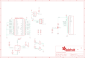

Contents
========

* [PRA4506 > Adafruit](#pra4506--adafruit)
	* [Schematic](#schematic)
	* [Interactive BOM](#interactive-bom)
	* [OOMP Parts](#oomp-parts)
	* [Images](#images)
	* [Tags](#tags)
  
![][im]
# PRA4506 > Adafruit

- ID: PROJ-ADAF-4506-STAN-01
- Hex ID: PRA4506
- Name: Adafruit
- Description: Adafruit
- Long Link: [http://oom.lt/PROJ-ADAF-4506-STAN-01](http://oom.lt/PROJ-ADAF-4506-STAN-01)
- Short Link: [http://oom.lt/PRA4506](http://oom.lt/PRA4506)

## Schematic
  

## Interactive BOM

- Interactive BOM page: [ibom.html](https://htmlpreview.github.io/?https://github.com/oomlout/oomlout_OOMP_projects/blob/main/PROJ-ADAF-4506-STAN-01/kicad/bom/ibom.html)

## OOMP Parts
  

|OOMP Parts|
| :---: |
|C1,CAPC-0805-X-UF10-V10,C1,10uF,CAP_CERAMIC0805-NOOUTLINE,0805-NO,Ceramic Capacitors,,|
|C10,CAPC-0805-X-UF10-V10,C10,10uF,CAP_CERAMIC0805-NOOUTLINE,0805-NO,Ceramic Capacitors,,|
|CONN1,UNMATCHED-UNMATCHED-X-UNMATCHED-01,CONN1,STEMMA_I2C_QT,STEMMA_I2C_QT,JST_SH4,,,|
|DISPLAY1,UNMATCHED-UNMATCHED-X-UNMATCHED-01,DISPLAY1,DISP_LCD_ST7789_1.3IN,DISP_LCD_ST7789_1.3IN,TFT_1.3IN_240X240_24P,,,|
|IC1,UNMATCHED-SO23-X-UNMATCHED-01,FID1,FIDUCIAL_1MM,FIDUCIAL_1MM,FIDUCIAL_1MM,Fiducial Alignment Points,EXCLUDE,|
|Q3,MOSN-SO23-X-KBSS138-01,FID2,FIDUCIAL_1MM,FIDUCIAL_1MM,FIDUCIAL_1MM,Fiducial Alignment Points,EXCLUDE,|
|R1,RESE-0805-X-O103-01,IC1,APX803,AXP083-SAG,SOT23,,,|
|R2,RESE-0603-X-O103-01,Q3,BSS138,MOSFET-NWIDE,SOT23-WIDE,N-Channel Mosfet,,|
|R3,RESE-0805-X-O103-01,R1,10K,RESISTOR0805_NOOUTLINE,0805-NO,Resistors,,|
|R5,RESE-0603-X-O11-01,R2,10K,RESISTOR_0603_NOOUT,0603-NO,Resistors,,|
|R11,RESE-0805-X-O103-01,R3,10K,RESISTOR0805_NOOUTLINE,0805-NO,Resistors,,|
|R12,RESE-0805-X-O103-01,R5,10,RESISTOR_0603_NOOUT,0603-NO,Resistors,,|
|R13,RESE-0805-X-O103-01,R11,10K,RESISTOR0805_NOOUTLINE,0805-NO,Resistors,,|
|R14,RESE-0805-X-O103-01,R12,10K,RESISTOR0805_NOOUTLINE,0805-NO,Resistors,,|
|R16,RESE-0805-X-O103-01,R13,10K,RESISTOR0805_NOOUTLINE,0805-NO,Resistors,,|
|R18,RESE-0805-X-O103-01,R14,10K,RESISTOR0805_NOOUTLINE,0805-NO,Resistors,,|
|RPI1,UNMATCHED-UNMATCHED-X-UNMATCHED-01,R16,10K,RESISTOR0805_NOOUTLINE,0805-NO,Resistors,,|
|SW1,UNMATCHED-UNMATCHED-X-UNMATCHED-01,R18,10K,RESISTOR0805_NOOUTLINE,0805-NO,Resistors,,|
|SW2,UNMATCHED-UNMATCHED-X-UNMATCHED-01,RPI1,RASPBERRYPI_BPLUS_BONNETSMT,RASPBERRYPI_BPLUS_BONNETSMT,PI_BONNET_SMT,,,|
|SW3,UNMATCHED-UNMATCHED-X-UNMATCHED-01,SW1,EVQQ,SWITCH_TACT_SMT_6MM,6MMX6MM_TACTILE_SMT,SMT Tact Switches,,|

## Images
  
  

|kicadPcb3d|kicadPcb3dFront|kicadPcb3dBack|eagleImage|eagleSchemImage|
| :---: | :---: | :---: | :---: | :---: |
||||||

## Tags

- hexID: PRA4506
- oompType: PROJ
- oompSize: ADAF
- oompColor: 4506
- oompDesc: STAN
- oompIndex: 01
- oompName: Adafruit 1.3in Color TFT Bonnet PCB
- sources: All source files from https://github.com/adafruit/Adafruit-1.3in-Color-TFT-Bonnet-PCB (source licence details in srcLicense.md)
- linkBuyPage: http://www.adafruit.com/products/4506
- oompID: PROJ-ADAF-4506-STAN-01
- oompParts: C1,CAPC-0805-X-UF10-V10
- oompParts: C10,CAPC-0805-X-UF10-V10
- oompParts: CONN1,UNMATCHED-UNMATCHED-X-UNMATCHED-01
- oompParts: DISPLAY1,UNMATCHED-UNMATCHED-X-UNMATCHED-01
- oompParts: IC1,UNMATCHED-SO23-X-UNMATCHED-01
- oompParts: Q3,MOSN-SO23-X-KBSS138-01
- oompParts: R1,RESE-0805-X-O103-01
- oompParts: R2,RESE-0603-X-O103-01
- oompParts: R3,RESE-0805-X-O103-01
- oompParts: R5,RESE-0603-X-O11-01
- oompParts: R11,RESE-0805-X-O103-01
- oompParts: R12,RESE-0805-X-O103-01
- oompParts: R13,RESE-0805-X-O103-01
- oompParts: R14,RESE-0805-X-O103-01
- oompParts: R16,RESE-0805-X-O103-01
- oompParts: R18,RESE-0805-X-O103-01
- oompParts: RPI1,UNMATCHED-UNMATCHED-X-UNMATCHED-01
- oompParts: SW1,UNMATCHED-UNMATCHED-X-UNMATCHED-01
- oompParts: SW2,UNMATCHED-UNMATCHED-X-UNMATCHED-01
- oompParts: SW3,UNMATCHED-UNMATCHED-X-UNMATCHED-01
- rawParts: C1,10uF,CAP_CERAMIC0805-NOOUTLINE,0805-NO,Ceramic Capacitors,,
- rawParts: C10,10uF,CAP_CERAMIC0805-NOOUTLINE,0805-NO,Ceramic Capacitors,,
- rawParts: CONN1,STEMMA_I2C_QT,STEMMA_I2C_QT,JST_SH4,,,
- rawParts: DISPLAY1,DISP_LCD_ST7789_1.3IN,DISP_LCD_ST7789_1.3IN,TFT_1.3IN_240X240_24P,,,
- rawParts: FID1,FIDUCIAL_1MM,FIDUCIAL_1MM,FIDUCIAL_1MM,Fiducial Alignment Points,EXCLUDE,
- rawParts: FID2,FIDUCIAL_1MM,FIDUCIAL_1MM,FIDUCIAL_1MM,Fiducial Alignment Points,EXCLUDE,
- rawParts: IC1,APX803,AXP083-SAG,SOT23,,,
- rawParts: Q3,BSS138,MOSFET-NWIDE,SOT23-WIDE,N-Channel Mosfet,,
- rawParts: R1,10K,RESISTOR0805_NOOUTLINE,0805-NO,Resistors,,
- rawParts: R2,10K,RESISTOR_0603_NOOUT,0603-NO,Resistors,,
- rawParts: R3,10K,RESISTOR0805_NOOUTLINE,0805-NO,Resistors,,
- rawParts: R5,10,RESISTOR_0603_NOOUT,0603-NO,Resistors,,
- rawParts: R11,10K,RESISTOR0805_NOOUTLINE,0805-NO,Resistors,,
- rawParts: R12,10K,RESISTOR0805_NOOUTLINE,0805-NO,Resistors,,
- rawParts: R13,10K,RESISTOR0805_NOOUTLINE,0805-NO,Resistors,,
- rawParts: R14,10K,RESISTOR0805_NOOUTLINE,0805-NO,Resistors,,
- rawParts: R16,10K,RESISTOR0805_NOOUTLINE,0805-NO,Resistors,,
- rawParts: R18,10K,RESISTOR0805_NOOUTLINE,0805-NO,Resistors,,
- rawParts: RPI1,RASPBERRYPI_BPLUS_BONNETSMT,RASPBERRYPI_BPLUS_BONNETSMT,PI_BONNET_SMT,,,
- rawParts: SW1,EVQQ,SWITCH_TACT_SMT_6MM,6MMX6MM_TACTILE_SMT,SMT Tact Switches,,
- rawParts: SW2,EVQQ,SWITCH_TACT_SMT_6MMSMALL,6MM_SMT,SMT Tact Switches,,
- rawParts: SW3,NAVSWITCHSKQUABAUE010,NAVSWITCHSKQUABAUE010,SKQUBAE010,,,

[im]: kicadPcb3d_450.png
