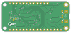

Contents
========

* [PRA4516 > Adafruit Feather nRF52840 Sense PCB](#pra4516--adafruit-feather-nrf52840-sense-pcb)
	* [Schematic](#schematic)
	* [PCB](#pcb)
	* [Interactive BOM](#interactive-bom)
	* [OOMP Parts](#oomp-parts)
	* [Images](#images)
	* [Tags](#tags)
  
![][im]
# PRA4516 > Adafruit Feather nRF52840 Sense PCB

- ID: PROJ-ADAF-4516-STAN-01
- Hex ID: PRA4516
- Name: Adafruit
- Description: Adafruit
- Long Link: [http://oom.lt/PROJ-ADAF-4516-STAN-01](http://oom.lt/PROJ-ADAF-4516-STAN-01)
- Short Link: [http://oom.lt/PRA4516](http://oom.lt/PRA4516)

## Schematic
  

## PCB
  

## Interactive BOM

- Interactive BOM page: [ibom.html](https://htmlpreview.github.io/?https://github.com/oomlout/oomlout_OOMP_projects/blob/main/PROJ-ADAF-4516-STAN-01/kicad/bom/ibom.html)

## OOMP Parts
  

|OOMP ID|Name|Identifier|
| :---: | :---: | :---: |
|[CAPC-0603-X-NF100-V50](https://github.com/oomlout/oomlout_OOMP_parts/tree/main/CAPC-0603-X-NF100-V50/)|[SMD (0603) 100 nF Capacitor (Ceramic) 50v](https://github.com/oomlout/oomlout_OOMP_parts/tree/main/CAPC-0603-X-NF100-V50/)|[C1, C3, C10, C12, C13](https://github.com/oomlout/oomlout_OOMP_parts/tree/main/CAPC-0603-X-NF100-V50/)|
|[CAPC-0603-X-UF1-V25](https://github.com/oomlout/oomlout_OOMP_parts/tree/main/CAPC-0603-X-UF1-V25/)|[SMD (0603) 1 uF Capacitor (Ceramic) 25v](https://github.com/oomlout/oomlout_OOMP_parts/tree/main/CAPC-0603-X-UF1-V25/)|[C4](https://github.com/oomlout/oomlout_OOMP_parts/tree/main/CAPC-0603-X-UF1-V25/)|
|[CAPC-0805-X-UF10-V10](https://github.com/oomlout/oomlout_OOMP_parts/tree/main/CAPC-0805-X-UF10-V10/)|[SMD (0805) 10 uF Capacitor (Ceramic) 10v](https://github.com/oomlout/oomlout_OOMP_parts/tree/main/CAPC-0805-X-UF10-V10/)|[C5, C6, C7, C8, C9](https://github.com/oomlout/oomlout_OOMP_parts/tree/main/CAPC-0805-X-UF10-V10/)|
|UNMATCHED-UNMATCHED-X-UNMATCHED-01||D+, D-, IC1, IC2, IC3, IC4, MDBT1, MS1, SWC, SWD, TP1, U1, U4, U5, X1, X2|
|DIOD-S123-X-UNMATCHED-01||D1|
|[LEDS-0805-R-STAN-01](https://github.com/oomlout/oomlout_OOMP_parts/tree/main/LEDS-0805-R-STAN-01/)|[SMD (0805) Red LED](https://github.com/oomlout/oomlout_OOMP_parts/tree/main/LEDS-0805-R-STAN-01/)|[D2](https://github.com/oomlout/oomlout_OOMP_parts/tree/main/LEDS-0805-R-STAN-01/)|
|LEDS-0805-O-STAN-01||D3|
|[LEDS-0603-L-STAN-01](https://github.com/oomlout/oomlout_OOMP_parts/tree/main/LEDS-0603-L-STAN-01/)|[SMD (0603) Blue LED](https://github.com/oomlout/oomlout_OOMP_parts/tree/main/LEDS-0603-L-STAN-01/)|[D4](https://github.com/oomlout/oomlout_OOMP_parts/tree/main/LEDS-0603-L-STAN-01/)|
|[LEDS-3535-RGB-K2812-01](https://github.com/oomlout/oomlout_OOMP_parts/tree/main/LEDS-3535-RGB-K2812-01/)|[SMD (3535) Smart Controller (WS2812B) RGB LED](https://github.com/oomlout/oomlout_OOMP_parts/tree/main/LEDS-3535-RGB-K2812-01/)|[LED1](https://github.com/oomlout/oomlout_OOMP_parts/tree/main/LEDS-3535-RGB-K2812-01/)|
|MOSP-SO23-X-UNMATCHED-01||Q3|
|[RESE-0603-X-O222-01](https://github.com/oomlout/oomlout_OOMP_parts/tree/main/RESE-0603-X-O222-01/)|[SMD (0603) 2.2k Ohm Resistor](https://github.com/oomlout/oomlout_OOMP_parts/tree/main/RESE-0603-X-O222-01/)|[R1](https://github.com/oomlout/oomlout_OOMP_parts/tree/main/RESE-0603-X-O222-01/)|
|[RESE-0603-X-O102-01](https://github.com/oomlout/oomlout_OOMP_parts/tree/main/RESE-0603-X-O102-01/)|[SMD (0603) 1k Ohm Resistor](https://github.com/oomlout/oomlout_OOMP_parts/tree/main/RESE-0603-X-O102-01/)|[R3](https://github.com/oomlout/oomlout_OOMP_parts/tree/main/RESE-0603-X-O102-01/)|
|[RESE-0603-X-O472-01](https://github.com/oomlout/oomlout_OOMP_parts/tree/main/RESE-0603-X-O472-01/)|[SMD (0603) 4.7k Ohm Resistor](https://github.com/oomlout/oomlout_OOMP_parts/tree/main/RESE-0603-X-O472-01/)|[R4](https://github.com/oomlout/oomlout_OOMP_parts/tree/main/RESE-0603-X-O472-01/)|
|[RESA-06038-X-O472X4-01](https://github.com/oomlout/oomlout_OOMP_parts/tree/main/RESA-06038-X-O472X4-01/)|[SMD (0603-8) 4.7k Ohm (x4) Resistor Array](https://github.com/oomlout/oomlout_OOMP_parts/tree/main/RESA-06038-X-O472X4-01/)|[R7](https://github.com/oomlout/oomlout_OOMP_parts/tree/main/RESA-06038-X-O472X4-01/)|
|[RESE-0603-X-O220-01](https://github.com/oomlout/oomlout_OOMP_parts/tree/main/RESE-0603-X-O220-01/)|[SMD (0603) 22 Ohm Resistor](https://github.com/oomlout/oomlout_OOMP_parts/tree/main/RESE-0603-X-O220-01/)|[R10, R11](https://github.com/oomlout/oomlout_OOMP_parts/tree/main/RESE-0603-X-O220-01/)|
|RESA-06038-X-O1003X4-01||R12|
|[BUTA-4628-X-STAN-01](https://github.com/oomlout/oomlout_OOMP_parts/tree/main/BUTA-4628-X-STAN-01/)|[SMD (4628) Pushbutton (Tactile)](https://github.com/oomlout/oomlout_OOMP_parts/tree/main/BUTA-4628-X-STAN-01/)|[SW1, SW2](https://github.com/oomlout/oomlout_OOMP_parts/tree/main/BUTA-4628-X-STAN-01/)|
|UNMATCHED-SO235-X-UNMATCHED-01||U2, U3|

## Images
  
  

|bominteractivefront|bominteractiveback|kicadPcb3d|kicadPcb3dFront|kicadPcb3dBack|kicadSchem|eagleImage|eagleSchemImage|pcbdraw|pcbdrawback|
| :---: | :---: | :---: | :---: | :---: | :---: | :---: | :---: | :---: | :---: |
|||||||||||

## Tags

- hexID: PRA4516
- oompType: PROJ
- oompSize: ADAF
- oompColor: 4516
- oompDesc: STAN
- oompIndex: 01
- oompName: Adafruit Feather nRF52840 Sense PCB
- sources: All source files from https://github.com/adafruit/Adafruit-Feather-nRF52840-Sense-PCB (source licence details in srcLicense.md)
- linkBuyPage: http://www.adafruit.com/products/4516
- oompID: PROJ-ADAF-4516-STAN-01
- oompParts: C1,CAPC-0603-X-NF100-V50
- oompParts: C3,CAPC-0603-X-NF100-V50
- oompParts: C4,CAPC-0603-X-UF1-V25
- oompParts: C5,CAPC-0805-X-UF10-V10
- oompParts: C6,CAPC-0805-X-UF10-V10
- oompParts: C7,CAPC-0805-X-UF10-V10
- oompParts: C8,CAPC-0805-X-UF10-V10
- oompParts: C9,CAPC-0805-X-UF10-V10
- oompParts: C10,CAPC-0603-X-NF100-V50
- oompParts: C12,CAPC-0603-X-NF100-V50
- oompParts: C13,CAPC-0603-X-NF100-V50
- oompParts: D+,UNMATCHED-UNMATCHED-X-UNMATCHED-01
- oompParts: D-,UNMATCHED-UNMATCHED-X-UNMATCHED-01
- oompParts: D1,DIOD-S123-X-UNMATCHED-01
- oompParts: D2,LEDS-0805-R-STAN-01
- oompParts: D3,LEDS-0805-O-STAN-01
- oompParts: D4,LEDS-0603-L-STAN-01
- oompParts: IC1,UNMATCHED-UNMATCHED-X-UNMATCHED-01
- oompParts: IC2,UNMATCHED-UNMATCHED-X-UNMATCHED-01
- oompParts: IC3,UNMATCHED-UNMATCHED-X-UNMATCHED-01
- oompParts: IC4,UNMATCHED-UNMATCHED-X-UNMATCHED-01
- oompParts: LED1,LEDS-3535-RGB-K2812-01
- oompParts: MDBT1,UNMATCHED-UNMATCHED-X-UNMATCHED-01
- oompParts: MS1,UNMATCHED-UNMATCHED-X-UNMATCHED-01
- oompParts: Q3,MOSP-SO23-X-UNMATCHED-01
- oompParts: R1,RESE-0603-X-O222-01
- oompParts: R3,RESE-0603-X-O102-01
- oompParts: R4,RESE-0603-X-O472-01
- oompParts: R7,RESA-06038-X-O472X4-01
- oompParts: R10,RESE-0603-X-O220-01
- oompParts: R11,RESE-0603-X-O220-01
- oompParts: R12,RESA-06038-X-O1003X4-01
- oompParts: SW1,BUTA-4628-X-STAN-01
- oompParts: SW2,BUTA-4628-X-STAN-01
- oompParts: SWC,UNMATCHED-UNMATCHED-X-UNMATCHED-01
- oompParts: SWD,UNMATCHED-UNMATCHED-X-UNMATCHED-01
- oompParts: TP1,UNMATCHED-UNMATCHED-X-UNMATCHED-01
- oompParts: U1,UNMATCHED-UNMATCHED-X-UNMATCHED-01
- oompParts: U2,UNMATCHED-SO235-X-UNMATCHED-01
- oompParts: U3,UNMATCHED-SO235-X-UNMATCHED-01
- oompParts: U4,UNMATCHED-UNMATCHED-X-UNMATCHED-01
- oompParts: U5,UNMATCHED-UNMATCHED-X-UNMATCHED-01
- oompParts: X1,UNMATCHED-UNMATCHED-X-UNMATCHED-01
- oompParts: X2,UNMATCHED-UNMATCHED-X-UNMATCHED-01
- rawParts: C1,0.1uF,CAP_CERAMIC0603_NO,0603-NO,Ceramic Capacitors,,,,
- rawParts: C3,0.1uF,CAP_CERAMIC0603_NO,0603-NO,Ceramic Capacitors,,,,
- rawParts: C4,1uF,CAP_CERAMIC0603_NO,0603-NO,Ceramic Capacitors,,,,
- rawParts: C5,10uF,CAP_CERAMIC0805-NOOUTLINE,0805-NO,Ceramic Capacitors,,,,
- rawParts: C6,10uF,CAP_CERAMIC0805-NOOUTLINE,0805-NO,Ceramic Capacitors,,,,
- rawParts: C7,10uF,CAP_CERAMIC0805-NOOUTLINE,0805-NO,Ceramic Capacitors,,,,
- rawParts: C8,10uF,CAP_CERAMIC0805-NOOUTLINE,0805-NO,Ceramic Capacitors,,,,
- rawParts: C9,10uF,CAP_CERAMIC0805-NOOUTLINE,0805-NO,Ceramic Capacitors,,,,
- rawParts: C10,0.1uF,CAP_CERAMIC0603_NO,0603-NO,Ceramic Capacitors,,,,
- rawParts: C12,0.1uF,CAP_CERAMIC0603_NO,0603-NO,Ceramic Capacitors,,,,
- rawParts: C13,0.1uF,CAP_CERAMIC0603_NO,0603-NO,Ceramic Capacitors,,,,
- rawParts: D+,TPTP10R,TPTP10R,TP10R,Test pad,,3,,
- rawParts: D-,TPTP10R,TPTP10R,TP10R,Test pad,,3,,
- rawParts: D1,MBR054,DIODE-SCHOTTKYSOD-123,SOD-123,,,,,
- rawParts: D2,RED,LED0805_NOOUTLINE,CHIPLED_0805_NOOUTLINE,LED,,,,
- rawParts: D3,ORANGE,LED0805_NOOUTLINE,CHIPLED_0805_NOOUTLINE,LED,,,,
- rawParts: D4,BLUE,LED0603_NOOUTLINE,CHIPLED_0603_NOOUTLINE,LED,,,,
- rawParts: FID1,FIDUCIAL_1MM,FIDUCIAL_1MM,FIDUCIAL_1MM,Fiducial Alignment Points,EXCLUDE,,,
- rawParts: FID2,FIDUCIAL_1MM,FIDUCIAL_1MM,FIDUCIAL_1MM,Fiducial Alignment Points,EXCLUDE,,,
- rawParts: IC1,LSM6DS33,LSM6DS33,LGA16_3X3MM,,,,,
- rawParts: IC2,GD25Q16,SPIFLASH_8PINUX,USON8,SOIC8 SPI Flash,,,,
- rawParts: IC3,LIS3MDL,LIS3MDL,LGA12_2X2MM,Digital output magnetic sensor. ultra-low-power, high-performance 3-axis magnetometer,,,,
- rawParts: IC4,MIC_PDM,MIC_PDM_SPK0415,SPK0415HM4H,,,,,
- rawParts: L1,DNP,INDUCTOR_0805MP,_0805MP,Inductors,,,,
- rawParts: LED1,WS2812B3535,WS2812B3535,LED3535,,,,,
- rawParts: MDBT1,MDBT50,MDBT50,MDBT50,Raytac Corporation,,,,
- rawParts: MS1,FEATHERWING_NODIM,FEATHERWING_NODIM,FEATHERWING_NODIM,,,,,
- rawParts: Q3,DMG2305,MOSFET-P,SOT23-R,P-Channel Mosfet,,,,
- rawParts: R1,2.2K,RESISTOR_0603_NOOUT,0603-NO,Resistors,,,,
- rawParts: R3,1K,RESISTOR_0603_NOOUT,0603-NO,Resistors,,,,
- rawParts: R4,4.7K,RESISTOR_0603_NOOUT,0603-NO,Resistors,,,,
- rawParts: R7,4.7K,RESISTOR_4PACK,RESPACK_4X0603,Resistor Packs (4 resistors),,,,
- rawParts: R10,22,RESISTOR_0603_NOOUT,0603-NO,Resistors,,,,
- rawParts: R11,22,RESISTOR_0603_NOOUT,0603-NO,Resistors,,,,
- rawParts: R12,100K,RESISTOR_4PACK,RESPACK_4X0603,Resistor Packs (4 resistors),,,,
- rawParts: SW1,KMR2,SWITCH_TACT_SMT4.6X2.8,BTN_KMR2_4.6X2.8,SMT Tact Switches,,,,
- rawParts: SW2,KMR2,SWITCH_TACT_SMT4.6X2.8,BTN_KMR2_4.6X2.8,SMT Tact Switches,,,,
- rawParts: SWC,TPTP12R,TPTP12R,TP12R,Test pad,,1,,
- rawParts: SWD,TPTP12R,TPTP12R,TP12R,Test pad,,1,,
- rawParts: TP1,TPTP10R,TPTP10R,TP10R,Test pad,,3,,
- rawParts: U1,APDS-9960,APDS-9960,APDS-9960,APDS-9960 - Digital Proximity Sensor with Ambient Light/RGB/Gesture Detection,,,,
- rawParts: U2,AP2112(3.3V),VREG_SOT23-5,SOT23-5,SOT23-5 Fixed Voltage Regulators,,,,
- rawParts: U3,MCP73831T-2ACI/OT,MCP73831/2,SOT23-5,MCP73831/2 LIPO Charger,,,,
- rawParts: U4,SHT30,SHT3X,SHT3X,SHT3x - Digital Temperature and Humidity Sensor,,,,
- rawParts: U5,BMP280,BMP280,BMP280,BMP280 - Digital Pressure Sensor,,,,
- rawParts: X1,4u20329,USB_MICRO_20329_V2,4UCONN_20329_V2,USB Connectors,,,,
- rawParts: X2,CON_JST_PH_2PIN_MTPH2,CON_JST_PH_2PIN_MTPH2,JSTPH2,,,,,

[im]: kicadPcb3d_450.png
