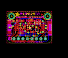
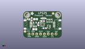
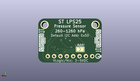
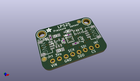

Contents
========

* [PROJ-ADAF-4530-STAN-01>Adafruit LPS2X PCB](#proj-adaf-4530-stan-01adafruit-lps2x-pcb)
	* [Images](#images)
	* [Interactive BOM](#interactive-bom)
	* [OOMP Parts](#oomp-parts)
	* [Tags](#tags)
  
![][im]
# PROJ-ADAF-4530-STAN-01>Adafruit LPS2X PCB

- ID: PROJ-ADAF-4530-STAN-01
- Hex ID: PRA4530
- Name: Adafruit LPS2X PCB
- Description: 

## Images
  
  

|eagleImage|kicadPcb3dFront|kicadPcb3dBack|kicadPcb3d|
| :---: | :---: | :---: | :---: |
|||||

## Interactive BOM

- Interactive BOM page: [ibom.html](kicad/bom/ibom.html)

## OOMP Parts
  

|OOMP Parts|
| :---: |
|<table><tr><td></td><td> C1</td><td>[CAPC-0603-X-NF100-V50 SMD (0603) 100 nF Capacitor (Ceramic) 50v](https://github.com/oomlout/oomlout_OOMP_parts/tree/main/CAPC-0603-X-NF100-V50/)</td><td>[C6N100](https://github.com/oomlout/oomlout_OOMP_parts/tree/main/CAPC-0603-X-NF100-V50/)</td></tr></table>|
|CAPC-0805-X-UNMATCHED-01, C2, 300.0, 225.0, 0,C2, 10uF, 0805-NO, microbuilder, (300, 225), R0|
|CAPC-0805-X-UNMATCHED-01, C3, 320.0, 490.0, 0,C3, 10uF, 0805-NO, microbuilder, (320, 490), R0|
|UNMATCHED-UNMATCHED-X-UNMATCHED-01, CONN3, 900.0, 350.0, 90,CONN3, STEMMA_I2C_QT, JST_SH4, microbuilder, (900, 350), R90|
|UNMATCHED-UNMATCHED-X-UNMATCHED-01, CONN4, 100.0, 350.0, 270,CONN4, STEMMA_I2C_QT, JST_SH4, microbuilder, (100, 350), R270|
|UNMATCHED-UNMATCHED-X-UNMATCHED-01, D1, 140.0, 495.0, 90,D1, GREEN, CHIPLED_0603_NOOUTLINE, microbuilder, (140, 495), R90|
|UNMATCHED-UNMATCHED-X-UNMATCHED-01, D2, 524.0, 512.0, 180,D2, 1N4148, SOD-323, microbuilder, (524, 512), R180|
|<table><tr><td></td><td> JP3</td><td>[HEAD-I01-X-PI08-01 2.54 mm 8 Pin Header](https://github.com/oomlout/oomlout_OOMP_parts/tree/main/HEAD-I01-X-PI08-01/)</td><td>[H08](https://github.com/oomlout/oomlout_OOMP_parts/tree/main/HEAD-I01-X-PI08-01/)</td></tr></table>|
|UNMATCHED-UNMATCHED-X-UNMATCHED-01, Q2, 665.0, 295.0, 90,Q2, BSS138, SOT363, microbuilder, (665, 295), R90|
|<table><tr><td></td><td> R1</td><td>[RESE-0603-X-O103-01 SMD (0603) 10k Ohm Resistor](https://github.com/oomlout/oomlout_OOMP_parts/tree/main/RESE-0603-X-O103-01/)</td><td>[R6103](https://github.com/oomlout/oomlout_OOMP_parts/tree/main/RESE-0603-X-O103-01/)</td></tr></table>|
|RESE-UNMATCHED-X-O103-01, R3, 680.0, 450.0, 180,R3, 10K, RESPACK_4X0603, microbuilder, (680, 450), R180|
|<table><tr><td></td><td> R4</td><td>[RESE-0603-X-O103-01 SMD (0603) 10k Ohm Resistor](https://github.com/oomlout/oomlout_OOMP_parts/tree/main/RESE-0603-X-O103-01/)</td><td>[R6103](https://github.com/oomlout/oomlout_OOMP_parts/tree/main/RESE-0603-X-O103-01/)</td></tr></table>|
|<table><tr><td></td><td> R5</td><td>[RESE-0603-X-O103-01 SMD (0603) 10k Ohm Resistor](https://github.com/oomlout/oomlout_OOMP_parts/tree/main/RESE-0603-X-O103-01/)</td><td>[R6103](https://github.com/oomlout/oomlout_OOMP_parts/tree/main/RESE-0603-X-O103-01/)</td></tr></table>|
|UNMATCHED-UNMATCHED-X-UNMATCHED-01, U$2, 500.0, 350.0, 0,U$2, LPS2X_LPS25, HLGA-10L, adafruit_sensor, (500, 350), R0|
|UNMATCHED-UNMATCHED-X-UNMATCHED-01, U2, 300.0, 350.0, 0,U2, AP2112K-3.3, SOT23-5, microbuilder, (300, 350), R0|

## Tags

- hexID: PRA4530
- oompType: PROJ
- oompSize: ADAF
- oompColor: 4530
- oompDesc: STAN
- oompIndex: 01
- oompName: Adafruit LPS2X PCB
- sources: All source files from https://github.com/adafruit/Adafruit-LPS2X-PCB (source licence details in srcLicense.md)
- linkBuyPage: http://www.adafruit.com/products/4530
- oompPart: CAPC-0603-X-NF100-V50, C1, 400.0, 361.0, 270
- oompPart: CAPC-0805-X-UNMATCHED-01, C2, 300.0, 225.0, 0
- oompPart: CAPC-0805-X-UNMATCHED-01, C3, 320.0, 490.0, 0
- oompPart: UNMATCHED-UNMATCHED-X-UNMATCHED-01, CONN3, 900.0, 350.0, 90
- oompPart: UNMATCHED-UNMATCHED-X-UNMATCHED-01, CONN4, 100.0, 350.0, 270
- oompPart: UNMATCHED-UNMATCHED-X-UNMATCHED-01, D1, 140.0, 495.0, 90
- oompPart: UNMATCHED-UNMATCHED-X-UNMATCHED-01, D2, 524.0, 512.0, 180
- oompPart: SKIP-UNMATCHED-X-UNMATCHED-01, FID3, 45.0, 167.5, 0
- oompPart: SKIP-UNMATCHED-X-UNMATCHED-01, FID4, 775.0, 641.5, 0
- oompPart: HEAD-I01-X-PI08-01, JP3, 500.0, 100.0, 0
- oompPart: UNMATCHED-UNMATCHED-X-UNMATCHED-01, Q2, 665.0, 295.0, 90
- oompPart: RESE-0603-X-O103-01, R1, 220.0, 490.0, 270
- oompPart: RESE-UNMATCHED-X-O103-01, R3, 680.0, 450.0, 180
- oompPart: RESE-0603-X-O103-01, R4, 557.0, 253.0, 0
- oompPart: RESE-0603-X-O103-01, R5, 505.0, 440.0, 180
- oompPart: SKIP-UNMATCHED-X-UNMATCHED-01, SJ1, 340.0, 210.0, M0
- oompPart: SKIP-UNMATCHED-X-UNMATCHED-01, U$1, 100.0, 600.0, 0
- oompPart: UNMATCHED-UNMATCHED-X-UNMATCHED-01, U$2, 500.0, 350.0, 0
- oompPart: SKIP-UNMATCHED-X-UNMATCHED-01, U$17, 900.0, 600.0, 0
- oompPart: UNMATCHED-UNMATCHED-X-UNMATCHED-01, U2, 300.0, 350.0, 0
- rawPart: C1, 0.1uF, 0603-NO, microbuilder, (400, 361), R270
- rawPart: C2, 10uF, 0805-NO, microbuilder, (300, 225), R0
- rawPart: C3, 10uF, 0805-NO, microbuilder, (320, 490), R0
- rawPart: CONN3, STEMMA_I2C_QT, JST_SH4, microbuilder, (900, 350), R90
- rawPart: CONN4, STEMMA_I2C_QT, JST_SH4, microbuilder, (100, 350), R270
- rawPart: D1, GREEN, CHIPLED_0603_NOOUTLINE, microbuilder, (140, 495), R90
- rawPart: D2, 1N4148, SOD-323, microbuilder, (524, 512), R180
- rawPart: FID3, FIDUCIAL_1MM, FIDUCIAL_1MM, microbuilder, (45, 167.5), R0
- rawPart: FID4, FIDUCIAL_1MM, FIDUCIAL_1MM, microbuilder, (775, 641.5), R0
- rawPart: JP3, 1X08_ROUND, microbuilder, (500, 100), R0
- rawPart: Q2, BSS138, SOT363, microbuilder, (665, 295), R90
- rawPart: R1, 10K, 0603-NO, microbuilder, (220, 490), R270
- rawPart: R3, 10K, RESPACK_4X0603, microbuilder, (680, 450), R180
- rawPart: R4, 10K, 0603-NO, microbuilder, (557, 253), R0
- rawPart: R5, 10K, 0603-NO, microbuilder, (505, 440), R180
- rawPart: SJ1, SOLDERJUMPER_ARROW_NOPASTE, microbuilder, (340, 210), MR0
- rawPart: U$1, MOUNTINGHOLE2.5, MOUNTINGHOLE_2.5_PLATED, microbuilder, (100, 600), R0
- rawPart: U$2, LPS2X_LPS25, HLGA-10L, adafruit_sensor, (500, 350), R0
- rawPart: U$17, MOUNTINGHOLE2.5, MOUNTINGHOLE_2.5_PLATED, microbuilder, (900, 600), R0
- rawPart: U2, AP2112K-3.3, SOT23-5, microbuilder, (300, 350), R0
- oompID: PROJ-ADAF-4530-STAN-01

[im]: kicadPcb3d_450.png
