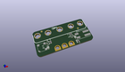
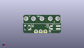
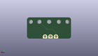
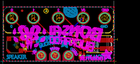
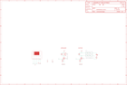

Contents
========

* [PRA4534 > Adafruit](#pra4534--adafruit)
	* [Images](#images)
	* [Tags](#tags)
  
![][im]
# PRA4534 > Adafruit

- ID: PROJ-ADAF-4534-STAN-01
- Hex ID: PRA4534
- Name: Adafruit
- Description: Adafruit

## Images
  
  

|kicadPcb3d|kicadPcb3dFront|kicadPcb3dBack|eagleImage|eagleSchemImage|
| :---: | :---: | :---: | :---: | :---: |
||||||

## Tags

- hexID: PRA4534
- oompType: PROJ
- oompSize: ADAF
- oompColor: 4534
- oompDesc: STAN
- oompIndex: 01
- oompName: Adafruit Bonsai Buckaroo PCB
- sources: All source files from https://github.com/adafruit/Adafruit-Bonsai-Buckaroo-PCB (source licence details in srcLicense.md)
- linkBuyPage: http://www.adafruit.com/products/4534
- oompID: PROJ-ADAF-4534-STAN-01
- oompParts: D1,UNMATCHED-UNMATCHED-UNMATCHED-UNMATCHED-UNMATCHED
- oompParts: D2,UNMATCHED-UNMATCHED-UNMATCHED-UNMATCHED-UNMATCHED
- oompParts: D6,UNMATCHED-UNMATCHED-UNMATCHED-UNMATCHED-UNMATCHED
- oompParts: MB2,UNMATCHED-UNMATCHED-UNMATCHED-UNMATCHED-UNMATCHED
- oompParts: Q1,UNMATCHED-UNMATCHED-UNMATCHED-UNMATCHED-UNMATCHED
- oompParts: Q2,UNMATCHED-UNMATCHED-UNMATCHED-UNMATCHED-UNMATCHED
- oompParts: R1,UNMATCHED-UNMATCHED-UNMATCHED-UNMATCHED-UNMATCHED
- oompParts: R2,UNMATCHED-UNMATCHED-UNMATCHED-UNMATCHED-UNMATCHED
- oompParts: R12,UNMATCHED-UNMATCHED-UNMATCHED-UNMATCHED-UNMATCHED
- oompParts: SP1,UNMATCHED-UNMATCHED-UNMATCHED-UNMATCHED-UNMATCHED
- oompParts: TP1,UNMATCHED-UNMATCHED-UNMATCHED-UNMATCHED-UNMATCHED
- oompParts: TP2,UNMATCHED-UNMATCHED-UNMATCHED-UNMATCHED-UNMATCHED
- oompParts: TP3,UNMATCHED-UNMATCHED-UNMATCHED-UNMATCHED-UNMATCHED
- oompParts: X1,UNMATCHED-UNMATCHED-UNMATCHED-UNMATCHED-UNMATCHED
- rawParts: D1,1N4148,DIODESOD-323,SOD-323,Diode,,
- rawParts: D2,red,LED0805_NOOUTLINE,CHIPLED_0805_NOOUTLINE,LED,,
- rawParts: D6,1N4148,DIODESOD-323,SOD-323,Diode,,
- rawParts: FID1,FIDUCIAL_1MM,FIDUCIAL_1MM,FIDUCIAL_1MM,Fiducial Alignment Points,EXCLUDE,
- rawParts: FID2,FIDUCIAL_1MM,FIDUCIAL_1MM,FIDUCIAL_1MM,Fiducial Alignment Points,EXCLUDE,
- rawParts: MB2,MICROBIT_5PIN,MICROBIT_5PIN,MICROBIT_5SMTNUT,,,
- rawParts: Q1,BSS138,MOSFET-NWIDE,SOT23-WIDE,N-Channel Mosfet,,
- rawParts: Q2,BSS138,MOSFET-NWIDE,SOT23-WIDE,N-Channel Mosfet,,
- rawParts: R1,10K,RESISTOR_0603_NOOUT,0603-NO,Resistors,,
- rawParts: R2,1K,RESISTOR_0603_NOOUT,0603-NO,Resistors,,
- rawParts: R12,10K,RESISTOR_0603_NOOUT,0603-NO,Resistors,,
- rawParts: SP1,SPEAKER_7.5MM,SPEAKER_7.5MM,BUZZER_SMT_7.5MM,SPEAKER Source: BuerklinAdded PS12 (for part # PS1240 piezo) http://www.ladyada.net/library/pcb/eaglelibrary.html,,
- rawParts: TP1,SEWTAPPCB_ALLIGATOR,SEWTAPPCB_ALLIGATOR,PCB_ALLI,,,
- rawParts: TP2,SEWTAPPCB_ALLIGATOR,SEWTAPPCB_ALLIGATOR,PCB_ALLI,,,
- rawParts: TP3,SEWTAPPCB_ALLIGATOR,SEWTAPPCB_ALLIGATOR,PCB_ALLI,,,
- rawParts: X1,2060-402/998-404,2060-402/998-404,P-2060-402/998-404,Serie 2060,  SMD-Leiterplattenklemme mit Betätigungsdrückern im Gurt 2-polig / Series 2060,  SMD terminal block with push-buttons in tape-and-reel packing 2-polePolzahl / Pole No.: 2 Rastermaß / Pitch: 4  mmBemessungsspannung / Rated Voltage: 160 VNennstrom / Nominal Current: 9 ALeiterquerschnitt / Conductor Size: 0.2 - 0.75 mm2Anschlusstechnik / Connection Technology: CAGE CLAMP® S Leitereinführung (zur Platine) / Conductor entry angle (to PCB): 0 °Farbe / Color: lichtgrau / light gray Stand: 01.01.2014. Die jeweils aktuellen Daten zu diesem Artikel finden Sie in unserem Produktkatalog, den Sie unter www.wago.com einsehen können.  As of: 01/01/2014. Please find the newest data for this article in our product catalogue, which can be viewed under www.wago.com.,,

[im]: kicadPcb3d_450.png
