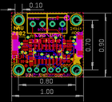
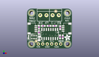
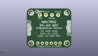
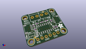

Contents
========

* [PROJ-ADAF-4538-STAN-01>Adafruit NAU7802 PCB](#proj-adaf-4538-stan-01adafruit-nau7802-pcb)
	* [Images](#images)
	* [Interactive BOM](#interactive-bom)
	* [OOMP Parts](#oomp-parts)
	* [Tags](#tags)
  
![][im]
# PROJ-ADAF-4538-STAN-01>Adafruit NAU7802 PCB

- ID: PROJ-ADAF-4538-STAN-01
- Hex ID: PRA4538
- Name: Adafruit NAU7802 PCB
- Description: 

## Images
  
  

|eagleImage|kicadPcb3dFront|kicadPcb3dBack|kicadPcb3d|
| :---: | :---: | :---: | :---: |
|||||

## Interactive BOM

- Interactive BOM page: [ibom.html](kicad/bom/ibom.html)

## OOMP Parts
  

|OOMP Parts|
| :---: |
|<table><tr><td></td><td> C1</td><td>[CAPC-0603-X-NF100-V50 SMD (0603) 100 nF Capacitor (Ceramic) 50v](https://github.com/oomlout/oomlout_OOMP_parts/tree/main/CAPC-0603-X-NF100-V50/)</td><td>[C6N100](https://github.com/oomlout/oomlout_OOMP_parts/tree/main/CAPC-0603-X-NF100-V50/)</td></tr></table>|
|<table><tr><td></td><td> C2</td><td>[CAPC-0603-X-NF100-V50 SMD (0603) 100 nF Capacitor (Ceramic) 50v](https://github.com/oomlout/oomlout_OOMP_parts/tree/main/CAPC-0603-X-NF100-V50/)</td><td>[C6N100](https://github.com/oomlout/oomlout_OOMP_parts/tree/main/CAPC-0603-X-NF100-V50/)</td></tr></table>|
|CAPC-0805-X-UNMATCHED-01, C3, 1.778, 1.5875, 90,C3, 10uF, 0805-NO, microbuilder, (0.07, 0.0625), R90|
|<table><tr><td></td><td> C4</td><td>[CAPC-0603-X-NF100-V50 SMD (0603) 100 nF Capacitor (Ceramic) 50v](https://github.com/oomlout/oomlout_OOMP_parts/tree/main/CAPC-0603-X-NF100-V50/)</td><td>[C6N100](https://github.com/oomlout/oomlout_OOMP_parts/tree/main/CAPC-0603-X-NF100-V50/)</td></tr></table>|
|CAPC-0603-X-UNMATCHED-01, C5, 13.5255, 2.4765, 270,C5, 1uF, 0603-NO, microbuilder, (0.5325, 0.0975), R270|
|CAPE-0603-X-UNMATCHED-01, C6, 7.302499999999999, 8.8265, 0,C6, 470pF, 0603-NO, microbuilder, (0.2875, 0.3475), R0|
|<table><tr><td></td><td> C7</td><td>[CAPC-0603-X-NF100-V50 SMD (0603) 100 nF Capacitor (Ceramic) 50v](https://github.com/oomlout/oomlout_OOMP_parts/tree/main/CAPC-0603-X-NF100-V50/)</td><td>[C6N100](https://github.com/oomlout/oomlout_OOMP_parts/tree/main/CAPC-0603-X-NF100-V50/)</td></tr></table>|
|UNMATCHED-UNMATCHED-X-UNMATCHED-01, CONN3, 17.7165, 7.302499999999999, 90,CONN3, STEMMA_I2C_QT, JST_SH4, microbuilder, (0.6975, 0.2875), R90|
|UNMATCHED-UNMATCHED-X-UNMATCHED-01, CONN4, -2.6034999999999995, 7.302499999999999, 270,CONN4, STEMMA_I2C_QT, JST_SH4, microbuilder, (-0.1025, 0.2875), R270|
|UNMATCHED-UNMATCHED-X-UNMATCHED-01, D1, -4.2545, 2.3495, 0,D1, GREEN, CHIPLED_0603_NOOUTLINE, microbuilder, (-0.1675, 0.0925), R0|
|UNMATCHED-UNMATCHED-X-UNMATCHED-01, IC1, 7.6834999999999996, 3.8734999999999995, 180,IC1, NAU7802, SOIC16_NARROW, adafruit_sensor, (0.3025, 0.1525), R180|
|<table><tr><td></td><td> JP1</td><td>[HEAD-I01-X-PI06-01 2.54 mm 6 Pin Header](https://github.com/oomlout/oomlout_OOMP_parts/tree/main/HEAD-I01-X-PI06-01/)</td><td>[H06](https://github.com/oomlout/oomlout_OOMP_parts/tree/main/HEAD-I01-X-PI06-01/)</td></tr></table>|
|RESE-0603-X-UNMATCHED-01, R1, 13.589, 7.810499999999999, 90,R1, 51, 0603-NO, microbuilder, (0.535, 0.3075), R90|
|RESE-0603-X-UNMATCHED-01, R2, 4.0005, 8.8265, 180,R2, 51, 0603-NO, microbuilder, (0.1575, 0.3475), R180|
|RESE-UNMATCHED-X-O103-01, R3, -1.3335, 2.3495, 0,R3, 10K, RESPACK_4X0603, microbuilder, (-0.0525, 0.0925), R0|
|UNMATCHED-UNMATCHED-X-UNMATCHED-01, X1, 4.1274999999999995, 14.9225, 180,X1, 3.5mm, TERMBLOCK_1X2-3.5MM, microbuilder, (0.1625, 0.5875), R180|
|UNMATCHED-UNMATCHED-X-UNMATCHED-01, X2, 11.112499999999999, 14.9225, 180,X2, 3.5mm, TERMBLOCK_1X2-3.5MM, microbuilder, (0.4375, 0.5875), R180|

## Tags

- hexID: PRA4538
- oompType: PROJ
- oompSize: ADAF
- oompColor: 4538
- oompDesc: STAN
- oompIndex: 01
- oompName: Adafruit NAU7802 PCB
- sources: All source files from https://github.com/adafruit/Adafruit-NAU7802-PCB (source licence details in srcLicense.md)
- linkBuyPage: http://www.adafruit.com/products/4538
- oompID: PROJ-ADAF-4538-STAN-01
- oompPart: CAPC-0603-X-NF100-V50, C1, 1.5875, 5.0165, 90
- oompPart: CAPC-0603-X-NF100-V50, C2, 1.5875, 8.064499999999999, 90
- oompPart: CAPC-0805-X-UNMATCHED-01, C3, 1.778, 1.5875, 90
- oompPart: CAPC-0603-X-NF100-V50, C4, 15.0495, 2.4765, 270
- oompPart: CAPC-0603-X-UNMATCHED-01, C5, 13.5255, 2.4765, 270
- oompPart: CAPE-0603-X-UNMATCHED-01, C6, 7.302499999999999, 8.8265, 0
- oompPart: CAPC-0603-X-NF100-V50, C7, 10.4775, 8.8265, 0
- oompPart: UNMATCHED-UNMATCHED-X-UNMATCHED-01, CONN3, 17.7165, 7.302499999999999, 90
- oompPart: UNMATCHED-UNMATCHED-X-UNMATCHED-01, CONN4, -2.6034999999999995, 7.302499999999999, 270
- oompPart: UNMATCHED-UNMATCHED-X-UNMATCHED-01, D1, -4.2545, 2.3495, 0
- oompPart: SKIP-UNMATCHED-X-UNMATCHED-01, FID3, 0.0, 0.0, 0
- oompPart: SKIP-UNMATCHED-X-UNMATCHED-01, FID4, 11.112499999999999, 17.208499999999997, 0
- oompPart: UNMATCHED-UNMATCHED-X-UNMATCHED-01, IC1, 7.6834999999999996, 3.8734999999999995, 180
- oompPart: HEAD-I01-X-PI06-01, JP1, 7.556499999999999, -1.5875, 0
- oompPart: RESE-0603-X-UNMATCHED-01, R1, 13.589, 7.810499999999999, 90
- oompPart: RESE-0603-X-UNMATCHED-01, R2, 4.0005, 8.8265, 180
- oompPart: RESE-UNMATCHED-X-O103-01, R3, -1.3335, 2.3495, 0
- oompPart: SKIP-UNMATCHED-X-UNMATCHED-01, U$1, -2.6034999999999995, 16.1925, 0
- oompPart: SKIP-UNMATCHED-X-UNMATCHED-01, U$17, 17.7165, 16.1925, 0
- oompPart: SKIP-UNMATCHED-X-UNMATCHED-01, U$19, -2.6034999999999995, -1.5875, 0
- oompPart: SKIP-UNMATCHED-X-UNMATCHED-01, U$21, 17.7165, -1.5875, 0
- oompPart: UNMATCHED-UNMATCHED-X-UNMATCHED-01, X1, 4.1274999999999995, 14.9225, 180
- oompPart: UNMATCHED-UNMATCHED-X-UNMATCHED-01, X2, 11.112499999999999, 14.9225, 180
- rawPart: C1, 0.1uF, 0603-NO, microbuilder, (0.0625, 0.1975), R90
- rawPart: C2, 0.1uF, 0603-NO, microbuilder, (0.0625, 0.3175), R90
- rawPart: C3, 10uF, 0805-NO, microbuilder, (0.07, 0.0625), R90
- rawPart: C4, 0.1uF, 0603-NO, microbuilder, (0.5925, 0.0975), R270
- rawPart: C5, 1uF, 0603-NO, microbuilder, (0.5325, 0.0975), R270
- rawPart: C6, 470pF, 0603-NO, microbuilder, (0.2875, 0.3475), R0
- rawPart: C7, 0.1uF, 0603-NO, microbuilder, (0.4125, 0.3475), R0
- rawPart: CONN3, STEMMA_I2C_QT, JST_SH4, microbuilder, (0.6975, 0.2875), R90
- rawPart: CONN4, STEMMA_I2C_QT, JST_SH4, microbuilder, (-0.1025, 0.2875), R270
- rawPart: D1, GREEN, CHIPLED_0603_NOOUTLINE, microbuilder, (-0.1675, 0.0925), R0
- rawPart: FID3, FIDUCIAL_1MM, FIDUCIAL_1MM, microbuilder, (0, 0), R0
- rawPart: FID4, FIDUCIAL_1MM, FIDUCIAL_1MM, microbuilder, (0.4375, 0.6775), R0
- rawPart: IC1, NAU7802, SOIC16_NARROW, adafruit_sensor, (0.3025, 0.1525), R180
- rawPart: JP1, 1X06_ROUND_70, microbuilder, (0.2975, -0.0625), R0
- rawPart: R1, 51, 0603-NO, microbuilder, (0.535, 0.3075), R90
- rawPart: R2, 51, 0603-NO, microbuilder, (0.1575, 0.3475), R180
- rawPart: R3, 10K, RESPACK_4X0603, microbuilder, (-0.0525, 0.0925), R0
- rawPart: U$1, MOUNTINGHOLE2.5, MOUNTINGHOLE_2.5_PLATED, microbuilder, (-0.1025, 0.6375), R0
- rawPart: U$17, MOUNTINGHOLE2.5, MOUNTINGHOLE_2.5_PLATED, microbuilder, (0.6975, 0.6375), R0
- rawPart: U$19, MOUNTINGHOLE2.5, MOUNTINGHOLE_2.5_PLATED, microbuilder, (-0.1025, -0.0625), R0
- rawPart: U$21, MOUNTINGHOLE2.5, MOUNTINGHOLE_2.5_PLATED, microbuilder, (0.6975, -0.0625), R0
- rawPart: X1, 3.5mm, TERMBLOCK_1X2-3.5MM, microbuilder, (0.1625, 0.5875), R180
- rawPart: X2, 3.5mm, TERMBLOCK_1X2-3.5MM, microbuilder, (0.4375, 0.5875), R180

[im]: kicadPcb3d_450.png
