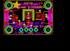

Contents
========

* [PROJ-ADAF-4566-STAN-01>Adafruit AHT20 PCB](#proj-adaf-4566-stan-01adafruit-aht20-pcb)
	* [Images](#images)
	* [Interactive BOM](#interactive-bom)
	* [Tags](#tags)
  
![][im]
# PROJ-ADAF-4566-STAN-01>Adafruit AHT20 PCB

- ID: PROJ-ADAF-4566-STAN-01
- Hex ID: PRA4566
- Name: Adafruit AHT20 PCB
- Description: 

## Images
  
  

|eagleImage|
| :---: |
||

## Interactive BOM

- Interactive BOM page: [ibom.html](kicad/bom/ibom.html)

## Tags

- hexID: PRA4566
- oompType: PROJ
- oompSize: ADAF
- oompColor: 4566
- oompDesc: STAN
- oompIndex: 01
- oompName: Adafruit AHT20 PCB
- sources: All source files from https://github.com/adafruit/Adafruit-AHT20-PCB (source licence details in srcLicense.md)
- linkBuyPage: http://www.adafruit.com/products/4566
- oompPart: CAPC-0805-X-UF10-V25, C5, 8.254999999999999, 5.588, 0
- oompPart: CAPC-0603-X-NF100-V50, C6, 12.7, 6.35, 270
- oompPart: UNMATCHED-UNMATCHED-X-UNMATCHED-01, CONN3, 22.796499999999998, 8.889999999999999, 90
- oompPart: UNMATCHED-UNMATCHED-X-UNMATCHED-01, CONN4, 2.6034999999999995, 8.889999999999999, 270
- oompPart: UNMATCHED-UNMATCHED-X-UNMATCHED-01, D1, 3.556, 12.572999999999999, 90
- oompPart: SKIP-UNMATCHED-X-UNMATCHED-01, FID3, 5.968999999999999, 3.0479999999999996, 0
- oompPart: SKIP-UNMATCHED-X-UNMATCHED-01, FID4, 19.558, 16.509999999999998, 0
- oompPart: UNMATCHED-UNMATCHED-X-UNMATCHED-01, JP2, 12.7, 2.54, 0
- oompPart: RESE-0603-X-O221-01, R1, 6.731, 8.636000000000001, 270
- oompPart: RESE-UNMATCHED-X-O103-01, R5, 17.906999999999996, 9.652, 270
- oompPart: SKIP-UNMATCHED-X-UNMATCHED-01, U$19, 2.54, 15.239999999999998, 0
- oompPart: SKIP-UNMATCHED-X-UNMATCHED-01, U$20, 22.86, 15.239999999999998, 0
- oompPart: SKIP-UNMATCHED-X-UNMATCHED-01, U$22, 2.54, 2.54, 0
- oompPart: SKIP-UNMATCHED-X-UNMATCHED-01, U$25, 22.86, 2.54, 0
- oompPart: UNMATCHED-UNMATCHED-X-UNMATCHED-01, U1, 12.7, 10.16, 0
- rawPart: 

[im]: eagleImage_450.png
