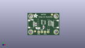
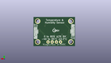
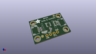

Contents
========

* [PROJ-ADAF-4566-STAN-01>Adafruit AHT20 PCB](#proj-adaf-4566-stan-01adafruit-aht20-pcb)
	* [Images](#images)
	* [Interactive BOM](#interactive-bom)
	* [OOMP Parts](#oomp-parts)
	* [Tags](#tags)
  
![][im]
# PROJ-ADAF-4566-STAN-01>Adafruit AHT20 PCB

- ID: PROJ-ADAF-4566-STAN-01
- Hex ID: PRA4566
- Name: Adafruit AHT20 PCB
- Description: 

## Images
  
  

|eagleImage|kicadPcb3dFront|kicadPcb3dBack|kicadPcb3d|
| :---: | :---: | :---: | :---: |
|||||

## Interactive BOM

- Interactive BOM page: [ibom.html](kicad/bom/ibom.html)

## OOMP Parts
  

|OOMP Parts|
| :---: |
|CAPC-0805-X-UNMATCHED-01, C5, 8.254999999999999, 5.588, 0,C5, 10uF, 0805-NO, microbuilder, (0.325, 0.22), R0|
|<table><tr><td></td><td> C6</td><td>[CAPC-0603-X-NF100-V50 SMD (0603) 100 nF Capacitor (Ceramic) 50v](https://github.com/oomlout/oomlout_OOMP_parts/tree/main/CAPC-0603-X-NF100-V50/)</td><td>[C6N100](https://github.com/oomlout/oomlout_OOMP_parts/tree/main/CAPC-0603-X-NF100-V50/)</td></tr></table>|
|UNMATCHED-UNMATCHED-X-UNMATCHED-01, CONN3, 22.796499999999998, 8.889999999999999, 90,CONN3, STEMMA_I2C_QT, JST_SH4, microbuilder, (0.8975, 0.35), R90|
|UNMATCHED-UNMATCHED-X-UNMATCHED-01, CONN4, 2.6034999999999995, 8.889999999999999, 270,CONN4, STEMMA_I2C_QT, JST_SH4, microbuilder, (0.1025, 0.35), R270|
|UNMATCHED-UNMATCHED-X-UNMATCHED-01, D1, 3.556, 12.572999999999999, 90,D1, GREEN, CHIPLED_0603_NOOUTLINE, microbuilder, (0.14, 0.495), R90|
|<table><tr><td></td><td> JP2</td><td>[HEAD-I01-X-PI04-01 2.54 mm 4 Pin Header](https://github.com/oomlout/oomlout_OOMP_parts/tree/main/HEAD-I01-X-PI04-01/)</td><td>[H04](https://github.com/oomlout/oomlout_OOMP_parts/tree/main/HEAD-I01-X-PI04-01/)</td></tr></table>|
|<table><tr><td></td><td> R1</td><td>[RESE-0603-X-O221-01 SMD (0603) 220 Ohm Resistor](https://github.com/oomlout/oomlout_OOMP_parts/tree/main/RESE-0603-X-O221-01/)</td><td>[R6221](https://github.com/oomlout/oomlout_OOMP_parts/tree/main/RESE-0603-X-O221-01/)</td></tr></table>|
|RESE-UNMATCHED-X-O103-01, R5, 17.906999999999996, 9.652, 270,R5, 10K, RESPACK_4X0603, microbuilder, (0.705, 0.38), R270|
|UNMATCHED-UNMATCHED-X-UNMATCHED-01, U1, 12.7, 10.16, 0,U1, AHT20, SNR6-1.0-3X3X1MM, Longan-IC, (0.5, 0.4), R0|

## Tags

- hexID: PRA4566
- oompType: PROJ
- oompSize: ADAF
- oompColor: 4566
- oompDesc: STAN
- oompIndex: 01
- oompName: Adafruit AHT20 PCB
- sources: All source files from https://github.com/adafruit/Adafruit-AHT20-PCB (source licence details in srcLicense.md)
- linkBuyPage: http://www.adafruit.com/products/4566
- oompID: PROJ-ADAF-4566-STAN-01
- oompPart: CAPC-0805-X-UNMATCHED-01, C5, 8.254999999999999, 5.588, 0
- oompPart: CAPC-0603-X-NF100-V50, C6, 12.7, 6.35, 270
- oompPart: UNMATCHED-UNMATCHED-X-UNMATCHED-01, CONN3, 22.796499999999998, 8.889999999999999, 90
- oompPart: UNMATCHED-UNMATCHED-X-UNMATCHED-01, CONN4, 2.6034999999999995, 8.889999999999999, 270
- oompPart: UNMATCHED-UNMATCHED-X-UNMATCHED-01, D1, 3.556, 12.572999999999999, 90
- oompPart: SKIP-UNMATCHED-X-UNMATCHED-01, FID3, 5.968999999999999, 3.0479999999999996, 0
- oompPart: SKIP-UNMATCHED-X-UNMATCHED-01, FID4, 19.558, 16.509999999999998, 0
- oompPart: HEAD-I01-X-PI04-01, JP2, 12.7, 2.54, 0
- oompPart: RESE-0603-X-O221-01, R1, 6.731, 8.636000000000001, 270
- oompPart: RESE-UNMATCHED-X-O103-01, R5, 17.906999999999996, 9.652, 270
- oompPart: SKIP-UNMATCHED-X-UNMATCHED-01, U$19, 2.54, 15.239999999999998, 0
- oompPart: SKIP-UNMATCHED-X-UNMATCHED-01, U$20, 22.86, 15.239999999999998, 0
- oompPart: SKIP-UNMATCHED-X-UNMATCHED-01, U$22, 2.54, 2.54, 0
- oompPart: SKIP-UNMATCHED-X-UNMATCHED-01, U$25, 22.86, 2.54, 0
- oompPart: UNMATCHED-UNMATCHED-X-UNMATCHED-01, U1, 12.7, 10.16, 0
- rawPart: C5, 10uF, 0805-NO, microbuilder, (0.325, 0.22), R0
- rawPart: C6, 0.1uF, 0603-NO, microbuilder, (0.5, 0.25), R270
- rawPart: CONN3, STEMMA_I2C_QT, JST_SH4, microbuilder, (0.8975, 0.35), R90
- rawPart: CONN4, STEMMA_I2C_QT, JST_SH4, microbuilder, (0.1025, 0.35), R270
- rawPart: D1, GREEN, CHIPLED_0603_NOOUTLINE, microbuilder, (0.14, 0.495), R90
- rawPart: FID3, FIDUCIAL_1MM, FIDUCIAL_1MM, microbuilder, (0.235, 0.12), R0
- rawPart: FID4, FIDUCIAL_1MM, FIDUCIAL_1MM, microbuilder, (0.77, 0.65), R0
- rawPart: JP2, 1X04_ROUND_76, microbuilder, (0.5, 0.1), R0
- rawPart: R1, 220, 0603-NO, microbuilder, (0.265, 0.34), R270
- rawPart: R5, 10K, RESPACK_4X0603, microbuilder, (0.705, 0.38), R270
- rawPart: U$19, MOUNTINGHOLE2.5, MOUNTINGHOLE_2.5_PLATED, microbuilder, (0.1, 0.6), R0
- rawPart: U$20, MOUNTINGHOLE2.5, MOUNTINGHOLE_2.5_PLATED, microbuilder, (0.9, 0.6), R0
- rawPart: U$22, MOUNTINGHOLE2.5, MOUNTINGHOLE_2.5_PLATED, microbuilder, (0.1, 0.1), R0
- rawPart: U$25, MOUNTINGHOLE2.5, MOUNTINGHOLE_2.5_PLATED, microbuilder, (0.9, 0.1), R0
- rawPart: U1, AHT20, SNR6-1.0-3X3X1MM, Longan-IC, (0.5, 0.4), R0

[im]: kicadPcb3d_450.png
