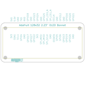
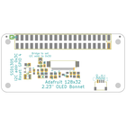
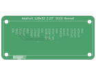
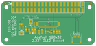

Contents
========

* [PRA4567 > Adafruit 2.23 inch Monochrome OLED Bonnet PCB](#pra4567--adafruit-223-inch-monochrome-oled-bonnet-pcb)
	* [Schematic](#schematic)
	* [PCB](#pcb)
	* [Interactive BOM](#interactive-bom)
	* [Images](#images)
	* [Tags](#tags)
  
![][im]
# PRA4567 > Adafruit 2.23 inch Monochrome OLED Bonnet PCB

- ID: PROJ-ADAF-4567-STAN-01
- Hex ID: PRA4567
- Name: Adafruit
- Description: Adafruit
- Long Link: [http://oom.lt/PROJ-ADAF-4567-STAN-01](http://oom.lt/PROJ-ADAF-4567-STAN-01)
- Short Link: [http://oom.lt/PRA4567](http://oom.lt/PRA4567)

## Schematic
  

## PCB
  

## Interactive BOM

- Interactive BOM page: [ibom.html](https://htmlpreview.github.io/?https://github.com/oomlout/oomlout_OOMP_projects/blob/main/PROJ-ADAF-4567-STAN-01/kicad/bom/ibom.html)

## Images
  
  

|bominteractivefront|bominteractiveback|kicadPcb3d|kicadPcb3dFront|kicadPcb3dBack|eagleImage|eagleSchemImage|pcbdraw|pcbdrawback|
| :---: | :---: | :---: | :---: | :---: | :---: | :---: | :---: | :---: |
||||||||||

## Tags

- hexID: PRA4567
- oompType: PROJ
- oompSize: ADAF
- oompColor: 4567
- oompDesc: STAN
- oompIndex: 01
- oompName: Adafruit 2.23 inch Monochrome OLED Bonnet PCB
- sources: All source files from https://github.com/adafruit/Adafruit-2.23-inch-Monochrome-OLED-Bonnet-PCB (source licence details in srcLicense.md)
- linkBuyPage: http://www.adafruit.com/products/4567
- oompID: PROJ-ADAF-4567-STAN-01
- rawParts: C1,0.1uF,CAP_CERAMIC0603_NO,0603-NO,Ceramic Capacitors,,
- rawParts: C2,10uF,CAP_CERAMIC0805-NOOUTLINE,0805-NO,Ceramic Capacitors,,
- rawParts: C4,10uF,CAP_CERAMIC0805-NOOUTLINE,0805-NO,Ceramic Capacitors,,
- rawParts: C5,10uF,CAP_CERAMIC0805-NOOUTLINE,0805-NO,Ceramic Capacitors,,
- rawParts: C6,10uF,CAP_CERAMIC0805-NOOUTLINE,0805-NO,Ceramic Capacitors,,
- rawParts: C7,2.2uF,CAP_CERAMIC0805-NOOUTLINE,0805-NO,Ceramic Capacitors,,
- rawParts: C8,10uF,CAP_CERAMIC0805-NOOUTLINE,0805-NO,Ceramic Capacitors,,
- rawParts: C9,0.1uF,CAP_CERAMIC0603_NO,0603-NO,Ceramic Capacitors,,
- rawParts: CONN1,STEMMA_I2C_QT,STEMMA_I2C_QT,JST_SH4,,,
- rawParts: D4,MBR120,DIODESOD-123,SOD-123,Diode,,
- rawParts: IC1,APX803S-29SA,AXP083-SAG,SOT23,,,
- rawParts: L1,10uH,INDUCTOR,INDUCTOR_1007,Inductors,,
- rawParts: R1,10K,RESISTOR_0603_NOOUT,0603-NO,Resistors,,
- rawParts: R2,10K,RESISTOR_0603_NOOUT,0603-NO,Resistors,,
- rawParts: R3,910K,RESISTOR0805_NOOUTLINE,0805-NO,Resistors,,
- rawParts: R7,100K,RESISTOR_0603_NOOUT,0603-NO,Resistors,,
- rawParts: R8,10K,RESISTOR_0603_NOOUT,0603-NO,Resistors,,
- rawParts: RPI1,RASPBERRYPI_BPLUS_BONNETSMT,RASPBERRYPI_BPLUS_BONNETSMT,PI_BONNET_SMT,,,
- rawParts: SJ1,,SOLDERJUMPER,SOLDERJUMPER_ARROW_NOPASTE,SMD Solder JUMPER,EXCLUDE,
- rawParts: U$33,2.23_INCH_OLEDBOTTOM_CONTACT_24_PIN_OLED,2.23_INCH_OLEDBOTTOM_CONTACT_24_PIN_OLED,2.23OLED_BOTTOM_CONTACT,,,
- rawParts: U1,FAN5331,VREG_FAN5331,SOT23-5,FAN5331 - LED/OLED 20V Boost Converter,,

[im]: kicadPcb3d_450.png
