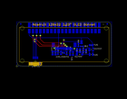
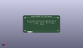
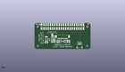
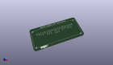

Contents
========

* [PROJ-ADAF-4567-STAN-01>Adafruit 2.23 inch Monochrome OLED Bonnet PCB](#proj-adaf-4567-stan-01adafruit-223-inch-monochrome-oled-bonnet-pcb)
	* [Images](#images)
	* [Interactive BOM](#interactive-bom)
	* [OOMP Parts](#oomp-parts)
	* [Tags](#tags)
  
![][im]
# PROJ-ADAF-4567-STAN-01>Adafruit 2.23 inch Monochrome OLED Bonnet PCB

- ID: PROJ-ADAF-4567-STAN-01
- Hex ID: PRA4567
- Name: Adafruit 2.23 inch Monochrome OLED Bonnet PCB
- Description: 

## Images
  
  

|eagleImage|kicadPcb3dFront|kicadPcb3dBack|kicadPcb3d|
| :---: | :---: | :---: | :---: |
|||||

## Interactive BOM

- Interactive BOM page: [ibom.html](kicad/bom/ibom.html)

## OOMP Parts
  

|OOMP Parts|
| :---: |
|<table><tr><td></td><td> C1</td><td>[CAPC-0603-X-NF100-V50 SMD (0603) 100 nF Capacitor (Ceramic) 50v](https://github.com/oomlout/oomlout_OOMP_parts/tree/main/CAPC-0603-X-NF100-V50/)</td><td>[C6N100](https://github.com/oomlout/oomlout_OOMP_parts/tree/main/CAPC-0603-X-NF100-V50/)</td></tr></table>|
|CAPC-0805-X-UNMATCHED-01, C2, 1045.0, 358.50394, M270,C2, 10uF, 0805-NO, microbuilder, (1045, 358.50394), MR270|
|CAPC-0805-X-UNMATCHED-01, C4, 1630.39395, 420.72047, M270,C4, 10uF, 0805-NO, microbuilder, (1630.39395, 420.72047), MR270|
|CAPC-0805-X-UNMATCHED-01, C5, 1713.7377, 420.72047, M270,C5, 10uF, 0805-NO, microbuilder, (1713.7377, 420.72047), MR270|
|CAPC-0805-X-UNMATCHED-01, C6, 2015.90551, 570.3937, M180,C6, 10uF, 0805-NO, microbuilder, (2015.90551, 570.3937), MR180|
|CAPC-0805-X-UF22D-01, C7, 963.46457, 358.50394, M90,C7, 2.2uF, 0805-NO, microbuilder, (963.46457, 358.50394), MR90|
|CAPC-0805-X-UNMATCHED-01, C8, 1519.6063, 346.49606, M90,C8, 10uF, 0805-NO, microbuilder, (1519.6063, 346.49606), MR90|
|<table><tr><td></td><td> C9</td><td>[CAPC-0603-X-NF100-V50 SMD (0603) 100 nF Capacitor (Ceramic) 50v](https://github.com/oomlout/oomlout_OOMP_parts/tree/main/CAPC-0603-X-NF100-V50/)</td><td>[C6N100](https://github.com/oomlout/oomlout_OOMP_parts/tree/main/CAPC-0603-X-NF100-V50/)</td></tr></table>|
|UNMATCHED-UNMATCHED-X-UNMATCHED-01, CONN1, 500.0, 125.0, M0,CONN1, STEMMA_I2C_QT, JST_SH4, microbuilder, (500, 125), MR0|
|UNMATCHED-UNMATCHED-X-UNMATCHED-01, D4, 1700.19685, 317.67717, M180,D4, MBR120, SOD-123, microbuilder, (1700.19685, 317.67717), MR180|
|UNMATCHED-UNMATCHED-X-UNMATCHED-01, IC1, 1233.50394, 361.70866, M90,IC1, APX803S-29SA, SOT23, adafruit, (1233.50394, 361.70866), MR90|
|UNMATCHED-UNMATCHED-X-UNMATCHED-01, L1, 2015.90551, 317.67717, M0,L1, 10uH, INDUCTOR_1007, microbuilder, (2015.90551, 317.67717), MR0|
|<table><tr><td></td><td> R1</td><td>[RESE-0603-X-O103-01 SMD (0603) 10k Ohm Resistor](https://github.com/oomlout/oomlout_OOMP_parts/tree/main/RESE-0603-X-O103-01/)</td><td>[R6103](https://github.com/oomlout/oomlout_OOMP_parts/tree/main/RESE-0603-X-O103-01/)</td></tr></table>|
|<table><tr><td></td><td> R2</td><td>[RESE-0603-X-O103-01 SMD (0603) 10k Ohm Resistor](https://github.com/oomlout/oomlout_OOMP_parts/tree/main/RESE-0603-X-O103-01/)</td><td>[R6103](https://github.com/oomlout/oomlout_OOMP_parts/tree/main/RESE-0603-X-O103-01/)</td></tr></table>|
|RESE-0805-X-O914-01, R3, 1438.42126, 346.49606, M90,R3, 910K, 0805-NO, microbuilder, (1438.42126, 346.49606), MR90|
|<table><tr><td></td><td> R7</td><td>[RESE-0603-X-O104-01 SMD (0603) 100k Ohm Resistor](https://github.com/oomlout/oomlout_OOMP_parts/tree/main/RESE-0603-X-O104-01/)</td><td>[R6104](https://github.com/oomlout/oomlout_OOMP_parts/tree/main/RESE-0603-X-O104-01/)</td></tr></table>|
|<table><tr><td></td><td> R8</td><td>[RESE-0603-X-O103-01 SMD (0603) 10k Ohm Resistor](https://github.com/oomlout/oomlout_OOMP_parts/tree/main/RESE-0603-X-O103-01/)</td><td>[R6103](https://github.com/oomlout/oomlout_OOMP_parts/tree/main/RESE-0603-X-O103-01/)</td></tr></table>|
|UNMATCHED-UNMATCHED-X-UNMATCHED-01, RPI1, 1.0, 0.0, 0,RPI1, RASPBERRYPI_BPLUS_BONNETSMT, PI_BONNET_SMT, adafruit_sbc, (1, 0), R0|
|UNMATCHED-UNMATCHED-X-UNMATCHED-01, U$33, 1279.52756, 580.7874, 0,U$33, 2.23_INCH_OLEDBOTTOM_CONTACT_24_PIN_OLED, 2.23OLED_BOTTOM_CONTACT, microbuilder, (1279.52756, 580.7874), R0|
|UNMATCHED-UNMATCHED-X-UNMATCHED-01, U1, 2015.90551, 454.17323, M90,U1, FAN5331, SOT23-5, microbuilder, (2015.90551, 454.17323), MR90|

## Tags

- hexID: PRA4567
- oompType: PROJ
- oompSize: ADAF
- oompColor: 4567
- oompDesc: STAN
- oompIndex: 01
- oompName: Adafruit 2.23 inch Monochrome OLED Bonnet PCB
- sources: All source files from https://github.com/adafruit/Adafruit-2.23-inch-Monochrome-OLED-Bonnet-PCB (source licence details in srcLicense.md)
- linkBuyPage: http://www.adafruit.com/products/4567
- oompID: PROJ-ADAF-4567-STAN-01
- oompPart: CAPC-0603-X-NF100-V50, C1, 1115.0, 360.0, M270
- oompPart: CAPC-0805-X-UNMATCHED-01, C2, 1045.0, 358.50394, M270
- oompPart: CAPC-0805-X-UNMATCHED-01, C4, 1630.39395, 420.72047, M270
- oompPart: CAPC-0805-X-UNMATCHED-01, C5, 1713.7377, 420.72047, M270
- oompPart: CAPC-0805-X-UNMATCHED-01, C6, 2015.90551, 570.3937, M180
- oompPart: CAPC-0805-X-UF22D-01, C7, 963.46457, 358.50394, M90
- oompPart: CAPC-0805-X-UNMATCHED-01, C8, 1519.6063, 346.49606, M90
- oompPart: CAPC-0603-X-NF100-V50, C9, 1797.25468, 420.72047, M90
- oompPart: UNMATCHED-UNMATCHED-X-UNMATCHED-01, CONN1, 500.0, 125.0, M0
- oompPart: UNMATCHED-UNMATCHED-X-UNMATCHED-01, D4, 1700.19685, 317.67717, M180
- oompPart: UNMATCHED-UNMATCHED-X-UNMATCHED-01, IC1, 1233.50394, 361.70866, M90
- oompPart: UNMATCHED-UNMATCHED-X-UNMATCHED-01, L1, 2015.90551, 317.67717, M0
- oompPart: RESE-0603-X-O103-01, R1, 1349.82283, 356.49606, M270
- oompPart: RESE-0603-X-O103-01, R2, 1665.0, 575.0, M90
- oompPart: RESE-0805-X-O914-01, R3, 1438.42126, 346.49606, M90
- oompPart: RESE-0603-X-O104-01, R7, 1880.94488, 420.72047, M270
- oompPart: RESE-0603-X-O103-01, R8, 1758.38583, 540.94488, M180
- oompPart: UNMATCHED-UNMATCHED-X-UNMATCHED-01, RPI1, 1.0, 0.0, 0
- oompPart: SKIP-UNMATCHED-X-UNMATCHED-01, SJ1, 1750.0, 650.0, M90
- oompPart: UNMATCHED-UNMATCHED-X-UNMATCHED-01, U$33, 1279.52756, 580.7874, 0
- oompPart: UNMATCHED-UNMATCHED-X-UNMATCHED-01, U1, 2015.90551, 454.17323, M90
- rawPart: C1, 0.1uF, 0603-NO, microbuilder, (1115, 360), MR270
- rawPart: C2, 10uF, 0805-NO, microbuilder, (1045, 358.50394), MR270
- rawPart: C4, 10uF, 0805-NO, microbuilder, (1630.39395, 420.72047), MR270
- rawPart: C5, 10uF, 0805-NO, microbuilder, (1713.7377, 420.72047), MR270
- rawPart: C6, 10uF, 0805-NO, microbuilder, (2015.90551, 570.3937), MR180
- rawPart: C7, 2.2uF, 0805-NO, microbuilder, (963.46457, 358.50394), MR90
- rawPart: C8, 10uF, 0805-NO, microbuilder, (1519.6063, 346.49606), MR90
- rawPart: C9, 0.1uF, 0603-NO, microbuilder, (1797.25468, 420.72047), MR90
- rawPart: CONN1, STEMMA_I2C_QT, JST_SH4, microbuilder, (500, 125), MR0
- rawPart: D4, MBR120, SOD-123, microbuilder, (1700.19685, 317.67717), MR180
- rawPart: IC1, APX803S-29SA, SOT23, adafruit, (1233.50394, 361.70866), MR90
- rawPart: L1, 10uH, INDUCTOR_1007, microbuilder, (2015.90551, 317.67717), MR0
- rawPart: R1, 10K, 0603-NO, microbuilder, (1349.82283, 356.49606), MR270
- rawPart: R2, 10K, 0603-NO, microbuilder, (1665, 575), MR90
- rawPart: R3, 910K, 0805-NO, microbuilder, (1438.42126, 346.49606), MR90
- rawPart: R7, 100K, 0603-NO, microbuilder, (1880.94488, 420.72047), MR270
- rawPart: R8, 10K, 0603-NO, microbuilder, (1758.38583, 540.94488), MR180
- rawPart: RPI1, RASPBERRYPI_BPLUS_BONNETSMT, PI_BONNET_SMT, adafruit_sbc, (1, 0), R0
- rawPart: SJ1, SOLDERJUMPER_ARROW_NOPASTE, microbuilder, (1750, 650), MR90
- rawPart: U$33, 2.23_INCH_OLEDBOTTOM_CONTACT_24_PIN_OLED, 2.23OLED_BOTTOM_CONTACT, microbuilder, (1279.52756, 580.7874), R0
- rawPart: U1, FAN5331, SOT23-5, microbuilder, (2015.90551, 454.17323), MR90

[im]: kicadPcb3d_450.png
