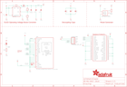

Contents
========

* [PRA4567 > Adafruit 2.23 inch Monochrome OLED Bonnet PCB](#pra4567--adafruit-223-inch-monochrome-oled-bonnet-pcb)
	* [Schematic](#schematic)
	* [PCB](#pcb)
	* [Interactive BOM](#interactive-bom)
	* [Images](#images)
	* [Tags](#tags)
  
![][im]
# PRA4567 > Adafruit 2.23 inch Monochrome OLED Bonnet PCB

- ID: PROJ-ADAF-4567-STAN-01
- Hex ID: PRA4567
- Name: Adafruit
- Description: Adafruit
- Long Link: [http://oom.lt/PROJ-ADAF-4567-STAN-01](http://oom.lt/PROJ-ADAF-4567-STAN-01)
- Short Link: [http://oom.lt/PRA4567](http://oom.lt/PRA4567)

## Schematic
  

## PCB
  

## Interactive BOM

- Interactive BOM page: [ibom.html](https://htmlpreview.github.io/?https://github.com/oomlout/oomlout_OOMP_projects/blob/main/PROJ-ADAF-4567-STAN-01/kicad/bom/ibom.html)

## Images
  
  

|kicadPcb3d|kicadPcb3dFront|kicadPcb3dBack|eagleImage|eagleSchemImage|
| :---: | :---: | :---: | :---: | :---: |
||||||

## Tags

- hexID: PRA4567
- oompType: PROJ
- oompSize: ADAF
- oompColor: 4567
- oompDesc: STAN
- oompIndex: 01
- oompName: Adafruit 2.23 inch Monochrome OLED Bonnet PCB
- sources: All source files from https://github.com/adafruit/Adafruit-2.23-inch-Monochrome-OLED-Bonnet-PCB (source licence details in srcLicense.md)
- linkBuyPage: http://www.adafruit.com/products/4567
- oompID: PROJ-ADAF-4567-STAN-01

[im]: kicadPcb3d_450.png
