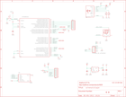

Contents
========

* [PRA4600 > Adafruit QT Py PCB](#pra4600--adafruit-qt-py-pcb)
	* [Schematic](#schematic)
	* [PCB](#pcb)
	* [Interactive BOM](#interactive-bom)
	* [OOMP Parts](#oomp-parts)
	* [Images](#images)
	* [Tags](#tags)
  
![][im]
# PRA4600 > Adafruit QT Py PCB

- ID: PROJ-ADAF-4600-STAN-01
- Hex ID: PRA4600
- Name: Adafruit
- Description: Adafruit
- Long Link: [http://oom.lt/PROJ-ADAF-4600-STAN-01](http://oom.lt/PROJ-ADAF-4600-STAN-01)
- Short Link: [http://oom.lt/PRA4600](http://oom.lt/PRA4600)

## Schematic
  

## PCB
  

## Interactive BOM

- Interactive BOM page: [ibom.html](https://htmlpreview.github.io/?https://github.com/oomlout/oomlout_OOMP_projects/blob/main/PROJ-ADAF-4600-STAN-01/kicad/bom/ibom.html)

## OOMP Parts
  

|OOMP Parts|
| :---: |
|[C1 CAPC-0805-X-UF10-V10 SMD (0805) 10 uF Capacitor (Ceramic) 10v](https://github.com/oomlout/oomlout_OOMP_parts/tree/main/CAPC-0805-X-UF10-V10/)|
|C2 C2,CAPC-0402-X-UF1-01|
|C3 C3,CAPC-0402-X-UF1-01|
|[C8 CAPC-0805-X-UF10-V10 SMD (0805) 10 uF Capacitor (Ceramic) 10v](https://github.com/oomlout/oomlout_OOMP_parts/tree/main/CAPC-0805-X-UF10-V10/)|
|[CONN1 HEAD-I01-X-PI04-01 2.54 mm 4 Pin Header](https://github.com/oomlout/oomlout_OOMP_parts/tree/main/HEAD-I01-X-PI04-01/)|
|D1 D1,DIOD-S323-X-UNMATCHED-01|
|IC3 IC3,UNMATCHED-UNMATCHED-X-UNMATCHED-01|
|[JP1 HEAD-I01-X-PI07-01 2.54 mm 7 Pin Header](https://github.com/oomlout/oomlout_OOMP_parts/tree/main/HEAD-I01-X-PI07-01/)|
|[JP3 HEAD-I01-X-PI07-01 2.54 mm 7 Pin Header](https://github.com/oomlout/oomlout_OOMP_parts/tree/main/HEAD-I01-X-PI07-01/)|
|LED1 LED1,LEDS-UNMATCHED-RGB-K2812-01|
|Q2 Q2,UNMATCHED-UNMATCHED-X-UNMATCHED-01|
|[R1 RESE-0402-X-O472-01 SMD (0402) 4.7k Ohm Resistor](https://github.com/oomlout/oomlout_OOMP_parts/tree/main/RESE-0402-X-O472-01/)|
|[R5 RESE-0402-X-O472-01 SMD (0402) 4.7k Ohm Resistor](https://github.com/oomlout/oomlout_OOMP_parts/tree/main/RESE-0402-X-O472-01/)|
|[R6 RESE-0402-X-O472-01 SMD (0402) 4.7k Ohm Resistor](https://github.com/oomlout/oomlout_OOMP_parts/tree/main/RESE-0402-X-O472-01/)|
|SWC SWC,UNMATCHED-UNMATCHED-X-UNMATCHED-01|
|SWC1 SWC1,UNMATCHED-UNMATCHED-X-UNMATCHED-01|
|SWD SWD,UNMATCHED-UNMATCHED-X-UNMATCHED-01|
|TP1 TP1,UNMATCHED-UNMATCHED-X-UNMATCHED-01|
|TP2 TP2,UNMATCHED-UNMATCHED-X-UNMATCHED-01|
|U1 U1,VREG-SO235-X-KAP2112K-V33D|
|U2 U2,UNMATCHED-UNMATCHED-X-UNMATCHED-01|
|X6 X6,UNMATCHED-UNMATCHED-X-UNMATCHED-01|

## Images
  
  

|kicadPcb3d|kicadPcb3dFront|kicadPcb3dBack|eagleImage|eagleSchemImage|
| :---: | :---: | :---: | :---: | :---: |
||||||

## Tags

- hexID: PRA4600
- oompType: PROJ
- oompSize: ADAF
- oompColor: 4600
- oompDesc: STAN
- oompIndex: 01
- oompName: Adafruit QT Py PCB
- sources: All source files from https://github.com/adafruit/Adafruit-QT-Py-PCB (source licence details in srcLicense.md)
- linkBuyPage: http://www.adafruit.com/products/4600
- oompID: PROJ-ADAF-4600-STAN-01
- oompParts: C1,CAPC-0805-X-UF10-V10
- oompParts: C2,CAPC-0402-X-UF1-01
- oompParts: C3,CAPC-0402-X-UF1-01
- oompParts: C8,CAPC-0805-X-UF10-V10
- oompParts: CONN1,HEAD-I01-X-PI04-01
- oompParts: D1,DIOD-S323-X-UNMATCHED-01
- oompParts: IC3,UNMATCHED-UNMATCHED-X-UNMATCHED-01
- oompParts: JP1,HEAD-I01-X-PI07-01
- oompParts: JP3,HEAD-I01-X-PI07-01
- oompParts: LED1,LEDS-UNMATCHED-RGB-K2812-01
- oompParts: Q2,UNMATCHED-UNMATCHED-X-UNMATCHED-01
- oompParts: R1,RESE-0402-X-O472-01
- oompParts: R5,RESE-0402-X-O472-01
- oompParts: R6,RESE-0402-X-O472-01
- oompParts: SWC,UNMATCHED-UNMATCHED-X-UNMATCHED-01
- oompParts: SWC1,UNMATCHED-UNMATCHED-X-UNMATCHED-01
- oompParts: SWD,UNMATCHED-UNMATCHED-X-UNMATCHED-01
- oompParts: TP1,UNMATCHED-UNMATCHED-X-UNMATCHED-01
- oompParts: TP2,UNMATCHED-UNMATCHED-X-UNMATCHED-01
- oompParts: U1,VREG-SO235-X-KAP2112K-V33D
- oompParts: U2,UNMATCHED-UNMATCHED-X-UNMATCHED-01
- oompParts: X6,UNMATCHED-UNMATCHED-X-UNMATCHED-01
- rawParts: C1,10uF,CAP_CERAMIC_0805MP,_0805MP,Ceramic Capacitors,,,,
- rawParts: C2,1uF,CAP_CERAMIC_0402NO,_0402NO,Ceramic Capacitors,,,,
- rawParts: C3,1uF,CAP_CERAMIC_0402NO,_0402NO,Ceramic Capacitors,,,,
- rawParts: C8,10uF,CAP_CERAMIC_0805MP,_0805MP,Ceramic Capacitors,,,,
- rawParts: CONN1,STEMMA_I2C_QTSKINNY,STEMMA_I2C_QTSKINNY,JST_SH4_SKINNY,,,,,
- rawParts: D1,  NSR0320,DIODE_SOD323MINI,SOD-323_MINI,Diode,,,,
- rawParts: IC3,ATSAMD21E,ATSAMD21E,QFN32_5MM,,,,,
- rawParts: JP1,,HEADER-1X7_CASTEL,1X07_CASTEL,PIN HEADER,,,,
- rawParts: JP3,,HEADER-1X7_CASTEL,1X07_CASTEL,PIN HEADER,,,,
- rawParts: LED1,WS2812B_SK6805_1515,WS2812B_SK6805_1515,SK6805_1515,,,,,
- rawParts: Q2,reset,SWITCH_TACT_SMT4.6X2.8,BTN_KMR2_4.6X2.8,SMT Tact Switches,,,,
- rawParts: R1,5.1K,RESISTOR_0402NO,_0402NO,Resistors,,,,
- rawParts: R5,5.1K,RESISTOR_0402NO,_0402NO,Resistors,,,,
- rawParts: R6,5.1K,RESISTOR_0402NO,_0402NO,Resistors,,,,
- rawParts: SWC,TPB1,27,TPB1,27,B1,27,Test pad,,19,,
- rawParts: SWC1,TPB1,27,TPB1,27,B1,27,Test pad,,19,,
- rawParts: SWD,TPB1,27,TPB1,27,B1,27,Test pad,,19,,
- rawParts: TP1,,TESTPOINT_1X3,TESTPOINT_RECT_1X3MM,Test Point,,,,
- rawParts: TP2,,TESTPOINT_1X3,TESTPOINT_RECT_1X3MM,Test Point,,,,
- rawParts: U$6,FIDUCIAL_1MM,FIDUCIAL_1MM,FIDUCIAL_1MM,Fiducial Alignment Points,EXCLUDE,,,
- rawParts: U$8,FIDUCIAL_1MM,FIDUCIAL_1MM,FIDUCIAL_1MM,Fiducial Alignment Points,EXCLUDE,,,
- rawParts: U1,AP2112K-3.3,VREG_SOT23-5,SOT23-5,SOT23-5 Fixed Voltage Regulators,,,,
- rawParts: U2,,SPIFLASH_8PIN,SOIC8_150MIL,SOIC8 SPI Flash,,,,
- rawParts: X6,USB TYPE C,USB_C,USB_C_CUSB31-CFM2AX-01-X,USB Type-C USB 2.0 Connector,,,,

[im]: kicadPcb3d_450.png
