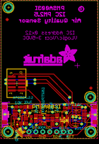

Contents
========

* [PROJ-ADAF-4632-STAN-01>Adafruit PMSA003I PCB](#proj-adaf-4632-stan-01adafruit-pmsa003i-pcb)
	* [Images](#images)
	* [Interactive BOM](#interactive-bom)
	* [OOMP Parts](#oomp-parts)
	* [Tags](#tags)
  
![][im]
# PROJ-ADAF-4632-STAN-01>Adafruit PMSA003I PCB

- ID: PROJ-ADAF-4632-STAN-01
- Hex ID: PRA4632
- Name: Adafruit PMSA003I PCB
- Description: 

## Images
  
  

|eagleImage|
| :---: |
||

## Interactive BOM

- Interactive BOM page: [ibom.html](kicad/bom/ibom.html)

## OOMP Parts
  

|OOMP Parts|
| :---: |
|<table><tr><td></td><td> C1</td><td>[CAPC-0603-X-NF100-V50 SMD (0603) 100 nF Capacitor (Ceramic) 50v](https://github.com/oomlout/oomlout_OOMP_parts/tree/main/CAPC-0603-X-NF100-V50/)</td><td>[C6N100](https://github.com/oomlout/oomlout_OOMP_parts/tree/main/CAPC-0603-X-NF100-V50/)</td></tr></table>|
|<table><tr><td></td><td> C2</td><td>[CAPC-0805-X-UF10-V25 SMD (0805) 10 uF Capacitor (Ceramic) 25v](https://github.com/oomlout/oomlout_OOMP_parts/tree/main/CAPC-0805-X-UF10-V25/)</td><td>[C85U010](https://github.com/oomlout/oomlout_OOMP_parts/tree/main/CAPC-0805-X-UF10-V25/)</td></tr></table>|
|<table><tr><td></td><td> C3</td><td>[CAPC-0805-X-UF10-V25 SMD (0805) 10 uF Capacitor (Ceramic) 25v](https://github.com/oomlout/oomlout_OOMP_parts/tree/main/CAPC-0805-X-UF10-V25/)</td><td>[C85U010](https://github.com/oomlout/oomlout_OOMP_parts/tree/main/CAPC-0805-X-UF10-V25/)</td></tr></table>|
|<table><tr><td></td><td> C4</td><td>[CAPC-0805-X-UF10-V25 SMD (0805) 10 uF Capacitor (Ceramic) 25v](https://github.com/oomlout/oomlout_OOMP_parts/tree/main/CAPC-0805-X-UF10-V25/)</td><td>[C85U010](https://github.com/oomlout/oomlout_OOMP_parts/tree/main/CAPC-0805-X-UF10-V25/)</td></tr></table>|
|CAPC-UNMATCHED-X-UF10-V25, C5, 18.796, 6.476999999999999, 270,C5, 10uF, 0805_10MGAP, microbuilder, (0.74, 0.255), R270|
|CAPC-0805-X-UNMATCHED-01, C6, 20.574, 7.746999999999999, 90,C6, 1uF, 0805-NO, microbuilder, (0.81, 0.305), R90|
|UNMATCHED-UNMATCHED-X-UNMATCHED-01, CONN3, 33.019999999999996, 8.889999999999999, 90,CONN3, STEMMA_I2C_QT, JST_SH4, microbuilder, (1.3, 0.35), R90|
|UNMATCHED-UNMATCHED-X-UNMATCHED-01, CONN4, 2.54, 8.889999999999999, 270,CONN4, STEMMA_I2C_QT, JST_SH4, microbuilder, (0.1, 0.35), R270|
|UNMATCHED-UNMATCHED-X-UNMATCHED-01, D1, 5.918000102, 5.320000028, 180,D1, GREEN, CHIPLED_0603_NOOUTLINE, microbuilder, (0.23299213, 0.20944882), R180|
|UNMATCHED-UNMATCHED-X-UNMATCHED-01, D2, 24.13, 6.731, 90,D2, 1N4148, SOD-323, microbuilder, (0.95, 0.265), R90|
|UNMATCHED-UNMATCHED-X-UNMATCHED-01, D3, 22.479, 6.731, 90,D3, 1N4148, SOD-323, microbuilder, (0.885, 0.265), R90|
|UNMATCHED-UNMATCHED-X-UNMATCHED-01, IC1, 15.748, 7.619999999999999, 270,IC1, AP3602/RT9361, SOT23-6, microbuilder, (0.62, 0.3), R270|
|UNMATCHED-UNMATCHED-X-UNMATCHED-01, JP2, 5.753999922, 20.30000004, 90,JP2, 2X05_1.27MM_SMT, microbuilder, (0.22653543, 0.7992126), R90|
|UNMATCHED-UNMATCHED-X-UNMATCHED-01, JP3, 17.779999999999998, 2.54, 0,JP3, 1X07_ROUND_70, microbuilder, (0.7, 0.1), R0|
|UNMATCHED-UNMATCHED-X-UNMATCHED-01, Q2, 27.291000028, 5.638999898, 90,Q2, BSS138, SOT363, microbuilder, (1.07444882, 0.22200787), R90|
|<table><tr><td></td><td> R1</td><td>[RESE-0603-X-O103-01 SMD (0603) 10k Ohm Resistor](https://github.com/oomlout/oomlout_OOMP_parts/tree/main/RESE-0603-X-O103-01/)</td><td>[R6103](https://github.com/oomlout/oomlout_OOMP_parts/tree/main/RESE-0603-X-O103-01/)</td></tr></table>|
|<table><tr><td></td><td> R2</td><td>[RESE-0603-X-O104-01 SMD (0603) 100k Ohm Resistor](https://github.com/oomlout/oomlout_OOMP_parts/tree/main/RESE-0603-X-O104-01/)</td><td>[R6104](https://github.com/oomlout/oomlout_OOMP_parts/tree/main/RESE-0603-X-O104-01/)</td></tr></table>|
|RESE-UNMATCHED-X-O103-01, R3, 27.609999898, 10.300999972, 90,R3, 10K, RESPACK_4X0603, microbuilder, (1.08700787, 0.40555118), R90|
|<table><tr><td></td><td> R4</td><td>[RESE-0603-X-O104-01 SMD (0603) 100k Ohm Resistor](https://github.com/oomlout/oomlout_OOMP_parts/tree/main/RESE-0603-X-O104-01/)</td><td>[R6104](https://github.com/oomlout/oomlout_OOMP_parts/tree/main/RESE-0603-X-O104-01/)</td></tr></table>|
|UNMATCHED-UNMATCHED-X-UNMATCHED-01, U2, 8.622000027999999, 8.686999898, 0,U2, AP2112K-3.3, SOT23-5, microbuilder, (0.33944882, 0.34200787), R0|

## Tags

- hexID: PRA4632
- oompType: PROJ
- oompSize: ADAF
- oompColor: 4632
- oompDesc: STAN
- oompIndex: 01
- oompName: Adafruit PMSA003I PCB
- sources: All source files from https://github.com/adafruit/Adafruit-PMSA003I-PCB (source licence details in srcLicense.md)
- linkBuyPage: http://www.adafruit.com/products/4632
- oompPart: CAPC-0603-X-NF100-V50, C1, 10.998000101999999, 7.352000027999999, 270
- oompPart: CAPC-0805-X-UF10-V25, C2, 8.241000028, 5.511999897999999, 0
- oompPart: CAPC-0805-X-UF10-V25, C3, 9.765000028, 11.607999898, 0
- oompPart: CAPC-0805-X-UF10-V25, C4, 12.7, 7.492999999999999, 270
- oompPart: CAPC-UNMATCHED-X-UF10-V25, C5, 18.796, 6.476999999999999, 270
- oompPart: CAPC-0805-X-UNMATCHED-01, C6, 20.574, 7.746999999999999, 90
- oompPart: UNMATCHED-UNMATCHED-X-UNMATCHED-01, CONN3, 33.019999999999996, 8.889999999999999, 90
- oompPart: UNMATCHED-UNMATCHED-X-UNMATCHED-01, CONN4, 2.54, 8.889999999999999, 270
- oompPart: UNMATCHED-UNMATCHED-X-UNMATCHED-01, D1, 5.918000102, 5.320000028, 180
- oompPart: UNMATCHED-UNMATCHED-X-UNMATCHED-01, D2, 24.13, 6.731, 90
- oompPart: UNMATCHED-UNMATCHED-X-UNMATCHED-01, D3, 22.479, 6.731, 90
- oompPart: SKIP-UNMATCHED-X-UNMATCHED-01, FID3, 32.943999898, 18.555999972, 270
- oompPart: SKIP-UNMATCHED-X-UNMATCHED-01, FID4, 2.209999898, 43.828999972, 270
- oompPart: UNMATCHED-UNMATCHED-X-UNMATCHED-01, IC1, 15.748, 7.619999999999999, 270
- oompPart: UNMATCHED-UNMATCHED-X-UNMATCHED-01, JP2, 5.753999922, 20.30000004, 90
- oompPart: UNMATCHED-UNMATCHED-X-UNMATCHED-01, JP3, 17.779999999999998, 2.54, 0
- oompPart: UNMATCHED-UNMATCHED-X-UNMATCHED-01, Q2, 27.291000028, 5.638999898, 90
- oompPart: RESE-0603-X-O103-01, R1, 6.400999898, 11.697999972, 180
- oompPart: RESE-0603-X-O104-01, R2, 15.366999999999999, 5.334, 0
- oompPart: RESE-UNMATCHED-X-O103-01, R3, 27.609999898, 10.300999972, 90
- oompPart: RESE-0603-X-O104-01, R4, 24.13, 11.302999999999999, 0
- oompPart: SKIP-UNMATCHED-X-UNMATCHED-01, U$1, 2.75400008, 48.29999992, 270
- oompPart: SKIP-UNMATCHED-X-UNMATCHED-01, U$17, 32.754000024, 15.299999879999998, 270
- oompPart: SKIP-UNMATCHED-X-UNMATCHED-01, U$19, 2.54, 2.54, 270
- oompPart: SKIP-UNMATCHED-X-UNMATCHED-01, U$21, 33.019999999999996, 2.54, 270
- oompPart: UNMATCHED-UNMATCHED-X-UNMATCHED-01, U2, 8.622000027999999, 8.686999898, 0
- rawPart: C1, 0.1uF, 0603-NO, microbuilder, (0.43299213, 0.28944882), R270
- rawPart: C2, 10uF, 0805-NO, microbuilder, (0.32444882, 0.21700787), R0
- rawPart: C3, 10uF, 0805-NO, microbuilder, (0.38444882, 0.45700787), R0
- rawPart: C4, 10uF, 0805-NO, microbuilder, (0.5, 0.295), R270
- rawPart: C5, 10uF, 0805_10MGAP, microbuilder, (0.74, 0.255), R270
- rawPart: C6, 1uF, 0805-NO, microbuilder, (0.81, 0.305), R90
- rawPart: CONN3, STEMMA_I2C_QT, JST_SH4, microbuilder, (1.3, 0.35), R90
- rawPart: CONN4, STEMMA_I2C_QT, JST_SH4, microbuilder, (0.1, 0.35), R270
- rawPart: D1, GREEN, CHIPLED_0603_NOOUTLINE, microbuilder, (0.23299213, 0.20944882), R180
- rawPart: D2, 1N4148, SOD-323, microbuilder, (0.95, 0.265), R90
- rawPart: D3, 1N4148, SOD-323, microbuilder, (0.885, 0.265), R90
- rawPart: FID3, FIDUCIAL_1MM, FIDUCIAL_1MM, microbuilder, (1.29700787, 0.73055118), R270
- rawPart: FID4, FIDUCIAL_1MM, FIDUCIAL_1MM, microbuilder, (0.08700787, 1.72555118), R270
- rawPart: IC1, AP3602/RT9361, SOT23-6, microbuilder, (0.62, 0.3), R270
- rawPart: JP2, 2X05_1.27MM_SMT, microbuilder, (0.22653543, 0.7992126), R90
- rawPart: JP3, 1X07_ROUND_70, microbuilder, (0.7, 0.1), R0
- rawPart: Q2, BSS138, SOT363, microbuilder, (1.07444882, 0.22200787), R90
- rawPart: R1, 10K, 0603-NO, microbuilder, (0.25200787, 0.46055118), R180
- rawPart: R2, 100K, 0603-NO, microbuilder, (0.605, 0.21), R0
- rawPart: R3, 10K, RESPACK_4X0603, microbuilder, (1.08700787, 0.40555118), R90
- rawPart: R4, 100K, 0603-NO, microbuilder, (0.95, 0.445), R0
- rawPart: U$1, MOUNTINGHOLE2.5, MOUNTINGHOLE_2.5_PLATED, microbuilder, (0.1084252, 1.9015748), R270
- rawPart: U$17, MOUNTINGHOLE2.5, MOUNTINGHOLE_2.5_PLATED, microbuilder, (1.28952756, 0.6023622), R270
- rawPart: U$19, MOUNTINGHOLE2.5, MOUNTINGHOLE_2.5_PLATED, microbuilder, (0.1, 0.1), R270
- rawPart: U$21, MOUNTINGHOLE2.5, MOUNTINGHOLE_2.5_PLATED, microbuilder, (1.3, 0.1), R270
- rawPart: U2, AP2112K-3.3, SOT23-5, microbuilder, (0.33944882, 0.34200787), R0

[im]: eagleImage_450.png
