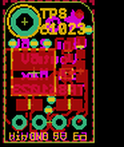
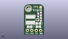
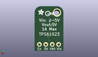
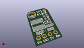

Contents
========

* [PROJ-ADAF-4654-STAN-01>Adafruit TPS61023 PCB](#proj-adaf-4654-stan-01adafruit-tps61023-pcb)
	* [Images](#images)
	* [Interactive BOM](#interactive-bom)
	* [OOMP Parts](#oomp-parts)
	* [Tags](#tags)
  
![][im]
# PROJ-ADAF-4654-STAN-01>Adafruit TPS61023 PCB

- ID: PROJ-ADAF-4654-STAN-01
- Hex ID: PRA4654
- Name: Adafruit TPS61023 PCB
- Description: 

## Images
  
  

|eagleImage|kicadPcb3dFront|kicadPcb3dBack|kicadPcb3d|
| :---: | :---: | :---: | :---: |
|||||

## Interactive BOM

- Interactive BOM page: [ibom.html](kicad/bom/ibom.html)

## OOMP Parts
  

|OOMP Parts|
| :---: |
|CAPE-0805-X-UNMATCHED-01, C1, 8.254999999999999, 6.604, 180,C1, 22uF, 0805-NO, microbuilder, (0.325, 0.26), R180|
|CAPE-0805-X-UNMATCHED-01, C2, 3.175, 4.699, 0,C2, 22uF, 0805-NO, microbuilder, (0.125, 0.185), R0|
|CAPE-0805-X-UNMATCHED-01, C3, 8.254999999999999, 4.724399999999999, 180,C3, 22uF, 0805-NO, microbuilder, (0.325, 0.186), R180|
|UNMATCHED-UNMATCHED-X-UNMATCHED-01, IC1, 7.874, 8.762999999999998, 270,IC1, TPS61023, SOT563, adafruit_power, (0.31, 0.345), R270|
|<table><tr><td></td><td> JP1</td><td>[HEAD-I01-X-PI04-01 2.54 mm 4 Pin Header](https://github.com/oomlout/oomlout_OOMP_parts/tree/main/HEAD-I01-X-PI04-01/)</td><td>[H04](https://github.com/oomlout/oomlout_OOMP_parts/tree/main/HEAD-I01-X-PI04-01/)</td></tr></table>|
|UNMATCHED-UNMATCHED-X-UNMATCHED-01, L1, 3.6829999999999994, 8.762999999999998, 270,L1, 1uH, INDUCTOR_5X5MM_TDK_VLC5045, microbuilder, (0.145, 0.345), R270|
|<table><tr><td></td><td> R1</td><td>[RESE-0603-X-O104-01 SMD (0603) 100k Ohm Resistor](https://github.com/oomlout/oomlout_OOMP_parts/tree/main/RESE-0603-X-O104-01/)</td><td>[R6104](https://github.com/oomlout/oomlout_OOMP_parts/tree/main/RESE-0603-X-O104-01/)</td></tr></table>|
|RESE-0603-X-UNMATCHED-01, R2, 9.652, 8.991599999999998, 90,R2, 732K, 0603-NO, microbuilder, (0.38, 0.354), R90|
|<table><tr><td></td><td> R3</td><td>[RESE-0603-X-O104-01 SMD (0603) 100k Ohm Resistor](https://github.com/oomlout/oomlout_OOMP_parts/tree/main/RESE-0603-X-O104-01/)</td><td>[R6104](https://github.com/oomlout/oomlout_OOMP_parts/tree/main/RESE-0603-X-O104-01/)</td></tr></table>|

## Tags

- hexID: PRA4654
- oompType: PROJ
- oompSize: ADAF
- oompColor: 4654
- oompDesc: STAN
- oompIndex: 01
- oompName: Adafruit TPS61023 PCB
- sources: All source files from https://github.com/adafruit/Adafruit-TPS61023-PCB (source licence details in srcLicense.md)
- linkBuyPage: http://www.adafruit.com/products/4654
- oompPart: CAPE-0805-X-UNMATCHED-01, C1, 8.254999999999999, 6.604, 180
- oompPart: CAPE-0805-X-UNMATCHED-01, C2, 3.175, 4.699, 0
- oompPart: CAPE-0805-X-UNMATCHED-01, C3, 8.254999999999999, 4.724399999999999, 180
- oompPart: SKIP-UNMATCHED-X-UNMATCHED-01, FID1, 9.524999999999999, 16.128999999999998, 0
- oompPart: UNMATCHED-UNMATCHED-X-UNMATCHED-01, IC1, 7.874, 8.762999999999998, 270
- oompPart: HEAD-I01-X-PI04-01, JP1, 5.715, 2.54, 180
- oompPart: UNMATCHED-UNMATCHED-X-UNMATCHED-01, L1, 3.6829999999999994, 8.762999999999998, 270
- oompPart: RESE-0603-X-O104-01, R1, 8.128, 11.557, 270
- oompPart: RESE-0603-X-UNMATCHED-01, R2, 9.652, 8.991599999999998, 90
- oompPart: RESE-0603-X-O104-01, R3, 9.652, 12.065, 90
- oompPart: SKIP-UNMATCHED-X-UNMATCHED-01, U$9, 2.54, 15.239999999999998, 0
- rawPart: C1, 22uF, 0805-NO, microbuilder, (0.325, 0.26), R180
- rawPart: C2, 22uF, 0805-NO, microbuilder, (0.125, 0.185), R0
- rawPart: C3, 22uF, 0805-NO, microbuilder, (0.325, 0.186), R180
- rawPart: FID1, FIDUCIAL_1MM, FIDUCIAL_1MM, microbuilder, (0.375, 0.635), R0
- rawPart: IC1, TPS61023, SOT563, adafruit_power, (0.31, 0.345), R270
- rawPart: JP1, 1X04_ROUND, microbuilder, (0.225, 0.1), R180
- rawPart: L1, 1uH, INDUCTOR_5X5MM_TDK_VLC5045, microbuilder, (0.145, 0.345), R270
- rawPart: R1, 100K, 0603-NO, microbuilder, (0.32, 0.455), R270
- rawPart: R2, 732K, 0603-NO, microbuilder, (0.38, 0.354), R90
- rawPart: R3, 100K, 0603-NO, microbuilder, (0.38, 0.475), R90
- rawPart: U$9, MOUNTINGHOLE2.5, MOUNTINGHOLE_2.5_PLATED, microbuilder, (0.1, 0.6), R0
- oompID: PROJ-ADAF-4654-STAN-01

[im]: kicadPcb3d_450.png
