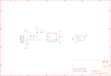

Contents
========

* [PRA466 > Adafruit](#pra466--adafruit)
	* [Schematic](#schematic)
	* [OOMP Parts](#oomp-parts)
	* [Images](#images)
	* [Tags](#tags)
  
![][im]
# PRA466 > Adafruit

- ID: PROJ-ADAF-466-STAN-01
- Hex ID: PRA466
- Name: Adafruit
- Description: Adafruit
- Long Link: [http://oom.lt/PROJ-ADAF-466-STAN-01](http://oom.lt/PROJ-ADAF-466-STAN-01)
- Short Link: [http://oom.lt/PRA466](http://oom.lt/PRA466)

## Schematic
  

## OOMP Parts
  

|OOMP Parts|
| :---: |
|C1,CAPC-0805-X-UF10-V10,C1,10uF,CAP_CERAMIC0805,0805,Ceramic Capacitors,,|
|C2,CAPC-0805-X-UF10-V10,C2,10uF,CAP_CERAMIC0805,0805,Ceramic Capacitors,,|
|C3,CAPC-0805-X-NF100-V50,C3,0.1uF,CAP_CERAMIC0805,0805,Ceramic Capacitors,,|
|C4,CAPC-0805-X-UF10-V10,C4,10uF,CAP_CERAMIC0805,0805,Ceramic Capacitors,,|
|C6,CAPC-0805-X-UF10-V10,C6,10uF,CAP_CERAMIC0805,0805,Ceramic Capacitors,,|
|JP1,HEAD-I01-X-PI05-01,JP1,,HEADER-1X576MIL,1X05_ROUND_76,PIN HEADER,,|
|R1,RESE-0805-X-O103-01,R1,10K,RESISTOR0805,0805,Resistors,,|
|R2,RESE-0805-X-O103-01,R2,10K,RESISTOR0805,0805,Resistors,,|
|U$5,UNMATCHED-UNMATCHED-X-UNMATCHED-01,U$5,MOUNTINGHOLE2.0,MOUNTINGHOLE2.0,MOUNTINGHOLE_2.0_PLATED,Mounting Hole,,|
|U$6,UNMATCHED-UNMATCHED-X-UNMATCHED-01,U$6,MOUNTINGHOLE2.0,MOUNTINGHOLE2.0,MOUNTINGHOLE_2.0_PLATED,Mounting Hole,,|
|U1,UNMATCHED-UNMATCHED-X-UNMATCHED-01,U$7,FIDUCIAL,FIDUCIAL,FIDUCIAL_1MM,For use by pick and place machines to calibrate the vision/machine, 1mm,,|
|U2,UNMATCHED-SO235-X-UNMATCHED-01,U$8,FIDUCIAL,FIDUCIAL,FIDUCIAL_1MM,For use by pick and place machines to calibrate the vision/machine, 1mm,,|

## Images
  
  

|kicadPcb3d|kicadPcb3dFront|kicadPcb3dBack|eagleImage|eagleSchemImage|
| :---: | :---: | :---: | :---: | :---: |
||||||

## Tags

- hexID: PRA466
- oompType: PROJ
- oompSize: ADAF
- oompColor: 466
- oompDesc: STAN
- oompIndex: 01
- oompName: Adafruit VCNL40X0 PCB
- sources: All source files from https://github.com/adafruit/Adafruit-VCNL40X0-PCB (source licence details in srcLicense.md)
- linkBuyPage: http://www.adafruit.com/products/466
- oompID: PROJ-ADAF-466-STAN-01
- oompParts: C1,CAPC-0805-X-UF10-V10
- oompParts: C2,CAPC-0805-X-UF10-V10
- oompParts: C3,CAPC-0805-X-NF100-V50
- oompParts: C4,CAPC-0805-X-UF10-V10
- oompParts: C6,CAPC-0805-X-UF10-V10
- oompParts: JP1,HEAD-I01-X-PI05-01
- oompParts: R1,RESE-0805-X-O103-01
- oompParts: R2,RESE-0805-X-O103-01
- oompParts: U$5,UNMATCHED-UNMATCHED-X-UNMATCHED-01
- oompParts: U$6,UNMATCHED-UNMATCHED-X-UNMATCHED-01
- oompParts: U1,UNMATCHED-UNMATCHED-X-UNMATCHED-01
- oompParts: U2,UNMATCHED-SO235-X-UNMATCHED-01
- rawParts: C1,10uF,CAP_CERAMIC0805,0805,Ceramic Capacitors,,
- rawParts: C2,10uF,CAP_CERAMIC0805,0805,Ceramic Capacitors,,
- rawParts: C3,0.1uF,CAP_CERAMIC0805,0805,Ceramic Capacitors,,
- rawParts: C4,10uF,CAP_CERAMIC0805,0805,Ceramic Capacitors,,
- rawParts: C6,10uF,CAP_CERAMIC0805,0805,Ceramic Capacitors,,
- rawParts: JP1,,HEADER-1X576MIL,1X05_ROUND_76,PIN HEADER,,
- rawParts: R1,10K,RESISTOR0805,0805,Resistors,,
- rawParts: R2,10K,RESISTOR0805,0805,Resistors,,
- rawParts: U$5,MOUNTINGHOLE2.0,MOUNTINGHOLE2.0,MOUNTINGHOLE_2.0_PLATED,Mounting Hole,,
- rawParts: U$6,MOUNTINGHOLE2.0,MOUNTINGHOLE2.0,MOUNTINGHOLE_2.0_PLATED,Mounting Hole,,
- rawParts: U$7,FIDUCIAL,FIDUCIAL,FIDUCIAL_1MM,For use by pick and place machines to calibrate the vision/machine, 1mm,,
- rawParts: U$8,FIDUCIAL,FIDUCIAL,FIDUCIAL_1MM,For use by pick and place machines to calibrate the vision/machine, 1mm,,
- rawParts: U1,VCNL4000-GS08,VCNL4000,VCNL4000,VCNL4000 - I²C Proximity and Light Sensor,,
- rawParts: U2,AP7311-33,VREG_SOT23-5,SOT23-5,SOT23-5 Fixed Voltage Regulators,,

[im]: kicadPcb3d_450.png
