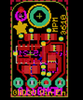

Contents
========

* [PROJ-ADAF-4683-STAN-01>Adafruit MPM3610 PCB](#proj-adaf-4683-stan-01adafruit-mpm3610-pcb)
	* [Images](#images)
	* [Interactive BOM](#interactive-bom)
	* [OOMP Parts](#oomp-parts)
	* [Tags](#tags)
  
![][im]
# PROJ-ADAF-4683-STAN-01>Adafruit MPM3610 PCB

- ID: PROJ-ADAF-4683-STAN-01
- Hex ID: PRA4683
- Name: Adafruit MPM3610 PCB
- Description: 

## Images
  
  

|eagleImage|
| :---: |
||

## Interactive BOM

- Interactive BOM page: [ibom.html](kicad/bom/ibom.html)

## OOMP Parts
  

|OOMP Parts|
| :---: |
|CAPE-0805-X-UNMATCHED-01, C1, 3.429, 4.826, 0,C1, 22uF, 0805-NO, microbuilder, (0.135, 0.19), R0|
|CAPE-0805-X-UNMATCHED-01, C2, 7.238999999999999, 6.35, 270,C2, 22uF, 0805-NO, microbuilder, (0.285, 0.25), R270|
|UNMATCHED-UNMATCHED-X-UNMATCHED-01, IC1, 3.429, 7.619999999999999, 270,IC1, MPM3610, MPM3610, microbuilder, (0.135, 0.3), R270|
|UNMATCHED-UNMATCHED-X-UNMATCHED-01, JP1, 5.08, 2.54, 180,JP1, 1X04_ROUND, microbuilder, (0.2, 0.1), R180|
|RESE-0603-X-UNMATCHED-01, R1, 7.874, 8.762999999999998, 180,R1, 75K, 0603-NO, microbuilder, (0.31, 0.345), R180|
|RESE-0603-X-UNMATCHED-01, R2, 6.858, 10.795, 180,R2, 75K, 0603-NO, microbuilder, (0.27, 0.425), R180|
|RESE-0603-X-UNMATCHED-01, R3, 3.8099999999999996, 10.795, 180,R3, 24K, 0603-NO, microbuilder, (0.15, 0.425), R180|

## Tags

- hexID: PRA4683
- oompType: PROJ
- oompSize: ADAF
- oompColor: 4683
- oompDesc: STAN
- oompIndex: 01
- oompName: Adafruit MPM3610 PCB
- sources: All source files from https://github.com/adafruit/Adafruit-MPM3610-PCB (source licence details in srcLicense.md)
- linkBuyPage: http://www.adafruit.com/products/4683
- oompPart: CAPE-0805-X-UNMATCHED-01, C1, 3.429, 4.826, 0
- oompPart: CAPE-0805-X-UNMATCHED-01, C2, 7.238999999999999, 6.35, 270
- oompPart: SKIP-UNMATCHED-X-UNMATCHED-01, FID1, 1.778, 15.620999999999999, 0
- oompPart: UNMATCHED-UNMATCHED-X-UNMATCHED-01, IC1, 3.429, 7.619999999999999, 270
- oompPart: UNMATCHED-UNMATCHED-X-UNMATCHED-01, JP1, 5.08, 2.54, 180
- oompPart: RESE-0603-X-UNMATCHED-01, R1, 7.874, 8.762999999999998, 180
- oompPart: RESE-0603-X-UNMATCHED-01, R2, 6.858, 10.795, 180
- oompPart: RESE-0603-X-UNMATCHED-01, R3, 3.8099999999999996, 10.795, 180
- oompPart: SKIP-UNMATCHED-X-UNMATCHED-01, U$9, 5.08, 14.604999999999999, 0
- rawPart: C1, 22uF, 0805-NO, microbuilder, (0.135, 0.19), R0
- rawPart: C2, 22uF, 0805-NO, microbuilder, (0.285, 0.25), R270
- rawPart: FID1, FIDUCIAL_1MM, FIDUCIAL_1MM, microbuilder, (0.07, 0.615), R0
- rawPart: IC1, MPM3610, MPM3610, microbuilder, (0.135, 0.3), R270
- rawPart: JP1, 1X04_ROUND, microbuilder, (0.2, 0.1), R180
- rawPart: R1, 75K, 0603-NO, microbuilder, (0.31, 0.345), R180
- rawPart: R2, 75K, 0603-NO, microbuilder, (0.27, 0.425), R180
- rawPart: R3, 24K, 0603-NO, microbuilder, (0.15, 0.425), R180
- rawPart: U$9, MOUNTINGHOLE2.5, MOUNTINGHOLE_2.5_PLATED, microbuilder, (0.2, 0.575), R0

[im]: eagleImage_450.png
