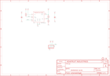

Contents
========

* [PRA4683 > Adafruit MPM3610 PCB](#pra4683--adafruit-mpm3610-pcb)
	* [Schematic](#schematic)
	* [PCB](#pcb)
	* [Interactive BOM](#interactive-bom)
	* [OOMP Parts](#oomp-parts)
	* [Images](#images)
	* [Tags](#tags)
  
![][im]
# PRA4683 > Adafruit MPM3610 PCB

- ID: PROJ-ADAF-4683-STAN-01
- Hex ID: PRA4683
- Name: Adafruit 4683
- Description: Adafruit 4683
- Long Link: [http://oom.lt/PROJ-ADAF-4683-STAN-01](http://oom.lt/PROJ-ADAF-4683-STAN-01)
- Short Link: [http://oom.lt/PRA4683](http://oom.lt/PRA4683)

## Schematic
  

## PCB
  

## Interactive BOM

- Interactive BOM page: [ibom.html](https://htmlpreview.github.io/?https://github.com/oomlout/oomlout_OOMP_projects/blob/main/PROJ-ADAF-4683-STAN-01/kicad/bom/ibom.html)

## OOMP Parts
  

|OOMP ID|Name|Identifier|
| :---: | :---: | :---: |
|[CAPC-0805-X-UF22-V63D](https://github.com/oomlout/oomlout_OOMP_parts/tree/main/CAPC-0805-X-UF22-V63D/)|[SMD (0805) 22 uF Capacitor (Ceramic) 6.3v](https://github.com/oomlout/oomlout_OOMP_parts/tree/main/CAPC-0805-X-UF22-V63D/)|[C1, C2](https://github.com/oomlout/oomlout_OOMP_parts/tree/main/CAPC-0805-X-UF22-V63D/)|
|UNMATCHED-UNMATCHED-X-UNMATCHED-01||IC1|
|[HEAD-I01-X-PI04-01](https://github.com/oomlout/oomlout_OOMP_parts/tree/main/HEAD-I01-X-PI04-01/)|[2.54 mm 4 Pin Header](https://github.com/oomlout/oomlout_OOMP_parts/tree/main/HEAD-I01-X-PI04-01/)|[JP1](https://github.com/oomlout/oomlout_OOMP_parts/tree/main/HEAD-I01-X-PI04-01/)|
|[RESE-0603-X-O753-01](https://github.com/oomlout/oomlout_OOMP_parts/tree/main/RESE-0603-X-O753-01/)|[SMD (0603) 75k Ohm Resistor](https://github.com/oomlout/oomlout_OOMP_parts/tree/main/RESE-0603-X-O753-01/)|[R1, R2](https://github.com/oomlout/oomlout_OOMP_parts/tree/main/RESE-0603-X-O753-01/)|
|[RESE-0603-X-O243-01](https://github.com/oomlout/oomlout_OOMP_parts/tree/main/RESE-0603-X-O243-01/)|[SMD (0603) 24k Ohm Resistor](https://github.com/oomlout/oomlout_OOMP_parts/tree/main/RESE-0603-X-O243-01/)|[R3](https://github.com/oomlout/oomlout_OOMP_parts/tree/main/RESE-0603-X-O243-01/)|

## Images
  
  

|bominteractivefront|bominteractiveback|kicadPcb3d|kicadPcb3dFront|kicadPcb3dBack|kicadSchem|eagleImage|eagleSchemImage|pcbdraw|
| :---: | :---: | :---: | :---: | :---: | :---: | :---: | :---: | :---: |
||||||||||

## Tags

- hexID: PRA4683
- oompType: PROJ
- oompSize: ADAF
- oompColor: 4683
- oompDesc: STAN
- oompIndex: 01
- oompName: Adafruit MPM3610 PCB
- sources: All source files from https://github.com/adafruit/Adafruit-MPM3610-PCB (source licence details in srcLicense.md)
- linkBuyPage: http://www.adafruit.com/products/4683
- oompID: PROJ-ADAF-4683-STAN-01
- oompParts: C1,CAPC-0805-X-UF22-V63D
- oompParts: C2,CAPC-0805-X-UF22-V63D
- oompParts: IC1,UNMATCHED-UNMATCHED-X-UNMATCHED-01
- oompParts: JP1,HEAD-I01-X-PI04-01
- oompParts: R1,RESE-0603-X-O753-01
- oompParts: R2,RESE-0603-X-O753-01
- oompParts: R3,RESE-0603-X-O243-01
- rawParts: C1,22uF,CAP_CERAMIC0805-NOOUTLINE,0805-NO,Ceramic Capacitors,,
- rawParts: C2,22uF,CAP_CERAMIC0805-NOOUTLINE,0805-NO,Ceramic Capacitors,,
- rawParts: FID1,FIDUCIAL_1MM,FIDUCIAL_1MM,FIDUCIAL_1MM,Fiducial Alignment Points,EXCLUDE,
- rawParts: IC1,MPM3610,MPM3610,MPM3610,,,
- rawParts: JP1,,HEADER-1X4ROUND,1X04_ROUND,PIN HEADER,,
- rawParts: R1,75K,RESISTOR_0603_NOOUT,0603-NO,Resistors,,
- rawParts: R2,75K,RESISTOR_0603_NOOUT,0603-NO,Resistors,,
- rawParts: R3,24K,RESISTOR_0603_NOOUT,0603-NO,Resistors,,
- rawParts: U$9,MOUNTINGHOLE2.5,MOUNTINGHOLE2.5,MOUNTINGHOLE_2.5_PLATED,Mounting Hole,EXCLUDE,

[im]: kicadPcb3d_450.png
