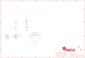

Contents
========

* [PRA4686 > Adafruit TMP235 PCB](#pra4686--adafruit-tmp235-pcb)
	* [Schematic](#schematic)
	* [PCB](#pcb)
	* [Interactive BOM](#interactive-bom)
	* [OOMP Parts](#oomp-parts)
	* [Images](#images)
	* [Tags](#tags)
  
![][im]
# PRA4686 > Adafruit TMP235 PCB

- ID: PROJ-ADAF-4686-STAN-01
- Hex ID: PRA4686
- Name: Adafruit
- Description: Adafruit
- Long Link: [http://oom.lt/PROJ-ADAF-4686-STAN-01](http://oom.lt/PROJ-ADAF-4686-STAN-01)
- Short Link: [http://oom.lt/PRA4686](http://oom.lt/PRA4686)

## Schematic
  

## PCB
  

## Interactive BOM

- Interactive BOM page: [ibom.html](https://htmlpreview.github.io/?https://github.com/oomlout/oomlout_OOMP_projects/blob/main/PROJ-ADAF-4686-STAN-01/kicad/bom/ibom.html)

## OOMP Parts
  

|OOMP Parts|
| :---: |
|[CAPC-0805-X-UF1-V25  SMD (0805) 1 uF Capacitor (Ceramic) 25v  C1](https://github.com/oomlout/oomlout_OOMP_parts/tree/main/CAPC-0805-X-UF1-V25/)|
|[LEDS-0805-G-STAN-01  SMD (0805) Green LED  D2](https://github.com/oomlout/oomlout_OOMP_parts/tree/main/LEDS-0805-G-STAN-01/)|
|[HEAD-I01-X-PI03-01  2.54 mm 3 Pin Header  JP1](https://github.com/oomlout/oomlout_OOMP_parts/tree/main/HEAD-I01-X-PI03-01/)|
|[RESE-0603-X-O102-01  SMD (0603) 1k Ohm Resistor  R3](https://github.com/oomlout/oomlout_OOMP_parts/tree/main/RESE-0603-X-O102-01/)|
|UNMATCHED-UNMATCHED-X-UNMATCHED-01 X1, X4|

## Images
  
  

|bominteractivefront|bominteractiveback|kicadPcb3d|kicadPcb3dFront|kicadPcb3dBack|eagleImage|eagleSchemImage|pcbdraw|pcbdrawback|
| :---: | :---: | :---: | :---: | :---: | :---: | :---: | :---: | :---: |
||||||||||

## Tags

- hexID: PRA4686
- oompType: PROJ
- oompSize: ADAF
- oompColor: 4686
- oompDesc: STAN
- oompIndex: 01
- oompName: Adafruit TMP235 PCB
- sources: All source files from https://github.com/adafruit/Adafruit-TMP235-PCB (source licence details in srcLicense.md)
- linkBuyPage: http://www.adafruit.com/products/4686
- oompID: PROJ-ADAF-4686-STAN-01
- oompParts: C1,CAPC-0805-X-UF1-V25
- oompParts: D2,LEDS-0805-G-STAN-01
- oompParts: JP1,HEAD-I01-X-PI03-01
- oompParts: R3,RESE-0603-X-O102-01
- oompParts: X1,UNMATCHED-UNMATCHED-X-UNMATCHED-01
- oompParts: X4,UNMATCHED-UNMATCHED-X-UNMATCHED-01
- rawParts: C1,1uF,CAP_CERAMIC0805-NOOUTLINE,0805-NO,Ceramic Capacitors,,
- rawParts: D2,GREEN,LED0805_NOOUTLINE,CHIPLED_0805_NOOUTLINE,LED,,
- rawParts: FID2,FIDUCIAL_1MM,FIDUCIAL_1MM,FIDUCIAL_1MM,Fiducial Alignment Points,EXCLUDE,
- rawParts: FID3,FIDUCIAL_1MM,FIDUCIAL_1MM,FIDUCIAL_1MM,Fiducial Alignment Points,EXCLUDE,
- rawParts: JP1,0.1 Header,HEADER-1X3,1X03_OVAL,PIN HEADER,,
- rawParts: R3,1K,RESISTOR_0603_NOOUT,0603-NO,Resistors,,
- rawParts: SJ1,,SOLDERJUMPER_CLOSED,SOLDERJUMPER_CLOSEDWIRE,Solder Jumper - Closed,,
- rawParts: U$1,MOUNTINGHOLE2.5,MOUNTINGHOLE2.5,MOUNTINGHOLE_2.5_PLATED,Mounting Hole,EXCLUDE,
- rawParts: U$8,MOUNTINGHOLE2.5,MOUNTINGHOLE2.5,MOUNTINGHOLE_2.5_PLATED,Mounting Hole,EXCLUDE,
- rawParts: X1,TMP235_DCKR,TMP235_DCKR,SC70-5,,,
- rawParts: X4,JST PH 3,CON_JST_PH_3PIN,JSTPH3,,,

[im]: kicadPcb3d_450.png
