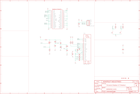

Contents
========

* [PRA4687 > Adafruit](#pra4687--adafruit)
	* [Schematic](#schematic)
	* [Interactive BOM](#interactive-bom)
	* [OOMP Parts](#oomp-parts)
	* [Images](#images)
	* [Tags](#tags)
  
![][im]
# PRA4687 > Adafruit

- ID: PROJ-ADAF-4687-STAN-01
- Hex ID: PRA4687
- Name: Adafruit
- Description: Adafruit
- Long Link: [http://oom.lt/PROJ-ADAF-4687-STAN-01](http://oom.lt/PROJ-ADAF-4687-STAN-01)
- Short Link: [http://oom.lt/PRA4687](http://oom.lt/PRA4687)

## Schematic
  

## Interactive BOM

- Interactive BOM page: [ibom.html](https://htmlpreview.github.io/?https://github.com/oomlout/oomlout_OOMP_projects/blob/main/PROJ-ADAF-4687-STAN-01/kicad/bom/ibom.html)

## OOMP Parts
  

|OOMP Parts|
| :---: |
|C1,CAPC-0805-X-UNMATCHED-01,C1,10uF/10V+,CAP_CERAMIC0805-NOOUTLINE,0805-NO,Ceramic Capacitors,,|
|C2,CAPC-0805-X-UNMATCHED-01,C2,1uF/10V,CAP_CERAMIC0805-NOOUTLINE,0805-NO,Ceramic Capacitors,,|
|C3,CAPC-0805-X-UNMATCHED-01,C3,1uF/25V,CAP_CERAMIC0805-NOOUTLINE,0805-NO,Ceramic Capacitors,,|
|C4,CAPC-0805-X-UNMATCHED-01,C4,1uF/25V,CAP_CERAMIC0805-NOOUTLINE,0805-NO,Ceramic Capacitors,,|
|C5,CAPC-0805-X-UNMATCHED-01,C5,4.7uF/25V,CAP_CERAMIC0805-NOOUTLINE,0805-NO,Ceramic Capacitors,,|
|C6,CAPC-0805-X-UNMATCHED-01,C6,1uF/10V,CAP_CERAMIC0805-NOOUTLINE,0805-NO,Ceramic Capacitors,,|
|C15,CAPC-0805-X-UNMATCHED-01,C15,10uF/10V+,CAP_CERAMIC0805-NOOUTLINE,0805-NO,Ceramic Capacitors,,|
|C16,CAPC-0805-X-UF1-01,C16,1uF,CAP_CERAMIC0805-NOOUTLINE,0805-NO,Ceramic Capacitors,,|
|C21,CAPC-0805-X-UNMATCHED-01,C21,10µF,CAP_CERAMIC0805-NOOUTLINE,0805-NO,Ceramic Capacitors,,|
|C22,CAPC-0805-X-UNMATCHED-01,C22,1uF/25V,CAP_CERAMIC0805-NOOUTLINE,0805-NO,Ceramic Capacitors,,|
|C23,CAPC-0805-X-UNMATCHED-01,C23,1uF/25V,CAP_CERAMIC0805-NOOUTLINE,0805-NO,Ceramic Capacitors,,|
|C24,CAPC-0805-X-UF1-01,C24,1uF,CAP_CERAMIC0805-NOOUTLINE,0805-NO,Ceramic Capacitors,,|
|CONN2,UNMATCHED-UNMATCHED-X-UNMATCHED-01,CONN2,STEMMA_I2C_QT,STEMMA_I2C_QT,JST_SH4,,,|
|D1,DIOD-UNMATCHED-X-UNMATCHED-01,D1,MBR0540,DIODE-SCHOTTKYSOD-123,SOD-123,,,|
|D2,DIOD-UNMATCHED-X-UNMATCHED-01,D2,MBR0540,DIODE-SCHOTTKYSOD-123,SOD-123,,,|
|D3,DIOD-UNMATCHED-X-UNMATCHED-01,D3,MBR0540,DIODE-SCHOTTKYSOD-123,SOD-123,,,|
|EINK1,UNMATCHED-UNMATCHED-X-UNMATCHED-01,EINK1,EINK_24PIN_213IN,EINK_24PIN_213IN,EINK_213IN_104X212,,,|
|L1,UNMATCHED-UNMATCHED-X-UNMATCHED-01,FID1,FIDUCIAL_1MM,FIDUCIAL_1MM,FIDUCIAL_1MM,Fiducial Alignment Points,EXCLUDE,|
|Q5,UNMATCHED-SO23-X-UNMATCHED-01,FID2,FIDUCIAL_1MM,FIDUCIAL_1MM,FIDUCIAL_1MM,Fiducial Alignment Points,EXCLUDE,|
|R2,RESE-0603-X-O1003-01,FID3,FIDUCIAL_1MM,FIDUCIAL_1MM,FIDUCIAL_1MM,Fiducial Alignment Points,EXCLUDE,|
|R3,RESE-0603-X-O1003-01,FID4,FIDUCIAL_1MM,FIDUCIAL_1MM,FIDUCIAL_1MM,Fiducial Alignment Points,EXCLUDE,|
|R4,RESE-UNMATCHED-X-UNMATCHED-01,L1,10uH,INDUCTORNR401,INDUCTOR_4X4MM_NR401,Inductors,,|
|R5,RESE-0603-X-O1003-01,Q5,IRLML0100,IRLML2060TRPBF,SOT23-3,,,|
|R6,RESE-0603-X-O1003-01,R2,100K,RESISTOR_0603_NOOUT,0603-NO,Resistors,,|
|RPI2,UNMATCHED-UNMATCHED-X-UNMATCHED-01,R3,100K,RESISTOR_0603_NOOUT,0603-NO,Resistors,,|
|SW3,UNMATCHED-UNMATCHED-X-UNMATCHED-01,R4,0.47ohm,RESISTOR0805_10MGAP,0805_10MGAP,Resistors,,|
|SW4,UNMATCHED-UNMATCHED-X-UNMATCHED-01,R5,100K,RESISTOR_0603_NOOUT,0603-NO,Resistors,,|

## Images
  
  

|kicadPcb3d|kicadPcb3dFront|kicadPcb3dBack|eagleImage|eagleSchemImage|
| :---: | :---: | :---: | :---: | :---: |
||||||

## Tags

- hexID: PRA4687
- oompType: PROJ
- oompSize: ADAF
- oompColor: 4687
- oompDesc: STAN
- oompIndex: 01
- oompName: Adafruit 2 13in eInk Bonnet PCB
- sources: All source files from https://github.com/adafruit/Adafruit-2-13in-eInk-Bonnet-PCB (source licence details in srcLicense.md)
- linkBuyPage: http://www.adafruit.com/products/4687
- oompID: PROJ-ADAF-4687-STAN-01
- oompParts: C1,CAPC-0805-X-UNMATCHED-01
- oompParts: C2,CAPC-0805-X-UNMATCHED-01
- oompParts: C3,CAPC-0805-X-UNMATCHED-01
- oompParts: C4,CAPC-0805-X-UNMATCHED-01
- oompParts: C5,CAPC-0805-X-UNMATCHED-01
- oompParts: C6,CAPC-0805-X-UNMATCHED-01
- oompParts: C15,CAPC-0805-X-UNMATCHED-01
- oompParts: C16,CAPC-0805-X-UF1-01
- oompParts: C21,CAPC-0805-X-UNMATCHED-01
- oompParts: C22,CAPC-0805-X-UNMATCHED-01
- oompParts: C23,CAPC-0805-X-UNMATCHED-01
- oompParts: C24,CAPC-0805-X-UF1-01
- oompParts: CONN2,UNMATCHED-UNMATCHED-X-UNMATCHED-01
- oompParts: D1,DIOD-UNMATCHED-X-UNMATCHED-01
- oompParts: D2,DIOD-UNMATCHED-X-UNMATCHED-01
- oompParts: D3,DIOD-UNMATCHED-X-UNMATCHED-01
- oompParts: EINK1,UNMATCHED-UNMATCHED-X-UNMATCHED-01
- oompParts: L1,UNMATCHED-UNMATCHED-X-UNMATCHED-01
- oompParts: Q5,UNMATCHED-SO23-X-UNMATCHED-01
- oompParts: R2,RESE-0603-X-O1003-01
- oompParts: R3,RESE-0603-X-O1003-01
- oompParts: R4,RESE-UNMATCHED-X-UNMATCHED-01
- oompParts: R5,RESE-0603-X-O1003-01
- oompParts: R6,RESE-0603-X-O1003-01
- oompParts: RPI2,UNMATCHED-UNMATCHED-X-UNMATCHED-01
- oompParts: SW3,UNMATCHED-UNMATCHED-X-UNMATCHED-01
- oompParts: SW4,UNMATCHED-UNMATCHED-X-UNMATCHED-01
- rawParts: C1,10uF/10V+,CAP_CERAMIC0805-NOOUTLINE,0805-NO,Ceramic Capacitors,,
- rawParts: C2,1uF/10V,CAP_CERAMIC0805-NOOUTLINE,0805-NO,Ceramic Capacitors,,
- rawParts: C3,1uF/25V,CAP_CERAMIC0805-NOOUTLINE,0805-NO,Ceramic Capacitors,,
- rawParts: C4,1uF/25V,CAP_CERAMIC0805-NOOUTLINE,0805-NO,Ceramic Capacitors,,
- rawParts: C5,4.7uF/25V,CAP_CERAMIC0805-NOOUTLINE,0805-NO,Ceramic Capacitors,,
- rawParts: C6,1uF/10V,CAP_CERAMIC0805-NOOUTLINE,0805-NO,Ceramic Capacitors,,
- rawParts: C15,10uF/10V+,CAP_CERAMIC0805-NOOUTLINE,0805-NO,Ceramic Capacitors,,
- rawParts: C16,1uF,CAP_CERAMIC0805-NOOUTLINE,0805-NO,Ceramic Capacitors,,
- rawParts: C21,10µF,CAP_CERAMIC0805-NOOUTLINE,0805-NO,Ceramic Capacitors,,
- rawParts: C22,1uF/25V,CAP_CERAMIC0805-NOOUTLINE,0805-NO,Ceramic Capacitors,,
- rawParts: C23,1uF/25V,CAP_CERAMIC0805-NOOUTLINE,0805-NO,Ceramic Capacitors,,
- rawParts: C24,1uF,CAP_CERAMIC0805-NOOUTLINE,0805-NO,Ceramic Capacitors,,
- rawParts: CONN2,STEMMA_I2C_QT,STEMMA_I2C_QT,JST_SH4,,,
- rawParts: D1,MBR0540,DIODE-SCHOTTKYSOD-123,SOD-123,,,
- rawParts: D2,MBR0540,DIODE-SCHOTTKYSOD-123,SOD-123,,,
- rawParts: D3,MBR0540,DIODE-SCHOTTKYSOD-123,SOD-123,,,
- rawParts: EINK1,EINK_24PIN_213IN,EINK_24PIN_213IN,EINK_213IN_104X212,,,
- rawParts: FID1,FIDUCIAL_1MM,FIDUCIAL_1MM,FIDUCIAL_1MM,Fiducial Alignment Points,EXCLUDE,
- rawParts: FID2,FIDUCIAL_1MM,FIDUCIAL_1MM,FIDUCIAL_1MM,Fiducial Alignment Points,EXCLUDE,
- rawParts: FID3,FIDUCIAL_1MM,FIDUCIAL_1MM,FIDUCIAL_1MM,Fiducial Alignment Points,EXCLUDE,
- rawParts: FID4,FIDUCIAL_1MM,FIDUCIAL_1MM,FIDUCIAL_1MM,Fiducial Alignment Points,EXCLUDE,
- rawParts: L1,10uH,INDUCTORNR401,INDUCTOR_4X4MM_NR401,Inductors,,
- rawParts: Q5,IRLML0100,IRLML2060TRPBF,SOT23-3,,,
- rawParts: R2,100K,RESISTOR_0603_NOOUT,0603-NO,Resistors,,
- rawParts: R3,100K,RESISTOR_0603_NOOUT,0603-NO,Resistors,,
- rawParts: R4,0.47ohm,RESISTOR0805_10MGAP,0805_10MGAP,Resistors,,
- rawParts: R5,100K,RESISTOR_0603_NOOUT,0603-NO,Resistors,,
- rawParts: R6,100K,RESISTOR_0603_NOOUT,0603-NO,Resistors,,
- rawParts: RPI2,RASPBERRYPI_BPLUS_SMT_NODIM,RASPBERRYPI_BPLUS_SMT_NODIM,PI_BONNET_SMT_NODIM,,,
- rawParts: SW3,,SWITCH_PUSHBUTTON_3.5X6MM,TACTILE_3X6MM,Buttons,,
- rawParts: SW4,,SWITCH_PUSHBUTTON_3.5X6MM,TACTILE_3X6MM,Buttons,,

[im]: kicadPcb3d_450.png
