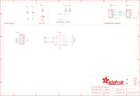

Contents
========

* [PRA4701 > Adafruit ST25DV16 PCB](#pra4701--adafruit-st25dv16-pcb)
	* [Schematic](#schematic)
	* [PCB](#pcb)
	* [Interactive BOM](#interactive-bom)
	* [OOMP Parts](#oomp-parts)
	* [Images](#images)
	* [Tags](#tags)
  
![][im]
# PRA4701 > Adafruit ST25DV16 PCB

- ID: PROJ-ADAF-4701-STAN-01
- Hex ID: PRA4701
- Name: Adafruit
- Description: Adafruit
- Long Link: [http://oom.lt/PROJ-ADAF-4701-STAN-01](http://oom.lt/PROJ-ADAF-4701-STAN-01)
- Short Link: [http://oom.lt/PRA4701](http://oom.lt/PRA4701)

## Schematic
  

## PCB
  

## Interactive BOM

- Interactive BOM page: [ibom.html](https://htmlpreview.github.io/?https://github.com/oomlout/oomlout_OOMP_projects/blob/main/PROJ-ADAF-4701-STAN-01/kicad/bom/ibom.html)

## OOMP Parts
  

|OOMP Parts|
| :---: |
|UNMATCHED-UNMATCHED-X-UNMATCHED-01 ANT1, RF1|
|[CAPC-0603-X-NF100-V50  SMD (0603) 100 nF Capacitor (Ceramic) 50v  C1](https://github.com/oomlout/oomlout_OOMP_parts/tree/main/CAPC-0603-X-NF100-V50/)|
|[CAPC-0805-X-UF10-V10  SMD (0805) 10 uF Capacitor (Ceramic) 10v  C3](https://github.com/oomlout/oomlout_OOMP_parts/tree/main/CAPC-0805-X-UF10-V10/)|
|HEAD-I01-X-UNMATCHED-01 CONN3, CONN4|
|[LEDS-0603-G-STAN-01  SMD (0603) Green LED  D1](https://github.com/oomlout/oomlout_OOMP_parts/tree/main/LEDS-0603-G-STAN-01/)|
|[HEAD-I01-X-PI06-01  2.54 mm 6 Pin Header  JP1](https://github.com/oomlout/oomlout_OOMP_parts/tree/main/HEAD-I01-X-PI06-01/)|
|RESA-06038-X-O103X4-01 R3|

## Images
  
  

|bominteractivefront|bominteractiveback|kicadPcb3d|kicadPcb3dFront|kicadPcb3dBack|eagleImage|eagleSchemImage|
| :---: | :---: | :---: | :---: | :---: | :---: | :---: |
||||||||

## Tags

- hexID: PRA4701
- oompType: PROJ
- oompSize: ADAF
- oompColor: 4701
- oompDesc: STAN
- oompIndex: 01
- oompName: Adafruit ST25DV16 PCB
- sources: All source files from https://github.com/adafruit/Adafruit-ST25DV16-PCB (source licence details in srcLicense.md)
- linkBuyPage: http://www.adafruit.com/products/4701
- oompID: PROJ-ADAF-4701-STAN-01
- oompParts: ANT1,UNMATCHED-UNMATCHED-X-UNMATCHED-01
- oompParts: C1,CAPC-0603-X-NF100-V50
- oompParts: C3,CAPC-0805-X-UF10-V10
- oompParts: CONN3,HEAD-I01-X-UNMATCHED-01
- oompParts: CONN4,HEAD-I01-X-UNMATCHED-01
- oompParts: D1,LEDS-0603-G-STAN-01
- oompParts: JP1,HEAD-I01-X-PI06-01
- oompParts: R3,RESA-06038-X-O103X4-01
- oompParts: RF1,UNMATCHED-UNMATCHED-X-UNMATCHED-01
- rawParts: ANT1,NFC_ANTENNA_25X15,NFC_ANTENNA_25X15,NFCANT_25X15,,,
- rawParts: C1,0.1uF,CAP_CERAMIC0603_NO,0603-NO,Ceramic Capacitors,,
- rawParts: C3,10uF,CAP_CERAMIC0805-NOOUTLINE,0805-NO,Ceramic Capacitors,,
- rawParts: CONN3,STEMMA_I2C_QT,STEMMA_I2C_QT,JST_SH4,,,
- rawParts: CONN4,STEMMA_I2C_QT,STEMMA_I2C_QT,JST_SH4,,,
- rawParts: D1,GREEN,LED0603_NOOUTLINE,CHIPLED_0603_NOOUTLINE,LED,,
- rawParts: FID3,FIDUCIAL_1MM,FIDUCIAL_1MM,FIDUCIAL_1MM,Fiducial Alignment Points,EXCLUDE,
- rawParts: FID4,FIDUCIAL_1MM,FIDUCIAL_1MM,FIDUCIAL_1MM,Fiducial Alignment Points,EXCLUDE,
- rawParts: JP1,,HEADER-1X670MIL,1X06_ROUND_70,PIN HEADER,,
- rawParts: R3,10K,RESISTOR_4PACK,RESPACK_4X0603,Resistor Packs (4 resistors),,
- rawParts: RF1,ST25DVXX_TSSOP,ST25DVXX_TSSOP,TSSOP8-4.4MM,,,
- rawParts: U$19,MOUNTINGHOLE2.5,MOUNTINGHOLE2.5,MOUNTINGHOLE_2.5_PLATED,Mounting Hole,EXCLUDE,
- rawParts: U$21,MOUNTINGHOLE2.5,MOUNTINGHOLE2.5,MOUNTINGHOLE_2.5_PLATED,Mounting Hole,EXCLUDE,

[im]: kicadPcb3d_450.png
