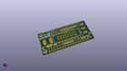
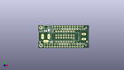
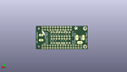
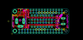
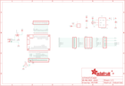

Contents
========

* [PRA4702 > Adafruit RGB Matrix FeatherWing PCB](#pra4702--adafruit-rgb-matrix-featherwing-pcb)
	* [Schematic](#schematic)
	* [PCB](#pcb)
	* [Interactive BOM](#interactive-bom)
	* [OOMP Parts](#oomp-parts)
	* [Images](#images)
	* [Tags](#tags)
  
![][im]
# PRA4702 > Adafruit RGB Matrix FeatherWing PCB

- ID: PROJ-ADAF-4702-STAN-01
- Hex ID: PRA4702
- Name: Adafruit
- Description: Adafruit
- Long Link: [http://oom.lt/PROJ-ADAF-4702-STAN-01](http://oom.lt/PROJ-ADAF-4702-STAN-01)
- Short Link: [http://oom.lt/PRA4702](http://oom.lt/PRA4702)

## Schematic
  

## PCB
  

## Interactive BOM

- Interactive BOM page: [ibom.html](https://htmlpreview.github.io/?https://github.com/oomlout/oomlout_OOMP_projects/blob/main/PROJ-ADAF-4702-STAN-01/kicad/bom/ibom.html)

## OOMP Parts
  

|OOMP Parts|
| :---: |
|[C6 CAPC-0805-X-UF10-V10 SMD (0805) 10 uF Capacitor (Ceramic) 10v](https://github.com/oomlout/oomlout_OOMP_parts/tree/main/CAPC-0805-X-UF10-V10/)|
|[C7 CAPC-0805-X-UF10-V10 SMD (0805) 10 uF Capacitor (Ceramic) 10v](https://github.com/oomlout/oomlout_OOMP_parts/tree/main/CAPC-0805-X-UF10-V10/)|
|IC2 IC2,VREG-SO235-X-KLP298XS-V33D|
|[JP1 HEAD-I01-X-PI12-01 2.54 mm 12 Pin Header](https://github.com/oomlout/oomlout_OOMP_parts/tree/main/HEAD-I01-X-PI12-01/)|
|[JP2 HEAD-I01-X-PI08-01 2.54 mm 8 Pin Header](https://github.com/oomlout/oomlout_OOMP_parts/tree/main/HEAD-I01-X-PI08-01/)|
|[JP3 HEAD-I01-X-PI08-01 2.54 mm 8 Pin Header](https://github.com/oomlout/oomlout_OOMP_parts/tree/main/HEAD-I01-X-PI08-01/)|
|[JP4 HEAD-I01-X-PI16-01 2.54 mm 16 Pin Header](https://github.com/oomlout/oomlout_OOMP_parts/tree/main/HEAD-I01-X-PI16-01/)|
|JP15 JP15,HEAD-I01-X-UNMATCHED-01|
|MS1 MS1,UNMATCHED-UNMATCHED-X-UNMATCHED-01|
|Q2 Q2,MOSP-UNMATCHED-X-UNMATCHED-01|
|R1 R1,RESE-0603-X-O1003-01|
|SW1 SW1,UNMATCHED-UNMATCHED-X-UNMATCHED-01|
|X1 X1,UNMATCHED-UNMATCHED-X-UNMATCHED-01|
|X2 X2,UNMATCHED-UNMATCHED-X-UNMATCHED-01|

## Images
  
  

|kicadPcb3d|kicadPcb3dFront|kicadPcb3dBack|eagleImage|eagleSchemImage|
| :---: | :---: | :---: | :---: | :---: |
||||||

## Tags

- hexID: PRA4702
- oompType: PROJ
- oompSize: ADAF
- oompColor: 4702
- oompDesc: STAN
- oompIndex: 01
- oompName: Adafruit RGB Matrix FeatherWing PCB
- sources: All source files from https://github.com/adafruit/Adafruit-RGB-Matrix-FeatherWing-PCB (source licence details in srcLicense.md)
- linkBuyPage: http://www.adafruit.com/products/4702
- oompID: PROJ-ADAF-4702-STAN-01
- oompParts: C6,CAPC-0805-X-UF10-V10
- oompParts: C7,CAPC-0805-X-UF10-V10
- oompParts: IC2,VREG-SO235-X-KLP298XS-V33D
- oompParts: JP1,HEAD-I01-X-PI12-01
- oompParts: JP2,HEAD-I01-X-PI08-01
- oompParts: JP3,HEAD-I01-X-PI08-01
- oompParts: JP4,HEAD-I01-X-PI16-01
- oompParts: JP15,HEAD-I01-X-UNMATCHED-01
- oompParts: MS1,UNMATCHED-UNMATCHED-X-UNMATCHED-01
- oompParts: Q2,MOSP-UNMATCHED-X-UNMATCHED-01
- oompParts: R1,RESE-0603-X-O1003-01
- oompParts: SW1,UNMATCHED-UNMATCHED-X-UNMATCHED-01
- oompParts: X1,UNMATCHED-UNMATCHED-X-UNMATCHED-01
- oompParts: X2,UNMATCHED-UNMATCHED-X-UNMATCHED-01
- rawParts: C6,10uF,CAP_CERAMIC0805-NOOUTLINE,0805-NO,Ceramic Capacitors,,
- rawParts: C7,10uF,CAP_CERAMIC0805-NOOUTLINE,0805-NO,Ceramic Capacitors,,
- rawParts: FID1,FIDUCIAL_1MM,FIDUCIAL_1MM,FIDUCIAL_1MM,Fiducial Alignment Points,EXCLUDE,
- rawParts: FID3,FIDUCIAL_1MM,FIDUCIAL_1MM,FIDUCIAL_1MM,Fiducial Alignment Points,EXCLUDE,
- rawParts: IC2,AP2112K-3.3,LP298XS,SOT23-5L,,,
- rawParts: JP1,,HEADER-1X12,1X12_ROUND,,,
- rawParts: JP2,,HEADER-1X870MIL,1X08_ROUND_70,PIN HEADER,,
- rawParts: JP3,,HEADER-1X870MIL,1X08_ROUND_70,PIN HEADER,,
- rawParts: JP4,,HEADER-1X16ROUND,1X16_ROUND,PIN HEADER,,
- rawParts: JP15,Shrouded 2x8,HEADER-2X8_SHROUDED,2X08_SHROUDED,,,
- rawParts: MS1,FEATHERWING,FEATHERWING,FEATHERWING,,,
- rawParts: Q2,AON7401,MOSFET-P-POWERDI3333,POWERDI3333,P-Channel Mosfet,,
- rawParts: R1,100K,RESISTOR_0603_NOOUT,0603-NO,Resistors,,
- rawParts: SW1,KMR2,SWITCH_TACT_SMT4.6X2.8,BTN_KMR2_4.6X2.8,SMT Tact Switches,,
- rawParts: X1,,DCBARRELPTH,DCJACK_2MM_PTH,DC Barrel Jack,,
- rawParts: X2,,TERMBLOCK_1X2_5.08MM,TERMBLOCK_508_1X2,3.5mm Terminal block,,

[im]: kicadPcb3d_450.png
