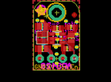

Contents
========

* [PROJ-ADAF-4711-STAN-01>Adafruit AP3429A PCB](#proj-adaf-4711-stan-01adafruit-ap3429a-pcb)
	* [Images](#images)
	* [Interactive BOM](#interactive-bom)
	* [OOMP Parts](#oomp-parts)
	* [Tags](#tags)
  
![][im]
# PROJ-ADAF-4711-STAN-01>Adafruit AP3429A PCB

- ID: PROJ-ADAF-4711-STAN-01
- Hex ID: PRA4711
- Name: Adafruit AP3429A PCB
- Description: 

## Images
  
  

|eagleImage|
| :---: |
||

## Interactive BOM

- Interactive BOM page: [ibom.html](kicad/bom/ibom.html)

## OOMP Parts
  

|OOMP Parts|
| :---: |
|CAPE-0805-X-UNMATCHED-01, C1, 1.9049999999999998, 9.652, 180,C1, 22uF, 0805-NO, microbuilder, (0.075, 0.38), R180|
|CAPE-0805-X-UNMATCHED-01, C2, 8.254999999999999, 7.112, 90,C2, 22uF, 0805-NO, microbuilder, (0.325, 0.28), R90|
|CAPE-0805-X-UNMATCHED-01, C3, 2.032, 4.699, 180,C3, 22uF, 0805-NO, microbuilder, (0.08, 0.185), R180|
|UNMATCHED-UNMATCHED-X-UNMATCHED-01, IC1, 5.206999999999999, 6.985, 270,IC1, VREG_BUCK_5PIN_AP3429/A, SOT23-5, adafruit_power, (0.205, 0.275), R270|
|UNMATCHED-UNMATCHED-X-UNMATCHED-01, JP1, 5.08, 2.54, 180,JP1, 1X04_ROUND, microbuilder, (0.2, 0.1), R180|
|UNMATCHED-UNMATCHED-X-UNMATCHED-01, L1, 1.9049999999999998, 7.238999999999999, 90,L1, SDER041H-2R2MS, INDUCTOR_TAIYOYUDEN_NRH2412T, microbuilder, (0.075, 0.285), R90|
|<table><tr><td></td><td> R1</td><td>[RESE-0603-X-O104-01 SMD (0603) 100k Ohm Resistor](https://github.com/oomlout/oomlout_OOMP_parts/tree/main/RESE-0603-X-O104-01/)</td><td>[R6104](https://github.com/oomlout/oomlout_OOMP_parts/tree/main/RESE-0603-X-O104-01/)</td></tr></table>|
|RESE-0603-X-UNMATCHED-01, R2, 5.206999999999999, 9.270999999999999, 180,R2, 450K, 0603-NO, microbuilder, (0.205, 0.365), R180|
|<table><tr><td></td><td> R3</td><td>[RESE-0603-X-O104-01 SMD (0603) 100k Ohm Resistor](https://github.com/oomlout/oomlout_OOMP_parts/tree/main/RESE-0603-X-O104-01/)</td><td>[R6104](https://github.com/oomlout/oomlout_OOMP_parts/tree/main/RESE-0603-X-O104-01/)</td></tr></table>|

## Tags

- hexID: PRA4711
- oompType: PROJ
- oompSize: ADAF
- oompColor: 4711
- oompDesc: STAN
- oompIndex: 01
- oompName: Adafruit AP3429A PCB
- sources: All source files from https://github.com/adafruit/Adafruit-AP3429A-PCB (source licence details in srcLicense.md)
- linkBuyPage: http://www.adafruit.com/products/4711
- oompPart: CAPE-0805-X-UNMATCHED-01, C1, 1.9049999999999998, 9.652, 180
- oompPart: CAPE-0805-X-UNMATCHED-01, C2, 8.254999999999999, 7.112, 90
- oompPart: CAPE-0805-X-UNMATCHED-01, C3, 2.032, 4.699, 180
- oompPart: SKIP-UNMATCHED-X-UNMATCHED-01, FID1, 8.889999999999999, 12.318999999999999, 0
- oompPart: UNMATCHED-UNMATCHED-X-UNMATCHED-01, IC1, 5.206999999999999, 6.985, 270
- oompPart: UNMATCHED-UNMATCHED-X-UNMATCHED-01, JP1, 5.08, 2.54, 180
- oompPart: UNMATCHED-UNMATCHED-X-UNMATCHED-01, L1, 1.9049999999999998, 7.238999999999999, 90
- oompPart: RESE-0603-X-O104-01, R1, 7.365999999999999, 4.699, 0
- oompPart: RESE-0603-X-UNMATCHED-01, R2, 5.206999999999999, 9.270999999999999, 180
- oompPart: RESE-0603-X-O104-01, R3, 8.254999999999999, 9.524999999999999, 180
- oompPart: SKIP-UNMATCHED-X-UNMATCHED-01, U$9, 5.08, 12.7, 0
- rawPart: C1, 22uF, 0805-NO, microbuilder, (0.075, 0.38), R180
- rawPart: C2, 22uF, 0805-NO, microbuilder, (0.325, 0.28), R90
- rawPart: C3, 22uF, 0805-NO, microbuilder, (0.08, 0.185), R180
- rawPart: FID1, FIDUCIAL_1MM, FIDUCIAL_1MM, microbuilder, (0.35, 0.485), R0
- rawPart: IC1, VREG_BUCK_5PIN_AP3429/A, SOT23-5, adafruit_power, (0.205, 0.275), R270
- rawPart: JP1, 1X04_ROUND, microbuilder, (0.2, 0.1), R180
- rawPart: L1, SDER041H-2R2MS, INDUCTOR_TAIYOYUDEN_NRH2412T, microbuilder, (0.075, 0.285), R90
- rawPart: R1, 100K, 0603-NO, microbuilder, (0.29, 0.185), R0
- rawPart: R2, 450K, 0603-NO, microbuilder, (0.205, 0.365), R180
- rawPart: R3, 100K, 0603-NO, microbuilder, (0.325, 0.375), R180
- rawPart: U$9, MOUNTINGHOLE2.5, MOUNTINGHOLE_2.5_PLATED, microbuilder, (0.2, 0.5), R0

[im]: eagleImage_450.png
