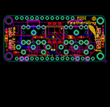
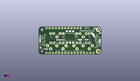
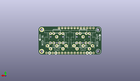
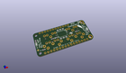

Contents
========

* [PROJ-ADAF-4740-STAN-01>Adafruit MIDI FeatherWing PCB](#proj-adaf-4740-stan-01adafruit-midi-featherwing-pcb)
	* [Images](#images)
	* [Interactive BOM](#interactive-bom)
	* [OOMP Parts](#oomp-parts)
	* [Tags](#tags)
  
![][im]
# PROJ-ADAF-4740-STAN-01>Adafruit MIDI FeatherWing PCB

- ID: PROJ-ADAF-4740-STAN-01
- Hex ID: PRA4740
- Name: Adafruit MIDI FeatherWing PCB
- Description: 

## Images
  
  

|eagleImage|kicadPcb3dFront|kicadPcb3dBack|kicadPcb3d|
| :---: | :---: | :---: | :---: |
|||||

## Interactive BOM

- Interactive BOM page: [ibom.html](kicad/bom/ibom.html)

## OOMP Parts
  

|OOMP Parts|
| :---: |
|UNMATCHED-UNMATCHED-X-UNMATCHED-01, D1, 33.400999999999996, 12.065, 180,D1, 1N4148, SOD-323, microbuilder, (1.315, 0.475), R180|
|UNMATCHED-0603-X-UNMATCHED-01, D2, 49.529999999999994, 11.43, 0,D2, BLUE, CHIPLED_0603, microbuilder, (1.95, 0.45), R0|
|UNMATCHED-0603-X-UNMATCHED-01, D3, 1.27, 11.43, 180,D3, BLUE, CHIPLED_0603, microbuilder, (0.05, 0.45), R180|
|UNMATCHED-UNMATCHED-X-UNMATCHED-01, MIDIIN, 36.068, 17.145, M180,MIDIIN, DIN_5, CP-2350, microbuilder, (1.42, 0.675), MR180|
|UNMATCHED-UNMATCHED-X-UNMATCHED-01, MIDIOUT, 14.731999999999998, 17.145, M180,MIDIOUT, DIN_5, CP-2350, microbuilder, (0.58, 0.675), MR180|
|UNMATCHED-UNMATCHED-X-UNMATCHED-01, MS1, 50.8, 0.0, M0,MS1, FEATHERWING_NODIM, FEATHERWING_NODIM, microbuilder, (2, 0), MR0|
|UNMATCHED-UNMATCHED-X-UNMATCHED-01, OK2, 25.4, 14.350999999999997, 180,OK2, H11L1MS, DIL6-SMD, optocoupler, (1, 0.565), R180|
|RESE-0603-X-UNMATCHED-01, R1, 15.748, 11.937999999999999, 0,R1, 33, 0603-NO, microbuilder, (0.62, 0.47), R0|
|<table><tr><td></td><td> R2</td><td>[RESE-0603-X-O221-01 SMD (0603) 220 Ohm Resistor](https://github.com/oomlout/oomlout_OOMP_parts/tree/main/RESE-0603-X-O221-01/)</td><td>[R6221](https://github.com/oomlout/oomlout_OOMP_parts/tree/main/RESE-0603-X-O221-01/)</td></tr></table>|
|RESE-0603-X-UNMATCHED-01, R3, 18.923, 11.937999999999999, 0,R3, 470, 0603-NO, microbuilder, (0.745, 0.47), R0|
|RESE-0603-X-UNMATCHED-01, R4, 6.095999999999999, 4.444999999999999, 180,R4, 10, 0603-NO, microbuilder, (0.24, 0.175), R180|
|RESE-0603-X-UNMATCHED-01, R5, 49.529999999999994, 8.382, 90,R5, 2.2K, 0603-NO, microbuilder, (1.95, 0.33), R90|
|RESE-0603-X-UNMATCHED-01, R6, 1.27, 14.477999999999998, 270,R6, 2.2K, 0603-NO, microbuilder, (0.05, 0.57), R270|
|UNMATCHED-UNMATCHED-X-UNMATCHED-01, X1, 36.068, 17.145, M270,X1, 3.5mm, STX3100, microbuilder, (1.42, 0.675), MR270|
|UNMATCHED-UNMATCHED-X-UNMATCHED-01, X2, 14.731999999999998, 17.145, M270,X2, 3.5mm, STX3100, microbuilder, (0.58, 0.675), MR270|

## Tags

- hexID: PRA4740
- oompType: PROJ
- oompSize: ADAF
- oompColor: 4740
- oompDesc: STAN
- oompIndex: 01
- oompName: Adafruit MIDI FeatherWing PCB
- sources: All source files from https://github.com/adafruit/Adafruit-MIDI-FeatherWing-PCB (source licence details in srcLicense.md)
- linkBuyPage: http://www.adafruit.com/products/4740
- oompPart: UNMATCHED-UNMATCHED-X-UNMATCHED-01, D1, 33.400999999999996, 12.065, 180
- oompPart: UNMATCHED-0603-X-UNMATCHED-01, D2, 49.529999999999994, 11.43, 0
- oompPart: UNMATCHED-0603-X-UNMATCHED-01, D3, 1.27, 11.43, 180
- oompPart: SKIP-UNMATCHED-X-UNMATCHED-01, FID1, 1.5239999999999998, 5.588, 0
- oompPart: SKIP-UNMATCHED-X-UNMATCHED-01, FID2, 49.529999999999994, 17.525999999999996, 0
- oompPart: UNMATCHED-UNMATCHED-X-UNMATCHED-01, MIDIIN, 36.068, 17.145, M180
- oompPart: UNMATCHED-UNMATCHED-X-UNMATCHED-01, MIDIOUT, 14.731999999999998, 17.145, M180
- oompPart: UNMATCHED-UNMATCHED-X-UNMATCHED-01, MS1, 50.8, 0.0, M0
- oompPart: UNMATCHED-UNMATCHED-X-UNMATCHED-01, OK2, 25.4, 14.350999999999997, 180
- oompPart: RESE-0603-X-UNMATCHED-01, R1, 15.748, 11.937999999999999, 0
- oompPart: RESE-0603-X-O221-01, R2, 38.73499999999999, 12.065, 0
- oompPart: RESE-0603-X-UNMATCHED-01, R3, 18.923, 11.937999999999999, 0
- oompPart: RESE-0603-X-UNMATCHED-01, R4, 6.095999999999999, 4.444999999999999, 180
- oompPart: RESE-0603-X-UNMATCHED-01, R5, 49.529999999999994, 8.382, 90
- oompPart: RESE-0603-X-UNMATCHED-01, R6, 1.27, 14.477999999999998, 270
- oompPart: UNMATCHED-UNMATCHED-X-UNMATCHED-01, X1, 36.068, 17.145, M270
- oompPart: UNMATCHED-UNMATCHED-X-UNMATCHED-01, X2, 14.731999999999998, 17.145, M270
- rawPart: D1, 1N4148, SOD-323, microbuilder, (1.315, 0.475), R180
- rawPart: D2, BLUE, CHIPLED_0603, microbuilder, (1.95, 0.45), R0
- rawPart: D3, BLUE, CHIPLED_0603, microbuilder, (0.05, 0.45), R180
- rawPart: FID1, FIDUCIAL_1MM, FIDUCIAL_1MM, microbuilder, (0.06, 0.22), R0
- rawPart: FID2, FIDUCIAL_1MM, FIDUCIAL_1MM, microbuilder, (1.95, 0.69), R0
- rawPart: MIDIIN, DIN_5, CP-2350, microbuilder, (1.42, 0.675), MR180
- rawPart: MIDIOUT, DIN_5, CP-2350, microbuilder, (0.58, 0.675), MR180
- rawPart: MS1, FEATHERWING_NODIM, FEATHERWING_NODIM, microbuilder, (2, 0), MR0
- rawPart: OK2, H11L1MS, DIL6-SMD, optocoupler, (1, 0.565), R180
- rawPart: R1, 33, 0603-NO, microbuilder, (0.62, 0.47), R0
- rawPart: R2, 220, 0603-NO, microbuilder, (1.525, 0.475), R0
- rawPart: R3, 470, 0603-NO, microbuilder, (0.745, 0.47), R0
- rawPart: R4, 10, 0603-NO, microbuilder, (0.24, 0.175), R180
- rawPart: R5, 2.2K, 0603-NO, microbuilder, (1.95, 0.33), R90
- rawPart: R6, 2.2K, 0603-NO, microbuilder, (0.05, 0.57), R270
- rawPart: X1, 3.5mm, STX3100, microbuilder, (1.42, 0.675), MR270
- rawPart: X2, 3.5mm, STX3100, microbuilder, (0.58, 0.675), MR270

[im]: kicadPcb3d_450.png
