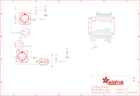

Contents
========

* [PRA4740 > Adafruit MIDI FeatherWing PCB](#pra4740--adafruit-midi-featherwing-pcb)
	* [Schematic](#schematic)
	* [PCB](#pcb)
	* [Interactive BOM](#interactive-bom)
	* [OOMP Parts](#oomp-parts)
	* [Images](#images)
	* [Tags](#tags)
  
![][im]
# PRA4740 > Adafruit MIDI FeatherWing PCB

- ID: PROJ-ADAF-4740-STAN-01
- Hex ID: PRA4740
- Name: Adafruit 4740
- Description: Adafruit 4740
- Long Link: [http://oom.lt/PROJ-ADAF-4740-STAN-01](http://oom.lt/PROJ-ADAF-4740-STAN-01)
- Short Link: [http://oom.lt/PRA4740](http://oom.lt/PRA4740)

## Schematic
  

## PCB
  

## Interactive BOM

- Interactive BOM page: [ibom.html](https://htmlpreview.github.io/?https://github.com/oomlout/oomlout_OOMP_projects/blob/main/PROJ-ADAF-4740-STAN-01/kicad/bom/ibom.html)

## OOMP Parts
  

|OOMP ID|Name|Identifier|
| :---: | :---: | :---: |
|[DIOD-S323-X-K4148-01](https://github.com/oomlout/oomlout_OOMP_parts/tree/main/DIOD-S323-X-K4148-01/)|[SMD (SOD-323) Diode](https://github.com/oomlout/oomlout_OOMP_parts/tree/main/DIOD-S323-X-K4148-01/)|[D1](https://github.com/oomlout/oomlout_OOMP_parts/tree/main/DIOD-S323-X-K4148-01/)|
|[LEDS-0603-L-STAN-01](https://github.com/oomlout/oomlout_OOMP_parts/tree/main/LEDS-0603-L-STAN-01/)|[SMD (0603) Blue LED](https://github.com/oomlout/oomlout_OOMP_parts/tree/main/LEDS-0603-L-STAN-01/)|[D2, D3](https://github.com/oomlout/oomlout_OOMP_parts/tree/main/LEDS-0603-L-STAN-01/)|
|UNMATCHED-UNMATCHED-X-UNMATCHED-01||MIDIIN, MIDIOUT, MS1, OK2, X1, X2|
|[RESE-0603-X-O330-01](https://github.com/oomlout/oomlout_OOMP_parts/tree/main/RESE-0603-X-O330-01/)|[SMD (0603) 33 Ohm Resistor](https://github.com/oomlout/oomlout_OOMP_parts/tree/main/RESE-0603-X-O330-01/)|[R1](https://github.com/oomlout/oomlout_OOMP_parts/tree/main/RESE-0603-X-O330-01/)|
|[RESE-0603-X-O221-01](https://github.com/oomlout/oomlout_OOMP_parts/tree/main/RESE-0603-X-O221-01/)|[SMD (0603) 220 Ohm Resistor](https://github.com/oomlout/oomlout_OOMP_parts/tree/main/RESE-0603-X-O221-01/)|[R2](https://github.com/oomlout/oomlout_OOMP_parts/tree/main/RESE-0603-X-O221-01/)|
|[RESE-0603-X-O471-01](https://github.com/oomlout/oomlout_OOMP_parts/tree/main/RESE-0603-X-O471-01/)|[SMD (0603) 470 Ohm Resistor](https://github.com/oomlout/oomlout_OOMP_parts/tree/main/RESE-0603-X-O471-01/)|[R3](https://github.com/oomlout/oomlout_OOMP_parts/tree/main/RESE-0603-X-O471-01/)|
|[RESE-0603-X-O100-01](https://github.com/oomlout/oomlout_OOMP_parts/tree/main/RESE-0603-X-O100-01/)|[SMD (0603) 10 Ohm Resistor](https://github.com/oomlout/oomlout_OOMP_parts/tree/main/RESE-0603-X-O100-01/)|[R4](https://github.com/oomlout/oomlout_OOMP_parts/tree/main/RESE-0603-X-O100-01/)|
|[RESE-0603-X-O222-01](https://github.com/oomlout/oomlout_OOMP_parts/tree/main/RESE-0603-X-O222-01/)|[SMD (0603) 2.2k Ohm Resistor](https://github.com/oomlout/oomlout_OOMP_parts/tree/main/RESE-0603-X-O222-01/)|[R5, R6](https://github.com/oomlout/oomlout_OOMP_parts/tree/main/RESE-0603-X-O222-01/)|

## Images
  
  

|bominteractivefront|bominteractiveback|kicadPcb3d|kicadPcb3dFront|kicadPcb3dBack|kicadSchem|eagleImage|eagleSchemImage|pcbdraw|pcbdrawback|
| :---: | :---: | :---: | :---: | :---: | :---: | :---: | :---: | :---: | :---: |
|||||||||||

## Tags

- hexID: PRA4740
- oompType: PROJ
- oompSize: ADAF
- oompColor: 4740
- oompDesc: STAN
- oompIndex: 01
- oompName: Adafruit MIDI FeatherWing PCB
- sources: All source files from https://github.com/adafruit/Adafruit-MIDI-FeatherWing-PCB (source licence details in srcLicense.md)
- linkBuyPage: http://www.adafruit.com/products/4740
- oompID: PROJ-ADAF-4740-STAN-01
- oompParts: D1,DIOD-S323-X-K4148-01
- oompParts: D2,LEDS-0603-L-STAN-01
- oompParts: D3,LEDS-0603-L-STAN-01
- oompParts: MIDIIN,UNMATCHED-UNMATCHED-X-UNMATCHED-01
- oompParts: MIDIOUT,UNMATCHED-UNMATCHED-X-UNMATCHED-01
- oompParts: MS1,UNMATCHED-UNMATCHED-X-UNMATCHED-01
- oompParts: OK2,UNMATCHED-UNMATCHED-X-UNMATCHED-01
- oompParts: R1,RESE-0603-X-O330-01
- oompParts: R2,RESE-0603-X-O221-01
- oompParts: R3,RESE-0603-X-O471-01
- oompParts: R4,RESE-0603-X-O100-01
- oompParts: R5,RESE-0603-X-O222-01
- oompParts: R6,RESE-0603-X-O222-01
- oompParts: X1,UNMATCHED-UNMATCHED-X-UNMATCHED-01
- oompParts: X2,UNMATCHED-UNMATCHED-X-UNMATCHED-01
- rawParts: D1,1N4148,DIODESOD-323,SOD-323,Diode,,,,,,,
- rawParts: D2,BLUE,LED0603,CHIPLED_0603,LED,,,,,,,
- rawParts: D3,BLUE,LED0603,CHIPLED_0603,LED,,,,,,,
- rawParts: FID1,FIDUCIAL_1MM,FIDUCIAL_1MM,FIDUCIAL_1MM,Fiducial Alignment Points,EXCLUDE,,,,,,
- rawParts: FID2,FIDUCIAL_1MM,FIDUCIAL_1MM,FIDUCIAL_1MM,Fiducial Alignment Points,EXCLUDE,,,,,,
- rawParts: MIDIIN,DIN_5,DIN_5,CP-2350,,,,,,,,
- rawParts: MIDIOUT,DIN_5,DIN_5,CP-2350,,,,,,,,
- rawParts: MS1,FEATHERWING_NODIM,FEATHERWING_NODIM,FEATHERWING_NODIM,,,,,,,,
- rawParts: OK2,H11L1MS,H11L1MS,DIL6-SMD,6-Pin DIP Optocoupler,,,,unknown,unknown,0,
- rawParts: R1,33,RESISTOR_0603_NOOUT,0603-NO,Resistors,,,,,,,
- rawParts: R2,220,RESISTOR_0603_NOOUT,0603-NO,Resistors,,,,,,,
- rawParts: R3,470,RESISTOR_0603_NOOUT,0603-NO,Resistors,,,,,,,
- rawParts: R4,10,RESISTOR_0603_NOOUT,0603-NO,Resistors,,,,,,,
- rawParts: R5,2.2K,RESISTOR_0603_NOOUT,0603-NO,Resistors,,,,,,,
- rawParts: R6,2.2K,RESISTOR_0603_NOOUT,0603-NO,Resistors,,,,,,,
- rawParts: X1,3.5mm,AUDIO_STEREOJACK,STX3100,MIC/HEADPHONE JACK,,,,,,,
- rawParts: X2,3.5mm,AUDIO_STEREOJACK,STX3100,MIC/HEADPHONE JACK,,,,,,,

[im]: kicadPcb3d_450.png
