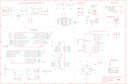

Contents
========

* [PRA4745 > Adafruit MatrixPortal M4 PCB](#pra4745--adafruit-matrixportal-m4-pcb)
	* [Schematic](#schematic)
	* [PCB](#pcb)
	* [Interactive BOM](#interactive-bom)
	* [OOMP Parts](#oomp-parts)
	* [Images](#images)
	* [Tags](#tags)
  
![][im]
# PRA4745 > Adafruit MatrixPortal M4 PCB

- ID: PROJ-ADAF-4745-STAN-01
- Hex ID: PRA4745
- Name: Adafruit
- Description: Adafruit
- Long Link: [http://oom.lt/PROJ-ADAF-4745-STAN-01](http://oom.lt/PROJ-ADAF-4745-STAN-01)
- Short Link: [http://oom.lt/PRA4745](http://oom.lt/PRA4745)

## Schematic
  

## PCB
  

## Interactive BOM

- Interactive BOM page: [ibom.html](https://htmlpreview.github.io/?https://github.com/oomlout/oomlout_OOMP_projects/blob/main/PROJ-ADAF-4745-STAN-01/kicad/bom/ibom.html)

## OOMP Parts
  

|OOMP Parts|
| :---: |
|[3VON LEDS-0805-G-STAN-01 SMD (0805) Green LED](https://github.com/oomlout/oomlout_OOMP_parts/tree/main/LEDS-0805-G-STAN-01/)|
|[5VON LEDS-0805-G-STAN-01 SMD (0805) Green LED](https://github.com/oomlout/oomlout_OOMP_parts/tree/main/LEDS-0805-G-STAN-01/)|
|[C1 CAPC-0805-X-UF10-V10 SMD (0805) 10 uF Capacitor (Ceramic) 10v](https://github.com/oomlout/oomlout_OOMP_parts/tree/main/CAPC-0805-X-UF10-V10/)|
|[C2 CAPC-0805-X-UF10-V10 SMD (0805) 10 uF Capacitor (Ceramic) 10v](https://github.com/oomlout/oomlout_OOMP_parts/tree/main/CAPC-0805-X-UF10-V10/)|
|[C3 CAPC-0805-X-UF10-V10 SMD (0805) 10 uF Capacitor (Ceramic) 10v](https://github.com/oomlout/oomlout_OOMP_parts/tree/main/CAPC-0805-X-UF10-V10/)|
|[C4 CAPC-0805-X-UF10-V10 SMD (0805) 10 uF Capacitor (Ceramic) 10v](https://github.com/oomlout/oomlout_OOMP_parts/tree/main/CAPC-0805-X-UF10-V10/)|
|C5 C5,CAPC-0603-X-UF1D-01|
|C6 C6,CAPC-0603-X-UNMATCHED-01|
|[C7 CAPC-0805-X-UF10-V10 SMD (0805) 10 uF Capacitor (Ceramic) 10v](https://github.com/oomlout/oomlout_OOMP_parts/tree/main/CAPC-0805-X-UF10-V10/)|
|C8 C8,CAPC-0603-X-UNMATCHED-01|
|C9 C9,CAPC-0603-X-UF1-01|
|C10 C10,CAPC-0603-X-UNMATCHED-01|
|C11 C11,CAPC-0603-X-UNMATCHED-01|
|C13 C13,CAPC-0603-X-UF1D-01|
|C14 C14,CAPC-0603-X-UNMATCHED-01|
|C15 C15,CAPC-0603-X-UNMATCHED-01|
|C16 C16,CAPC-0603-X-UNMATCHED-01|
|C17 C17,CAPC-0603-X-UF1D-01|
|[C18 CAPC-0805-X-UF10-V10 SMD (0805) 10 uF Capacitor (Ceramic) 10v](https://github.com/oomlout/oomlout_OOMP_parts/tree/main/CAPC-0805-X-UF10-V10/)|
|[C19 CAPC-0805-X-UF10-V10 SMD (0805) 10 uF Capacitor (Ceramic) 10v](https://github.com/oomlout/oomlout_OOMP_parts/tree/main/CAPC-0805-X-UF10-V10/)|
|[C20 CAPC-0805-X-UF10-V10 SMD (0805) 10 uF Capacitor (Ceramic) 10v](https://github.com/oomlout/oomlout_OOMP_parts/tree/main/CAPC-0805-X-UF10-V10/)|
|[CONN1 HEAD-I01-X-PI04-01 2.54 mm 4 Pin Header](https://github.com/oomlout/oomlout_OOMP_parts/tree/main/HEAD-I01-X-PI04-01/)|
|D2 D2,DIOD-S323-X-UNMATCHED-01|
|DOWN DOWN,UNMATCHED-UNMATCHED-X-UNMATCHED-01|
|JP1 JP1,HEAD-I01-X-PI11-01|
|[L LEDS-0603-G-STAN-01 SMD (0603) Green LED](https://github.com/oomlout/oomlout_OOMP_parts/tree/main/LEDS-0603-G-STAN-01/)|
|[LED1 LEDS-3535-RGB-K2812-01 SMD (3535) Smart Controller (WS2812B) RGB LED](https://github.com/oomlout/oomlout_OOMP_parts/tree/main/LEDS-3535-RGB-K2812-01/)|
|PC2 PC2,CAPX-UNMATCHED-X-UNMATCHED-01|
|[R1 RESE-0603-X-O103-01 SMD (0603) 10k Ohm Resistor](https://github.com/oomlout/oomlout_OOMP_parts/tree/main/RESE-0603-X-O103-01/)|
|[R2 RESE-0603-X-O103-01 SMD (0603) 10k Ohm Resistor](https://github.com/oomlout/oomlout_OOMP_parts/tree/main/RESE-0603-X-O103-01/)|
|[R3 RESE-0603-X-O472-01 SMD (0603) 4.7k Ohm Resistor](https://github.com/oomlout/oomlout_OOMP_parts/tree/main/RESE-0603-X-O472-01/)|
|[R4 RESE-0603-X-O102-01 SMD (0603) 1k Ohm Resistor](https://github.com/oomlout/oomlout_OOMP_parts/tree/main/RESE-0603-X-O102-01/)|
|[R5 RESE-0603-X-O103-01 SMD (0603) 10k Ohm Resistor](https://github.com/oomlout/oomlout_OOMP_parts/tree/main/RESE-0603-X-O103-01/)|
|[R6 RESE-0603-X-O103-01 SMD (0603) 10k Ohm Resistor](https://github.com/oomlout/oomlout_OOMP_parts/tree/main/RESE-0603-X-O103-01/)|
|[R7 RESE-0603-X-O103-01 SMD (0603) 10k Ohm Resistor](https://github.com/oomlout/oomlout_OOMP_parts/tree/main/RESE-0603-X-O103-01/)|
|[R8 RESE-0603-X-O472-01 SMD (0603) 4.7k Ohm Resistor](https://github.com/oomlout/oomlout_OOMP_parts/tree/main/RESE-0603-X-O472-01/)|
|[R9 RESE-0603-X-O102-01 SMD (0603) 1k Ohm Resistor](https://github.com/oomlout/oomlout_OOMP_parts/tree/main/RESE-0603-X-O102-01/)|
|R10 R10,RESA-06038-X-O472X4-01|
|[R15 RESE-0603-X-O103-01 SMD (0603) 10k Ohm Resistor](https://github.com/oomlout/oomlout_OOMP_parts/tree/main/RESE-0603-X-O103-01/)|
|RST RST,UNMATCHED-UNMATCHED-X-UNMATCHED-01|
|SENSE SENSE,UNMATCHED-UNMATCHED-X-UNMATCHED-01|
|U$1 U$1,UNMATCHED-UNMATCHED-X-UNMATCHED-01|
|U1 U1,UNMATCHED-UNMATCHED-X-UNMATCHED-01|
|U2 U2,VREG-SO23-X-KAP2112K-01|
|U3 U3,UNMATCHED-UNMATCHED-X-UNMATCHED-01|
|U4 U4,UNMATCHED-UNMATCHED-X-UNMATCHED-01|
|U5 U5,UNMATCHED-UNMATCHED-X-UNMATCHED-01|
|UP UP,UNMATCHED-UNMATCHED-X-UNMATCHED-01|
|X1 X1,UNMATCHED-UNMATCHED-X-UNMATCHED-01|
|X5 X5,UNMATCHED-UNMATCHED-X-UNMATCHED-01|
|X6 X6,UNMATCHED-UNMATCHED-X-UNMATCHED-01|

## Images
  
  

|kicadPcb3d|kicadPcb3dFront|kicadPcb3dBack|eagleImage|eagleSchemImage|
| :---: | :---: | :---: | :---: | :---: |
||||||

## Tags

- hexID: PRA4745
- oompType: PROJ
- oompSize: ADAF
- oompColor: 4745
- oompDesc: STAN
- oompIndex: 01
- oompName: Adafruit MatrixPortal M4 PCB
- sources: All source files from https://github.com/adafruit/Adafruit-MatrixPortal-M4-PCB (source licence details in srcLicense.md)
- linkBuyPage: http://www.adafruit.com/products/4745
- oompID: PROJ-ADAF-4745-STAN-01
- oompParts: 3VON,LEDS-0805-G-STAN-01
- oompParts: 5VON,LEDS-0805-G-STAN-01
- oompParts: C1,CAPC-0805-X-UF10-V10
- oompParts: C2,CAPC-0805-X-UF10-V10
- oompParts: C3,CAPC-0805-X-UF10-V10
- oompParts: C4,CAPC-0805-X-UF10-V10
- oompParts: C5,CAPC-0603-X-UF1D-01
- oompParts: C6,CAPC-0603-X-UNMATCHED-01
- oompParts: C7,CAPC-0805-X-UF10-V10
- oompParts: C8,CAPC-0603-X-UNMATCHED-01
- oompParts: C9,CAPC-0603-X-UF1-01
- oompParts: C10,CAPC-0603-X-UNMATCHED-01
- oompParts: C11,CAPC-0603-X-UNMATCHED-01
- oompParts: C13,CAPC-0603-X-UF1D-01
- oompParts: C14,CAPC-0603-X-UNMATCHED-01
- oompParts: C15,CAPC-0603-X-UNMATCHED-01
- oompParts: C16,CAPC-0603-X-UNMATCHED-01
- oompParts: C17,CAPC-0603-X-UF1D-01
- oompParts: C18,CAPC-0805-X-UF10-V10
- oompParts: C19,CAPC-0805-X-UF10-V10
- oompParts: C20,CAPC-0805-X-UF10-V10
- oompParts: CONN1,HEAD-I01-X-PI04-01
- oompParts: D2,DIOD-S323-X-UNMATCHED-01
- oompParts: DOWN,UNMATCHED-UNMATCHED-X-UNMATCHED-01
- oompParts: JP1,HEAD-I01-X-PI11-01
- oompParts: L,LEDS-0603-G-STAN-01
- oompParts: LED1,LEDS-3535-RGB-K2812-01
- oompParts: PC2,CAPX-UNMATCHED-X-UNMATCHED-01
- oompParts: R1,RESE-0603-X-O103-01
- oompParts: R2,RESE-0603-X-O103-01
- oompParts: R3,RESE-0603-X-O472-01
- oompParts: R4,RESE-0603-X-O102-01
- oompParts: R5,RESE-0603-X-O103-01
- oompParts: R6,RESE-0603-X-O103-01
- oompParts: R7,RESE-0603-X-O103-01
- oompParts: R8,RESE-0603-X-O472-01
- oompParts: R9,RESE-0603-X-O102-01
- oompParts: R10,RESA-06038-X-O472X4-01
- oompParts: R15,RESE-0603-X-O103-01
- oompParts: RST,UNMATCHED-UNMATCHED-X-UNMATCHED-01
- oompParts: SENSE,UNMATCHED-UNMATCHED-X-UNMATCHED-01
- oompParts: U$1,UNMATCHED-UNMATCHED-X-UNMATCHED-01
- oompParts: U1,UNMATCHED-UNMATCHED-X-UNMATCHED-01
- oompParts: U2,VREG-SO23-X-KAP2112K-01
- oompParts: U3,UNMATCHED-UNMATCHED-X-UNMATCHED-01
- oompParts: U4,UNMATCHED-UNMATCHED-X-UNMATCHED-01
- oompParts: U5,UNMATCHED-UNMATCHED-X-UNMATCHED-01
- oompParts: UP,UNMATCHED-UNMATCHED-X-UNMATCHED-01
- oompParts: X1,UNMATCHED-UNMATCHED-X-UNMATCHED-01
- oompParts: X5,UNMATCHED-UNMATCHED-X-UNMATCHED-01
- oompParts: X6,UNMATCHED-UNMATCHED-X-UNMATCHED-01
- rawParts: 3VON,GREEN,LED0805_NOOUTLINE,CHIPLED_0805_NOOUTLINE,LED,,
- rawParts: 5VON,GREEN,LED0805_NOOUTLINE,CHIPLED_0805_NOOUTLINE,LED,,
- rawParts: C1,10uF,CAP_CERAMIC0805-NOOUTLINE,0805-NO,Ceramic Capacitors,,
- rawParts: C2,10uF,CAP_CERAMIC0805-NOOUTLINE,0805-NO,Ceramic Capacitors,,
- rawParts: C3,10uF,CAP_CERAMIC0805-NOOUTLINE,0805-NO,Ceramic Capacitors,,
- rawParts: C4,10uF,CAP_CERAMIC0805-NOOUTLINE,0805-NO,Ceramic Capacitors,,
- rawParts: C5,0.1uF,CAP_CERAMIC0603_NO,0603-NO,Ceramic Capacitors,,
- rawParts: C6,.1u,CAP_CERAMIC0603_NO,0603-NO,Ceramic Capacitors,,
- rawParts: C7,10uF,CAP_CERAMIC0805-NOOUTLINE,0805-NO,Ceramic Capacitors,,
- rawParts: C8,.1u,CAP_CERAMIC0603_NO,0603-NO,Ceramic Capacitors,,
- rawParts: C9,1uF,CAP_CERAMIC0603_NO,0603-NO,Ceramic Capacitors,,
- rawParts: C10,.1u,CAP_CERAMIC0603_NO,0603-NO,Ceramic Capacitors,,
- rawParts: C11,.1u,CAP_CERAMIC0603_NO,0603-NO,Ceramic Capacitors,,
- rawParts: C13,0.1uF,CAP_CERAMIC0603_NO,0603-NO,Ceramic Capacitors,,
- rawParts: C14,.1u,CAP_CERAMIC0603_NO,0603-NO,Ceramic Capacitors,,
- rawParts: C15,.1u,CAP_CERAMIC0603_NO,0603-NO,Ceramic Capacitors,,
- rawParts: C16,.1u,CAP_CERAMIC0603_NO,0603-NO,Ceramic Capacitors,,
- rawParts: C17,0.1uF,CAP_CERAMIC0603_NO,0603-NO,Ceramic Capacitors,,
- rawParts: C18,10uF,CAP_CERAMIC0805-NOOUTLINE,0805-NO,Ceramic Capacitors,,
- rawParts: C19,10uF,CAP_CERAMIC0805-NOOUTLINE,0805-NO,Ceramic Capacitors,,
- rawParts: C20,10uF,CAP_CERAMIC0805-NOOUTLINE,0805-NO,Ceramic Capacitors,,
- rawParts: CONN1,STEMMA_I2C_QT,STEMMA_I2C_QT,JST_SH4,,,
- rawParts: D2,3.6V,DIODE-ZENERSOD323,SOD-323,Zener Diode,,
- rawParts: DOWN,TL3330AF260QG,SWITCH_SPST_TACT_RA,SPST_TACTILE_RA,Switch - SPST,,
- rawParts: FID1,FIDUCIAL_1MM,FIDUCIAL_1MM,FIDUCIAL_1MM,Fiducial Alignment Points,EXCLUDE,
- rawParts: FID2,FIDUCIAL_1MM,FIDUCIAL_1MM,FIDUCIAL_1MM,Fiducial Alignment Points,EXCLUDE,
- rawParts: FID3,FIDUCIAL_1MM,FIDUCIAL_1MM,FIDUCIAL_1MM,Fiducial Alignment Points,EXCLUDE,
- rawParts: FID4,FIDUCIAL_1MM,FIDUCIAL_1MM,FIDUCIAL_1MM,Fiducial Alignment Points,EXCLUDE,
- rawParts: JP1,,HEADER-1X11,1X11_ROUND,,,
- rawParts: L,RED,LED0603_NOOUTLINE,CHIPLED_0603_NOOUTLINE,LED,,
- rawParts: LED1,WS2812B3535,WS2812B3535,LED3535,,,
- rawParts: PC2,47uF+/6.3V+,CAP_ELECTROLYTICPANASONIC_D,PANASONIC_D,Electrolytic Capacitors,,
- rawParts: R1,10K,RESISTOR_0603_NOOUT,0603-NO,Resistors,,
- rawParts: R2,10K,RESISTOR_0603_NOOUT,0603-NO,Resistors,,
- rawParts: R3,5.1K,RESISTOR_0603_NOOUT,0603-NO,Resistors,,
- rawParts: R4,1K,RESISTOR_0603_NOOUT,0603-NO,Resistors,,
- rawParts: R5,10K,RESISTOR_0603_NOOUT,0603-NO,Resistors,,
- rawParts: R6,10K,RESISTOR_0603_NOOUT,0603-NO,Resistors,,
- rawParts: R7,10K,RESISTOR_0603_NOOUT,0603-NO,Resistors,,
- rawParts: R8,5.1K,RESISTOR_0603_NOOUT,0603-NO,Resistors,,
- rawParts: R9,1K,RESISTOR_0603_NOOUT,0603-NO,Resistors,,
- rawParts: R10,5.1K,RESISTOR_4PACK,RESPACK_4X0603,Resistor Packs (4 resistors),,
- rawParts: R15,10K,RESISTOR_0603_NOOUT,0603-NO,Resistors,,
- rawParts: RST,TL3330AF260QG,SWITCH_SPST_TACT_RA,SPST_TACTILE_RA,Switch - SPST,,
- rawParts: SENSE,JST PH 3,CON_JST_PH_3PIN,JSTPH3,,,
- rawParts: SJ1,,SOLDERJUMPER_2WAY,SOLDERJUMPER_2WAY_OPEN_NOPASTE,2-Way Solder Jumper,,
- rawParts: SJ2,,SOLDERJUMPER_2WAY,SOLDERJUMPER_2WAY_OPEN_NOPASTE,2-Way Solder Jumper,,
- rawParts: TP1,SEWTAP_SMTNUTM3,SEWTAP_SMTNUTM3,SMT_NUT_3MM,,,
- rawParts: TP2,SEWTAP_SMTNUTM3,SEWTAP_SMTNUTM3,SMT_NUT_3MM,,,
- rawParts: U$1,ATSAMD51J19,ATSAMD51J,PQFN64-1,ATSAMD51J cortex m4 microcontroller,,
- rawParts: U1,74AHCT245,74LCX245,TSSOP20,74LCX245MTC - 5.0V Tolerant Bi-Directional Buffer,,
- rawParts: U2,AP2112K-3.3,LP2985-XXDBVR33,SOT23-DBV,ULTRALOW-POWER 50-mA LOW-DROPOUT LINEAR REGULATORS,,
- rawParts: U3,GD25Q16,SPIFLASH_8PIN208MIL,SOIC8_208MIL,SOIC8 SPI Flash,,
- rawParts: U4,LIS3DHTR,ACCEL_LIS3DHTR,LGA16_3X3MM,LIS3DHTR 3-Axis Accelerometer with I2C/SPI Interface,,
- rawParts: U5,74AHCT245,74LCX245,TSSOP20,74LCX245MTC - 5.0V Tolerant Bi-Directional Buffer,,
- rawParts: UP,TL3330AF260QG,SWITCH_SPST_TACT_RA,SPST_TACTILE_RA,Switch - SPST,,
- rawParts: X1,RGBMATRIX_THMSMT,RGBMATRIX_THMSMT,2X08_SMTTHM_RGBMATRIX,,,
- rawParts: X5,USB TYPE C,USB_C,USB_C_CUSB31-CFM2AX-01-X,USB Type-C USB 2.0 Connector,,
- rawParts: X6,ESP32_WROOM32,ESP32_WROOM32,WROOM32,,,

[im]: kicadPcb3d_450.png
