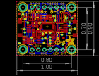
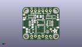
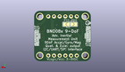
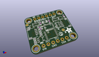

Contents
========

* [PROJ-ADAF-4754-STAN-01>Adafruit BNO08x PCB](#proj-adaf-4754-stan-01adafruit-bno08x-pcb)
	* [Images](#images)
	* [Interactive BOM](#interactive-bom)
	* [OOMP Parts](#oomp-parts)
	* [Tags](#tags)
  
![][im]
# PROJ-ADAF-4754-STAN-01>Adafruit BNO08x PCB

- ID: PROJ-ADAF-4754-STAN-01
- Hex ID: PRA4754
- Name: Adafruit BNO08x PCB
- Description: 

## Images
  
  

|eagleImage|kicadPcb3dFront|kicadPcb3dBack|kicadPcb3d|
| :---: | :---: | :---: | :---: |
|||||

## Interactive BOM

- Interactive BOM page: [ibom.html](kicad/bom/ibom.html)

## OOMP Parts
  

|OOMP Parts|
| :---: |
|CAPE-0603-X-NF100-01, C1, 7.492999999999999, 13.716, 180,C1, 0.1uF, 0603-NO, microbuilder, (0.295, 0.54), R180|
|CAPE-0805-X-UNMATCHED-01, C2, 3.0479999999999996, 6.5405, 270,C2, 10uF, 0805-NO, microbuilder, (0.12, 0.2575), R270|
|CAPE-0805-X-UNMATCHED-01, C3, 6.9215, 9.779, 90,C3, 10uF, 0805-NO, microbuilder, (0.2725, 0.385), R90|
|CAPE-0603-X-NF100-01, C4, 7.6834999999999996, 12.382499999999999, 0,C4, 0.1uF, 0603-NO, microbuilder, (0.3025, 0.4875), R0|
|CAPE-0603-X-NF100-01, C5, 24.1935, 16.5735, 270,C5, 0.1uF, 0603-NO, microbuilder, (0.9525, 0.6525), R270|
|CAPE-0603-X-UNMATCHED-01, C6, 8.762999999999998, 16.128999999999998, 90,C6, 22pF, 0603-NO, microbuilder, (0.345, 0.635), R90|
|CAPE-0603-X-UNMATCHED-01, C7, 14.097000000000001, 15.875, 270,C7, 22pF, 0603-NO, microbuilder, (0.555, 0.625), R270|
|UNMATCHED-UNMATCHED-X-UNMATCHED-01, CONN3, 22.86, 11.43, 90,CONN3, STEMMA_I2C_QT, JST_SH4, microbuilder, (0.9, 0.45), R90|
|UNMATCHED-UNMATCHED-X-UNMATCHED-01, CONN4, 2.54, 11.43, 270,CONN4, STEMMA_I2C_QT, JST_SH4, microbuilder, (0.1, 0.45), R270|
|UNMATCHED-UNMATCHED-X-UNMATCHED-01, D1, 1.5239999999999998, 15.493999999999998, 90,D1, GREEN, CHIPLED_0603_NOOUTLINE, microbuilder, (0.06, 0.61), R90|
|UNMATCHED-UNMATCHED-X-UNMATCHED-01, JP1, 12.7, 2.54, 0,JP1, 1X06_ROUND_70, microbuilder, (0.5, 0.1), R0|
|UNMATCHED-UNMATCHED-X-UNMATCHED-01, JP2, 12.7, 20.32, 0,JP2, 1X06_ROUND_70, microbuilder, (0.5, 0.8), R0|
|UNMATCHED-UNMATCHED-X-UNMATCHED-01, Q2, 21.59, 16.002, 0,Q2, BSS138, SOT363, microbuilder, (0.85, 0.63), R0|
|RESE-UNMATCHED-X-O103-01, R2, 6.0325, 16.256, 180,R2, 10K, RESPACK_4X0603, microbuilder, (0.2375, 0.64), R180|
|RESE-UNMATCHED-X-O103-01, R3, 18.2245, 15.8115, 0,R3, 10K, RESPACK_4X0603, microbuilder, (0.7175, 0.6225), R0|
|RESE-UNMATCHED-X-O103-01, R4, 17.970499999999998, 11.6205, 90,R4, 10K, RESPACK_4X0603, microbuilder, (0.7075, 0.4575), R90|
|UNMATCHED-UNMATCHED-X-UNMATCHED-01, SJ1, 10.9855, 16.764, M180,SJ1, PS1, SOLDERJUMPER_ARROW_NOPASTE, microbuilder, (0.4325, 0.66), MR180|
|UNMATCHED-UNMATCHED-X-UNMATCHED-01, SJ2, 7.619999999999999, 16.764, M0,SJ2, PS0, SOLDERJUMPER_ARROW_NOPASTE, microbuilder, (0.3, 0.66), MR0|
|UNMATCHED-UNMATCHED-X-UNMATCHED-01, U1, 12.7, 12.2555, 0,U1, BNO080, BNO080, microbuilder, (0.5, 0.4825), R0|
|UNMATCHED-UNMATCHED-X-UNMATCHED-01, U2, 6.0325, 6.223, 270,U2, AP2112K-3.3, SOT23-5, microbuilder, (0.2375, 0.245), R270|
|UNMATCHED-UNMATCHED-X-UNMATCHED-01, U3, 12.191999999999998, 7.365999999999999, 270,U3, 74AHC4050, TSSOP16, microbuilder, (0.48, 0.29), R270|
|UNMATCHED-UNMATCHED-X-UNMATCHED-01, X1, 11.43, 16.319499999999998, 180,X1, 32.768, XTAL3215, adafruit2, (0.45, 0.6425), R180|

## Tags

- hexID: PRA4754
- oompType: PROJ
- oompSize: ADAF
- oompColor: 4754
- oompDesc: STAN
- oompIndex: 01
- oompName: Adafruit BNO08x PCB
- sources: All source files from https://github.com/adafruit/Adafruit-BNO08x-PCB (source licence details in srcLicense.md)
- linkBuyPage: http://www.adafruit.com/products/4754
- oompPart: CAPE-0603-X-NF100-01, C1, 7.492999999999999, 13.716, 180
- oompPart: CAPE-0805-X-UNMATCHED-01, C2, 3.0479999999999996, 6.5405, 270
- oompPart: CAPE-0805-X-UNMATCHED-01, C3, 6.9215, 9.779, 90
- oompPart: CAPE-0603-X-NF100-01, C4, 7.6834999999999996, 12.382499999999999, 0
- oompPart: CAPE-0603-X-NF100-01, C5, 24.1935, 16.5735, 270
- oompPart: CAPE-0603-X-UNMATCHED-01, C6, 8.762999999999998, 16.128999999999998, 90
- oompPart: CAPE-0603-X-UNMATCHED-01, C7, 14.097000000000001, 15.875, 270
- oompPart: UNMATCHED-UNMATCHED-X-UNMATCHED-01, CONN3, 22.86, 11.43, 90
- oompPart: UNMATCHED-UNMATCHED-X-UNMATCHED-01, CONN4, 2.54, 11.43, 270
- oompPart: UNMATCHED-UNMATCHED-X-UNMATCHED-01, D1, 1.5239999999999998, 15.493999999999998, 90
- oompPart: SKIP-UNMATCHED-X-UNMATCHED-01, FID3, 1.0795000000000001, 17.653, 0
- oompPart: SKIP-UNMATCHED-X-UNMATCHED-01, FID4, 19.431, 7.492999999999999, 0
- oompPart: UNMATCHED-UNMATCHED-X-UNMATCHED-01, JP1, 12.7, 2.54, 0
- oompPart: UNMATCHED-UNMATCHED-X-UNMATCHED-01, JP2, 12.7, 20.32, 0
- oompPart: UNMATCHED-UNMATCHED-X-UNMATCHED-01, Q2, 21.59, 16.002, 0
- oompPart: RESE-UNMATCHED-X-O103-01, R2, 6.0325, 16.256, 180
- oompPart: RESE-UNMATCHED-X-O103-01, R3, 18.2245, 15.8115, 0
- oompPart: RESE-UNMATCHED-X-O103-01, R4, 17.970499999999998, 11.6205, 90
- oompPart: UNMATCHED-UNMATCHED-X-UNMATCHED-01, SJ1, 10.9855, 16.764, M180
- oompPart: UNMATCHED-UNMATCHED-X-UNMATCHED-01, SJ2, 7.619999999999999, 16.764, M0
- oompPart: SKIP-UNMATCHED-X-UNMATCHED-01, U$1, 2.54, 20.32, 0
- oompPart: SKIP-UNMATCHED-X-UNMATCHED-01, U$17, 22.86, 20.32, 0
- oompPart: SKIP-UNMATCHED-X-UNMATCHED-01, U$19, 2.54, 2.54, 0
- oompPart: SKIP-UNMATCHED-X-UNMATCHED-01, U$21, 22.86, 2.54, 0
- oompPart: UNMATCHED-UNMATCHED-X-UNMATCHED-01, U1, 12.7, 12.2555, 0
- oompPart: UNMATCHED-UNMATCHED-X-UNMATCHED-01, U2, 6.0325, 6.223, 270
- oompPart: UNMATCHED-UNMATCHED-X-UNMATCHED-01, U3, 12.191999999999998, 7.365999999999999, 270
- oompPart: UNMATCHED-UNMATCHED-X-UNMATCHED-01, X1, 11.43, 16.319499999999998, 180
- rawPart: C1, 0.1uF, 0603-NO, microbuilder, (0.295, 0.54), R180
- rawPart: C2, 10uF, 0805-NO, microbuilder, (0.12, 0.2575), R270
- rawPart: C3, 10uF, 0805-NO, microbuilder, (0.2725, 0.385), R90
- rawPart: C4, 0.1uF, 0603-NO, microbuilder, (0.3025, 0.4875), R0
- rawPart: C5, 0.1uF, 0603-NO, microbuilder, (0.9525, 0.6525), R270
- rawPart: C6, 22pF, 0603-NO, microbuilder, (0.345, 0.635), R90
- rawPart: C7, 22pF, 0603-NO, microbuilder, (0.555, 0.625), R270
- rawPart: CONN3, STEMMA_I2C_QT, JST_SH4, microbuilder, (0.9, 0.45), R90
- rawPart: CONN4, STEMMA_I2C_QT, JST_SH4, microbuilder, (0.1, 0.45), R270
- rawPart: D1, GREEN, CHIPLED_0603_NOOUTLINE, microbuilder, (0.06, 0.61), R90
- rawPart: FID3, FIDUCIAL_1MM, FIDUCIAL_1MM, microbuilder, (0.0425, 0.695), R0
- rawPart: FID4, FIDUCIAL_1MM, FIDUCIAL_1MM, microbuilder, (0.765, 0.295), R0
- rawPart: JP1, 1X06_ROUND_70, microbuilder, (0.5, 0.1), R0
- rawPart: JP2, 1X06_ROUND_70, microbuilder, (0.5, 0.8), R0
- rawPart: Q2, BSS138, SOT363, microbuilder, (0.85, 0.63), R0
- rawPart: R2, 10K, RESPACK_4X0603, microbuilder, (0.2375, 0.64), R180
- rawPart: R3, 10K, RESPACK_4X0603, microbuilder, (0.7175, 0.6225), R0
- rawPart: R4, 10K, RESPACK_4X0603, microbuilder, (0.7075, 0.4575), R90
- rawPart: SJ1, PS1, SOLDERJUMPER_ARROW_NOPASTE, microbuilder, (0.4325, 0.66), MR180
- rawPart: SJ2, PS0, SOLDERJUMPER_ARROW_NOPASTE, microbuilder, (0.3, 0.66), MR0
- rawPart: U$1, MOUNTINGHOLE2.5, MOUNTINGHOLE_2.5_PLATED, microbuilder, (0.1, 0.8), R0
- rawPart: U$17, MOUNTINGHOLE2.5, MOUNTINGHOLE_2.5_PLATED, microbuilder, (0.9, 0.8), R0
- rawPart: U$19, MOUNTINGHOLE2.5, MOUNTINGHOLE_2.5_PLATED, microbuilder, (0.1, 0.1), R0
- rawPart: U$21, MOUNTINGHOLE2.5, MOUNTINGHOLE_2.5_PLATED, microbuilder, (0.9, 0.1), R0
- rawPart: U1, BNO080, BNO080, microbuilder, (0.5, 0.4825), R0
- rawPart: U2, AP2112K-3.3, SOT23-5, microbuilder, (0.2375, 0.245), R270
- rawPart: U3, 74AHC4050, TSSOP16, microbuilder, (0.48, 0.29), R270
- rawPart: X1, 32.768, XTAL3215, adafruit2, (0.45, 0.6425), R180

[im]: kicadPcb3d_450.png
