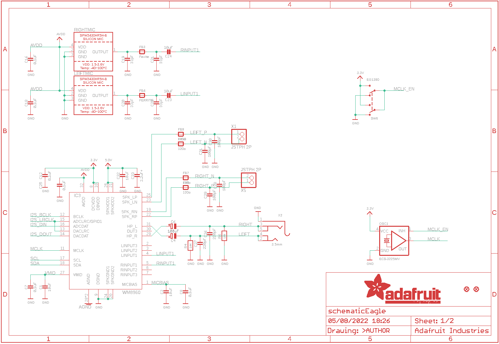
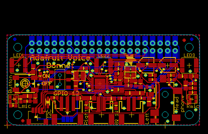
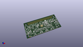
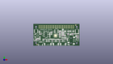
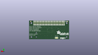

Contents
========

* [PRA4757 > Adafruit Voice Bonnet PCB](#pra4757--adafruit-voice-bonnet-pcb)
	* [Schematic](#schematic)
	* [PCB](#pcb)
	* [Interactive BOM](#interactive-bom)
	* [OOMP Parts](#oomp-parts)
	* [Images](#images)
	* [Tags](#tags)
  
![][im]
# PRA4757 > Adafruit Voice Bonnet PCB

- ID: PROJ-ADAF-4757-STAN-01
- Hex ID: PRA4757
- Name: Adafruit
- Description: Adafruit
- Long Link: [http://oom.lt/PROJ-ADAF-4757-STAN-01](http://oom.lt/PROJ-ADAF-4757-STAN-01)
- Short Link: [http://oom.lt/PRA4757](http://oom.lt/PRA4757)

## Schematic
  

## PCB
  

## Interactive BOM

- Interactive BOM page: [ibom.html](https://htmlpreview.github.io/?https://github.com/oomlout/oomlout_OOMP_projects/blob/main/PROJ-ADAF-4757-STAN-01/kicad/bom/ibom.html)

## OOMP Parts
  

|OOMP Parts|
| :---: |
|[CAPC-0805-X-UF10-V10  SMD (0805) 10 uF Capacitor (Ceramic) 10v  C1, C2, C5, C9, C10, C11, C13, C23, C24, C32, C34](https://github.com/oomlout/oomlout_OOMP_parts/tree/main/CAPC-0805-X-UF10-V10/)|
|CAPC-0603-X-UF1D-01 C3, C7, C8, C12, C14, C16, C18, C25|
|CAPE-PANC-X-UF100-01 C4, C6|
|CAPC-0603-X-PF33-01 C19, C20, C21, C22|
|CAPC-0603-X-PF220-01 C26, C27|
|[CAPC-0603-X-PF100-V50  SMD (0603) 100 pF Capacitor (Ceramic) 50v  C28, C29, C30, C31](https://github.com/oomlout/oomlout_OOMP_parts/tree/main/CAPC-0603-X-PF100-V50/)|
|CAPC-0805-X-UNMATCHED-01 C33|
|HEAD-I01-X-UNMATCHED-01 CONN3|
|DIOD-S323-X-UNMATCHED-01 D1|
|FERB-0805-X-UNMATCHED-01 FB1, FB2, FB3, FB4, FB7, FB8, FB9, FB10|
|UNMATCHED-UNMATCHED-X-UNMATCHED-01 IC3, LEFTMIC, NEOPIX, OSC1, RIGHTMIC, RPI1, SW6, X1, X2, X5|
|LEDS-UNMATCHED-RGB-K102-01 LED1, LED2, LED3|
|[RESE-0603-X-O103-01  SMD (0603) 10k Ohm Resistor  R1, R4, R6](https://github.com/oomlout/oomlout_OOMP_parts/tree/main/RESE-0603-X-O103-01/)|
|[RESE-0603-X-O102-01  SMD (0603) 1k Ohm Resistor  R7](https://github.com/oomlout/oomlout_OOMP_parts/tree/main/RESE-0603-X-O102-01/)|
|[BUTA-6060-X-STAN-01  SMD (6060) Pushbutton (Tactile)  SW1](https://github.com/oomlout/oomlout_OOMP_parts/tree/main/BUTA-6060-X-STAN-01/)|
|UNMATCHED-SO235-X-UNMATCHED-01 U3|

## Images
  
  

|kicadPcb3d|kicadPcb3dFront|kicadPcb3dBack|eagleImage|eagleSchemImage|
| :---: | :---: | :---: | :---: | :---: |
||||||

## Tags

- hexID: PRA4757
- oompType: PROJ
- oompSize: ADAF
- oompColor: 4757
- oompDesc: STAN
- oompIndex: 01
- oompName: Adafruit Voice Bonnet PCB
- sources: All source files from https://github.com/adafruit/Adafruit-Voice-Bonnet-PCB (source licence details in srcLicense.md)
- linkBuyPage: http://www.adafruit.com/products/4757
- oompID: PROJ-ADAF-4757-STAN-01
- oompParts: C1,CAPC-0805-X-UF10-V10
- oompParts: C2,CAPC-0805-X-UF10-V10
- oompParts: C3,CAPC-0603-X-UF1D-01
- oompParts: C4,CAPE-PANC-X-UF100-01
- oompParts: C5,CAPC-0805-X-UF10-V10
- oompParts: C6,CAPE-PANC-X-UF100-01
- oompParts: C7,CAPC-0603-X-UF1D-01
- oompParts: C8,CAPC-0603-X-UF1D-01
- oompParts: C9,CAPC-0805-X-UF10-V10
- oompParts: C10,CAPC-0805-X-UF10-V10
- oompParts: C11,CAPC-0805-X-UF10-V10
- oompParts: C12,CAPC-0603-X-UF1D-01
- oompParts: C13,CAPC-0805-X-UF10-V10
- oompParts: C14,CAPC-0603-X-UF1D-01
- oompParts: C16,CAPC-0603-X-UF1D-01
- oompParts: C18,CAPC-0603-X-UF1D-01
- oompParts: C19,CAPC-0603-X-PF33-01
- oompParts: C20,CAPC-0603-X-PF33-01
- oompParts: C21,CAPC-0603-X-PF33-01
- oompParts: C22,CAPC-0603-X-PF33-01
- oompParts: C23,CAPC-0805-X-UF10-V10
- oompParts: C24,CAPC-0805-X-UF10-V10
- oompParts: C25,CAPC-0603-X-UF1D-01
- oompParts: C26,CAPC-0603-X-PF220-01
- oompParts: C27,CAPC-0603-X-PF220-01
- oompParts: C28,CAPC-0603-X-PF100-V50
- oompParts: C29,CAPC-0603-X-PF100-V50
- oompParts: C30,CAPC-0603-X-PF100-V50
- oompParts: C31,CAPC-0603-X-PF100-V50
- oompParts: C32,CAPC-0805-X-UF10-V10
- oompParts: C33,CAPC-0805-X-UNMATCHED-01
- oompParts: C34,CAPC-0805-X-UF10-V10
- oompParts: CONN3,HEAD-I01-X-UNMATCHED-01
- oompParts: D1,DIOD-S323-X-UNMATCHED-01
- oompParts: FB1,FERB-0805-X-UNMATCHED-01
- oompParts: FB2,FERB-0805-X-UNMATCHED-01
- oompParts: FB3,FERB-0805-X-UNMATCHED-01
- oompParts: FB4,FERB-0805-X-UNMATCHED-01
- oompParts: FB7,FERB-0805-X-UNMATCHED-01
- oompParts: FB8,FERB-0805-X-UNMATCHED-01
- oompParts: FB9,FERB-0805-X-UNMATCHED-01
- oompParts: FB10,FERB-0805-X-UNMATCHED-01
- oompParts: IC3,UNMATCHED-UNMATCHED-X-UNMATCHED-01
- oompParts: LED1,LEDS-UNMATCHED-RGB-K102-01
- oompParts: LED2,LEDS-UNMATCHED-RGB-K102-01
- oompParts: LED3,LEDS-UNMATCHED-RGB-K102-01
- oompParts: LEFTMIC,UNMATCHED-UNMATCHED-X-UNMATCHED-01
- oompParts: NEOPIX,UNMATCHED-UNMATCHED-X-UNMATCHED-01
- oompParts: OSC1,UNMATCHED-UNMATCHED-X-UNMATCHED-01
- oompParts: R1,RESE-0603-X-O103-01
- oompParts: R4,RESE-0603-X-O103-01
- oompParts: R6,RESE-0603-X-O103-01
- oompParts: R7,RESE-0603-X-O102-01
- oompParts: RIGHTMIC,UNMATCHED-UNMATCHED-X-UNMATCHED-01
- oompParts: RPI1,UNMATCHED-UNMATCHED-X-UNMATCHED-01
- oompParts: SW1,BUTA-6060-X-STAN-01
- oompParts: SW6,UNMATCHED-UNMATCHED-X-UNMATCHED-01
- oompParts: U3,UNMATCHED-SO235-X-UNMATCHED-01
- oompParts: X1,UNMATCHED-UNMATCHED-X-UNMATCHED-01
- oompParts: X2,UNMATCHED-UNMATCHED-X-UNMATCHED-01
- oompParts: X5,UNMATCHED-UNMATCHED-X-UNMATCHED-01
- rawParts: C1,10uF,CAP_CERAMIC0805-NOOUTLINE,0805-NO,Ceramic Capacitors,,
- rawParts: C2,10uF,CAP_CERAMIC0805-NOOUTLINE,0805-NO,Ceramic Capacitors,,
- rawParts: C3,0.1uF,CAP_CERAMIC0603_NO,0603-NO,Ceramic Capacitors,,
- rawParts: C4,100uF,CAP_ELECTROLYTICPANASONIC_C,PANASONIC_C,Electrolytic Capacitors,,
- rawParts: C5,10uF,CAP_CERAMIC0805-NOOUTLINE,0805-NO,Ceramic Capacitors,,
- rawParts: C6,100uF,CAP_ELECTROLYTICPANASONIC_C,PANASONIC_C,Electrolytic Capacitors,,
- rawParts: C7,0.1uF,CAP_CERAMIC0603_NO,0603-NO,Ceramic Capacitors,,
- rawParts: C8,0.1uF,CAP_CERAMIC0603_NO,0603-NO,Ceramic Capacitors,,
- rawParts: C9,10uF,CAP_CERAMIC0805-NOOUTLINE,0805-NO,Ceramic Capacitors,,
- rawParts: C10,10uF,CAP_CERAMIC0805-NOOUTLINE,0805-NO,Ceramic Capacitors,,
- rawParts: C11,10uF,CAP_CERAMIC0805-NOOUTLINE,0805-NO,Ceramic Capacitors,,
- rawParts: C12,0.1uF,CAP_CERAMIC0603_NO,0603-NO,Ceramic Capacitors,,
- rawParts: C13,10uF,CAP_CERAMIC0805-NOOUTLINE,0805-NO,Ceramic Capacitors,,
- rawParts: C14,0.1uF,CAP_CERAMIC0603_NO,0603-NO,Ceramic Capacitors,,
- rawParts: C16,0.1uF,CAP_CERAMIC0603_NO,0603-NO,Ceramic Capacitors,,
- rawParts: C18,0.1uF,CAP_CERAMIC0603_NO,0603-NO,Ceramic Capacitors,,
- rawParts: C19,33pF,CAP_CERAMIC0603_NO,0603-NO,Ceramic Capacitors,,
- rawParts: C20,33pF,CAP_CERAMIC0603_NO,0603-NO,Ceramic Capacitors,,
- rawParts: C21,33pF,CAP_CERAMIC0603_NO,0603-NO,Ceramic Capacitors,,
- rawParts: C22,33pF,CAP_CERAMIC0603_NO,0603-NO,Ceramic Capacitors,,
- rawParts: C23,10uF,CAP_CERAMIC0805-NOOUTLINE,0805-NO,Ceramic Capacitors,,
- rawParts: C24,10uF,CAP_CERAMIC0805-NOOUTLINE,0805-NO,Ceramic Capacitors,,
- rawParts: C25,0.1uF,CAP_CERAMIC0603_NO,0603-NO,Ceramic Capacitors,,
- rawParts: C26,220pF,CAP_CERAMIC0603_NO,0603-NO,Ceramic Capacitors,,
- rawParts: C27,220pF,CAP_CERAMIC0603_NO,0603-NO,Ceramic Capacitors,,
- rawParts: C28,100pF,CAP_CERAMIC0603_NO,0603-NO,Ceramic Capacitors,,
- rawParts: C29,100pF,CAP_CERAMIC0603_NO,0603-NO,Ceramic Capacitors,,
- rawParts: C30,100pF,CAP_CERAMIC0603_NO,0603-NO,Ceramic Capacitors,,
- rawParts: C31,100pF,CAP_CERAMIC0603_NO,0603-NO,Ceramic Capacitors,,
- rawParts: C32,10uF,CAP_CERAMIC0805-NOOUTLINE,0805-NO,Ceramic Capacitors,,
- rawParts: C33,2.2uF+,CAP_CERAMIC0805-NOOUTLINE,0805-NO,Ceramic Capacitors,,
- rawParts: C34,10uF,CAP_CERAMIC0805-NOOUTLINE,0805-NO,Ceramic Capacitors,,
- rawParts: CONN3,STEMMA_I2C_QT,STEMMA_I2C_QT,JST_SH4,,,
- rawParts: D1,3.6V,DIODE-ZENERSOD323,SOD-323,Zener Diode,,
- rawParts: FB1,Ferrite,FERRITE0805,0805,Ferrite Bead,,
- rawParts: FB2,Ferrite,FERRITE0805,0805,Ferrite Bead,,
- rawParts: FB3,Ferrite,FERRITE-0805NO,0805-NO,Ferrite Bead,,
- rawParts: FB4,FERRITE,FERRITE-0805NO,0805-NO,Ferrite Bead,,
- rawParts: FB7,120o,FERRITE-0805NO,0805-NO,Ferrite Bead,,
- rawParts: FB8,120o,FERRITE-0805NO,0805-NO,Ferrite Bead,,
- rawParts: FB9,120o,FERRITE-0805NO,0805-NO,Ferrite Bead,,
- rawParts: FB10,120o,FERRITE-0805NO,0805-NO,Ferrite Bead,,
- rawParts: FID1,FIDUCIAL_1MM,FIDUCIAL_1MM,FIDUCIAL_1MM,Fiducial Alignment Points,EXCLUDE,
- rawParts: FID2,FIDUCIAL_1MM,FIDUCIAL_1MM,FIDUCIAL_1MM,Fiducial Alignment Points,EXCLUDE,
- rawParts: IC3,WM8960,WM8960,QFN32_5MM,,,
- rawParts: LED1,SK6822,APA102,APA102,APA102/DotStar Pixels,,
- rawParts: LED2,SK6822,APA102,APA102,APA102/DotStar Pixels,,
- rawParts: LED3,SK6822,APA102,APA102,APA102/DotStar Pixels,,
- rawParts: LEFTMIC,,SPW2430HR5H-B,SPW2430HR5H-B,SPW2430HR5H-B - Silicon Microphone,,
- rawParts: NEOPIX,JST PH 3,CON_JST_PH_3PIN,JSTPH3,,,
- rawParts: OSC1,ECS-3225MV,OSCILLATOR3.2X2.5,OSC_3.2X2.5MM,Oscillators,,
- rawParts: R1,10K,RESISTOR_0603_NOOUT,0603-NO,Resistors,,
- rawParts: R4,10K,RESISTOR_0603_NOOUT,0603-NO,Resistors,,
- rawParts: R6,10k,RESISTOR_0603_NOOUT,0603-NO,Resistors,,
- rawParts: R7,1K,RESISTOR_0603_NOOUT,0603-NO,Resistors,,
- rawParts: RIGHTMIC,,SPW2430HR5H-B,SPW2430HR5H-B,SPW2430HR5H-B - Silicon Microphone,,
- rawParts: RPI1,RASPBERRYPI_BPLUS_BONNET_THMSMT,RASPBERRYPI_BPLUS_BONNET_THMSMT,PI_BONNET_THMSMT,,,
- rawParts: SJ1,,SOLDERJUMPER_2WAY,SOLDERJUMPER_2WAY_OPEN_NOPASTE,2-Way Solder Jumper,,
- rawParts: SW1,EVQQ,SWITCH_TACT_SMT_EVQQ2_SMALL,EVQ-Q2_SMALLER,SMT Tact Switches,,
- rawParts: SW6,EG1390,SWITCH_DPDTEG1390,EG1390,Switch - DPDT,,
- rawParts: U3,AP2112-3.3K,VREG_SOT23-5,SOT23-5,SOT23-5 Fixed Voltage Regulators,,
- rawParts: X1,JSTPH 2P,CON_JST_PH_2PIN,JSTPH2,JST 2-Pin Right-Angle Connector,,
- rawParts: X2,3.5mm,AUDIO_3.5MMJACK,4UCONN_19269,3.5MM Audio Jack,,
- rawParts: X5,JSTPH 2P,CON_JST_PH_2PIN,JSTPH2,JST 2-Pin Right-Angle Connector,,

[im]: kicadPcb3d_450.png
