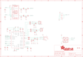

Contents
========

* [PRA4757 > Adafruit](#pra4757--adafruit)
	* [Schematic](#schematic)
	* [Interactive BOM](#interactive-bom)
	* [OOMP Parts](#oomp-parts)
	* [Images](#images)
	* [Tags](#tags)
  
![][im]
# PRA4757 > Adafruit

- ID: PROJ-ADAF-4757-STAN-01
- Hex ID: PRA4757
- Name: Adafruit
- Description: Adafruit
- Long Link: [http://oom.lt/PROJ-ADAF-4757-STAN-01](http://oom.lt/PROJ-ADAF-4757-STAN-01)
- Short Link: [http://oom.lt/PRA4757](http://oom.lt/PRA4757)

## Schematic
  

## Interactive BOM

- Interactive BOM page: [ibom.html](https://htmlpreview.github.io/?https://github.com/oomlout/oomlout_OOMP_projects/blob/main/PROJ-ADAF-4757-STAN-01/kicad/bom/ibom.html)

## OOMP Parts
  

|OOMP Parts|
| :---: |
|C1,CAPC-0805-X-UF10-V10,C1,10uF,CAP_CERAMIC0805-NOOUTLINE,0805-NO,Ceramic Capacitors,,|
|C2,CAPC-0805-X-UF10-V10,C2,10uF,CAP_CERAMIC0805-NOOUTLINE,0805-NO,Ceramic Capacitors,,|
|C3,CAPC-0603-X-NF100-V50,C3,0.1uF,CAP_CERAMIC0603_NO,0603-NO,Ceramic Capacitors,,|
|C4,CAPX-UNMATCHED-X-UF100-01,C4,100uF,CAP_ELECTROLYTICPANASONIC_C,PANASONIC_C,Electrolytic Capacitors,,|
|C5,CAPC-0805-X-UF10-V10,C5,10uF,CAP_CERAMIC0805-NOOUTLINE,0805-NO,Ceramic Capacitors,,|
|C6,CAPX-UNMATCHED-X-UF100-01,C6,100uF,CAP_ELECTROLYTICPANASONIC_C,PANASONIC_C,Electrolytic Capacitors,,|
|C7,CAPC-0603-X-NF100-V50,C7,0.1uF,CAP_CERAMIC0603_NO,0603-NO,Ceramic Capacitors,,|
|C8,CAPC-0603-X-NF100-V50,C8,0.1uF,CAP_CERAMIC0603_NO,0603-NO,Ceramic Capacitors,,|
|C9,CAPC-0805-X-UF10-V10,C9,10uF,CAP_CERAMIC0805-NOOUTLINE,0805-NO,Ceramic Capacitors,,|
|C10,CAPC-0805-X-UF10-V10,C10,10uF,CAP_CERAMIC0805-NOOUTLINE,0805-NO,Ceramic Capacitors,,|
|C11,CAPC-0805-X-UF10-V10,C11,10uF,CAP_CERAMIC0805-NOOUTLINE,0805-NO,Ceramic Capacitors,,|
|C12,CAPC-0603-X-NF100-V50,C12,0.1uF,CAP_CERAMIC0603_NO,0603-NO,Ceramic Capacitors,,|
|C13,CAPC-0805-X-UF10-V10,C13,10uF,CAP_CERAMIC0805-NOOUTLINE,0805-NO,Ceramic Capacitors,,|
|C14,CAPC-0603-X-NF100-V50,C14,0.1uF,CAP_CERAMIC0603_NO,0603-NO,Ceramic Capacitors,,|
|C16,CAPC-0603-X-NF100-V50,C16,0.1uF,CAP_CERAMIC0603_NO,0603-NO,Ceramic Capacitors,,|
|C18,CAPC-0603-X-NF100-V50,C18,0.1uF,CAP_CERAMIC0603_NO,0603-NO,Ceramic Capacitors,,|
|C19,CAPC-0603-X-UNMATCHED-01,C19,33pF,CAP_CERAMIC0603_NO,0603-NO,Ceramic Capacitors,,|
|C20,CAPC-0603-X-UNMATCHED-01,C20,33pF,CAP_CERAMIC0603_NO,0603-NO,Ceramic Capacitors,,|
|C21,CAPC-0603-X-UNMATCHED-01,C21,33pF,CAP_CERAMIC0603_NO,0603-NO,Ceramic Capacitors,,|
|C22,CAPC-0603-X-UNMATCHED-01,C22,33pF,CAP_CERAMIC0603_NO,0603-NO,Ceramic Capacitors,,|
|C23,CAPC-0805-X-UF10-V10,C23,10uF,CAP_CERAMIC0805-NOOUTLINE,0805-NO,Ceramic Capacitors,,|
|C24,CAPC-0805-X-UF10-V10,C24,10uF,CAP_CERAMIC0805-NOOUTLINE,0805-NO,Ceramic Capacitors,,|
|C25,CAPC-0603-X-NF100-V50,C25,0.1uF,CAP_CERAMIC0603_NO,0603-NO,Ceramic Capacitors,,|
|C26,CAPC-0603-X-UNMATCHED-01,C26,220pF,CAP_CERAMIC0603_NO,0603-NO,Ceramic Capacitors,,|
|C27,CAPC-0603-X-UNMATCHED-01,C27,220pF,CAP_CERAMIC0603_NO,0603-NO,Ceramic Capacitors,,|
|C28,CAPC-0603-X-UNMATCHED-01,C28,100pF,CAP_CERAMIC0603_NO,0603-NO,Ceramic Capacitors,,|
|C29,CAPC-0603-X-UNMATCHED-01,C29,100pF,CAP_CERAMIC0603_NO,0603-NO,Ceramic Capacitors,,|
|C30,CAPC-0603-X-UNMATCHED-01,C30,100pF,CAP_CERAMIC0603_NO,0603-NO,Ceramic Capacitors,,|
|C31,CAPC-0603-X-UNMATCHED-01,C31,100pF,CAP_CERAMIC0603_NO,0603-NO,Ceramic Capacitors,,|
|C32,CAPC-0805-X-UF10-V10,C32,10uF,CAP_CERAMIC0805-NOOUTLINE,0805-NO,Ceramic Capacitors,,|
|C33,CAPC-0805-X-UNMATCHED-01,C33,2.2uF+,CAP_CERAMIC0805-NOOUTLINE,0805-NO,Ceramic Capacitors,,|
|C34,CAPC-0805-X-UF10-V10,C34,10uF,CAP_CERAMIC0805-NOOUTLINE,0805-NO,Ceramic Capacitors,,|
|CONN3,UNMATCHED-UNMATCHED-X-UNMATCHED-01,CONN3,STEMMA_I2C_QT,STEMMA_I2C_QT,JST_SH4,,,|
|D1,DIOD-S323-X-UNMATCHED-01,D1,3.6V,DIODE-ZENERSOD323,SOD-323,Zener Diode,,|
|FB1,UNMATCHED-0805-X-UNMATCHED-01,FB1,Ferrite,FERRITE0805,0805,Ferrite Bead,,|
|FB2,UNMATCHED-0805-X-UNMATCHED-01,FB2,Ferrite,FERRITE0805,0805,Ferrite Bead,,|
|FB3,UNMATCHED-0805-X-UNMATCHED-01,FB3,Ferrite,FERRITE-0805NO,0805-NO,Ferrite Bead,,|
|FB4,UNMATCHED-0805-X-UNMATCHED-01,FB4,FERRITE,FERRITE-0805NO,0805-NO,Ferrite Bead,,|
|FB7,UNMATCHED-0805-X-UNMATCHED-01,FB7,120o,FERRITE-0805NO,0805-NO,Ferrite Bead,,|
|FB8,UNMATCHED-0805-X-UNMATCHED-01,FB8,120o,FERRITE-0805NO,0805-NO,Ferrite Bead,,|
|FB9,UNMATCHED-0805-X-UNMATCHED-01,FB9,120o,FERRITE-0805NO,0805-NO,Ferrite Bead,,|
|FB10,UNMATCHED-0805-X-UNMATCHED-01,FB10,120o,FERRITE-0805NO,0805-NO,Ferrite Bead,,|
|IC3,UNMATCHED-UNMATCHED-X-UNMATCHED-01,FID1,FIDUCIAL_1MM,FIDUCIAL_1MM,FIDUCIAL_1MM,Fiducial Alignment Points,EXCLUDE,|
|LED1,UNMATCHED-UNMATCHED-X-UNMATCHED-01,FID2,FIDUCIAL_1MM,FIDUCIAL_1MM,FIDUCIAL_1MM,Fiducial Alignment Points,EXCLUDE,|
|LED2,UNMATCHED-UNMATCHED-X-UNMATCHED-01,IC3,WM8960,WM8960,QFN32_5MM,,,|
|LED3,UNMATCHED-UNMATCHED-X-UNMATCHED-01,LED1,SK6822,APA102,APA102,APA102/DotStar Pixels,,|
|LEFTMIC,UNMATCHED-UNMATCHED-X-UNMATCHED-01,LED2,SK6822,APA102,APA102,APA102/DotStar Pixels,,|
|NEOPIX,UNMATCHED-UNMATCHED-X-UNMATCHED-01,LED3,SK6822,APA102,APA102,APA102/DotStar Pixels,,|
|OSC1,UNMATCHED-UNMATCHED-X-UNMATCHED-01,LEFTMIC,,SPW2430HR5H-B,SPW2430HR5H-B,SPW2430HR5H-B - Silicon Microphone,,|
|R1,RESE-0603-X-O103-01,NEOPIX,JST PH 3,CON_JST_PH_3PIN,JSTPH3,,,|
|R4,RESE-0603-X-O103-01,OSC1,ECS-3225MV,OSCILLATOR3.2X2.5,OSC_3.2X2.5MM,Oscillators,,|
|R6,RESE-0603-X-O103-01,R1,10K,RESISTOR_0603_NOOUT,0603-NO,Resistors,,|
|R7,RESE-0603-X-O102-01,R4,10K,RESISTOR_0603_NOOUT,0603-NO,Resistors,,|
|RIGHTMIC,UNMATCHED-UNMATCHED-X-UNMATCHED-01,R6,10k,RESISTOR_0603_NOOUT,0603-NO,Resistors,,|
|RPI1,UNMATCHED-UNMATCHED-X-UNMATCHED-01,R7,1K,RESISTOR_0603_NOOUT,0603-NO,Resistors,,|
|SW1,UNMATCHED-UNMATCHED-X-UNMATCHED-01,RIGHTMIC,,SPW2430HR5H-B,SPW2430HR5H-B,SPW2430HR5H-B - Silicon Microphone,,|
|SW6,UNMATCHED-UNMATCHED-X-UNMATCHED-01,RPI1,RASPBERRYPI_BPLUS_BONNET_THMSMT,RASPBERRYPI_BPLUS_BONNET_THMSMT,PI_BONNET_THMSMT,,,|
|U3,UNMATCHED-SO235-X-UNMATCHED-01,SJ1,,SOLDERJUMPER_2WAY,SOLDERJUMPER_2WAY_OPEN_NOPASTE,2-Way Solder Jumper,,|
|X1,UNMATCHED-UNMATCHED-X-UNMATCHED-01,SW1,EVQQ,SWITCH_TACT_SMT_EVQQ2_SMALL,EVQ-Q2_SMALLER,SMT Tact Switches,,|
|X2,UNMATCHED-UNMATCHED-X-UNMATCHED-01,SW6,EG1390,SWITCH_DPDTEG1390,EG1390,Switch - DPDT,,|
|X5,UNMATCHED-UNMATCHED-X-UNMATCHED-01,U3,AP2112-3.3K,VREG_SOT23-5,SOT23-5,SOT23-5 Fixed Voltage Regulators,,|

## Images
  
  

|kicadPcb3d|kicadPcb3dFront|kicadPcb3dBack|eagleImage|eagleSchemImage|
| :---: | :---: | :---: | :---: | :---: |
||||||

## Tags

- hexID: PRA4757
- oompType: PROJ
- oompSize: ADAF
- oompColor: 4757
- oompDesc: STAN
- oompIndex: 01
- oompName: Adafruit Voice Bonnet PCB
- sources: All source files from https://github.com/adafruit/Adafruit-Voice-Bonnet-PCB (source licence details in srcLicense.md)
- linkBuyPage: http://www.adafruit.com/products/4757
- oompID: PROJ-ADAF-4757-STAN-01
- oompParts: C1,CAPC-0805-X-UF10-V10
- oompParts: C2,CAPC-0805-X-UF10-V10
- oompParts: C3,CAPC-0603-X-NF100-V50
- oompParts: C4,CAPX-UNMATCHED-X-UF100-01
- oompParts: C5,CAPC-0805-X-UF10-V10
- oompParts: C6,CAPX-UNMATCHED-X-UF100-01
- oompParts: C7,CAPC-0603-X-NF100-V50
- oompParts: C8,CAPC-0603-X-NF100-V50
- oompParts: C9,CAPC-0805-X-UF10-V10
- oompParts: C10,CAPC-0805-X-UF10-V10
- oompParts: C11,CAPC-0805-X-UF10-V10
- oompParts: C12,CAPC-0603-X-NF100-V50
- oompParts: C13,CAPC-0805-X-UF10-V10
- oompParts: C14,CAPC-0603-X-NF100-V50
- oompParts: C16,CAPC-0603-X-NF100-V50
- oompParts: C18,CAPC-0603-X-NF100-V50
- oompParts: C19,CAPC-0603-X-UNMATCHED-01
- oompParts: C20,CAPC-0603-X-UNMATCHED-01
- oompParts: C21,CAPC-0603-X-UNMATCHED-01
- oompParts: C22,CAPC-0603-X-UNMATCHED-01
- oompParts: C23,CAPC-0805-X-UF10-V10
- oompParts: C24,CAPC-0805-X-UF10-V10
- oompParts: C25,CAPC-0603-X-NF100-V50
- oompParts: C26,CAPC-0603-X-UNMATCHED-01
- oompParts: C27,CAPC-0603-X-UNMATCHED-01
- oompParts: C28,CAPC-0603-X-UNMATCHED-01
- oompParts: C29,CAPC-0603-X-UNMATCHED-01
- oompParts: C30,CAPC-0603-X-UNMATCHED-01
- oompParts: C31,CAPC-0603-X-UNMATCHED-01
- oompParts: C32,CAPC-0805-X-UF10-V10
- oompParts: C33,CAPC-0805-X-UNMATCHED-01
- oompParts: C34,CAPC-0805-X-UF10-V10
- oompParts: CONN3,UNMATCHED-UNMATCHED-X-UNMATCHED-01
- oompParts: D1,DIOD-S323-X-UNMATCHED-01
- oompParts: FB1,UNMATCHED-0805-X-UNMATCHED-01
- oompParts: FB2,UNMATCHED-0805-X-UNMATCHED-01
- oompParts: FB3,UNMATCHED-0805-X-UNMATCHED-01
- oompParts: FB4,UNMATCHED-0805-X-UNMATCHED-01
- oompParts: FB7,UNMATCHED-0805-X-UNMATCHED-01
- oompParts: FB8,UNMATCHED-0805-X-UNMATCHED-01
- oompParts: FB9,UNMATCHED-0805-X-UNMATCHED-01
- oompParts: FB10,UNMATCHED-0805-X-UNMATCHED-01
- oompParts: IC3,UNMATCHED-UNMATCHED-X-UNMATCHED-01
- oompParts: LED1,UNMATCHED-UNMATCHED-X-UNMATCHED-01
- oompParts: LED2,UNMATCHED-UNMATCHED-X-UNMATCHED-01
- oompParts: LED3,UNMATCHED-UNMATCHED-X-UNMATCHED-01
- oompParts: LEFTMIC,UNMATCHED-UNMATCHED-X-UNMATCHED-01
- oompParts: NEOPIX,UNMATCHED-UNMATCHED-X-UNMATCHED-01
- oompParts: OSC1,UNMATCHED-UNMATCHED-X-UNMATCHED-01
- oompParts: R1,RESE-0603-X-O103-01
- oompParts: R4,RESE-0603-X-O103-01
- oompParts: R6,RESE-0603-X-O103-01
- oompParts: R7,RESE-0603-X-O102-01
- oompParts: RIGHTMIC,UNMATCHED-UNMATCHED-X-UNMATCHED-01
- oompParts: RPI1,UNMATCHED-UNMATCHED-X-UNMATCHED-01
- oompParts: SW1,UNMATCHED-UNMATCHED-X-UNMATCHED-01
- oompParts: SW6,UNMATCHED-UNMATCHED-X-UNMATCHED-01
- oompParts: U3,UNMATCHED-SO235-X-UNMATCHED-01
- oompParts: X1,UNMATCHED-UNMATCHED-X-UNMATCHED-01
- oompParts: X2,UNMATCHED-UNMATCHED-X-UNMATCHED-01
- oompParts: X5,UNMATCHED-UNMATCHED-X-UNMATCHED-01
- rawParts: C1,10uF,CAP_CERAMIC0805-NOOUTLINE,0805-NO,Ceramic Capacitors,,
- rawParts: C2,10uF,CAP_CERAMIC0805-NOOUTLINE,0805-NO,Ceramic Capacitors,,
- rawParts: C3,0.1uF,CAP_CERAMIC0603_NO,0603-NO,Ceramic Capacitors,,
- rawParts: C4,100uF,CAP_ELECTROLYTICPANASONIC_C,PANASONIC_C,Electrolytic Capacitors,,
- rawParts: C5,10uF,CAP_CERAMIC0805-NOOUTLINE,0805-NO,Ceramic Capacitors,,
- rawParts: C6,100uF,CAP_ELECTROLYTICPANASONIC_C,PANASONIC_C,Electrolytic Capacitors,,
- rawParts: C7,0.1uF,CAP_CERAMIC0603_NO,0603-NO,Ceramic Capacitors,,
- rawParts: C8,0.1uF,CAP_CERAMIC0603_NO,0603-NO,Ceramic Capacitors,,
- rawParts: C9,10uF,CAP_CERAMIC0805-NOOUTLINE,0805-NO,Ceramic Capacitors,,
- rawParts: C10,10uF,CAP_CERAMIC0805-NOOUTLINE,0805-NO,Ceramic Capacitors,,
- rawParts: C11,10uF,CAP_CERAMIC0805-NOOUTLINE,0805-NO,Ceramic Capacitors,,
- rawParts: C12,0.1uF,CAP_CERAMIC0603_NO,0603-NO,Ceramic Capacitors,,
- rawParts: C13,10uF,CAP_CERAMIC0805-NOOUTLINE,0805-NO,Ceramic Capacitors,,
- rawParts: C14,0.1uF,CAP_CERAMIC0603_NO,0603-NO,Ceramic Capacitors,,
- rawParts: C16,0.1uF,CAP_CERAMIC0603_NO,0603-NO,Ceramic Capacitors,,
- rawParts: C18,0.1uF,CAP_CERAMIC0603_NO,0603-NO,Ceramic Capacitors,,
- rawParts: C19,33pF,CAP_CERAMIC0603_NO,0603-NO,Ceramic Capacitors,,
- rawParts: C20,33pF,CAP_CERAMIC0603_NO,0603-NO,Ceramic Capacitors,,
- rawParts: C21,33pF,CAP_CERAMIC0603_NO,0603-NO,Ceramic Capacitors,,
- rawParts: C22,33pF,CAP_CERAMIC0603_NO,0603-NO,Ceramic Capacitors,,
- rawParts: C23,10uF,CAP_CERAMIC0805-NOOUTLINE,0805-NO,Ceramic Capacitors,,
- rawParts: C24,10uF,CAP_CERAMIC0805-NOOUTLINE,0805-NO,Ceramic Capacitors,,
- rawParts: C25,0.1uF,CAP_CERAMIC0603_NO,0603-NO,Ceramic Capacitors,,
- rawParts: C26,220pF,CAP_CERAMIC0603_NO,0603-NO,Ceramic Capacitors,,
- rawParts: C27,220pF,CAP_CERAMIC0603_NO,0603-NO,Ceramic Capacitors,,
- rawParts: C28,100pF,CAP_CERAMIC0603_NO,0603-NO,Ceramic Capacitors,,
- rawParts: C29,100pF,CAP_CERAMIC0603_NO,0603-NO,Ceramic Capacitors,,
- rawParts: C30,100pF,CAP_CERAMIC0603_NO,0603-NO,Ceramic Capacitors,,
- rawParts: C31,100pF,CAP_CERAMIC0603_NO,0603-NO,Ceramic Capacitors,,
- rawParts: C32,10uF,CAP_CERAMIC0805-NOOUTLINE,0805-NO,Ceramic Capacitors,,
- rawParts: C33,2.2uF+,CAP_CERAMIC0805-NOOUTLINE,0805-NO,Ceramic Capacitors,,
- rawParts: C34,10uF,CAP_CERAMIC0805-NOOUTLINE,0805-NO,Ceramic Capacitors,,
- rawParts: CONN3,STEMMA_I2C_QT,STEMMA_I2C_QT,JST_SH4,,,
- rawParts: D1,3.6V,DIODE-ZENERSOD323,SOD-323,Zener Diode,,
- rawParts: FB1,Ferrite,FERRITE0805,0805,Ferrite Bead,,
- rawParts: FB2,Ferrite,FERRITE0805,0805,Ferrite Bead,,
- rawParts: FB3,Ferrite,FERRITE-0805NO,0805-NO,Ferrite Bead,,
- rawParts: FB4,FERRITE,FERRITE-0805NO,0805-NO,Ferrite Bead,,
- rawParts: FB7,120o,FERRITE-0805NO,0805-NO,Ferrite Bead,,
- rawParts: FB8,120o,FERRITE-0805NO,0805-NO,Ferrite Bead,,
- rawParts: FB9,120o,FERRITE-0805NO,0805-NO,Ferrite Bead,,
- rawParts: FB10,120o,FERRITE-0805NO,0805-NO,Ferrite Bead,,
- rawParts: FID1,FIDUCIAL_1MM,FIDUCIAL_1MM,FIDUCIAL_1MM,Fiducial Alignment Points,EXCLUDE,
- rawParts: FID2,FIDUCIAL_1MM,FIDUCIAL_1MM,FIDUCIAL_1MM,Fiducial Alignment Points,EXCLUDE,
- rawParts: IC3,WM8960,WM8960,QFN32_5MM,,,
- rawParts: LED1,SK6822,APA102,APA102,APA102/DotStar Pixels,,
- rawParts: LED2,SK6822,APA102,APA102,APA102/DotStar Pixels,,
- rawParts: LED3,SK6822,APA102,APA102,APA102/DotStar Pixels,,
- rawParts: LEFTMIC,,SPW2430HR5H-B,SPW2430HR5H-B,SPW2430HR5H-B - Silicon Microphone,,
- rawParts: NEOPIX,JST PH 3,CON_JST_PH_3PIN,JSTPH3,,,
- rawParts: OSC1,ECS-3225MV,OSCILLATOR3.2X2.5,OSC_3.2X2.5MM,Oscillators,,
- rawParts: R1,10K,RESISTOR_0603_NOOUT,0603-NO,Resistors,,
- rawParts: R4,10K,RESISTOR_0603_NOOUT,0603-NO,Resistors,,
- rawParts: R6,10k,RESISTOR_0603_NOOUT,0603-NO,Resistors,,
- rawParts: R7,1K,RESISTOR_0603_NOOUT,0603-NO,Resistors,,
- rawParts: RIGHTMIC,,SPW2430HR5H-B,SPW2430HR5H-B,SPW2430HR5H-B - Silicon Microphone,,
- rawParts: RPI1,RASPBERRYPI_BPLUS_BONNET_THMSMT,RASPBERRYPI_BPLUS_BONNET_THMSMT,PI_BONNET_THMSMT,,,
- rawParts: SJ1,,SOLDERJUMPER_2WAY,SOLDERJUMPER_2WAY_OPEN_NOPASTE,2-Way Solder Jumper,,
- rawParts: SW1,EVQQ,SWITCH_TACT_SMT_EVQQ2_SMALL,EVQ-Q2_SMALLER,SMT Tact Switches,,
- rawParts: SW6,EG1390,SWITCH_DPDTEG1390,EG1390,Switch - DPDT,,
- rawParts: U3,AP2112-3.3K,VREG_SOT23-5,SOT23-5,SOT23-5 Fixed Voltage Regulators,,
- rawParts: X1,JSTPH 2P,CON_JST_PH_2PIN,JSTPH2,JST 2-Pin Right-Angle Connector,,
- rawParts: X2,3.5mm,AUDIO_3.5MMJACK,4UCONN_19269,3.5MM Audio Jack,,
- rawParts: X5,JSTPH 2P,CON_JST_PH_2PIN,JSTPH2,JST 2-Pin Right-Angle Connector,,

[im]: kicadPcb3d_450.png
