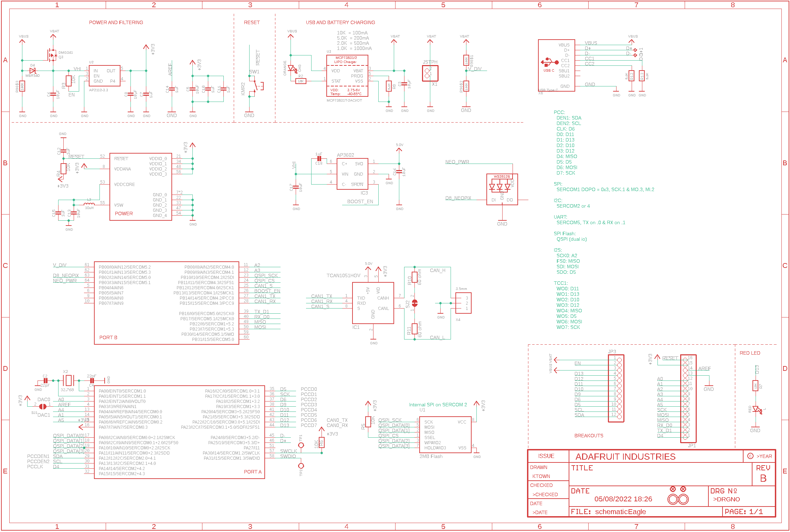
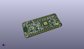
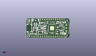
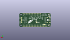
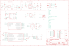

Contents
========

* [PRA4759 > Adafruit](#pra4759--adafruit)
	* [Schematic](#schematic)
	* [Interactive BOM](#interactive-bom)
	* [OOMP Parts](#oomp-parts)
	* [Images](#images)
	* [Tags](#tags)
  
![][im]
# PRA4759 > Adafruit

- ID: PROJ-ADAF-4759-STAN-01
- Hex ID: PRA4759
- Name: Adafruit
- Description: Adafruit
- Long Link: [http://oom.lt/PROJ-ADAF-4759-STAN-01](http://oom.lt/PROJ-ADAF-4759-STAN-01)
- Short Link: [http://oom.lt/PRA4759](http://oom.lt/PRA4759)

## Schematic
  

## Interactive BOM

- Interactive BOM page: [ibom.html](https://htmlpreview.github.io/?https://github.com/oomlout/oomlout_OOMP_projects/blob/main/PROJ-ADAF-4759-STAN-01/kicad/bom/ibom.html)

## OOMP Parts
  

|OOMP Parts|
| :---: |
|C2,CAPC-0603-X-UNMATCHED-01,C2,22pF,CAP_CERAMIC0603_NO,0603-NO,Ceramic Capacitors,,,,,|
|C3,CAPC-0805-X-UNMATCHED-01,C3,10µF,CAP_CERAMIC0805-NOOUTLINE,0805-NO,Ceramic Capacitors,,,,,|
|C4,CAPC-0603-X-UNMATCHED-01,C4,22pF,CAP_CERAMIC0603_NO,0603-NO,Ceramic Capacitors,,,,,|
|C5,CAPC-0805-X-UF10-V10,C5,10uF,CAP_CERAMIC0805-NOOUTLINE,0805-NO,Ceramic Capacitors,,,,,|
|C6,CAPC-0805-X-UNMATCHED-01,C6,10µF,CAP_CERAMIC0805-NOOUTLINE,0805-NO,Ceramic Capacitors,,,,,|
|C7,CAPC-0603-X-UF1-01,C7,1uF,CAP_CERAMIC0603_NO,0603-NO,Ceramic Capacitors,,,,,|
|C8,CAPC-0805-X-UNMATCHED-01,C8,10µF,CAP_CERAMIC0805-NOOUTLINE,0805-NO,Ceramic Capacitors,,,C,,|
|C10,CAPC-0603-X-UF1-01,C10,1uF,CAP_CERAMIC0603_NO,0603-NO,Ceramic Capacitors,,,,,|
|C11,CAPC-0603-X-UF1-01,C11,1uF,CAP_CERAMIC0603_NO,0603-NO,Ceramic Capacitors,,,,,|
|C12,CAPC-0603-X-UF1-01,C12,1uF,CAP_CERAMIC0603_NO,0603-NO,Ceramic Capacitors,,,,,|
|C13,CAPC-0805-X-UF10-V10,C13,10uF,CAP_CERAMIC0805-NOOUTLINE,0805-NO,Ceramic Capacitors,,,,,|
|C14,CAPC-0603-X-UF1-01,C14,1uF,CAP_CERAMIC0603_NO,0603-NO,Ceramic Capacitors,,,,,|
|C15,CAPC-0603-X-UF1-01,C15,1uF,CAP_CERAMIC0603_NO,0603-NO,Ceramic Capacitors,,,,,|
|C16,CAPC-0805-X-UF10-V10,C16,10uF,CAP_CERAMIC_0805MP,_0805MP,Ceramic Capacitors,,,,,|
|C17,CAPC-0805-X-UF10-V10,C17,10uF,CAP_CERAMIC0805-NOOUTLINE,0805-NO,Ceramic Capacitors,,,,,|
|C18,CAPC-UNMATCHED-X-UF1-01,C18,1uF,CAP_CERAMIC0805_10MGAP,0805_10MGAP,Ceramic Capacitors,,,,,|
|CHG,LEDS-0603-G-STAN-01,CHG,ORANGE,LED0603_NOOUTLINE,CHIPLED_0603_NOOUTLINE,LED,,,,,|
|D+1,UNMATCHED-UNMATCHED-X-UNMATCHED-01,D+1,TPB1,27,TPB1,27,B1,27,Test pad,,19,,,|
|D-1,UNMATCHED-UNMATCHED-X-UNMATCHED-01,D-1,TPB1,27,TPB1,27,B1,27,Test pad,,19,,,|
|D4,DIOD-UNMATCHED-X-UNMATCHED-01,D4,MBR540,DIODE-SCHOTTKYSOD-123,SOD-123,,,,,,|
|IC1,UNMATCHED-UNMATCHED-X-UNMATCHED-01,IC1,TCAN1051HGV,CAN_TRANSCIEVER_TCAN1051V,SOIC8_150MIL,,,,,,|
|IC3,UNMATCHED-SO23-X-UNMATCHED-01,IC3,AP3602,AP3602,SOT23-6,,,,,,|
|JP1,HEAD-I01-X-PI16-01,JP1,,HEADER-1X16ROUND,1X16_ROUND,PIN HEADER,,,,,|
|JP3,HEAD-I01-X-PI12-01,JP3,,HEADER-1X12,1X12_ROUND,,,,,,|
|L,LEDS-0603-G-STAN-01,L,RED,LED0603_NOOUTLINE,CHIPLED_0603_NOOUTLINE,LED,,,,,|
|L2,UNMATCHED-UNMATCHED-X-UNMATCHED-01,L2,10uH,INDUCTOR,INDUCTOR_1007,Inductors,,,,,|
|LED1,UNMATCHED-UNMATCHED-X-UNMATCHED-01,LED1,WS2812B3535,WS2812B3535,LED3535,,,,,,|
|Q3,MOSP-SO23-X-UNMATCHED-01,Q3,DMG341,MOSFET-P,SOT23-R,P-Channel Mosfet,,,,,|
|R2,RESE-0603-X-O103-01,R2,10K,RESISTOR_0603_NOOUT,0603-NO,Resistors,,,,,|
|R3,RESE-0603-X-O103-01,R3,10K,RESISTOR_0603_NOOUT,0603-NO,Resistors,,,,,|
|R4,RESE-0603-X-O103-01,R4,10K,RESISTOR_0603_NOOUT,0603-NO,Resistors,,,,,|
|R5,RESE-0603-X-O103-01,R5,10K,RESISTOR_0603_NOOUT,0603-NO,Resistors,,,,,|
|R6,RESE-0603-X-O103-01,R6,10K,RESISTOR_0603_NOOUT,0603-NO,Resistors,,,,,|
|R7,RESE-0603-X-O103-01,R7,10K,RESISTOR_0603_NOOUT,0603-NO,Resistors,,,,,|
|R8,RESE-0603-X-UNMATCHED-01,R8,5.1K,RESISTOR_0603_NOOUT,0603-NO,Resistors,,,,,|
|R9,RESE-UNMATCHED-X-O1003-01,R9,100K,RESISTOR_4PACK_NO,RESPACK_4X0603_NO,Resistor Packs (4 resistors),,,,,|
|R10,RESE-0805-X-UNMATCHED-01,R10,60 ohm,RESISTOR0805_NOOUTLINE,0805-NO,Resistors,,,,,|
|R11,RESE-0805-X-UNMATCHED-01,R11,60 ohm,RESISTOR0805_NOOUTLINE,0805-NO,Resistors,,,,,|
|R12,RESE-0603-X-UNMATCHED-01,R12,5.1K,RESISTOR_0603_NOOUT,0603-NO,Resistors,,,,,|
|R13,RESE-0603-X-UNMATCHED-01,R13,5.1K,RESISTOR_0603_NOOUT,0603-NO,Resistors,,,,,|
|SW1,UNMATCHED-UNMATCHED-X-UNMATCHED-01,SJ1,,SOLDERJUMPERCLOSED,SOLDERJUMPER_CLOSEDWIRE,SMD Solder JUMPER,,,,,|
|TP1,UNMATCHED-UNMATCHED-X-UNMATCHED-01,SJ2,,SOLDERJUMPER_CLOSED,SOLDERJUMPER_CLOSEDWIRE,Solder Jumper - Closed,,,,,|
|TP2,UNMATCHED-UNMATCHED-X-UNMATCHED-01,SW1,KMR2,SWITCH_TACT_SMT4.6X2.8,BTN_KMR2_4.6X2.8,SMT Tact Switches,,,,,|
|U$14,UNMATCHED-UNMATCHED-X-UNMATCHED-01,TP1,,TESTPOINTROUND1.5MM,TESTPOINT_ROUND_1.5MM,Test Point,,,,,|
|U1,UNMATCHED-UNMATCHED-X-UNMATCHED-01,TP2,,TESTPOINTROUND1.5MM,TESTPOINT_ROUND_1.5MM,Test Point,,,,,|
|U2,UNMATCHED-SO235-X-UNMATCHED-01,U$14,ATSAMD51J,ATSAMD51J,PQFN64-1,ATSAMD51J cortex m4 microcontroller,,,,,|
|U3,UNMATCHED-SO235-X-UNMATCHED-01,U$31,MOUNTINGHOLE2.5,MOUNTINGHOLE2.5,MOUNTINGHOLE_2.5_PLATED,Mounting Hole,EXCLUDE,,,,|
|X1,UNMATCHED-UNMATCHED-X-UNMATCHED-01,U$32,MOUNTINGHOLE2.5,MOUNTINGHOLE2.5,MOUNTINGHOLE_2.5_PLATED,Mounting Hole,EXCLUDE,,,,|
|X2,UNMATCHED-UNMATCHED-X-UNMATCHED-01,U$34,FIDUCIAL_1MM,FIDUCIAL_1MM,FIDUCIAL_1MM,Fiducial Alignment Points,EXCLUDE,,,,|
|X4,UNMATCHED-UNMATCHED-X-UNMATCHED-01,U$35,FIDUCIAL_1MM,FIDUCIAL_1MM,FIDUCIAL_1MM,Fiducial Alignment Points,EXCLUDE,,,,|
|X6,UNMATCHED-UNMATCHED-X-UNMATCHED-01,U1,2MB Flash,SPIFLASH_8PINUX,USON8,SOIC8 SPI Flash,,,,,|

## Images
  
  

|kicadPcb3d|kicadPcb3dFront|kicadPcb3dBack|eagleImage|eagleSchemImage|
| :---: | :---: | :---: | :---: | :---: |
||||||

## Tags

- hexID: PRA4759
- oompType: PROJ
- oompSize: ADAF
- oompColor: 4759
- oompDesc: STAN
- oompIndex: 01
- oompName: Adafruit Feather M4 CAN PCB
- sources: All source files from https://github.com/adafruit/Adafruit-Feather-M4-CAN-PCB (source licence details in srcLicense.md)
- linkBuyPage: http://www.adafruit.com/products/4759
- oompID: PROJ-ADAF-4759-STAN-01
- oompParts: C2,CAPC-0603-X-UNMATCHED-01
- oompParts: C3,CAPC-0805-X-UNMATCHED-01
- oompParts: C4,CAPC-0603-X-UNMATCHED-01
- oompParts: C5,CAPC-0805-X-UF10-V10
- oompParts: C6,CAPC-0805-X-UNMATCHED-01
- oompParts: C7,CAPC-0603-X-UF1-01
- oompParts: C8,CAPC-0805-X-UNMATCHED-01
- oompParts: C10,CAPC-0603-X-UF1-01
- oompParts: C11,CAPC-0603-X-UF1-01
- oompParts: C12,CAPC-0603-X-UF1-01
- oompParts: C13,CAPC-0805-X-UF10-V10
- oompParts: C14,CAPC-0603-X-UF1-01
- oompParts: C15,CAPC-0603-X-UF1-01
- oompParts: C16,CAPC-0805-X-UF10-V10
- oompParts: C17,CAPC-0805-X-UF10-V10
- oompParts: C18,CAPC-UNMATCHED-X-UF1-01
- oompParts: CHG,LEDS-0603-G-STAN-01
- oompParts: D+1,UNMATCHED-UNMATCHED-X-UNMATCHED-01
- oompParts: D-1,UNMATCHED-UNMATCHED-X-UNMATCHED-01
- oompParts: D4,DIOD-UNMATCHED-X-UNMATCHED-01
- oompParts: IC1,UNMATCHED-UNMATCHED-X-UNMATCHED-01
- oompParts: IC3,UNMATCHED-SO23-X-UNMATCHED-01
- oompParts: JP1,HEAD-I01-X-PI16-01
- oompParts: JP3,HEAD-I01-X-PI12-01
- oompParts: L,LEDS-0603-G-STAN-01
- oompParts: L2,UNMATCHED-UNMATCHED-X-UNMATCHED-01
- oompParts: LED1,UNMATCHED-UNMATCHED-X-UNMATCHED-01
- oompParts: Q3,MOSP-SO23-X-UNMATCHED-01
- oompParts: R2,RESE-0603-X-O103-01
- oompParts: R3,RESE-0603-X-O103-01
- oompParts: R4,RESE-0603-X-O103-01
- oompParts: R5,RESE-0603-X-O103-01
- oompParts: R6,RESE-0603-X-O103-01
- oompParts: R7,RESE-0603-X-O103-01
- oompParts: R8,RESE-0603-X-UNMATCHED-01
- oompParts: R9,RESE-UNMATCHED-X-O1003-01
- oompParts: R10,RESE-0805-X-UNMATCHED-01
- oompParts: R11,RESE-0805-X-UNMATCHED-01
- oompParts: R12,RESE-0603-X-UNMATCHED-01
- oompParts: R13,RESE-0603-X-UNMATCHED-01
- oompParts: SW1,UNMATCHED-UNMATCHED-X-UNMATCHED-01
- oompParts: TP1,UNMATCHED-UNMATCHED-X-UNMATCHED-01
- oompParts: TP2,UNMATCHED-UNMATCHED-X-UNMATCHED-01
- oompParts: U$14,UNMATCHED-UNMATCHED-X-UNMATCHED-01
- oompParts: U1,UNMATCHED-UNMATCHED-X-UNMATCHED-01
- oompParts: U2,UNMATCHED-SO235-X-UNMATCHED-01
- oompParts: U3,UNMATCHED-SO235-X-UNMATCHED-01
- oompParts: X1,UNMATCHED-UNMATCHED-X-UNMATCHED-01
- oompParts: X2,UNMATCHED-UNMATCHED-X-UNMATCHED-01
- oompParts: X4,UNMATCHED-UNMATCHED-X-UNMATCHED-01
- oompParts: X6,UNMATCHED-UNMATCHED-X-UNMATCHED-01
- rawParts: C2,22pF,CAP_CERAMIC0603_NO,0603-NO,Ceramic Capacitors,,,,,
- rawParts: C3,10µF,CAP_CERAMIC0805-NOOUTLINE,0805-NO,Ceramic Capacitors,,,,,
- rawParts: C4,22pF,CAP_CERAMIC0603_NO,0603-NO,Ceramic Capacitors,,,,,
- rawParts: C5,10uF,CAP_CERAMIC0805-NOOUTLINE,0805-NO,Ceramic Capacitors,,,,,
- rawParts: C6,10µF,CAP_CERAMIC0805-NOOUTLINE,0805-NO,Ceramic Capacitors,,,,,
- rawParts: C7,1uF,CAP_CERAMIC0603_NO,0603-NO,Ceramic Capacitors,,,,,
- rawParts: C8,10µF,CAP_CERAMIC0805-NOOUTLINE,0805-NO,Ceramic Capacitors,,,C,,
- rawParts: C10,1uF,CAP_CERAMIC0603_NO,0603-NO,Ceramic Capacitors,,,,,
- rawParts: C11,1uF,CAP_CERAMIC0603_NO,0603-NO,Ceramic Capacitors,,,,,
- rawParts: C12,1uF,CAP_CERAMIC0603_NO,0603-NO,Ceramic Capacitors,,,,,
- rawParts: C13,10uF,CAP_CERAMIC0805-NOOUTLINE,0805-NO,Ceramic Capacitors,,,,,
- rawParts: C14,1uF,CAP_CERAMIC0603_NO,0603-NO,Ceramic Capacitors,,,,,
- rawParts: C15,1uF,CAP_CERAMIC0603_NO,0603-NO,Ceramic Capacitors,,,,,
- rawParts: C16,10uF,CAP_CERAMIC_0805MP,_0805MP,Ceramic Capacitors,,,,,
- rawParts: C17,10uF,CAP_CERAMIC0805-NOOUTLINE,0805-NO,Ceramic Capacitors,,,,,
- rawParts: C18,1uF,CAP_CERAMIC0805_10MGAP,0805_10MGAP,Ceramic Capacitors,,,,,
- rawParts: CHG,ORANGE,LED0603_NOOUTLINE,CHIPLED_0603_NOOUTLINE,LED,,,,,
- rawParts: D+1,TPB1,27,TPB1,27,B1,27,Test pad,,19,,,
- rawParts: D-1,TPB1,27,TPB1,27,B1,27,Test pad,,19,,,
- rawParts: D4,MBR540,DIODE-SCHOTTKYSOD-123,SOD-123,,,,,,
- rawParts: IC1,TCAN1051HGV,CAN_TRANSCIEVER_TCAN1051V,SOIC8_150MIL,,,,,,
- rawParts: IC3,AP3602,AP3602,SOT23-6,,,,,,
- rawParts: JP1,,HEADER-1X16ROUND,1X16_ROUND,PIN HEADER,,,,,
- rawParts: JP3,,HEADER-1X12,1X12_ROUND,,,,,,
- rawParts: L,RED,LED0603_NOOUTLINE,CHIPLED_0603_NOOUTLINE,LED,,,,,
- rawParts: L2,10uH,INDUCTOR,INDUCTOR_1007,Inductors,,,,,
- rawParts: LED1,WS2812B3535,WS2812B3535,LED3535,,,,,,
- rawParts: Q3,DMG341,MOSFET-P,SOT23-R,P-Channel Mosfet,,,,,
- rawParts: R2,10K,RESISTOR_0603_NOOUT,0603-NO,Resistors,,,,,
- rawParts: R3,10K,RESISTOR_0603_NOOUT,0603-NO,Resistors,,,,,
- rawParts: R4,10K,RESISTOR_0603_NOOUT,0603-NO,Resistors,,,,,
- rawParts: R5,10K,RESISTOR_0603_NOOUT,0603-NO,Resistors,,,,,
- rawParts: R6,10K,RESISTOR_0603_NOOUT,0603-NO,Resistors,,,,,
- rawParts: R7,10K,RESISTOR_0603_NOOUT,0603-NO,Resistors,,,,,
- rawParts: R8,5.1K,RESISTOR_0603_NOOUT,0603-NO,Resistors,,,,,
- rawParts: R9,100K,RESISTOR_4PACK_NO,RESPACK_4X0603_NO,Resistor Packs (4 resistors),,,,,
- rawParts: R10,60 ohm,RESISTOR0805_NOOUTLINE,0805-NO,Resistors,,,,,
- rawParts: R11,60 ohm,RESISTOR0805_NOOUTLINE,0805-NO,Resistors,,,,,
- rawParts: R12,5.1K,RESISTOR_0603_NOOUT,0603-NO,Resistors,,,,,
- rawParts: R13,5.1K,RESISTOR_0603_NOOUT,0603-NO,Resistors,,,,,
- rawParts: SJ1,,SOLDERJUMPERCLOSED,SOLDERJUMPER_CLOSEDWIRE,SMD Solder JUMPER,,,,,
- rawParts: SJ2,,SOLDERJUMPER_CLOSED,SOLDERJUMPER_CLOSEDWIRE,Solder Jumper - Closed,,,,,
- rawParts: SW1,KMR2,SWITCH_TACT_SMT4.6X2.8,BTN_KMR2_4.6X2.8,SMT Tact Switches,,,,,
- rawParts: TP1,,TESTPOINTROUND1.5MM,TESTPOINT_ROUND_1.5MM,Test Point,,,,,
- rawParts: TP2,,TESTPOINTROUND1.5MM,TESTPOINT_ROUND_1.5MM,Test Point,,,,,
- rawParts: U$14,ATSAMD51J,ATSAMD51J,PQFN64-1,ATSAMD51J cortex m4 microcontroller,,,,,
- rawParts: U$31,MOUNTINGHOLE2.5,MOUNTINGHOLE2.5,MOUNTINGHOLE_2.5_PLATED,Mounting Hole,EXCLUDE,,,,
- rawParts: U$32,MOUNTINGHOLE2.5,MOUNTINGHOLE2.5,MOUNTINGHOLE_2.5_PLATED,Mounting Hole,EXCLUDE,,,,
- rawParts: U$34,FIDUCIAL_1MM,FIDUCIAL_1MM,FIDUCIAL_1MM,Fiducial Alignment Points,EXCLUDE,,,,
- rawParts: U$35,FIDUCIAL_1MM,FIDUCIAL_1MM,FIDUCIAL_1MM,Fiducial Alignment Points,EXCLUDE,,,,
- rawParts: U1,2MB Flash,SPIFLASH_8PINUX,USON8,SOIC8 SPI Flash,,,,,
- rawParts: U2,AP2112-3.3,VREG_SOT23-5,SOT23-5@1,SOT23-5 Fixed Voltage Regulators,,,,,
- rawParts: U3,MCP73831T-2ACI/OT,MCP73831/2,SOT23-5,MCP73831/2 LIPO Charger,,,,,
- rawParts: X1,JSTPH,CON_JST_PH_2PIN_BATT,JSTPH2_BATT,JST 2-Pin Right-Angle Connector,,,,,
- rawParts: X2,32.768,XTAL-3.2X1.5,XTAL3215,Low cost SMT crystals, no capacitors included,,,,,
- rawParts: X4,3.5mm,TERMBLOCK_1X3,TERMBLOCK_1X3-3.5MM,3.5mm Terminal block,,,,,
- rawParts: X6,USB Type C,USB_C,USB_C_CUSB31-CFM2AX-01-X,USB Type-C USB 2.0 Connector,,,,,

[im]: kicadPcb3d_450.png
