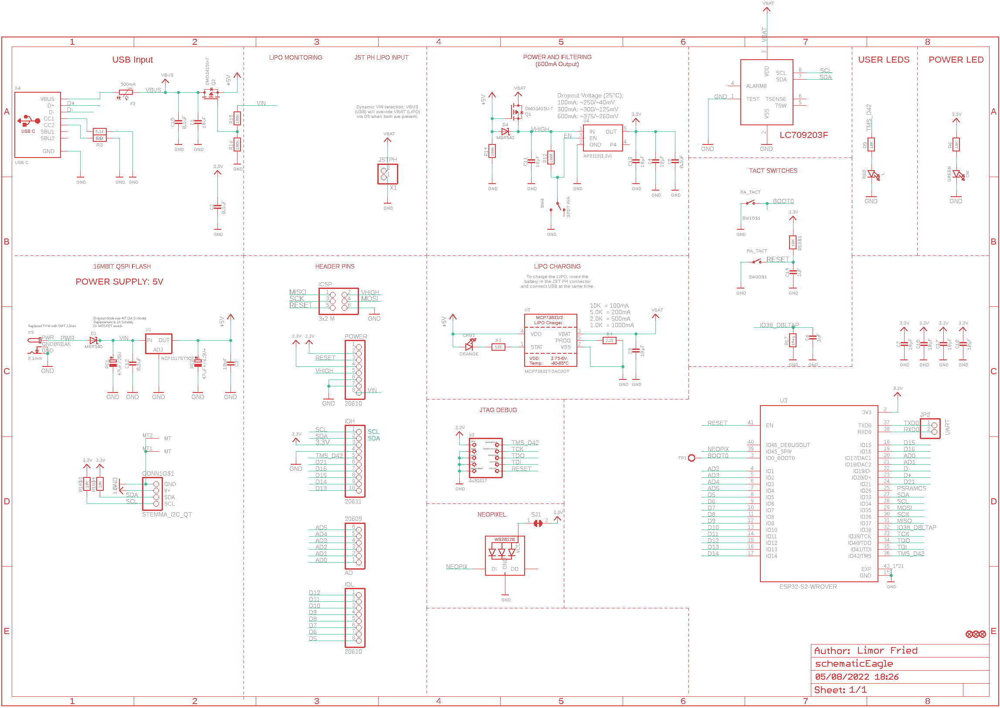
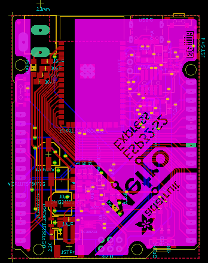
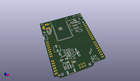
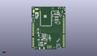
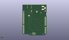
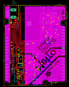
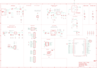

Contents
========

* [PRA4775 > Adafruit Metro ESP32 S2 PCB](#pra4775--adafruit-metro-esp32-s2-pcb)
	* [Schematic](#schematic)
	* [PCB](#pcb)
	* [Interactive BOM](#interactive-bom)
	* [OOMP Parts](#oomp-parts)
	* [Images](#images)
	* [Tags](#tags)
  
![][im]
# PRA4775 > Adafruit Metro ESP32 S2 PCB

- ID: PROJ-ADAF-4775-STAN-01
- Hex ID: PRA4775
- Name: Adafruit
- Description: Adafruit
- Long Link: [http://oom.lt/PROJ-ADAF-4775-STAN-01](http://oom.lt/PROJ-ADAF-4775-STAN-01)
- Short Link: [http://oom.lt/PRA4775](http://oom.lt/PRA4775)

## Schematic
  

## PCB
  

## Interactive BOM

- Interactive BOM page: [ibom.html](https://htmlpreview.github.io/?https://github.com/oomlout/oomlout_OOMP_projects/blob/main/PROJ-ADAF-4775-STAN-01/kicad/bom/ibom.html)

## OOMP Parts
  

|OOMP Parts|
| :---: |
|[AD HEAD-I01-X-PI06-01 2.54 mm 6 Pin Header](https://github.com/oomlout/oomlout_OOMP_parts/tree/main/HEAD-I01-X-PI06-01/)|
|[C1 CAPC-0805-X-UF10-V10 SMD (0805) 10 uF Capacitor (Ceramic) 10v](https://github.com/oomlout/oomlout_OOMP_parts/tree/main/CAPC-0805-X-UF10-V10/)|
|C2 C2,CAPC-0603-X-UF1D-01|
|[C3 CAPC-0805-X-UF10-V10 SMD (0805) 10 uF Capacitor (Ceramic) 10v](https://github.com/oomlout/oomlout_OOMP_parts/tree/main/CAPC-0805-X-UF10-V10/)|
|[C4 CAPC-0805-X-UF10-V10 SMD (0805) 10 uF Capacitor (Ceramic) 10v](https://github.com/oomlout/oomlout_OOMP_parts/tree/main/CAPC-0805-X-UF10-V10/)|
|C5 C5,CAPC-0603-X-UF1D-01|
|C6 C6,CAPC-0603-X-UF1-01|
|[C7 CAPC-0805-X-UF10-V10 SMD (0805) 10 uF Capacitor (Ceramic) 10v](https://github.com/oomlout/oomlout_OOMP_parts/tree/main/CAPC-0805-X-UF10-V10/)|
|[C8 CAPC-0805-X-UF10-V10 SMD (0805) 10 uF Capacitor (Ceramic) 10v](https://github.com/oomlout/oomlout_OOMP_parts/tree/main/CAPC-0805-X-UF10-V10/)|
|[C10 CAPC-0805-X-UF10-V10 SMD (0805) 10 uF Capacitor (Ceramic) 10v](https://github.com/oomlout/oomlout_OOMP_parts/tree/main/CAPC-0805-X-UF10-V10/)|
|[C11 CAPC-0805-X-UF10-V10 SMD (0805) 10 uF Capacitor (Ceramic) 10v](https://github.com/oomlout/oomlout_OOMP_parts/tree/main/CAPC-0805-X-UF10-V10/)|
|C12 C12,CAPC-0603-X-UF1D-01|
|[C13 CAPC-0805-X-UF10-V10 SMD (0805) 10 uF Capacitor (Ceramic) 10v](https://github.com/oomlout/oomlout_OOMP_parts/tree/main/CAPC-0805-X-UF10-V10/)|
|C14 C14,CAPC-0603-X-UF1-01|
|C15 C15,CAPC-0603-X-UF1D-01|
|[C17 CAPC-0805-X-UF10-V10 SMD (0805) 10 uF Capacitor (Ceramic) 10v](https://github.com/oomlout/oomlout_OOMP_parts/tree/main/CAPC-0805-X-UF10-V10/)|
|[C18 CAPC-0805-X-UF10-V10 SMD (0805) 10 uF Capacitor (Ceramic) 10v](https://github.com/oomlout/oomlout_OOMP_parts/tree/main/CAPC-0805-X-UF10-V10/)|
|[CHG1 LEDS-0603-G-STAN-01 SMD (0603) Green LED](https://github.com/oomlout/oomlout_OOMP_parts/tree/main/LEDS-0603-G-STAN-01/)|
|[CONN1 HEAD-I01-X-PI04-01 2.54 mm 4 Pin Header](https://github.com/oomlout/oomlout_OOMP_parts/tree/main/HEAD-I01-X-PI04-01/)|
|D1 D1,DIOD-S123-X-UNMATCHED-01|
|D4 D4,DIOD-S123-X-UNMATCHED-01|
|F2 F2,UNMATCHED-1206-X-UNMATCHED-01|
|IC2 IC2,UNMATCHED-UNMATCHED-X-UNMATCHED-01|
|ICSP ICSP,HEAD-I01-X-UNMATCHED-01|
|[IOH HEAD-I01-X-PI10-01 2.54 mm 10 Pin Header](https://github.com/oomlout/oomlout_OOMP_parts/tree/main/HEAD-I01-X-PI10-01/)|
|[IOL HEAD-I01-X-PI08-01 2.54 mm 8 Pin Header](https://github.com/oomlout/oomlout_OOMP_parts/tree/main/HEAD-I01-X-PI08-01/)|
|[JP2 HEAD-I01-X-PI02-01 2.54 mm 2 Pin Header](https://github.com/oomlout/oomlout_OOMP_parts/tree/main/HEAD-I01-X-PI02-01/)|
|[L LEDS-0603-G-STAN-01 SMD (0603) Green LED](https://github.com/oomlout/oomlout_OOMP_parts/tree/main/LEDS-0603-G-STAN-01/)|
|[LED1 LEDS-3535-RGB-K2812-01 SMD (3535) Smart Controller (WS2812B) RGB LED](https://github.com/oomlout/oomlout_OOMP_parts/tree/main/LEDS-3535-RGB-K2812-01/)|
|[ON LEDS-0603-G-STAN-01 SMD (0603) Green LED](https://github.com/oomlout/oomlout_OOMP_parts/tree/main/LEDS-0603-G-STAN-01/)|
|PC1 PC1,CAPX-UNMATCHED-X-UNMATCHED-01|
|PC2 PC2,CAPX-UNMATCHED-X-UNMATCHED-01|
|[POWER HEAD-I01-X-PI08-01 2.54 mm 8 Pin Header](https://github.com/oomlout/oomlout_OOMP_parts/tree/main/HEAD-I01-X-PI08-01/)|
|Q1 Q1,MOSP-SO23-X-UNMATCHED-01|
|Q2 Q2,MOSP-SO23-X-UNMATCHED-01|
|R1 R1,RESA-06038-X-O103X4-01|
|[R2 RESE-0603-X-O103-01 SMD (0603) 10k Ohm Resistor](https://github.com/oomlout/oomlout_OOMP_parts/tree/main/RESE-0603-X-O103-01/)|
|[R3 RESE-0603-X-O472-01 SMD (0603) 4.7k Ohm Resistor](https://github.com/oomlout/oomlout_OOMP_parts/tree/main/RESE-0603-X-O472-01/)|
|[R4 RESE-0603-X-O222-01 SMD (0603) 2.2k Ohm Resistor](https://github.com/oomlout/oomlout_OOMP_parts/tree/main/RESE-0603-X-O222-01/)|
|[R6 RESE-0603-X-O103-01 SMD (0603) 10k Ohm Resistor](https://github.com/oomlout/oomlout_OOMP_parts/tree/main/RESE-0603-X-O103-01/)|
|[R8 RESE-0603-X-O472-01 SMD (0603) 4.7k Ohm Resistor](https://github.com/oomlout/oomlout_OOMP_parts/tree/main/RESE-0603-X-O472-01/)|
|[R9 RESE-0603-X-O103-01 SMD (0603) 10k Ohm Resistor](https://github.com/oomlout/oomlout_OOMP_parts/tree/main/RESE-0603-X-O103-01/)|
|R12 R12,RESE-0603-X-O1003-01|
|R14 R14,RESE-0603-X-O1003-01|
|R15 R15,RESE-0603-X-O1003-01|
|R16 R16,RESE-0603-X-O1003-01|
|R17 R17,RESE-0603-X-UNMATCHED-01|
|SW1 SW1,UNMATCHED-UNMATCHED-X-UNMATCHED-01|
|SW3 SW3,UNMATCHED-UNMATCHED-X-UNMATCHED-01|
|SW4 SW4,UNMATCHED-UNMATCHED-X-UNMATCHED-01|
|TP1 TP1,UNMATCHED-UNMATCHED-X-UNMATCHED-01|
|U1 U1,UNMATCHED-UNMATCHED-X-UNMATCHED-01|
|U2 U2,UNMATCHED-SO235-X-UNMATCHED-01|
|U3 U3,UNMATCHED-UNMATCHED-X-UNMATCHED-01|
|U4 U4,UNMATCHED-SO235-X-UNMATCHED-01|
|X1 X1,UNMATCHED-UNMATCHED-X-UNMATCHED-01|
|X2 X2,UNMATCHED-UNMATCHED-X-UNMATCHED-01|
|X4 X4,UNMATCHED-UNMATCHED-X-UNMATCHED-01|
|X5 X5,UNMATCHED-UNMATCHED-X-UNMATCHED-01|

## Images
  
  

|kicadPcb3d|kicadPcb3dFront|kicadPcb3dBack|eagleImage|eagleSchemImage|
| :---: | :---: | :---: | :---: | :---: |
||||||

## Tags

- hexID: PRA4775
- oompType: PROJ
- oompSize: ADAF
- oompColor: 4775
- oompDesc: STAN
- oompIndex: 01
- oompName: Adafruit Metro ESP32 S2 PCB
- sources: All source files from https://github.com/adafruit/Adafruit-Metro-ESP32-S2-PCB (source licence details in srcLicense.md)
- linkBuyPage: http://www.adafruit.com/products/4775
- oompID: PROJ-ADAF-4775-STAN-01
- oompParts: AD,HEAD-I01-X-PI06-01
- oompParts: C1,CAPC-0805-X-UF10-V10
- oompParts: C2,CAPC-0603-X-UF1D-01
- oompParts: C3,CAPC-0805-X-UF10-V10
- oompParts: C4,CAPC-0805-X-UF10-V10
- oompParts: C5,CAPC-0603-X-UF1D-01
- oompParts: C6,CAPC-0603-X-UF1-01
- oompParts: C7,CAPC-0805-X-UF10-V10
- oompParts: C8,CAPC-0805-X-UF10-V10
- oompParts: C10,CAPC-0805-X-UF10-V10
- oompParts: C11,CAPC-0805-X-UF10-V10
- oompParts: C12,CAPC-0603-X-UF1D-01
- oompParts: C13,CAPC-0805-X-UF10-V10
- oompParts: C14,CAPC-0603-X-UF1-01
- oompParts: C15,CAPC-0603-X-UF1D-01
- oompParts: C17,CAPC-0805-X-UF10-V10
- oompParts: C18,CAPC-0805-X-UF10-V10
- oompParts: CHG1,LEDS-0603-G-STAN-01
- oompParts: CONN1,HEAD-I01-X-PI04-01
- oompParts: D1,DIOD-S123-X-UNMATCHED-01
- oompParts: D4,DIOD-S123-X-UNMATCHED-01
- oompParts: F2,UNMATCHED-1206-X-UNMATCHED-01
- oompParts: IC2,UNMATCHED-UNMATCHED-X-UNMATCHED-01
- oompParts: ICSP,HEAD-I01-X-UNMATCHED-01
- oompParts: IOH,HEAD-I01-X-PI10-01
- oompParts: IOL,HEAD-I01-X-PI08-01
- oompParts: JP2,HEAD-I01-X-PI02-01
- oompParts: L,LEDS-0603-G-STAN-01
- oompParts: LED1,LEDS-3535-RGB-K2812-01
- oompParts: ON,LEDS-0603-G-STAN-01
- oompParts: PC1,CAPX-UNMATCHED-X-UNMATCHED-01
- oompParts: PC2,CAPX-UNMATCHED-X-UNMATCHED-01
- oompParts: POWER,HEAD-I01-X-PI08-01
- oompParts: Q1,MOSP-SO23-X-UNMATCHED-01
- oompParts: Q2,MOSP-SO23-X-UNMATCHED-01
- oompParts: R1,RESA-06038-X-O103X4-01
- oompParts: R2,RESE-0603-X-O103-01
- oompParts: R3,RESE-0603-X-O472-01
- oompParts: R4,RESE-0603-X-O222-01
- oompParts: R6,RESE-0603-X-O103-01
- oompParts: R8,RESE-0603-X-O472-01
- oompParts: R9,RESE-0603-X-O103-01
- oompParts: R12,RESE-0603-X-O1003-01
- oompParts: R14,RESE-0603-X-O1003-01
- oompParts: R15,RESE-0603-X-O1003-01
- oompParts: R16,RESE-0603-X-O1003-01
- oompParts: R17,RESE-0603-X-UNMATCHED-01
- oompParts: SW1,UNMATCHED-UNMATCHED-X-UNMATCHED-01
- oompParts: SW3,UNMATCHED-UNMATCHED-X-UNMATCHED-01
- oompParts: SW4,UNMATCHED-UNMATCHED-X-UNMATCHED-01
- oompParts: TP1,UNMATCHED-UNMATCHED-X-UNMATCHED-01
- oompParts: U1,UNMATCHED-UNMATCHED-X-UNMATCHED-01
- oompParts: U2,UNMATCHED-SO235-X-UNMATCHED-01
- oompParts: U3,UNMATCHED-UNMATCHED-X-UNMATCHED-01
- oompParts: U4,UNMATCHED-SO235-X-UNMATCHED-01
- oompParts: X1,UNMATCHED-UNMATCHED-X-UNMATCHED-01
- oompParts: X2,UNMATCHED-UNMATCHED-X-UNMATCHED-01
- oompParts: X4,UNMATCHED-UNMATCHED-X-UNMATCHED-01
- oompParts: X5,UNMATCHED-UNMATCHED-X-UNMATCHED-01
- rawParts: AD,20609,HEADER-1X6OVALWAVE,1X06_OVALWAVE,PIN HEADER,,,,,,,,,
- rawParts: C1,10uF,CAP_CERAMIC0805-NOOUTLINE,0805-NO,Ceramic Capacitors,,,,,,,,,
- rawParts: C2,0.1uF,CAP_CERAMIC0603_NO,0603-NO,Ceramic Capacitors,,,,,,,,,
- rawParts: C3,10uF,CAP_CERAMIC0805-NOOUTLINE,0805-NO,Ceramic Capacitors,,,,,,,,,
- rawParts: C4,10µF,CAP_CERAMIC0805-NOOUTLINE,0805-NO,Ceramic Capacitors,,,,,,,,,
- rawParts: C5,0.1uF,CAP_CERAMIC0603_NO,0603-NO,Ceramic Capacitors,,,,,,,,,
- rawParts: C6,1uF,CAP_CERAMIC0603_NO,0603-NO,Ceramic Capacitors,,,,,,,,,
- rawParts: C7,10µF,CAP_CERAMIC0805-NOOUTLINE,0805-NO,Ceramic Capacitors,,,,,,,,,
- rawParts: C8,10µF,CAP_CERAMIC0805-NOOUTLINE,0805-NO,Ceramic Capacitors,,,,,,,,,
- rawParts: C10,10µF,CAP_CERAMIC0805-NOOUTLINE,0805-NO,Ceramic Capacitors,,,,,,,,,
- rawParts: C11,10µF,CAP_CERAMIC0805-NOOUTLINE,0805-NO,Ceramic Capacitors,,,,,,,,,
- rawParts: C12,0.1uF,CAP_CERAMIC0603_NO,0603-NO,Ceramic Capacitors,,,,,,,,,
- rawParts: C13,10µF,CAP_CERAMIC0805-NOOUTLINE,0805-NO,Ceramic Capacitors,,,,,,,,,
- rawParts: C14,1uF,CAP_CERAMIC0603_NO,0603-NO,Ceramic Capacitors,,,,,,,,,
- rawParts: C15,0.1uF,CAP_CERAMIC0603_NO,0603-NO,Ceramic Capacitors,,,,,,,,,
- rawParts: C17,10µF,CAP_CERAMIC0805-NOOUTLINE,0805-NO,Ceramic Capacitors,,,,,,,,,
- rawParts: C18,10µF,CAP_CERAMIC0805-NOOUTLINE,0805-NO,Ceramic Capacitors,,,,,,,,,
- rawParts: CHG1,ORANGE,LED0603_NOOUTLINE,CHIPLED_0603_NOOUTLINE,LED,,,,,,,,,
- rawParts: CONN1,STEMMA_I2C_QT,STEMMA_I2C_QT,JST_SH4,,,,,,,,,,
- rawParts: D1,MBR540,DIODE-SCHOTTKYSOD-123,SOD-123,,,,,,,,,,
- rawParts: D4,MBR540,DIODE-SCHOTTKYSOD-123,SOD-123,,,,,,,,,,
- rawParts: F2,500mA,PTC1206,1206,PTC (Resettable Fuse),,,,,,,,,
- rawParts: FD1,FIDUCIAL_1MM,FIDUCIAL_1MM,FIDUCIAL_1MM,Fiducial Alignment Points,,EXCLUDE,,,,,,,
- rawParts: FD2,FIDUCIAL_1MM,FIDUCIAL_1MM,FIDUCIAL_1MM,Fiducial Alignment Points,,EXCLUDE,,,,,,,
- rawParts: FD3,FIDUCIAL_1MM,FIDUCIAL_1MM,FIDUCIAL_1MM,Fiducial Alignment Points,,EXCLUDE,,,,,,,
- rawParts: IC2,LC709203F,LC709203F,WDFN8_3X4_0.65,,,,,,,,,,
- rawParts: ICSP,3x2 M,HEADER-2X3,2X03_ROUND_70MIL,PIN HEADER,,,,,,,,,
- rawParts: IOH,20611,HEADER-1X10OVALWAVE,1X10_OVALWAVE,PIN HEADER,,,,,,,,,
- rawParts: IOL,20610,HEADER-1X8OVALWAVE,1X08_OVALWAVE,PIN HEADER,,,,,,,,,
- rawParts: JP2,UART,HEADER-1X2ROUND,1X02_ROUND,PIN HEADER,,,,,,,,,
- rawParts: L,RED,LED0603_NOOUTLINE,CHIPLED_0603_NOOUTLINE,LED,,,,,,,,,
- rawParts: LED1,WS2812B3535,WS2812B3535,LED3535,,,,,,,,,,
- rawParts: ON,GREEN,LED0603_NOOUTLINE,CHIPLED_0603_NOOUTLINE,LED,,,,,,,,,
- rawParts: PC1,47uF/25V,CAP_ELECTROLYTICPANASONIC_D,PANASONIC_D,Electrolytic Capacitors,,,,,,,,,
- rawParts: PC2,47uF+/6.3V+,CAP_ELECTROLYTICPANASONIC_D,PANASONIC_D,Electrolytic Capacitors,,,,,,,,,
- rawParts: POWER,20610,HEADER-1X8OVALWAVE,1X08_OVALWAVE,PIN HEADER,,,,,,,,,
- rawParts: Q1,DMG3415U-7,MOSFET-P,SOT23-R,P-Channel Mosfet,,,,,,,,,
- rawParts: Q2,DMG3415U-7,MOSFET-P,SOT23-R,P-Channel Mosfet,,,,,,,,,
- rawParts: R1,10K,RESISTOR_4PACK,RESPACK_4X0603,Resistor Packs (4 resistors),,,,,,,,,
- rawParts: R2,10K,RESISTOR_0603_NOOUT,0603-NO,Resistors,,,,,,,,,
- rawParts: R3,5.1K,RESISTOR_0603_NOOUT,0603-NO,Resistors,,,,,,,,,
- rawParts: R4,2.2K,RESISTOR_0603_NOOUT,0603-NO,Resistors,,,,,,,,,
- rawParts: R6,10K,RESISTOR_0603_NOOUT,0603-NO,Resistors,,,,,,,,,
- rawParts: R8,5.1K,RESISTOR_0603_NOOUT,0603-NO,Resistors,,,,,,,,,
- rawParts: R9,10K,RESISTOR_0603_NOOUT,0603-NO,Resistors,,,,,,,,,
- rawParts: R12,100K,RESISTOR_0603_NOOUT,0603-NO,Resistors,,,,,,,,,
- rawParts: R14,100k,RESISTOR_0603_NOOUT,0603-NO,Resistors,,,,,,,,,
- rawParts: R15,100K,RESISTOR_0603_NOOUT,0603-NO,Resistors,,,,,,,,,
- rawParts: R16,100K,RESISTOR_0603_NOOUT,0603-NO,Resistors,,,,,,,,,
- rawParts: R17,1Meg,RESISTOR_0603_NOOUT,0603-NO,Resistors,,,,,,,,,
- rawParts: SJ1,,SOLDERJUMPER_CLOSED,SOLDERJUMPER_CLOSEDWIRE,Solder Jumper - Closed,,,,,,,,,
- rawParts: SW1,RA_TACT,SWITCH_SPST_TACT_RA,SPST_TACTILE_RA,Switch - SPST,,,,,,,,,
- rawParts: SW3,RA_TACT,SWITCH_SPST_TACT_RA,SPST_TACTILE_RA,Switch - SPST,,,,,,,,,
- rawParts: SW4,SPDT R/A,SWITCH_SPDT,SPDT_SMT_SSSS811101,Switch - SPDT,,,,,,,,,
- rawParts: TP1,,TESTPOINTROUND1.5MMNO,TESTPOINT_ROUND_1.5MM_NO,Test Point,,,,,,,,,
- rawParts: U1,NCP1117ST50T3G,LM1117SOT223-REFLOW,SOT223-R,LM1117 Voltage Regulator,,,,,,,,,
- rawParts: U2,MCP73831T-2ACI/OT,MCP73831/2,SOT23-5,MCP73831/2 LIPO Charger,,,,,,,,,
- rawParts: U3,ESP32-S2-WROVER,ESP32-S2-WROVER,MODULE_ESP32-S2-WROVER,WiFi 802.11b/g/n Transceiver Module 2.4GHz Antenna Not Included Surface Mount Check prices,Warning,, WiFi 802.11b/g/n Transceiver Module 2.4GHz Antenna Not Included Surface Mount ,https://snapeda.com/shop?store=DigiKey&id=4614060,Espressif Systems,ESP32-S2-WROVER,VFQFN-56 Espressif Systems,None,
- rawParts: U4,AP2112(3.3V),VREG_SOT23-5,SOT23-5,SOT23-5 Fixed Voltage Regulators,,,,,,,,,
- rawParts: X1,JSTPH,CON_JST_PH_2PIN_BATT,JSTPH2_BATT,JST 2-Pin Right-Angle Connector,,,,,,,,,
- rawParts: X2,4u20317,JTAG-CORTEXBOXPOSTS,2X05_1.27MM_BOX_POSTS,Serial Wire (SW-DP) Connector,,,,,,,,,
- rawParts: X4,USB C,USB_C,USB_C_CUSB31-CFM2AX-01-X,USB Type-C USB 2.0 Connector,,,,,,,,,
- rawParts: X5,2.1mm,DCBARRELPTH,DCJACK_2MM_PTH,DC Barrel Jack,,,,,,,,,

[im]: kicadPcb3d_450.png
