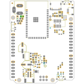
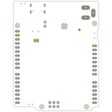
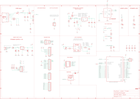

Contents
========

* [PRA4775 > Adafruit Metro ESP32 S2 PCB](#pra4775--adafruit-metro-esp32-s2-pcb)
	* [Schematic](#schematic)
	* [PCB](#pcb)
	* [Interactive BOM](#interactive-bom)
	* [OOMP Parts](#oomp-parts)
	* [Images](#images)
	* [Tags](#tags)
  
![][im]
# PRA4775 > Adafruit Metro ESP32 S2 PCB

- ID: PROJ-ADAF-4775-STAN-01
- Hex ID: PRA4775
- Name: Adafruit
- Description: Adafruit
- Long Link: [http://oom.lt/PROJ-ADAF-4775-STAN-01](http://oom.lt/PROJ-ADAF-4775-STAN-01)
- Short Link: [http://oom.lt/PRA4775](http://oom.lt/PRA4775)

## Schematic
  

## PCB
  

## Interactive BOM

- Interactive BOM page: [ibom.html](https://htmlpreview.github.io/?https://github.com/oomlout/oomlout_OOMP_projects/blob/main/PROJ-ADAF-4775-STAN-01/kicad/bom/ibom.html)

## OOMP Parts
  

|OOMP Parts|
| :---: |
|[HEAD-I01-X-PI06-01  2.54 mm 6 Pin Header  AD](https://github.com/oomlout/oomlout_OOMP_parts/tree/main/HEAD-I01-X-PI06-01/)|
|[CAPC-0805-X-UF10-V10  SMD (0805) 10 uF Capacitor (Ceramic) 10v  C1, C3, C4, C7, C8, C10, C11, C13, C17, C18](https://github.com/oomlout/oomlout_OOMP_parts/tree/main/CAPC-0805-X-UF10-V10/)|
|[CAPC-0603-X-NF100-V50  SMD (0603) 100 nF Capacitor (Ceramic) 50v  C2, C5, C12, C15](https://github.com/oomlout/oomlout_OOMP_parts/tree/main/CAPC-0603-X-NF100-V50/)|
|[CAPC-0603-X-UF1-V25  SMD (0603) 1 uF Capacitor (Ceramic) 25v  C6, C14](https://github.com/oomlout/oomlout_OOMP_parts/tree/main/CAPC-0603-X-UF1-V25/)|
|LEDS-0603-O-STAN-01 CHG1|
|HEAD-I01-X-UNMATCHED-01 CONN1|
|DIOD-S123-X-UNMATCHED-01 D1, D4|
|UNMATCHED-1206-X-UNMATCHED-01 F2|
|UNMATCHED-UNMATCHED-X-UNMATCHED-01 IC2, SW1, SW3, SW4, U1, U3, X1, X2, X4, X5|
|[HEAD-I01-X-PI2X03-01  2.54 mm 6 Pin (2x3) Header  ICSP](https://github.com/oomlout/oomlout_OOMP_parts/tree/main/HEAD-I01-X-PI2X03-01/)|
|[HEAD-I01-X-PI10-01  2.54 mm 10 Pin Header  IOH](https://github.com/oomlout/oomlout_OOMP_parts/tree/main/HEAD-I01-X-PI10-01/)|
|[HEAD-I01-X-PI08-01  2.54 mm 8 Pin Header  IOL, POWER](https://github.com/oomlout/oomlout_OOMP_parts/tree/main/HEAD-I01-X-PI08-01/)|
|[HEAD-I01-X-PI02-01  2.54 mm 2 Pin Header  JP2](https://github.com/oomlout/oomlout_OOMP_parts/tree/main/HEAD-I01-X-PI02-01/)|
|[LEDS-0603-R-STAN-01  SMD (0603) Red LED  L](https://github.com/oomlout/oomlout_OOMP_parts/tree/main/LEDS-0603-R-STAN-01/)|
|[LEDS-3535-RGB-K2812-01  SMD (3535) Smart Controller (WS2812B) RGB LED  LED1](https://github.com/oomlout/oomlout_OOMP_parts/tree/main/LEDS-3535-RGB-K2812-01/)|
|[LEDS-0603-G-STAN-01  SMD (0603) Green LED  ON](https://github.com/oomlout/oomlout_OOMP_parts/tree/main/LEDS-0603-G-STAN-01/)|
|[CAPE-PAND-X-UF47-V25  SMD (6.3 mm) (Panasonic D) 47 uF Capacitor (Electrolytic) 25v  PC1](https://github.com/oomlout/oomlout_OOMP_parts/tree/main/CAPE-PAND-X-UF47-V25/)|
|CAPE-PAND-X-UF47-V63D PC2|
|MOSP-SO23-X-UNMATCHED-01 Q1, Q2|
|RESA-06038-X-O103X4-01 R1|
|[RESE-0603-X-O103-01  SMD (0603) 10k Ohm Resistor  R2, R6, R9](https://github.com/oomlout/oomlout_OOMP_parts/tree/main/RESE-0603-X-O103-01/)|
|[RESE-0603-X-O472-01  SMD (0603) 4.7k Ohm Resistor  R3, R8](https://github.com/oomlout/oomlout_OOMP_parts/tree/main/RESE-0603-X-O472-01/)|
|[RESE-0603-X-O222-01  SMD (0603) 2.2k Ohm Resistor  R4](https://github.com/oomlout/oomlout_OOMP_parts/tree/main/RESE-0603-X-O222-01/)|
|RESE-0603-X-O1003-01 R12, R14, R15, R16|
|RESE-0603-X-UNMATCHED-01 R17|
|UNMATCHED-SO235-X-UNMATCHED-01 U2, U4|

## Images
  
  

|bominteractivefront|bominteractiveback|kicadPcb3d|kicadPcb3dFront|kicadPcb3dBack|eagleImage|eagleSchemImage|
| :---: | :---: | :---: | :---: | :---: | :---: | :---: |
||||||||

## Tags

- hexID: PRA4775
- oompType: PROJ
- oompSize: ADAF
- oompColor: 4775
- oompDesc: STAN
- oompIndex: 01
- oompName: Adafruit Metro ESP32 S2 PCB
- sources: All source files from https://github.com/adafruit/Adafruit-Metro-ESP32-S2-PCB (source licence details in srcLicense.md)
- linkBuyPage: http://www.adafruit.com/products/4775
- oompID: PROJ-ADAF-4775-STAN-01
- oompParts: AD,HEAD-I01-X-PI06-01
- oompParts: C1,CAPC-0805-X-UF10-V10
- oompParts: C2,CAPC-0603-X-NF100-V50
- oompParts: C3,CAPC-0805-X-UF10-V10
- oompParts: C4,CAPC-0805-X-UF10-V10
- oompParts: C5,CAPC-0603-X-NF100-V50
- oompParts: C6,CAPC-0603-X-UF1-V25
- oompParts: C7,CAPC-0805-X-UF10-V10
- oompParts: C8,CAPC-0805-X-UF10-V10
- oompParts: C10,CAPC-0805-X-UF10-V10
- oompParts: C11,CAPC-0805-X-UF10-V10
- oompParts: C12,CAPC-0603-X-NF100-V50
- oompParts: C13,CAPC-0805-X-UF10-V10
- oompParts: C14,CAPC-0603-X-UF1-V25
- oompParts: C15,CAPC-0603-X-NF100-V50
- oompParts: C17,CAPC-0805-X-UF10-V10
- oompParts: C18,CAPC-0805-X-UF10-V10
- oompParts: CHG1,LEDS-0603-O-STAN-01
- oompParts: CONN1,HEAD-I01-X-UNMATCHED-01
- oompParts: D1,DIOD-S123-X-UNMATCHED-01
- oompParts: D4,DIOD-S123-X-UNMATCHED-01
- oompParts: F2,UNMATCHED-1206-X-UNMATCHED-01
- oompParts: IC2,UNMATCHED-UNMATCHED-X-UNMATCHED-01
- oompParts: ICSP,HEAD-I01-X-PI2X03-01
- oompParts: IOH,HEAD-I01-X-PI10-01
- oompParts: IOL,HEAD-I01-X-PI08-01
- oompParts: JP2,HEAD-I01-X-PI02-01
- oompParts: L,LEDS-0603-R-STAN-01
- oompParts: LED1,LEDS-3535-RGB-K2812-01
- oompParts: ON,LEDS-0603-G-STAN-01
- oompParts: PC1,CAPE-PAND-X-UF47-V25
- oompParts: PC2,CAPE-PAND-X-UF47-V63D
- oompParts: POWER,HEAD-I01-X-PI08-01
- oompParts: Q1,MOSP-SO23-X-UNMATCHED-01
- oompParts: Q2,MOSP-SO23-X-UNMATCHED-01
- oompParts: R1,RESA-06038-X-O103X4-01
- oompParts: R2,RESE-0603-X-O103-01
- oompParts: R3,RESE-0603-X-O472-01
- oompParts: R4,RESE-0603-X-O222-01
- oompParts: R6,RESE-0603-X-O103-01
- oompParts: R8,RESE-0603-X-O472-01
- oompParts: R9,RESE-0603-X-O103-01
- oompParts: R12,RESE-0603-X-O1003-01
- oompParts: R14,RESE-0603-X-O1003-01
- oompParts: R15,RESE-0603-X-O1003-01
- oompParts: R16,RESE-0603-X-O1003-01
- oompParts: R17,RESE-0603-X-UNMATCHED-01
- oompParts: SW1,UNMATCHED-UNMATCHED-X-UNMATCHED-01
- oompParts: SW3,UNMATCHED-UNMATCHED-X-UNMATCHED-01
- oompParts: SW4,UNMATCHED-UNMATCHED-X-UNMATCHED-01
- oompParts: U1,UNMATCHED-UNMATCHED-X-UNMATCHED-01
- oompParts: U2,UNMATCHED-SO235-X-UNMATCHED-01
- oompParts: U3,UNMATCHED-UNMATCHED-X-UNMATCHED-01
- oompParts: U4,UNMATCHED-SO235-X-UNMATCHED-01
- oompParts: X1,UNMATCHED-UNMATCHED-X-UNMATCHED-01
- oompParts: X2,UNMATCHED-UNMATCHED-X-UNMATCHED-01
- oompParts: X4,UNMATCHED-UNMATCHED-X-UNMATCHED-01
- oompParts: X5,UNMATCHED-UNMATCHED-X-UNMATCHED-01
- rawParts: AD,20609,HEADER-1X6OVALWAVE,1X06_OVALWAVE,PIN HEADER,,,,,,,,,
- rawParts: C1,10uF,CAP_CERAMIC0805-NOOUTLINE,0805-NO,Ceramic Capacitors,,,,,,,,,
- rawParts: C2,0.1uF,CAP_CERAMIC0603_NO,0603-NO,Ceramic Capacitors,,,,,,,,,
- rawParts: C3,10uF,CAP_CERAMIC0805-NOOUTLINE,0805-NO,Ceramic Capacitors,,,,,,,,,
- rawParts: C4,10µF,CAP_CERAMIC0805-NOOUTLINE,0805-NO,Ceramic Capacitors,,,,,,,,,
- rawParts: C5,0.1uF,CAP_CERAMIC0603_NO,0603-NO,Ceramic Capacitors,,,,,,,,,
- rawParts: C6,1uF,CAP_CERAMIC0603_NO,0603-NO,Ceramic Capacitors,,,,,,,,,
- rawParts: C7,10µF,CAP_CERAMIC0805-NOOUTLINE,0805-NO,Ceramic Capacitors,,,,,,,,,
- rawParts: C8,10µF,CAP_CERAMIC0805-NOOUTLINE,0805-NO,Ceramic Capacitors,,,,,,,,,
- rawParts: C10,10µF,CAP_CERAMIC0805-NOOUTLINE,0805-NO,Ceramic Capacitors,,,,,,,,,
- rawParts: C11,10µF,CAP_CERAMIC0805-NOOUTLINE,0805-NO,Ceramic Capacitors,,,,,,,,,
- rawParts: C12,0.1uF,CAP_CERAMIC0603_NO,0603-NO,Ceramic Capacitors,,,,,,,,,
- rawParts: C13,10µF,CAP_CERAMIC0805-NOOUTLINE,0805-NO,Ceramic Capacitors,,,,,,,,,
- rawParts: C14,1uF,CAP_CERAMIC0603_NO,0603-NO,Ceramic Capacitors,,,,,,,,,
- rawParts: C15,0.1uF,CAP_CERAMIC0603_NO,0603-NO,Ceramic Capacitors,,,,,,,,,
- rawParts: C17,10µF,CAP_CERAMIC0805-NOOUTLINE,0805-NO,Ceramic Capacitors,,,,,,,,,
- rawParts: C18,10µF,CAP_CERAMIC0805-NOOUTLINE,0805-NO,Ceramic Capacitors,,,,,,,,,
- rawParts: CHG1,ORANGE,LED0603_NOOUTLINE,CHIPLED_0603_NOOUTLINE,LED,,,,,,,,,
- rawParts: CONN1,STEMMA_I2C_QT,STEMMA_I2C_QT,JST_SH4,,,,,,,,,,
- rawParts: D1,MBR540,DIODE-SCHOTTKYSOD-123,SOD-123,,,,,,,,,,
- rawParts: D4,MBR540,DIODE-SCHOTTKYSOD-123,SOD-123,,,,,,,,,,
- rawParts: F2,500mA,PTC1206,1206,PTC (Resettable Fuse),,,,,,,,,
- rawParts: FD1,FIDUCIAL_1MM,FIDUCIAL_1MM,FIDUCIAL_1MM,Fiducial Alignment Points,,EXCLUDE,,,,,,,
- rawParts: FD2,FIDUCIAL_1MM,FIDUCIAL_1MM,FIDUCIAL_1MM,Fiducial Alignment Points,,EXCLUDE,,,,,,,
- rawParts: FD3,FIDUCIAL_1MM,FIDUCIAL_1MM,FIDUCIAL_1MM,Fiducial Alignment Points,,EXCLUDE,,,,,,,
- rawParts: IC2,LC709203F,LC709203F,WDFN8_3X4_0.65,,,,,,,,,,
- rawParts: ICSP,3x2 M,HEADER-2X3,2X03_ROUND_70MIL,PIN HEADER,,,,,,,,,
- rawParts: IOH,20611,HEADER-1X10OVALWAVE,1X10_OVALWAVE,PIN HEADER,,,,,,,,,
- rawParts: IOL,20610,HEADER-1X8OVALWAVE,1X08_OVALWAVE,PIN HEADER,,,,,,,,,
- rawParts: JP2,UART,HEADER-1X2ROUND,1X02_ROUND,PIN HEADER,,,,,,,,,
- rawParts: L,RED,LED0603_NOOUTLINE,CHIPLED_0603_NOOUTLINE,LED,,,,,,,,,
- rawParts: LED1,WS2812B3535,WS2812B3535,LED3535,,,,,,,,,,
- rawParts: ON,GREEN,LED0603_NOOUTLINE,CHIPLED_0603_NOOUTLINE,LED,,,,,,,,,
- rawParts: PC1,47uF/25V,CAP_ELECTROLYTICPANASONIC_D,PANASONIC_D,Electrolytic Capacitors,,,,,,,,,
- rawParts: PC2,47uF+/6.3V+,CAP_ELECTROLYTICPANASONIC_D,PANASONIC_D,Electrolytic Capacitors,,,,,,,,,
- rawParts: POWER,20610,HEADER-1X8OVALWAVE,1X08_OVALWAVE,PIN HEADER,,,,,,,,,
- rawParts: Q1,DMG3415U-7,MOSFET-P,SOT23-R,P-Channel Mosfet,,,,,,,,,
- rawParts: Q2,DMG3415U-7,MOSFET-P,SOT23-R,P-Channel Mosfet,,,,,,,,,
- rawParts: R1,10K,RESISTOR_4PACK,RESPACK_4X0603,Resistor Packs (4 resistors),,,,,,,,,
- rawParts: R2,10K,RESISTOR_0603_NOOUT,0603-NO,Resistors,,,,,,,,,
- rawParts: R3,5.1K,RESISTOR_0603_NOOUT,0603-NO,Resistors,,,,,,,,,
- rawParts: R4,2.2K,RESISTOR_0603_NOOUT,0603-NO,Resistors,,,,,,,,,
- rawParts: R6,10K,RESISTOR_0603_NOOUT,0603-NO,Resistors,,,,,,,,,
- rawParts: R8,5.1K,RESISTOR_0603_NOOUT,0603-NO,Resistors,,,,,,,,,
- rawParts: R9,10K,RESISTOR_0603_NOOUT,0603-NO,Resistors,,,,,,,,,
- rawParts: R12,100K,RESISTOR_0603_NOOUT,0603-NO,Resistors,,,,,,,,,
- rawParts: R14,100k,RESISTOR_0603_NOOUT,0603-NO,Resistors,,,,,,,,,
- rawParts: R15,100K,RESISTOR_0603_NOOUT,0603-NO,Resistors,,,,,,,,,
- rawParts: R16,100K,RESISTOR_0603_NOOUT,0603-NO,Resistors,,,,,,,,,
- rawParts: R17,1Meg,RESISTOR_0603_NOOUT,0603-NO,Resistors,,,,,,,,,
- rawParts: SJ1,,SOLDERJUMPER_CLOSED,SOLDERJUMPER_CLOSEDWIRE,Solder Jumper - Closed,,,,,,,,,
- rawParts: SW1,RA_TACT,SWITCH_SPST_TACT_RA,SPST_TACTILE_RA,Switch - SPST,,,,,,,,,
- rawParts: SW3,RA_TACT,SWITCH_SPST_TACT_RA,SPST_TACTILE_RA,Switch - SPST,,,,,,,,,
- rawParts: SW4,SPDT R/A,SWITCH_SPDT,SPDT_SMT_SSSS811101,Switch - SPDT,,,,,,,,,
- rawParts: TP1,,TESTPOINTROUND1.5MMNO,TESTPOINT_ROUND_1.5MM_NO,Test Point,,,,,,,,,
- rawParts: U1,NCP1117ST50T3G,LM1117SOT223-REFLOW,SOT223-R,LM1117 Voltage Regulator,,,,,,,,,
- rawParts: U2,MCP73831T-2ACI/OT,MCP73831/2,SOT23-5,MCP73831/2 LIPO Charger,,,,,,,,,
- rawParts: U3,ESP32-S2-WROVER,ESP32-S2-WROVER,MODULE_ESP32-S2-WROVER,WiFi 802.11b/g/n Transceiver Module 2.4GHz Antenna Not Included Surface Mount Check prices,Warning,, WiFi 802.11b/g/n Transceiver Module 2.4GHz Antenna Not Included Surface Mount ,https://snapeda.com/shop?store=DigiKey&id=4614060,Espressif Systems,ESP32-S2-WROVER,VFQFN-56 Espressif Systems,None,
- rawParts: U4,AP2112(3.3V),VREG_SOT23-5,SOT23-5,SOT23-5 Fixed Voltage Regulators,,,,,,,,,
- rawParts: X1,JSTPH,CON_JST_PH_2PIN_BATT,JSTPH2_BATT,JST 2-Pin Right-Angle Connector,,,,,,,,,
- rawParts: X2,4u20317,JTAG-CORTEXBOXPOSTS,2X05_1.27MM_BOX_POSTS,Serial Wire (SW-DP) Connector,,,,,,,,,
- rawParts: X4,USB C,USB_C,USB_C_CUSB31-CFM2AX-01-X,USB Type-C USB 2.0 Connector,,,,,,,,,
- rawParts: X5,2.1mm,DCBARRELPTH,DCJACK_2MM_PTH,DC Barrel Jack,,,,,,,,,

[im]: kicadPcb3d_450.png
