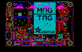

Contents
========

* [PROJ-ADAF-4800-STAN-01>Adafruit_MagTag_PCBs](#proj-adaf-4800-stan-01adafruit_magtag_pcbs)
	* [Images](#images)
	* [Interactive BOM](#interactive-bom)
	* [OOMP Parts](#oomp-parts)
	* [Tags](#tags)
  
![][im]
# PROJ-ADAF-4800-STAN-01>Adafruit_MagTag_PCBs

- ID: PROJ-ADAF-4800-STAN-01
- Hex ID: PRA4800
- Name: Adafruit_MagTag_PCBs
- Description: 

## Images
  
  

|eagleImage|
| :---: |
||

## Interactive BOM

- Interactive BOM page: [ibom.html](kicad/bom/ibom.html)

## OOMP Parts
  

|OOMP Parts|
| :---: |
|<table><tr><td></td><td> C1</td><td>[CAPC-0805-X-UF10-V25 SMD (0805) 10 uF Capacitor (Ceramic) 25v](https://github.com/oomlout/oomlout_OOMP_parts/tree/main/CAPC-0805-X-UF10-V25/)</td><td>[C85U010](https://github.com/oomlout/oomlout_OOMP_parts/tree/main/CAPC-0805-X-UF10-V25/)</td></tr></table>|
|<table><tr><td></td><td> C2</td><td>[CAPC-0603-X-NF100-V50 SMD (0603) 100 nF Capacitor (Ceramic) 50v](https://github.com/oomlout/oomlout_OOMP_parts/tree/main/CAPC-0603-X-NF100-V50/)</td><td>[C6N100](https://github.com/oomlout/oomlout_OOMP_parts/tree/main/CAPC-0603-X-NF100-V50/)</td></tr></table>|
|<table><tr><td></td><td> C3</td><td>[CAPC-0805-X-UF10-V25 SMD (0805) 10 uF Capacitor (Ceramic) 25v](https://github.com/oomlout/oomlout_OOMP_parts/tree/main/CAPC-0805-X-UF10-V25/)</td><td>[C85U010](https://github.com/oomlout/oomlout_OOMP_parts/tree/main/CAPC-0805-X-UF10-V25/)</td></tr></table>|
|<table><tr><td></td><td> C4</td><td>[CAPC-0805-X-UF10-V25 SMD (0805) 10 uF Capacitor (Ceramic) 25v](https://github.com/oomlout/oomlout_OOMP_parts/tree/main/CAPC-0805-X-UF10-V25/)</td><td>[C85U010](https://github.com/oomlout/oomlout_OOMP_parts/tree/main/CAPC-0805-X-UF10-V25/)</td></tr></table>|
|<table><tr><td></td><td> C5</td><td>[CAPC-0603-X-NF100-V50 SMD (0603) 100 nF Capacitor (Ceramic) 50v](https://github.com/oomlout/oomlout_OOMP_parts/tree/main/CAPC-0603-X-NF100-V50/)</td><td>[C6N100](https://github.com/oomlout/oomlout_OOMP_parts/tree/main/CAPC-0603-X-NF100-V50/)</td></tr></table>|
|CAPC-0603-X-UNMATCHED-01, C6, 28.194000000000003, 33.0835, 90,C6, 1uF, 0603-NO, microbuilder, (1.11, 1.3025), R90|
|<table><tr><td></td><td> C7</td><td>[CAPC-0805-X-UF10-V25 SMD (0805) 10 uF Capacitor (Ceramic) 25v](https://github.com/oomlout/oomlout_OOMP_parts/tree/main/CAPC-0805-X-UF10-V25/)</td><td>[C85U010](https://github.com/oomlout/oomlout_OOMP_parts/tree/main/CAPC-0805-X-UF10-V25/)</td></tr></table>|
|<table><tr><td></td><td> C8</td><td>[CAPC-0805-X-UF10-V25 SMD (0805) 10 uF Capacitor (Ceramic) 25v](https://github.com/oomlout/oomlout_OOMP_parts/tree/main/CAPC-0805-X-UF10-V25/)</td><td>[C85U010](https://github.com/oomlout/oomlout_OOMP_parts/tree/main/CAPC-0805-X-UF10-V25/)</td></tr></table>|
|ERROR, C9 10uF/10V+ 0805-NO, 0, 0, 0,C9, 10uF/10V+, 0805-NO, microbuilder, (2.58346457, 1.42984252), R180|
|<table><tr><td></td><td> C10</td><td>[CAPC-0805-X-UF10-V25 SMD (0805) 10 uF Capacitor (Ceramic) 25v](https://github.com/oomlout/oomlout_OOMP_parts/tree/main/CAPC-0805-X-UF10-V25/)</td><td>[C85U010](https://github.com/oomlout/oomlout_OOMP_parts/tree/main/CAPC-0805-X-UF10-V25/)</td></tr></table>|
|<table><tr><td></td><td> C11</td><td>[CAPC-0805-X-UF10-V25 SMD (0805) 10 uF Capacitor (Ceramic) 25v](https://github.com/oomlout/oomlout_OOMP_parts/tree/main/CAPC-0805-X-UF10-V25/)</td><td>[C85U010](https://github.com/oomlout/oomlout_OOMP_parts/tree/main/CAPC-0805-X-UF10-V25/)</td></tr></table>|
|CAPC-0603-X-UNMATCHED-01, C12, 68.8975, 47.751999999999995, 0,C12, 1uF, 0603-NO, microbuilder, (2.7125, 1.88), R0|
|<table><tr><td></td><td> C13</td><td>[CAPC-0805-X-UF10-V25 SMD (0805) 10 uF Capacitor (Ceramic) 25v](https://github.com/oomlout/oomlout_OOMP_parts/tree/main/CAPC-0805-X-UF10-V25/)</td><td>[C85U010](https://github.com/oomlout/oomlout_OOMP_parts/tree/main/CAPC-0805-X-UF10-V25/)</td></tr></table>|
|CAPC-0603-X-UNMATCHED-01, C14, 2.794, 20.2565, 270,C14, 1uF, 0603-NO, microbuilder, (0.11, 0.7975), R270|
|<table><tr><td></td><td> C15</td><td>[CAPC-0603-X-NF100-V50 SMD (0603) 100 nF Capacitor (Ceramic) 50v](https://github.com/oomlout/oomlout_OOMP_parts/tree/main/CAPC-0603-X-NF100-V50/)</td><td>[C6N100](https://github.com/oomlout/oomlout_OOMP_parts/tree/main/CAPC-0603-X-NF100-V50/)</td></tr></table>|
|<table><tr><td></td><td> C16</td><td>[CAPC-0603-X-NF100-V50 SMD (0603) 100 nF Capacitor (Ceramic) 50v](https://github.com/oomlout/oomlout_OOMP_parts/tree/main/CAPC-0603-X-NF100-V50/)</td><td>[C6N100](https://github.com/oomlout/oomlout_OOMP_parts/tree/main/CAPC-0603-X-NF100-V50/)</td></tr></table>|
|<table><tr><td></td><td> C17</td><td>[CAPC-0805-X-UF10-V25 SMD (0805) 10 uF Capacitor (Ceramic) 25v](https://github.com/oomlout/oomlout_OOMP_parts/tree/main/CAPC-0805-X-UF10-V25/)</td><td>[C85U010](https://github.com/oomlout/oomlout_OOMP_parts/tree/main/CAPC-0805-X-UF10-V25/)</td></tr></table>|
|<table><tr><td></td><td> C18</td><td>[CAPC-0805-X-UF10-V25 SMD (0805) 10 uF Capacitor (Ceramic) 25v](https://github.com/oomlout/oomlout_OOMP_parts/tree/main/CAPC-0805-X-UF10-V25/)</td><td>[C85U010](https://github.com/oomlout/oomlout_OOMP_parts/tree/main/CAPC-0805-X-UF10-V25/)</td></tr></table>|
|CAPC-0805-X-UNMATCHED-01, C19, 72.351000078, 40.604000072, 0,C19, 1uF, 0805-NO, microbuilder, (2.84846457, 1.59858268), R0|
|<table><tr><td></td><td> C20</td><td>[CAPC-0805-X-UF10-V25 SMD (0805) 10 uF Capacitor (Ceramic) 25v](https://github.com/oomlout/oomlout_OOMP_parts/tree/main/CAPC-0805-X-UF10-V25/)</td><td>[C85U010](https://github.com/oomlout/oomlout_OOMP_parts/tree/main/CAPC-0805-X-UF10-V25/)</td></tr></table>|
|<table><tr><td></td><td> C21</td><td>[CAPC-0603-X-NF100-V50 SMD (0603) 100 nF Capacitor (Ceramic) 50v](https://github.com/oomlout/oomlout_OOMP_parts/tree/main/CAPC-0603-X-NF100-V50/)</td><td>[C6N100](https://github.com/oomlout/oomlout_OOMP_parts/tree/main/CAPC-0603-X-NF100-V50/)</td></tr></table>|
|CAPC-0805-X-UNMATCHED-01, C23, 63.246, 25.780999999999995, 0,C23, 1uF, 0805-NO, microbuilder, (2.49, 1.015), R0|
|CAPC-0805-X-UNMATCHED-01, C24, 63.246, 21.971, 0,C24, 1uF, 0805-NO, microbuilder, (2.49, 0.865), R0|
|CAPC-0805-X-UNMATCHED-01, C25, 63.246, 20.066, 0,C25, 1uF, 0805-NO, microbuilder, (2.49, 0.79), R0|
|CAPC-0805-X-UNMATCHED-01, C26, 63.246, 18.160999999999998, 0,C26, 1uF, 0805-NO, microbuilder, (2.49, 0.715), R0|
|CAPC-0805-X-UNMATCHED-01, C27, 69.469, 36.57599999999999, 180,C27, 1uF, 0805-NO, microbuilder, (2.735, 1.44), R180|
|CAPC-0805-X-UNMATCHED-01, C28, 62.865, 42.8625, 0,C28, 1uF, 0805-NO, microbuilder, (2.475, 1.6875), R0|
|ERROR, C29 4.7uF/25V 0805-NO, 0, 0, 0,C29, 4.7uF/25V, 0805-NO, microbuilder, (2.63, 1.685), R180|
|CAPC-0805-X-UNMATCHED-01, C30, 72.263, 38.608, 0,C30, 1uF, 0805-NO, microbuilder, (2.845, 1.52), R0|
|CAPC-0805-X-UNMATCHED-01, C31, 63.246, 23.875999999999998, 0,C31, 1uF, 0805-NO, microbuilder, (2.49, 0.94), R0|
|UNMATCHED-UNMATCHED-X-UNMATCHED-01, CHG1, 11.8745, 2.3495, 0,CHG1, ORANGE, CHIPLED_0603_NOOUTLINE, microbuilder, (0.4675, 0.0925), R0|
|UNMATCHED-UNMATCHED-X-UNMATCHED-01, CONN1, 40.64, 2.794, 0,CONN1, STEMMA_I2C_QT, JST_SH4, microbuilder, (1.6, 0.11), R0|
|UNMATCHED-UNMATCHED-X-UNMATCHED-01, D1, 30.861, 6.858, 0,D1, 3.6V, SOD-323, microbuilder, (1.215, 0.27), R0|
|UNMATCHED-UNMATCHED-X-UNMATCHED-01, D2, 63.8175, 46.863, 0,D2, MBR0530, SOD-123, microbuilder, (2.5125, 1.845), R0|
|UNMATCHED-UNMATCHED-X-UNMATCHED-01, D3, 63.881, 44.958, 180,D3, MBR0530, SOD-123, microbuilder, (2.515, 1.77), R180|
|UNMATCHED-UNMATCHED-X-UNMATCHED-01, D4, 13.652499999999998, 14.604999999999999, 180,D4, MBR540, SOD-123, microbuilder, (0.5375, 0.575), R180|
|UNMATCHED-UNMATCHED-X-UNMATCHED-01, D5, 69.596, 40.894, 90,D5, MBR0530, SOD-123, microbuilder, (2.74, 1.61), R90|
|UNMATCHED-UNMATCHED-X-UNMATCHED-01, D6, 49.275999999999996, 8.001, 0,D6, 3.6V, SOD-323, microbuilder, (1.94, 0.315), R0|
|UNMATCHED-UNMATCHED-X-UNMATCHED-01, EINK2, 69.8754, 26.5684, M0,EINK2, EINK_24PIN_290IN, EINK_290IN, microbuilder, (2.751, 1.046), MR0|
|UNMATCHED-UNMATCHED-X-UNMATCHED-01, IC2, 33.909, 10.413999999999998, 270,IC2, PAM8301, SOT23-6, microbuilder, (1.335, 0.41), R270|
|UNMATCHED-UNMATCHED-X-UNMATCHED-01, IC4, 40.766999999999996, 10.4775, 180,IC4, LIS3DH, LGA16_3X3MM, microbuilder, (1.605, 0.4125), R180|
|UNMATCHED-UNMATCHED-X-UNMATCHED-01, JP2, 28.066999999999997, 39.116, 90,JP2, UART, 1X02_ROUND, microbuilder, (1.105, 1.54), R90|
|UNMATCHED-UNMATCHED-X-UNMATCHED-01, L, 14.2875, 2.2859999999999996, 180,L, RED, CHIPLED_0603_NOOUTLINE, microbuilder, (0.5625, 0.09), R180|
|UNMATCHED-UNMATCHED-X-UNMATCHED-01, L1, 66.03999999999999, 39.49699999999999, 180,L1, 10uH, INDUCTOR_4X4MM_NR401, microbuilder, (2.6, 1.555), R180|
|UNMATCHED-UNMATCHED-X-UNMATCHED-01, LED2, 15.875, 49.529999999999994, M180,LED2, WS2812B_4020, WS2812B_4020, microbuilder, (0.625, 1.95), MR180|
|UNMATCHED-UNMATCHED-X-UNMATCHED-01, LED3, 31.75, 49.529999999999994, M180,LED3, WS2812B_4020, WS2812B_4020, microbuilder, (1.25, 1.95), MR180|
|UNMATCHED-UNMATCHED-X-UNMATCHED-01, LED4, 48.26, 49.529999999999994, M180,LED4, WS2812B_4020, WS2812B_4020, microbuilder, (1.9, 1.95), MR180|
|UNMATCHED-UNMATCHED-X-UNMATCHED-01, LED5, 64.77, 49.529999999999994, M180,LED5, WS2812B_4020, WS2812B_4020, microbuilder, (2.55, 1.95), MR180|
|UNMATCHED-UNMATCHED-X-UNMATCHED-01, ON, 16.5735, 2.2859999999999996, 180,ON, GREEN, CHIPLED_0603_NOOUTLINE, microbuilder, (0.6525, 0.09), R180|
|UNMATCHED-UNMATCHED-X-UNMATCHED-01, Q1, 12.318999999999999, 11.684, 270,Q1, DMG3415U-7, SOT23-R, microbuilder, (0.485, 0.46), R270|
|UNMATCHED-UNMATCHED-X-UNMATCHED-01, Q2, 21.971, 17.779999999999998, 270,Q2, DMG3415, SOT23-R, microbuilder, (0.865, 0.7), R270|
|UNMATCHED-UNMATCHED-X-UNMATCHED-01, Q3, 15.938499999999998, 11.937999999999999, 270,Q3, DMG3415U-7, SOT23-R, microbuilder, (0.6275, 0.47), R270|
|UNMATCHED-UNMATCHED-X-UNMATCHED-01, Q5, 68.45299999999999, 45.339, 90,Q5, IRLML0100, SOT23-3, Parts, (2.695, 1.785), R90|
|<table><tr><td></td><td> R1</td><td>[RESE-0603-X-O103-01 SMD (0603) 10k Ohm Resistor](https://github.com/oomlout/oomlout_OOMP_parts/tree/main/RESE-0603-X-O103-01/)</td><td>[R6103](https://github.com/oomlout/oomlout_OOMP_parts/tree/main/RESE-0603-X-O103-01/)</td></tr></table>|
|<table><tr><td></td><td> R2</td><td>[RESE-0603-X-O103-01 SMD (0603) 10k Ohm Resistor](https://github.com/oomlout/oomlout_OOMP_parts/tree/main/RESE-0603-X-O103-01/)</td><td>[R6103](https://github.com/oomlout/oomlout_OOMP_parts/tree/main/RESE-0603-X-O103-01/)</td></tr></table>|
|RESE-0603-X-UNMATCHED-01, R3, 9.524999999999999, 9.7155, 180,R3, 5.1K, 0603-NO, microbuilder, (0.375, 0.3825), R180|
|RESE-0603-X-UNMATCHED-01, R4, 65.9765, 2.9844999999999997, 180,R4, 5.1k, 0603-NO, microbuilder, (2.5975, 0.1175), R180|
|<table><tr><td></td><td> R5</td><td>[RESE-0603-X-O103-01 SMD (0603) 10k Ohm Resistor](https://github.com/oomlout/oomlout_OOMP_parts/tree/main/RESE-0603-X-O103-01/)</td><td>[R6103](https://github.com/oomlout/oomlout_OOMP_parts/tree/main/RESE-0603-X-O103-01/)</td></tr></table>|
|RESE-0603-X-UNMATCHED-01, R6, 16.319499999999998, 5.3975, 90,R6, 47K, 0603-NO, microbuilder, (0.6425, 0.2125), R90|
|<table><tr><td></td><td> R7</td><td>[RESE-0603-X-O103-01 SMD (0603) 10k Ohm Resistor](https://github.com/oomlout/oomlout_OOMP_parts/tree/main/RESE-0603-X-O103-01/)</td><td>[R6103](https://github.com/oomlout/oomlout_OOMP_parts/tree/main/RESE-0603-X-O103-01/)</td></tr></table>|
|RESE-0603-X-UNMATCHED-01, R8, 9.2075, 13.398499999999999, 180,R8, 5.1K, 0603-NO, microbuilder, (0.3625, 0.5275), R180|
|<table><tr><td></td><td> R9</td><td>[RESE-0603-X-O103-01 SMD (0603) 10k Ohm Resistor](https://github.com/oomlout/oomlout_OOMP_parts/tree/main/RESE-0603-X-O103-01/)</td><td>[R6103](https://github.com/oomlout/oomlout_OOMP_parts/tree/main/RESE-0603-X-O103-01/)</td></tr></table>|
|RESE-0603-X-UNMATCHED-01, R10, 63.626999999999995, 5.460999999999999, 270,R10, 1Meg, 0603-NO, microbuilder, (2.505, 0.215), R270|
|RESE-0603-X-UNMATCHED-01, R11, 65.9765, 6.35, 0,R11, 1Meg, 0603-NO, microbuilder, (2.5975, 0.25), R0|
|RESE-0603-X-UNMATCHED-01, R12, 14.6685, 9.652, 0,R12, 100k, 0603-NO, microbuilder, (0.5775, 0.38), R0|
|RESE-UNMATCHED-X-UNMATCHED-01, R13, 72.7075, 42.672, 180,R13, 0.47ohm, 0805_10MGAP, microbuilder, (2.8625, 1.68), R180|
|RESE-0603-X-UNMATCHED-01, R14, 9.4615, 8.128, 180,R14, 100k, 0603-NO, microbuilder, (0.3725, 0.32), R180|
|<table><tr><td></td><td> R15</td><td>[RESE-0603-X-O104-01 SMD (0603) 100k Ohm Resistor](https://github.com/oomlout/oomlout_OOMP_parts/tree/main/RESE-0603-X-O104-01/)</td><td>[R6104](https://github.com/oomlout/oomlout_OOMP_parts/tree/main/RESE-0603-X-O104-01/)</td></tr></table>|
|<table><tr><td></td><td> R16</td><td>[RESE-0603-X-O102-01 SMD (0603) 1k Ohm Resistor](https://github.com/oomlout/oomlout_OOMP_parts/tree/main/RESE-0603-X-O102-01/)</td><td>[R6102](https://github.com/oomlout/oomlout_OOMP_parts/tree/main/RESE-0603-X-O102-01/)</td></tr></table>|
|RESE-0603-X-UNMATCHED-01, R17, 28.130499999999998, 29.908499999999997, 90,R17, 1Meg, 0603-NO, microbuilder, (1.1075, 1.1775), R90|
|<table><tr><td></td><td> R18</td><td>[RESE-0603-X-O102-01 SMD (0603) 1k Ohm Resistor](https://github.com/oomlout/oomlout_OOMP_parts/tree/main/RESE-0603-X-O102-01/)</td><td>[R6102](https://github.com/oomlout/oomlout_OOMP_parts/tree/main/RESE-0603-X-O102-01/)</td></tr></table>|
|RESE-0603-X-UNMATCHED-01, R19, 17.3355, 17.970499999999998, 0,R19, 47K, 0603-NO, microbuilder, (0.6825, 0.7075), R0|
|<table><tr><td></td><td> R20</td><td>[RESE-0603-X-O103-01 SMD (0603) 10k Ohm Resistor](https://github.com/oomlout/oomlout_OOMP_parts/tree/main/RESE-0603-X-O103-01/)</td><td>[R6103](https://github.com/oomlout/oomlout_OOMP_parts/tree/main/RESE-0603-X-O103-01/)</td></tr></table>|
|RESE-UNMATCHED-X-UNMATCHED-01, R21, 71.88199999999999, 45.466, 270,R21, DNP, 0805_10MGAP, microbuilder, (2.83, 1.79), R270|
|RESE-0603-X-UNMATCHED-01, R22, 29.590999999999998, 3.302, 270,R22, DNP, 0603-NO, microbuilder, (1.165, 0.13), R270|
|RESE-0603-X-UNMATCHED-01, R23, 46.101, 4.064, 270,R23, DNP, 0603-NO, microbuilder, (1.815, 0.16), R270|
|RESE-0603-X-UNMATCHED-01, R24, 6.0325, 25.2095, 270,R24, DNP, 0603-NO, microbuilder, (0.2375, 0.9925), R270|
|RESE-0603-X-UNMATCHED-01, R25, 62.102999999999994, 5.460999999999999, 90,R25, DNP, 0603-NO, microbuilder, (2.445, 0.215), R90|
|<table><tr><td></td><td> R26</td><td>[RESE-0603-X-O104-01 SMD (0603) 100k Ohm Resistor](https://github.com/oomlout/oomlout_OOMP_parts/tree/main/RESE-0603-X-O104-01/)</td><td>[R6104](https://github.com/oomlout/oomlout_OOMP_parts/tree/main/RESE-0603-X-O104-01/)</td></tr></table>|
|<table><tr><td></td><td> R27</td><td>[RESE-0603-X-O104-01 SMD (0603) 100k Ohm Resistor](https://github.com/oomlout/oomlout_OOMP_parts/tree/main/RESE-0603-X-O104-01/)</td><td>[R6104](https://github.com/oomlout/oomlout_OOMP_parts/tree/main/RESE-0603-X-O104-01/)</td></tr></table>|
|ERROR, SENSE JST PH, 0, 0, 0,SENSE, JST, PH, 3, JSTPH3, microbuilder, (0.93, 0.18), R180|
|ERROR, SENSE1 JST PH, 0, 0, 0,SENSE1, JST, PH, 3, JSTPH3, microbuilder, (2.22, 0.18), R180|
|UNMATCHED-UNMATCHED-X-UNMATCHED-01, SJ2, 33.147, 1.5239999999999998, 0,SJ2, SOLDERJUMPER_2WAY_OPEN_NOPASTE, microbuilder, (1.305, 0.06), R0|
|ERROR, SP1 7.5mm SPK, 0, 0, 0,SP1, 7.5mm, SPK, BUZZER_SMT_7.5MM, microbuilder, (1.1, 0.625), R270|
|UNMATCHED-UNMATCHED-X-UNMATCHED-01, SW1, 1.778, 38.099999999999994, 270,SW1, RA_TACT, SPST_TACTILE_RA, microbuilder, (0.07, 1.5), R270|
|UNMATCHED-UNMATCHED-X-UNMATCHED-01, SW2, 15.239999999999998, 3.8099999999999996, M0,SW2, TACTILE_3X6MM, microbuilder, (0.6, 0.15), MR0|
|UNMATCHED-UNMATCHED-X-UNMATCHED-01, SW3, 1.778, 25.4, 270,SW3, RA_TACT, SPST_TACTILE_RA, microbuilder, (0.07, 1), R270|
|ERROR, SW4 SPDT R/A, 0, 0, 0,SW4, SPDT, R/A, SPDT_SMT_SSSS811101, microbuilder, (2.65, 2.03), R180|
|UNMATCHED-UNMATCHED-X-UNMATCHED-01, SW5, 31.75, 3.8099999999999996, M0,SW5, TACTILE_3X6MM, microbuilder, (1.25, 0.15), MR0|
|UNMATCHED-UNMATCHED-X-UNMATCHED-01, SW6, 48.26, 3.8099999999999996, M0,SW6, TACTILE_3X6MM, microbuilder, (1.9, 0.15), MR0|
|UNMATCHED-UNMATCHED-X-UNMATCHED-01, SW7, 64.77, 3.8099999999999996, M0,SW7, TACTILE_3X6MM, microbuilder, (2.55, 0.15), MR0|
|UNMATCHED-UNMATCHED-X-UNMATCHED-01, TP1, 1.27, 43.18, 270,TP1, TESTPOINT_ROUND_1.5MM_NO, microbuilder, (0.05, 1.7), R270|
|UNMATCHED-UNMATCHED-X-UNMATCHED-01, TP2, 3.8099999999999996, 49.529999999999994, 0,TP2, SEWTAP_SMTNUTM3, SMT_NUT_3MM, microbuilder, (0.15, 1.95), R0|
|UNMATCHED-UNMATCHED-X-UNMATCHED-01, TP3, 3.8099999999999996, 3.8099999999999996, 0,TP3, SEWTAP_SMTNUTM3, SMT_NUT_3MM, microbuilder, (0.15, 0.15), R0|
|UNMATCHED-UNMATCHED-X-UNMATCHED-01, TP4, 76.19999999999999, 49.529999999999994, 0,TP4, SEWTAP_SMTNUTM3, SMT_NUT_3MM, microbuilder, (3, 1.95), R0|
|UNMATCHED-UNMATCHED-X-UNMATCHED-01, TP5, 76.19999999999999, 3.8099999999999996, 0,TP5, SEWTAP_SMTNUTM3, SMT_NUT_3MM, microbuilder, (3, 0.15), R0|
|UNMATCHED-UNMATCHED-X-UNMATCHED-01, TP6, 1.27, 20.32, 0,TP6, TESTPOINT_ROUND_1.5MM_NO, microbuilder, (0.05, 0.8), R0|
|UNMATCHED-UNMATCHED-X-UNMATCHED-01, TP7, 1.27, 20.32, M0,TP7, TESTPOINT_ROUND_1.5MM_NO, microbuilder, (0.05, 0.8), MR0|
|UNMATCHED-UNMATCHED-X-UNMATCHED-01, TP8, 1.27, 43.18, M0,TP8, TESTPOINT_ROUND_1.5MM_NO, microbuilder, (0.05, 1.7), MR0|
|UNMATCHED-UNMATCHED-X-UNMATCHED-01, U1, 40.004999999999995, 50.8, M0,U1, ALS-PT19-315C, microbuilder, (1.575, 2), MR0|
|UNMATCHED-UNMATCHED-X-UNMATCHED-01, U2, 69.596, 3.7464999999999997, 90,U2, MCP73831T-2ACI/OT, SOT23-5, microbuilder, (2.74, 0.1475), R90|
|UNMATCHED-UNMATCHED-X-UNMATCHED-01, U3, 17.4625, 37.846, 0,U3, ESP32-S2-WROVER, MODULE_ESP32-S2-WROVER, adafruit_wireless, (0.6875, 1.49), R0|
|UNMATCHED-UNMATCHED-X-UNMATCHED-01, U4, 19.177, 12.827, 0,U4, AP2112K-3.3, SOT23-5, microbuilder, (0.755, 0.505), R0|
|UNMATCHED-UNMATCHED-X-UNMATCHED-01, X1, 70.4215, 11.684, 90,X1, JSTPH, JSTPH2_BATT, microbuilder, (2.7725, 0.46), R90|
|ERROR, X4 USB C, 0, 0, 0,X4, USB, C, USB_C_CUSB31-CFM2AX-01-X, microbuilder, (0.115, 0.5), R270|

## Tags

- hexID: PRA4800
- oompType: PROJ
- oompSize: ADAF
- oompColor: 4800
- oompDesc: STAN
- oompIndex: 01
- oompName: Adafruit_MagTag_PCBs
- sources: All source files from https://github.com/adafruit/Adafruit_MagTag_PCBs (source licence details in srcLicense.md)
- linkBuyPage: http://www.adafruit.com/products/4800
- oompPart: CAPC-0805-X-UF10-V25, C1, 8.4455, 15.6845, 90
- oompPart: CAPC-0603-X-NF100-V50, C2, 65.5955, 34.671, 0
- oompPart: CAPC-0805-X-UF10-V25, C3, 30.099, 46.608999999999995, 270
- oompPart: CAPC-0805-X-UF10-V25, C4, 22.352, 15.112999999999998, 0
- oompPart: CAPC-0603-X-NF100-V50, C5, 22.479, 13.334999999999999, 0
- oompPart: CAPC-0603-X-UNMATCHED-01, C6, 28.194000000000003, 33.0835, 90
- oompPart: CAPC-0805-X-UF10-V25, C7, 5.08, 43.307, 180
- oompPart: CAPC-0805-X-UF10-V25, C8, 69.596, 6.4135, 180
- oompPart: ERROR, C9 10uF/10V+ 0805-NO, 0, 0, 0
- oompPart: CAPC-0805-X-UF10-V25, C10, 5.08, 45.211999999999996, 180
- oompPart: CAPC-0805-X-UF10-V25, C11, 19.1135, 9.779, 180
- oompPart: CAPC-0603-X-UNMATCHED-01, C12, 68.8975, 47.751999999999995, 0
- oompPart: CAPC-0805-X-UF10-V25, C13, 18.034, 15.938499999999998, 180
- oompPart: CAPC-0603-X-UNMATCHED-01, C14, 2.794, 20.2565, 270
- oompPart: CAPC-0603-X-NF100-V50, C15, 10.287, 15.748, 90
- oompPart: CAPC-0603-X-NF100-V50, C16, 65.9765, 4.762499999999999, 0
- oompPart: CAPC-0805-X-UF10-V25, C17, 5.206999999999999, 41.401999999999994, 180
- oompPart: CAPC-0805-X-UF10-V25, C18, 63.246, 27.749499999999998, 180
- oompPart: CAPC-0805-X-UNMATCHED-01, C19, 72.351000078, 40.604000072, 0
- oompPart: CAPC-0805-X-UF10-V25, C20, 49.784, 4.0005, 270
- oompPart: CAPC-0603-X-NF100-V50, C21, 15.0495, 19.939, 270
- oompPart: CAPC-0805-X-UNMATCHED-01, C23, 63.246, 25.780999999999995, 0
- oompPart: CAPC-0805-X-UNMATCHED-01, C24, 63.246, 21.971, 0
- oompPart: CAPC-0805-X-UNMATCHED-01, C25, 63.246, 20.066, 0
- oompPart: CAPC-0805-X-UNMATCHED-01, C26, 63.246, 18.160999999999998, 0
- oompPart: CAPC-0805-X-UNMATCHED-01, C27, 69.469, 36.57599999999999, 180
- oompPart: CAPC-0805-X-UNMATCHED-01, C28, 62.865, 42.8625, 0
- oompPart: ERROR, C29 4.7uF/25V 0805-NO, 0, 0, 0
- oompPart: CAPC-0805-X-UNMATCHED-01, C30, 72.263, 38.608, 0
- oompPart: CAPC-0805-X-UNMATCHED-01, C31, 63.246, 23.875999999999998, 0
- oompPart: UNMATCHED-UNMATCHED-X-UNMATCHED-01, CHG1, 11.8745, 2.3495, 0
- oompPart: UNMATCHED-UNMATCHED-X-UNMATCHED-01, CONN1, 40.64, 2.794, 0
- oompPart: UNMATCHED-UNMATCHED-X-UNMATCHED-01, D1, 30.861, 6.858, 0
- oompPart: UNMATCHED-UNMATCHED-X-UNMATCHED-01, D2, 63.8175, 46.863, 0
- oompPart: UNMATCHED-UNMATCHED-X-UNMATCHED-01, D3, 63.881, 44.958, 180
- oompPart: UNMATCHED-UNMATCHED-X-UNMATCHED-01, D4, 13.652499999999998, 14.604999999999999, 180
- oompPart: UNMATCHED-UNMATCHED-X-UNMATCHED-01, D5, 69.596, 40.894, 90
- oompPart: UNMATCHED-UNMATCHED-X-UNMATCHED-01, D6, 49.275999999999996, 8.001, 0
- oompPart: UNMATCHED-UNMATCHED-X-UNMATCHED-01, EINK2, 69.8754, 26.5684, M0
- oompPart: SKIP-UNMATCHED-X-UNMATCHED-01, FID1, 0.9680000959999998, 45.967000014, 0
- oompPart: SKIP-UNMATCHED-X-UNMATCHED-01, FID2, 7.47800003, 1.095000096, 90
- oompPart: SKIP-UNMATCHED-X-UNMATCHED-01, FID3, 77.978, 43.815, 0
- oompPart: SKIP-UNMATCHED-X-UNMATCHED-01, FID4, 74.803, 9.652, M0
- oompPart: SKIP-UNMATCHED-X-UNMATCHED-01, FID5, 77.978, 43.815, M0
- oompPart: SKIP-UNMATCHED-X-UNMATCHED-01, FID6, 8.636000000000001, 6.35, M0
- oompPart: UNMATCHED-UNMATCHED-X-UNMATCHED-01, IC2, 33.909, 10.413999999999998, 270
- oompPart: UNMATCHED-UNMATCHED-X-UNMATCHED-01, IC4, 40.766999999999996, 10.4775, 180
- oompPart: UNMATCHED-UNMATCHED-X-UNMATCHED-01, JP2, 28.066999999999997, 39.116, 90
- oompPart: UNMATCHED-UNMATCHED-X-UNMATCHED-01, L, 14.2875, 2.2859999999999996, 180
- oompPart: UNMATCHED-UNMATCHED-X-UNMATCHED-01, L1, 66.03999999999999, 39.49699999999999, 180
- oompPart: UNMATCHED-UNMATCHED-X-UNMATCHED-01, LED2, 15.875, 49.529999999999994, M180
- oompPart: UNMATCHED-UNMATCHED-X-UNMATCHED-01, LED3, 31.75, 49.529999999999994, M180
- oompPart: UNMATCHED-UNMATCHED-X-UNMATCHED-01, LED4, 48.26, 49.529999999999994, M180
- oompPart: UNMATCHED-UNMATCHED-X-UNMATCHED-01, LED5, 64.77, 49.529999999999994, M180
- oompPart: UNMATCHED-UNMATCHED-X-UNMATCHED-01, ON, 16.5735, 2.2859999999999996, 180
- oompPart: UNMATCHED-UNMATCHED-X-UNMATCHED-01, Q1, 12.318999999999999, 11.684, 270
- oompPart: UNMATCHED-UNMATCHED-X-UNMATCHED-01, Q2, 21.971, 17.779999999999998, 270
- oompPart: UNMATCHED-UNMATCHED-X-UNMATCHED-01, Q3, 15.938499999999998, 11.937999999999999, 270
- oompPart: UNMATCHED-UNMATCHED-X-UNMATCHED-01, Q5, 68.45299999999999, 45.339, 90
- oompPart: RESE-0603-X-O103-01, R1, 5.270499999999999, 21.462999999999997, 0
- oompPart: RESE-0603-X-O103-01, R2, 11.811, 5.460999999999999, 90
- oompPart: RESE-0603-X-UNMATCHED-01, R3, 9.524999999999999, 9.7155, 180
- oompPart: RESE-0603-X-UNMATCHED-01, R4, 65.9765, 2.9844999999999997, 180
- oompPart: RESE-0603-X-O103-01, R5, 44.577, 4.064, 90
- oompPart: RESE-0603-X-UNMATCHED-01, R6, 16.319499999999998, 5.3975, 90
- oompPart: RESE-0603-X-O103-01, R7, 36.703, 4.191, 90
- oompPart: RESE-0603-X-UNMATCHED-01, R8, 9.2075, 13.398499999999999, 180
- oompPart: RESE-0603-X-O103-01, R9, 14.160499999999999, 5.460999999999999, 90
- oompPart: RESE-0603-X-UNMATCHED-01, R10, 63.626999999999995, 5.460999999999999, 270
- oompPart: RESE-0603-X-UNMATCHED-01, R11, 65.9765, 6.35, 0
- oompPart: RESE-0603-X-UNMATCHED-01, R12, 14.6685, 9.652, 0
- oompPart: RESE-UNMATCHED-X-UNMATCHED-01, R13, 72.7075, 42.672, 180
- oompPart: RESE-0603-X-UNMATCHED-01, R14, 9.4615, 8.128, 180
- oompPart: RESE-0603-X-O104-01, R15, 22.098, 20.193, 0
- oompPart: RESE-0603-X-O102-01, R16, 29.209999999999997, 9.017, 0
- oompPart: RESE-0603-X-UNMATCHED-01, R17, 28.130499999999998, 29.908499999999997, 90
- oompPart: RESE-0603-X-O102-01, R18, 49.275999999999996, 9.524999999999999, 180
- oompPart: RESE-0603-X-UNMATCHED-01, R19, 17.3355, 17.970499999999998, 0
- oompPart: RESE-0603-X-O103-01, R20, 5.588, 36.3855, 90
- oompPart: RESE-UNMATCHED-X-UNMATCHED-01, R21, 71.88199999999999, 45.466, 270
- oompPart: RESE-0603-X-UNMATCHED-01, R22, 29.590999999999998, 3.302, 270
- oompPart: RESE-0603-X-UNMATCHED-01, R23, 46.101, 4.064, 270
- oompPart: RESE-0603-X-UNMATCHED-01, R24, 6.0325, 25.2095, 270
- oompPart: RESE-0603-X-UNMATCHED-01, R25, 62.102999999999994, 5.460999999999999, 90
- oompPart: RESE-0603-X-O104-01, R26, 34.4805, 8.001, 0
- oompPart: RESE-0603-X-O104-01, R27, 63.18249999999999, 29.5275, 0
- oompPart: ERROR, SENSE JST PH, 0, 0, 0
- oompPart: ERROR, SENSE1 JST PH, 0, 0, 0
- oompPart: UNMATCHED-UNMATCHED-X-UNMATCHED-01, SJ2, 33.147, 1.5239999999999998, 0
- oompPart: ERROR, SP1 7.5mm SPK, 0, 0, 0
- oompPart: UNMATCHED-UNMATCHED-X-UNMATCHED-01, SW1, 1.778, 38.099999999999994, 270
- oompPart: UNMATCHED-UNMATCHED-X-UNMATCHED-01, SW2, 15.239999999999998, 3.8099999999999996, M0
- oompPart: UNMATCHED-UNMATCHED-X-UNMATCHED-01, SW3, 1.778, 25.4, 270
- oompPart: ERROR, SW4 SPDT R/A, 0, 0, 0
- oompPart: UNMATCHED-UNMATCHED-X-UNMATCHED-01, SW5, 31.75, 3.8099999999999996, M0
- oompPart: UNMATCHED-UNMATCHED-X-UNMATCHED-01, SW6, 48.26, 3.8099999999999996, M0
- oompPart: UNMATCHED-UNMATCHED-X-UNMATCHED-01, SW7, 64.77, 3.8099999999999996, M0
- oompPart: UNMATCHED-UNMATCHED-X-UNMATCHED-01, TP1, 1.27, 43.18, 270
- oompPart: UNMATCHED-UNMATCHED-X-UNMATCHED-01, TP2, 3.8099999999999996, 49.529999999999994, 0
- oompPart: UNMATCHED-UNMATCHED-X-UNMATCHED-01, TP3, 3.8099999999999996, 3.8099999999999996, 0
- oompPart: UNMATCHED-UNMATCHED-X-UNMATCHED-01, TP4, 76.19999999999999, 49.529999999999994, 0
- oompPart: UNMATCHED-UNMATCHED-X-UNMATCHED-01, TP5, 76.19999999999999, 3.8099999999999996, 0
- oompPart: UNMATCHED-UNMATCHED-X-UNMATCHED-01, TP6, 1.27, 20.32, 0
- oompPart: UNMATCHED-UNMATCHED-X-UNMATCHED-01, TP7, 1.27, 20.32, M0
- oompPart: UNMATCHED-UNMATCHED-X-UNMATCHED-01, TP8, 1.27, 43.18, M0
- oompPart: UNMATCHED-UNMATCHED-X-UNMATCHED-01, U1, 40.004999999999995, 50.8, M0
- oompPart: UNMATCHED-UNMATCHED-X-UNMATCHED-01, U2, 69.596, 3.7464999999999997, 90
- oompPart: UNMATCHED-UNMATCHED-X-UNMATCHED-01, U3, 17.4625, 37.846, 0
- oompPart: UNMATCHED-UNMATCHED-X-UNMATCHED-01, U4, 19.177, 12.827, 0
- oompPart: UNMATCHED-UNMATCHED-X-UNMATCHED-01, X1, 70.4215, 11.684, 90
- oompPart: ERROR, X4 USB C, 0, 0, 0
- rawPart: C1, 10uF, 0805-NO, microbuilder, (0.3325, 0.6175), R90
- rawPart: C2, 0.1uF, 0603-NO, microbuilder, (2.5825, 1.365), R0
- rawPart: C3, 10uF, 0805-NO, microbuilder, (1.185, 1.835), R270
- rawPart: C4, 10uF, 0805-NO, microbuilder, (0.88, 0.595), R0
- rawPart: C5, 0.1uF, 0603-NO, microbuilder, (0.885, 0.525), R0
- rawPart: C6, 1uF, 0603-NO, microbuilder, (1.11, 1.3025), R90
- rawPart: C7, 10uF, 0805-NO, microbuilder, (0.2, 1.705), R180
- rawPart: C8, 10uF, 0805-NO, microbuilder, (2.74, 0.2525), R180
- rawPart: C9, 10uF/10V+, 0805-NO, microbuilder, (2.58346457, 1.42984252), R180
- rawPart: C10, 10uF, 0805-NO, microbuilder, (0.2, 1.78), R180
- rawPart: C11, 10uF, 0805-NO, microbuilder, (0.7525, 0.385), R180
- rawPart: C12, 1uF, 0603-NO, microbuilder, (2.7125, 1.88), R0
- rawPart: C13, 10uF, 0805-NO, microbuilder, (0.71, 0.6275), R180
- rawPart: C14, 1uF, 0603-NO, microbuilder, (0.11, 0.7975), R270
- rawPart: C15, 0.1uF, 0603-NO, microbuilder, (0.405, 0.62), R90
- rawPart: C16, 0.1uF, 0603-NO, microbuilder, (2.5975, 0.1875), R0
- rawPart: C17, 10uF, 0805-NO, microbuilder, (0.205, 1.63), R180
- rawPart: C18, 10uF, 0805-NO, microbuilder, (2.49, 1.0925), R180
- rawPart: C19, 1uF, 0805-NO, microbuilder, (2.84846457, 1.59858268), R0
- rawPart: C20, 10uF, 0805-NO, microbuilder, (1.96, 0.1575), R270
- rawPart: C21, 0.1uF, 0603-NO, microbuilder, (0.5925, 0.785), R270
- rawPart: C23, 1uF, 0805-NO, microbuilder, (2.49, 1.015), R0
- rawPart: C24, 1uF, 0805-NO, microbuilder, (2.49, 0.865), R0
- rawPart: C25, 1uF, 0805-NO, microbuilder, (2.49, 0.79), R0
- rawPart: C26, 1uF, 0805-NO, microbuilder, (2.49, 0.715), R0
- rawPart: C27, 1uF, 0805-NO, microbuilder, (2.735, 1.44), R180
- rawPart: C28, 1uF, 0805-NO, microbuilder, (2.475, 1.6875), R0
- rawPart: C29, 4.7uF/25V, 0805-NO, microbuilder, (2.63, 1.685), R180
- rawPart: C30, 1uF, 0805-NO, microbuilder, (2.845, 1.52), R0
- rawPart: C31, 1uF, 0805-NO, microbuilder, (2.49, 0.94), R0
- rawPart: CHG1, ORANGE, CHIPLED_0603_NOOUTLINE, microbuilder, (0.4675, 0.0925), R0
- rawPart: CONN1, STEMMA_I2C_QT, JST_SH4, microbuilder, (1.6, 0.11), R0
- rawPart: D1, 3.6V, SOD-323, microbuilder, (1.215, 0.27), R0
- rawPart: D2, MBR0530, SOD-123, microbuilder, (2.5125, 1.845), R0
- rawPart: D3, MBR0530, SOD-123, microbuilder, (2.515, 1.77), R180
- rawPart: D4, MBR540, SOD-123, microbuilder, (0.5375, 0.575), R180
- rawPart: D5, MBR0530, SOD-123, microbuilder, (2.74, 1.61), R90
- rawPart: D6, 3.6V, SOD-323, microbuilder, (1.94, 0.315), R0
- rawPart: EINK2, EINK_24PIN_290IN, EINK_290IN, microbuilder, (2.751, 1.046), MR0
- rawPart: FID1, FIDUCIAL_1MM, FIDUCIAL_1MM, microbuilder, (0.03811024, 1.80972441), R0
- rawPart: FID2, FIDUCIAL_1MM, FIDUCIAL_1MM, microbuilder, (0.29440945, 0.04311024), R90
- rawPart: FID3, FIDUCIAL_1MM, FIDUCIAL_1MM, microbuilder, (3.07, 1.725), R0
- rawPart: FID4, FIDUCIAL_1MM, FIDUCIAL_1MM, microbuilder, (2.945, 0.38), MR0
- rawPart: FID5, FIDUCIAL_1MM, FIDUCIAL_1MM, microbuilder, (3.07, 1.725), MR0
- rawPart: FID6, FIDUCIAL_1MM, FIDUCIAL_1MM, microbuilder, (0.34, 0.25), MR0
- rawPart: IC2, PAM8301, SOT23-6, microbuilder, (1.335, 0.41), R270
- rawPart: IC4, LIS3DH, LGA16_3X3MM, microbuilder, (1.605, 0.4125), R180
- rawPart: JP2, UART, 1X02_ROUND, microbuilder, (1.105, 1.54), R90
- rawPart: L, RED, CHIPLED_0603_NOOUTLINE, microbuilder, (0.5625, 0.09), R180
- rawPart: L1, 10uH, INDUCTOR_4X4MM_NR401, microbuilder, (2.6, 1.555), R180
- rawPart: LED2, WS2812B_4020, WS2812B_4020, microbuilder, (0.625, 1.95), MR180
- rawPart: LED3, WS2812B_4020, WS2812B_4020, microbuilder, (1.25, 1.95), MR180
- rawPart: LED4, WS2812B_4020, WS2812B_4020, microbuilder, (1.9, 1.95), MR180
- rawPart: LED5, WS2812B_4020, WS2812B_4020, microbuilder, (2.55, 1.95), MR180
- rawPart: ON, GREEN, CHIPLED_0603_NOOUTLINE, microbuilder, (0.6525, 0.09), R180
- rawPart: Q1, DMG3415U-7, SOT23-R, microbuilder, (0.485, 0.46), R270
- rawPart: Q2, DMG3415, SOT23-R, microbuilder, (0.865, 0.7), R270
- rawPart: Q3, DMG3415U-7, SOT23-R, microbuilder, (0.6275, 0.47), R270
- rawPart: Q5, IRLML0100, SOT23-3, Parts, (2.695, 1.785), R90
- rawPart: R1, 10K, 0603-NO, microbuilder, (0.2075, 0.845), R0
- rawPart: R2, 10K, 0603-NO, microbuilder, (0.465, 0.215), R90
- rawPart: R3, 5.1K, 0603-NO, microbuilder, (0.375, 0.3825), R180
- rawPart: R4, 5.1k, 0603-NO, microbuilder, (2.5975, 0.1175), R180
- rawPart: R5, 10K, 0603-NO, microbuilder, (1.755, 0.16), R90
- rawPart: R6, 47K, 0603-NO, microbuilder, (0.6425, 0.2125), R90
- rawPart: R7, 10K, 0603-NO, microbuilder, (1.445, 0.165), R90
- rawPart: R8, 5.1K, 0603-NO, microbuilder, (0.3625, 0.5275), R180
- rawPart: R9, 10K, 0603-NO, microbuilder, (0.5575, 0.215), R90
- rawPart: R10, 1Meg, 0603-NO, microbuilder, (2.505, 0.215), R270
- rawPart: R11, 1Meg, 0603-NO, microbuilder, (2.5975, 0.25), R0
- rawPart: R12, 100k, 0603-NO, microbuilder, (0.5775, 0.38), R0
- rawPart: R13, 0.47ohm, 0805_10MGAP, microbuilder, (2.8625, 1.68), R180
- rawPart: R14, 100k, 0603-NO, microbuilder, (0.3725, 0.32), R180
- rawPart: R15, 100K, 0603-NO, microbuilder, (0.87, 0.795), R0
- rawPart: R16, 1K, 0603-NO, microbuilder, (1.15, 0.355), R0
- rawPart: R17, 1Meg, 0603-NO, microbuilder, (1.1075, 1.1775), R90
- rawPart: R18, 1K, 0603-NO, microbuilder, (1.94, 0.375), R180
- rawPart: R19, 47K, 0603-NO, microbuilder, (0.6825, 0.7075), R0
- rawPart: R20, 10K, 0603-NO, microbuilder, (0.22, 1.4325), R90
- rawPart: R21, DNP, 0805_10MGAP, microbuilder, (2.83, 1.79), R270
- rawPart: R22, DNP, 0603-NO, microbuilder, (1.165, 0.13), R270
- rawPart: R23, DNP, 0603-NO, microbuilder, (1.815, 0.16), R270
- rawPart: R24, DNP, 0603-NO, microbuilder, (0.2375, 0.9925), R270
- rawPart: R25, DNP, 0603-NO, microbuilder, (2.445, 0.215), R90
- rawPart: R26, 100K, 0603-NO, microbuilder, (1.3575, 0.315), R0
- rawPart: R27, 100K, 0603-NO, microbuilder, (2.4875, 1.1625), R0
- rawPart: SENSE, JST, PH, 3, JSTPH3, microbuilder, (0.93, 0.18), R180
- rawPart: SENSE1, JST, PH, 3, JSTPH3, microbuilder, (2.22, 0.18), R180
- rawPart: SJ2, SOLDERJUMPER_2WAY_OPEN_NOPASTE, microbuilder, (1.305, 0.06), R0
- rawPart: SP1, 7.5mm, SPK, BUZZER_SMT_7.5MM, microbuilder, (1.1, 0.625), R270
- rawPart: SW1, RA_TACT, SPST_TACTILE_RA, microbuilder, (0.07, 1.5), R270
- rawPart: SW2, TACTILE_3X6MM, microbuilder, (0.6, 0.15), MR0
- rawPart: SW3, RA_TACT, SPST_TACTILE_RA, microbuilder, (0.07, 1), R270
- rawPart: SW4, SPDT, R/A, SPDT_SMT_SSSS811101, microbuilder, (2.65, 2.03), R180
- rawPart: SW5, TACTILE_3X6MM, microbuilder, (1.25, 0.15), MR0
- rawPart: SW6, TACTILE_3X6MM, microbuilder, (1.9, 0.15), MR0
- rawPart: SW7, TACTILE_3X6MM, microbuilder, (2.55, 0.15), MR0
- rawPart: TP1, TESTPOINT_ROUND_1.5MM_NO, microbuilder, (0.05, 1.7), R270
- rawPart: TP2, SEWTAP_SMTNUTM3, SMT_NUT_3MM, microbuilder, (0.15, 1.95), R0
- rawPart: TP3, SEWTAP_SMTNUTM3, SMT_NUT_3MM, microbuilder, (0.15, 0.15), R0
- rawPart: TP4, SEWTAP_SMTNUTM3, SMT_NUT_3MM, microbuilder, (3, 1.95), R0
- rawPart: TP5, SEWTAP_SMTNUTM3, SMT_NUT_3MM, microbuilder, (3, 0.15), R0
- rawPart: TP6, TESTPOINT_ROUND_1.5MM_NO, microbuilder, (0.05, 0.8), R0
- rawPart: TP7, TESTPOINT_ROUND_1.5MM_NO, microbuilder, (0.05, 0.8), MR0
- rawPart: TP8, TESTPOINT_ROUND_1.5MM_NO, microbuilder, (0.05, 1.7), MR0
- rawPart: U1, ALS-PT19-315C, microbuilder, (1.575, 2), MR0
- rawPart: U2, MCP73831T-2ACI/OT, SOT23-5, microbuilder, (2.74, 0.1475), R90
- rawPart: U3, ESP32-S2-WROVER, MODULE_ESP32-S2-WROVER, adafruit_wireless, (0.6875, 1.49), R0
- rawPart: U4, AP2112K-3.3, SOT23-5, microbuilder, (0.755, 0.505), R0
- rawPart: X1, JSTPH, JSTPH2_BATT, microbuilder, (2.7725, 0.46), R90
- rawPart: X4, USB, C, USB_C_CUSB31-CFM2AX-01-X, microbuilder, (0.115, 0.5), R270

[im]: eagleImage_450.png
