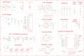

Contents
========

* [PRA4800 > Adafruit](#pra4800--adafruit)
	* [Schematic](#schematic)
	* [Interactive BOM](#interactive-bom)
	* [OOMP Parts](#oomp-parts)
	* [Images](#images)
	* [Tags](#tags)
  
![][im]
# PRA4800 > Adafruit

- ID: PROJ-ADAF-4800-STAN-01
- Hex ID: PRA4800
- Name: Adafruit
- Description: Adafruit
- Long Link: [http://oom.lt/PROJ-ADAF-4800-STAN-01](http://oom.lt/PROJ-ADAF-4800-STAN-01)
- Short Link: [http://oom.lt/PRA4800](http://oom.lt/PRA4800)

## Schematic
  

## Interactive BOM

- Interactive BOM page: [ibom.html](https://htmlpreview.github.io/?https://github.com/oomlout/oomlout_OOMP_projects/blob/main/PROJ-ADAF-4800-STAN-01/kicad/bom/ibom.html)

## OOMP Parts
  

|OOMP Parts|
| :---: |
|C1,CAPC-0805-X-UF10-V10,C1,10uF,CAP_CERAMIC0805-NOOUTLINE,0805-NO,Ceramic Capacitors,,,,,,,,,|
|C2,CAPC-0603-X-NF100-V50,C2,0.1uF,CAP_CERAMIC0603_NO,0603-NO,Ceramic Capacitors,,,,,,,,,|
|C3,CAPC-0805-X-UNMATCHED-01,C3,10µF,CAP_CERAMIC0805-NOOUTLINE,0805-NO,Ceramic Capacitors,,,,,,,,,|
|C4,CAPC-0805-X-UNMATCHED-01,C4,10µF,CAP_CERAMIC0805-NOOUTLINE,0805-NO,Ceramic Capacitors,,,,,,,,,|
|C5,CAPC-0603-X-NF100-V50,C5,0.1uF,CAP_CERAMIC0603_NO,0603-NO,Ceramic Capacitors,,,,,,,,,|
|C6,CAPC-0603-X-UF1-01,C6,1uF,CAP_CERAMIC0603_NO,0603-NO,Ceramic Capacitors,,,,,,,,,|
|C7,CAPC-0805-X-UNMATCHED-01,C7,10µF,CAP_CERAMIC0805-NOOUTLINE,0805-NO,Ceramic Capacitors,,,,,,,,,|
|C8,CAPC-0805-X-UNMATCHED-01,C8,10µF,CAP_CERAMIC0805-NOOUTLINE,0805-NO,Ceramic Capacitors,,,,,,,,,|
|C9,CAPC-0805-X-UNMATCHED-01,C9,10uF/10V+,CAP_CERAMIC0805-NOOUTLINE,0805-NO,Ceramic Capacitors,,,,,,,,,|
|C10,CAPC-0805-X-UNMATCHED-01,C10,10µF,CAP_CERAMIC0805-NOOUTLINE,0805-NO,Ceramic Capacitors,,,,,,,,,|
|C11,CAPC-0805-X-UNMATCHED-01,C11,10µF,CAP_CERAMIC0805-NOOUTLINE,0805-NO,Ceramic Capacitors,,,,,,,,,|
|C12,CAPC-0603-X-UF1-01,C12,1uF,CAP_CERAMIC0603_NO,0603-NO,Ceramic Capacitors,,,,,,,,,|
|C13,CAPC-0805-X-UNMATCHED-01,C13,10µF,CAP_CERAMIC0805-NOOUTLINE,0805-NO,Ceramic Capacitors,,,,,,,,,|
|C14,CAPC-0603-X-UF1-01,C14,1uF,CAP_CERAMIC0603_NO,0603-NO,Ceramic Capacitors,,,,,,,,,|
|C15,CAPC-0603-X-NF100-V50,C15,0.1uF,CAP_CERAMIC0603_NO,0603-NO,Ceramic Capacitors,,,,,,,,,|
|C16,CAPC-0603-X-NF100-V50,C16,0.1uF,CAP_CERAMIC0603_NO,0603-NO,Ceramic Capacitors,,,,,,,,,|
|C17,CAPC-0805-X-UNMATCHED-01,C17,10µF,CAP_CERAMIC0805-NOOUTLINE,0805-NO,Ceramic Capacitors,,,,,,,,,|
|C18,CAPC-0805-X-UNMATCHED-01,C18,10µF,CAP_CERAMIC0805-NOOUTLINE,0805-NO,Ceramic Capacitors,,,,,,,,,|
|C19,CAPC-0805-X-UF1-01,C19,1uF,CAP_CERAMIC0805-NOOUTLINE,0805-NO,Ceramic Capacitors,,,,,,,,,|
|C20,CAPC-0805-X-UF10-V10,C20,10uF,CAP_CERAMIC0805-NOOUTLINE,0805-NO,Ceramic Capacitors,,,,,,,,,|
|C21,CAPC-0603-X-NF100-V50,C21,0.1uF,CAP_CERAMIC0603_NO,0603-NO,Ceramic Capacitors,,,,,,,,,|
|C23,CAPC-0805-X-UF1-01,C23,1uF,CAP_CERAMIC0805-NOOUTLINE,0805-NO,Ceramic Capacitors,,,,,,,,,|
|C24,CAPC-0805-X-UF1-01,C24,1uF,CAP_CERAMIC0805-NOOUTLINE,0805-NO,Ceramic Capacitors,,,,,,,,,|
|C25,CAPC-0805-X-UF1-01,C25,1uF,CAP_CERAMIC0805-NOOUTLINE,0805-NO,Ceramic Capacitors,,,,,,,,,|
|C26,CAPC-0805-X-UF1-01,C26,1uF,CAP_CERAMIC0805-NOOUTLINE,0805-NO,Ceramic Capacitors,,,,,,,,,|
|C27,CAPC-0805-X-UF1-01,C27,1uF,CAP_CERAMIC0805-NOOUTLINE,0805-NO,Ceramic Capacitors,,,,,,,,,|
|C28,CAPC-0805-X-UF1-01,C28,1uF,CAP_CERAMIC0805-NOOUTLINE,0805-NO,Ceramic Capacitors,,,,,,,,,|
|C29,CAPC-0805-X-UNMATCHED-01,C29,4.7uF/25V,CAP_CERAMIC0805-NOOUTLINE,0805-NO,Ceramic Capacitors,,,,,,,,,|
|C30,CAPC-0805-X-UF1-01,C30,1uF,CAP_CERAMIC0805-NOOUTLINE,0805-NO,Ceramic Capacitors,,,,,,,,,|
|C31,CAPC-0805-X-UF1-01,C31,1uF,CAP_CERAMIC0805-NOOUTLINE,0805-NO,Ceramic Capacitors,,,,,,,,,|
|CHG1,LEDS-0603-G-STAN-01,CHG1,ORANGE,LED0603_NOOUTLINE,CHIPLED_0603_NOOUTLINE,LED,,,,,,,,,|
|CONN1,UNMATCHED-UNMATCHED-X-UNMATCHED-01,CONN1,STEMMA_I2C_QT,STEMMA_I2C_QT,JST_SH4,,,,,,,,,,|
|D1,DIOD-S323-X-UNMATCHED-01,D1,3.6V,DIODE-ZENERSOD323,SOD-323,Zener Diode,,,,,,,,,|
|D2,DIOD-UNMATCHED-X-UNMATCHED-01,D2,MBR0530,DIODE-SCHOTTKYSOD-123,SOD-123,,,,,,,,,,|
|D3,DIOD-UNMATCHED-X-UNMATCHED-01,D3,MBR0530,DIODE-SCHOTTKYSOD-123,SOD-123,,,,,,,,,,|
|D4,DIOD-UNMATCHED-X-UNMATCHED-01,D4,MBR540,DIODE-SCHOTTKYSOD-123,SOD-123,,,,,,,,,,|
|D5,DIOD-UNMATCHED-X-UNMATCHED-01,D5,MBR0530,DIODE-SCHOTTKYSOD-123,SOD-123,,,,,,,,,,|
|D6,DIOD-S323-X-UNMATCHED-01,D6,3.6V,DIODE-ZENERSOD323,SOD-323,Zener Diode,,,,,,,,,|
|EINK2,UNMATCHED-UNMATCHED-X-UNMATCHED-01,EINK2,EINK_24PIN_290IN,EINK_24PIN_290IN,EINK_290IN,,,,,,,,,,|
|IC2,UNMATCHED-SO23-X-UNMATCHED-01,FID1,FIDUCIAL_1MM,FIDUCIAL_1MM,FIDUCIAL_1MM,Fiducial Alignment Points,,EXCLUDE,,,,,,,|
|IC4,UNMATCHED-UNMATCHED-X-UNMATCHED-01,FID2,FIDUCIAL_1MM,FIDUCIAL_1MM,FIDUCIAL_1MM,Fiducial Alignment Points,,EXCLUDE,,,,,,,|
|JP2,HEAD-I01-X-PI02-01,FID3,FIDUCIAL_1MM,FIDUCIAL_1MM,FIDUCIAL_1MM,Fiducial Alignment Points,,EXCLUDE,,,,,,,|
|L,LEDS-0603-G-STAN-01,FID4,FIDUCIAL_1MM,FIDUCIAL_1MM,FIDUCIAL_1MM,Fiducial Alignment Points,,EXCLUDE,,,,,,,|
|L1,UNMATCHED-UNMATCHED-X-UNMATCHED-01,FID5,FIDUCIAL_1MM,FIDUCIAL_1MM,FIDUCIAL_1MM,Fiducial Alignment Points,,EXCLUDE,,,,,,,|
|LED2,UNMATCHED-UNMATCHED-X-UNMATCHED-01,FID6,FIDUCIAL_1MM,FIDUCIAL_1MM,FIDUCIAL_1MM,Fiducial Alignment Points,,EXCLUDE,,,,,,,|
|LED3,UNMATCHED-UNMATCHED-X-UNMATCHED-01,IC2,PAM8301,PAM8301,SOT23-6,,,,,,,,,,|
|LED4,UNMATCHED-UNMATCHED-X-UNMATCHED-01,IC4,LIS3DH,ACCEL_LIS3DHTR,LGA16_3X3MM,LIS3DHTR 3-Axis Accelerometer with I2C/SPI Interface,,,,,,,,,|
|LED5,UNMATCHED-UNMATCHED-X-UNMATCHED-01,JP2,UART,HEADER-1X2ROUND,1X02_ROUND,PIN HEADER,,,,,,,,,|
|ON,LEDS-0603-G-STAN-01,L,RED,LED0603_NOOUTLINE,CHIPLED_0603_NOOUTLINE,LED,,,,,,,,,|
|Q1,MOSP-SO23-X-UNMATCHED-01,L1,10uH,INDUCTORNR401,INDUCTOR_4X4MM_NR401,Inductors,,,,,,,,,|
|Q2,MOSP-SO23-X-UNMATCHED-01,LED2,WS2812B_4020,WS2812B_4020,WS2812B_4020,,,,,,,,,,|
|Q3,MOSP-SO23-X-UNMATCHED-01,LED3,WS2812B_4020,WS2812B_4020,WS2812B_4020,,,,,,,,,,|
|Q5,UNMATCHED-SO23-X-UNMATCHED-01,LED4,WS2812B_4020,WS2812B_4020,WS2812B_4020,,,,,,,,,,|
|R1,RESE-0603-X-O103-01,LED5,WS2812B_4020,WS2812B_4020,WS2812B_4020,,,,,,,,,,|
|R2,RESE-0603-X-O103-01,ON,GREEN,LED0603_NOOUTLINE,CHIPLED_0603_NOOUTLINE,LED,,,,,,,,,|
|R3,RESE-0603-X-UNMATCHED-01,Q1,DMG3415U-7,MOSFET-P,SOT23-R,P-Channel Mosfet,,,,,,,,,|
|R4,RESE-0603-X-UNMATCHED-01,Q2,DMG3415,MOSFET-P,SOT23-R,P-Channel Mosfet,,,,,,,,,|
|R5,RESE-0603-X-O103-01,Q3,DMG3415U-7,MOSFET-P,SOT23-R,P-Channel Mosfet,,,,,,,,,|
|R6,RESE-0603-X-O473-01,Q5,IRLML0100,IRLML2060TRPBF,SOT23-3,,,,,,,,,,|
|R7,RESE-0603-X-O103-01,R1,10K,RESISTOR_0603_NOOUT,0603-NO,Resistors,,,,,,,,,|
|R8,RESE-0603-X-UNMATCHED-01,R2,10K,RESISTOR_0603_NOOUT,0603-NO,Resistors,,,,,,,,,|
|R9,RESE-0603-X-O103-01,R3,5.1K,RESISTOR_0603_NOOUT,0603-NO,Resistors,,,,,,,,,|
|R10,RESE-0603-X-UNMATCHED-01,R4,5.1k,RESISTOR_0603_NOOUT,0603-NO,Resistors,,,,,,,,,|
|R11,RESE-0603-X-UNMATCHED-01,R5,10K,RESISTOR_0603_NOOUT,0603-NO,Resistors,,,,,,,,,|
|R12,RESE-0603-X-O1003-01,R6,47K,RESISTOR_0603_NOOUT,0603-NO,Resistors,,,,,,,,,|
|R13,RESE-UNMATCHED-X-UNMATCHED-01,R7,10K,RESISTOR_0603_NOOUT,0603-NO,Resistors,,,,,,,,,|
|R14,RESE-0603-X-O1003-01,R8,5.1K,RESISTOR_0603_NOOUT,0603-NO,Resistors,,,,,,,,,|
|R15,RESE-0603-X-O1003-01,R9,10K,RESISTOR_0603_NOOUT,0603-NO,Resistors,,,,,,,,,|
|R16,RESE-0603-X-O102-01,R10,1Meg,RESISTOR_0603_NOOUT,0603-NO,Resistors,,,,,,,,,|
|R17,RESE-0603-X-UNMATCHED-01,R11,1Meg,RESISTOR_0603_NOOUT,0603-NO,Resistors,,,,,,,,,|
|R18,RESE-0603-X-O102-01,R12,100k,RESISTOR_0603_NOOUT,0603-NO,Resistors,,,,,,,,,|
|R19,RESE-0603-X-O473-01,R13,0.47ohm,RESISTOR0805_10MGAP,0805_10MGAP,Resistors,,,,,,,,,|
|R20,RESE-0603-X-O103-01,R14,100k,RESISTOR_0603_NOOUT,0603-NO,Resistors,,,,,,,,,|
|R21,RESE-UNMATCHED-X-UNMATCHED-01,R15,100K,RESISTOR_0603_NOOUT,0603-NO,Resistors,,,,,,,,,|
|R22,RESE-0603-X-UNMATCHED-01,R16,1K,RESISTOR_0603_NOOUT,0603-NO,Resistors,,,,,,,,,|
|R23,RESE-0603-X-UNMATCHED-01,R17,1Meg,RESISTOR_0603_NOOUT,0603-NO,Resistors,,,,,,,,,|
|R24,RESE-0603-X-UNMATCHED-01,R18,1K,RESISTOR_0603_NOOUT,0603-NO,Resistors,,,,,,,,,|
|R25,RESE-0603-X-UNMATCHED-01,R19,47K,RESISTOR_0603_NOOUT,0603-NO,Resistors,,,,,,,,,|
|R26,RESE-0603-X-O1003-01,R20,10K,RESISTOR_0603_NOOUT,0603-NO,Resistors,,,,,,,,,|
|R27,RESE-0603-X-O1003-01,R21,DNP,RESISTOR0805_10MGAP,0805_10MGAP,Resistors,,,,,,,,,|
|SENSE,UNMATCHED-UNMATCHED-X-UNMATCHED-01,R22,DNP,RESISTOR_0603_NOOUT,0603-NO,Resistors,,,,,,,,,|
|SENSE1,UNMATCHED-UNMATCHED-X-UNMATCHED-01,R23,DNP,RESISTOR_0603_NOOUT,0603-NO,Resistors,,,,,,,,,|
|SP1,UNMATCHED-UNMATCHED-X-UNMATCHED-01,R24,DNP,RESISTOR_0603_NOOUT,0603-NO,Resistors,,,,,,,,,|
|SW1,UNMATCHED-UNMATCHED-X-UNMATCHED-01,R25,DNP,RESISTOR_0603_NOOUT,0603-NO,Resistors,,,,,,,,,|
|SW2,UNMATCHED-UNMATCHED-X-UNMATCHED-01,R26,100K,RESISTOR_0603_NOOUT,0603-NO,Resistors,,,,,,,,,|
|SW3,UNMATCHED-UNMATCHED-X-UNMATCHED-01,R27,100K,RESISTOR_0603_NOOUT,0603-NO,Resistors,,,,,,,,,|
|SW4,UNMATCHED-UNMATCHED-X-UNMATCHED-01,SENSE,JST PH 3,CON_JST_PH_3PIN,JSTPH3,,,,,,,,,,|
|SW5,UNMATCHED-UNMATCHED-X-UNMATCHED-01,SENSE1,JST PH 3,CON_JST_PH_3PIN,JSTPH3,,,,,,,,,,|
|SW6,UNMATCHED-UNMATCHED-X-UNMATCHED-01,SJ2,,SOLDERJUMPER_2WAY,SOLDERJUMPER_2WAY_OPEN_NOPASTE,2-Way Solder Jumper,,,,,,,,,|
|SW7,UNMATCHED-UNMATCHED-X-UNMATCHED-01,SP1,7.5mm SPK,SPEAKER_7.5MM,BUZZER_SMT_7.5MM,SPEAKER Source: BuerklinAdded PS12 (for part # PS1240 piezo) http://www.ladyada.net/library/pcb/eaglelibrary.html,,,,,,,,,|
|TP1,UNMATCHED-UNMATCHED-X-UNMATCHED-01,SW1,RA_TACT,SWITCH_SPST_TACT_RA,SPST_TACTILE_RA,Switch - SPST,,,,,,,,,|
|TP2,UNMATCHED-UNMATCHED-X-UNMATCHED-01,SW2,,SWITCH_PUSHBUTTON_3.5X6MM,TACTILE_3X6MM,Buttons,,,,,,,,,|
|TP3,UNMATCHED-UNMATCHED-X-UNMATCHED-01,SW3,RA_TACT,SWITCH_SPST_TACT_RA,SPST_TACTILE_RA,Switch - SPST,,,,,,,,,|
|TP4,UNMATCHED-UNMATCHED-X-UNMATCHED-01,SW4,SPDT R/A,SWITCH_SPDT,SPDT_SMT_SSSS811101,Switch - SPDT,,,,,,,,,|
|TP5,UNMATCHED-UNMATCHED-X-UNMATCHED-01,SW5,,SWITCH_PUSHBUTTON_3.5X6MM,TACTILE_3X6MM,Buttons,,,,,,,,,|
|TP6,UNMATCHED-UNMATCHED-X-UNMATCHED-01,SW6,,SWITCH_PUSHBUTTON_3.5X6MM,TACTILE_3X6MM,Buttons,,,,,,,,,|
|TP7,UNMATCHED-UNMATCHED-X-UNMATCHED-01,SW7,,SWITCH_PUSHBUTTON_3.5X6MM,TACTILE_3X6MM,Buttons,,,,,,,,,|
|TP8,UNMATCHED-UNMATCHED-X-UNMATCHED-01,TP1,,TESTPOINTROUND1.5MMNO,TESTPOINT_ROUND_1.5MM_NO,Test Point,,,,,,,,,|
|U1,UNMATCHED-UNMATCHED-X-UNMATCHED-01,TP2,SEWTAP_SMTNUTM3,SEWTAP_SMTNUTM3,SMT_NUT_3MM,,,,,,,,,,|
|U2,UNMATCHED-SO235-X-UNMATCHED-01,TP3,SEWTAP_SMTNUTM3,SEWTAP_SMTNUTM3,SMT_NUT_3MM,,,,,,,,,,|
|U3,UNMATCHED-UNMATCHED-X-UNMATCHED-01,TP4,SEWTAP_SMTNUTM3,SEWTAP_SMTNUTM3,SMT_NUT_3MM,,,,,,,,,,|
|U4,VREG-SO235-X-KAP2112K-V33D,TP5,SEWTAP_SMTNUTM3,SEWTAP_SMTNUTM3,SMT_NUT_3MM,,,,,,,,,,|
|X1,UNMATCHED-UNMATCHED-X-UNMATCHED-01,TP6,,TESTPOINTROUND1.5MMNO,TESTPOINT_ROUND_1.5MM_NO,Test Point,,,,,,,,,|
|X4,UNMATCHED-UNMATCHED-X-UNMATCHED-01,TP7,,TESTPOINTROUND1.5MMNO,TESTPOINT_ROUND_1.5MM_NO,Test Point,,,,,,,,,|

## Images
  
  

|kicadPcb3d|kicadPcb3dFront|kicadPcb3dBack|eagleImage|eagleSchemImage|
| :---: | :---: | :---: | :---: | :---: |
||||||

## Tags

- hexID: PRA4800
- oompType: PROJ
- oompSize: ADAF
- oompColor: 4800
- oompDesc: STAN
- oompIndex: 01
- oompName: Adafruit_MagTag_PCBs
- sources: All source files from https://github.com/adafruit/Adafruit_MagTag_PCBs (source licence details in srcLicense.md)
- linkBuyPage: http://www.adafruit.com/products/4800
- oompID: PROJ-ADAF-4800-STAN-01
- oompParts: C1,CAPC-0805-X-UF10-V10
- oompParts: C2,CAPC-0603-X-NF100-V50
- oompParts: C3,CAPC-0805-X-UNMATCHED-01
- oompParts: C4,CAPC-0805-X-UNMATCHED-01
- oompParts: C5,CAPC-0603-X-NF100-V50
- oompParts: C6,CAPC-0603-X-UF1-01
- oompParts: C7,CAPC-0805-X-UNMATCHED-01
- oompParts: C8,CAPC-0805-X-UNMATCHED-01
- oompParts: C9,CAPC-0805-X-UNMATCHED-01
- oompParts: C10,CAPC-0805-X-UNMATCHED-01
- oompParts: C11,CAPC-0805-X-UNMATCHED-01
- oompParts: C12,CAPC-0603-X-UF1-01
- oompParts: C13,CAPC-0805-X-UNMATCHED-01
- oompParts: C14,CAPC-0603-X-UF1-01
- oompParts: C15,CAPC-0603-X-NF100-V50
- oompParts: C16,CAPC-0603-X-NF100-V50
- oompParts: C17,CAPC-0805-X-UNMATCHED-01
- oompParts: C18,CAPC-0805-X-UNMATCHED-01
- oompParts: C19,CAPC-0805-X-UF1-01
- oompParts: C20,CAPC-0805-X-UF10-V10
- oompParts: C21,CAPC-0603-X-NF100-V50
- oompParts: C23,CAPC-0805-X-UF1-01
- oompParts: C24,CAPC-0805-X-UF1-01
- oompParts: C25,CAPC-0805-X-UF1-01
- oompParts: C26,CAPC-0805-X-UF1-01
- oompParts: C27,CAPC-0805-X-UF1-01
- oompParts: C28,CAPC-0805-X-UF1-01
- oompParts: C29,CAPC-0805-X-UNMATCHED-01
- oompParts: C30,CAPC-0805-X-UF1-01
- oompParts: C31,CAPC-0805-X-UF1-01
- oompParts: CHG1,LEDS-0603-G-STAN-01
- oompParts: CONN1,UNMATCHED-UNMATCHED-X-UNMATCHED-01
- oompParts: D1,DIOD-S323-X-UNMATCHED-01
- oompParts: D2,DIOD-UNMATCHED-X-UNMATCHED-01
- oompParts: D3,DIOD-UNMATCHED-X-UNMATCHED-01
- oompParts: D4,DIOD-UNMATCHED-X-UNMATCHED-01
- oompParts: D5,DIOD-UNMATCHED-X-UNMATCHED-01
- oompParts: D6,DIOD-S323-X-UNMATCHED-01
- oompParts: EINK2,UNMATCHED-UNMATCHED-X-UNMATCHED-01
- oompParts: IC2,UNMATCHED-SO23-X-UNMATCHED-01
- oompParts: IC4,UNMATCHED-UNMATCHED-X-UNMATCHED-01
- oompParts: JP2,HEAD-I01-X-PI02-01
- oompParts: L,LEDS-0603-G-STAN-01
- oompParts: L1,UNMATCHED-UNMATCHED-X-UNMATCHED-01
- oompParts: LED2,UNMATCHED-UNMATCHED-X-UNMATCHED-01
- oompParts: LED3,UNMATCHED-UNMATCHED-X-UNMATCHED-01
- oompParts: LED4,UNMATCHED-UNMATCHED-X-UNMATCHED-01
- oompParts: LED5,UNMATCHED-UNMATCHED-X-UNMATCHED-01
- oompParts: ON,LEDS-0603-G-STAN-01
- oompParts: Q1,MOSP-SO23-X-UNMATCHED-01
- oompParts: Q2,MOSP-SO23-X-UNMATCHED-01
- oompParts: Q3,MOSP-SO23-X-UNMATCHED-01
- oompParts: Q5,UNMATCHED-SO23-X-UNMATCHED-01
- oompParts: R1,RESE-0603-X-O103-01
- oompParts: R2,RESE-0603-X-O103-01
- oompParts: R3,RESE-0603-X-UNMATCHED-01
- oompParts: R4,RESE-0603-X-UNMATCHED-01
- oompParts: R5,RESE-0603-X-O103-01
- oompParts: R6,RESE-0603-X-O473-01
- oompParts: R7,RESE-0603-X-O103-01
- oompParts: R8,RESE-0603-X-UNMATCHED-01
- oompParts: R9,RESE-0603-X-O103-01
- oompParts: R10,RESE-0603-X-UNMATCHED-01
- oompParts: R11,RESE-0603-X-UNMATCHED-01
- oompParts: R12,RESE-0603-X-O1003-01
- oompParts: R13,RESE-UNMATCHED-X-UNMATCHED-01
- oompParts: R14,RESE-0603-X-O1003-01
- oompParts: R15,RESE-0603-X-O1003-01
- oompParts: R16,RESE-0603-X-O102-01
- oompParts: R17,RESE-0603-X-UNMATCHED-01
- oompParts: R18,RESE-0603-X-O102-01
- oompParts: R19,RESE-0603-X-O473-01
- oompParts: R20,RESE-0603-X-O103-01
- oompParts: R21,RESE-UNMATCHED-X-UNMATCHED-01
- oompParts: R22,RESE-0603-X-UNMATCHED-01
- oompParts: R23,RESE-0603-X-UNMATCHED-01
- oompParts: R24,RESE-0603-X-UNMATCHED-01
- oompParts: R25,RESE-0603-X-UNMATCHED-01
- oompParts: R26,RESE-0603-X-O1003-01
- oompParts: R27,RESE-0603-X-O1003-01
- oompParts: SENSE,UNMATCHED-UNMATCHED-X-UNMATCHED-01
- oompParts: SENSE1,UNMATCHED-UNMATCHED-X-UNMATCHED-01
- oompParts: SP1,UNMATCHED-UNMATCHED-X-UNMATCHED-01
- oompParts: SW1,UNMATCHED-UNMATCHED-X-UNMATCHED-01
- oompParts: SW2,UNMATCHED-UNMATCHED-X-UNMATCHED-01
- oompParts: SW3,UNMATCHED-UNMATCHED-X-UNMATCHED-01
- oompParts: SW4,UNMATCHED-UNMATCHED-X-UNMATCHED-01
- oompParts: SW5,UNMATCHED-UNMATCHED-X-UNMATCHED-01
- oompParts: SW6,UNMATCHED-UNMATCHED-X-UNMATCHED-01
- oompParts: SW7,UNMATCHED-UNMATCHED-X-UNMATCHED-01
- oompParts: TP1,UNMATCHED-UNMATCHED-X-UNMATCHED-01
- oompParts: TP2,UNMATCHED-UNMATCHED-X-UNMATCHED-01
- oompParts: TP3,UNMATCHED-UNMATCHED-X-UNMATCHED-01
- oompParts: TP4,UNMATCHED-UNMATCHED-X-UNMATCHED-01
- oompParts: TP5,UNMATCHED-UNMATCHED-X-UNMATCHED-01
- oompParts: TP6,UNMATCHED-UNMATCHED-X-UNMATCHED-01
- oompParts: TP7,UNMATCHED-UNMATCHED-X-UNMATCHED-01
- oompParts: TP8,UNMATCHED-UNMATCHED-X-UNMATCHED-01
- oompParts: U1,UNMATCHED-UNMATCHED-X-UNMATCHED-01
- oompParts: U2,UNMATCHED-SO235-X-UNMATCHED-01
- oompParts: U3,UNMATCHED-UNMATCHED-X-UNMATCHED-01
- oompParts: U4,VREG-SO235-X-KAP2112K-V33D
- oompParts: X1,UNMATCHED-UNMATCHED-X-UNMATCHED-01
- oompParts: X4,UNMATCHED-UNMATCHED-X-UNMATCHED-01
- rawParts: C1,10uF,CAP_CERAMIC0805-NOOUTLINE,0805-NO,Ceramic Capacitors,,,,,,,,,
- rawParts: C2,0.1uF,CAP_CERAMIC0603_NO,0603-NO,Ceramic Capacitors,,,,,,,,,
- rawParts: C3,10µF,CAP_CERAMIC0805-NOOUTLINE,0805-NO,Ceramic Capacitors,,,,,,,,,
- rawParts: C4,10µF,CAP_CERAMIC0805-NOOUTLINE,0805-NO,Ceramic Capacitors,,,,,,,,,
- rawParts: C5,0.1uF,CAP_CERAMIC0603_NO,0603-NO,Ceramic Capacitors,,,,,,,,,
- rawParts: C6,1uF,CAP_CERAMIC0603_NO,0603-NO,Ceramic Capacitors,,,,,,,,,
- rawParts: C7,10µF,CAP_CERAMIC0805-NOOUTLINE,0805-NO,Ceramic Capacitors,,,,,,,,,
- rawParts: C8,10µF,CAP_CERAMIC0805-NOOUTLINE,0805-NO,Ceramic Capacitors,,,,,,,,,
- rawParts: C9,10uF/10V+,CAP_CERAMIC0805-NOOUTLINE,0805-NO,Ceramic Capacitors,,,,,,,,,
- rawParts: C10,10µF,CAP_CERAMIC0805-NOOUTLINE,0805-NO,Ceramic Capacitors,,,,,,,,,
- rawParts: C11,10µF,CAP_CERAMIC0805-NOOUTLINE,0805-NO,Ceramic Capacitors,,,,,,,,,
- rawParts: C12,1uF,CAP_CERAMIC0603_NO,0603-NO,Ceramic Capacitors,,,,,,,,,
- rawParts: C13,10µF,CAP_CERAMIC0805-NOOUTLINE,0805-NO,Ceramic Capacitors,,,,,,,,,
- rawParts: C14,1uF,CAP_CERAMIC0603_NO,0603-NO,Ceramic Capacitors,,,,,,,,,
- rawParts: C15,0.1uF,CAP_CERAMIC0603_NO,0603-NO,Ceramic Capacitors,,,,,,,,,
- rawParts: C16,0.1uF,CAP_CERAMIC0603_NO,0603-NO,Ceramic Capacitors,,,,,,,,,
- rawParts: C17,10µF,CAP_CERAMIC0805-NOOUTLINE,0805-NO,Ceramic Capacitors,,,,,,,,,
- rawParts: C18,10µF,CAP_CERAMIC0805-NOOUTLINE,0805-NO,Ceramic Capacitors,,,,,,,,,
- rawParts: C19,1uF,CAP_CERAMIC0805-NOOUTLINE,0805-NO,Ceramic Capacitors,,,,,,,,,
- rawParts: C20,10uF,CAP_CERAMIC0805-NOOUTLINE,0805-NO,Ceramic Capacitors,,,,,,,,,
- rawParts: C21,0.1uF,CAP_CERAMIC0603_NO,0603-NO,Ceramic Capacitors,,,,,,,,,
- rawParts: C23,1uF,CAP_CERAMIC0805-NOOUTLINE,0805-NO,Ceramic Capacitors,,,,,,,,,
- rawParts: C24,1uF,CAP_CERAMIC0805-NOOUTLINE,0805-NO,Ceramic Capacitors,,,,,,,,,
- rawParts: C25,1uF,CAP_CERAMIC0805-NOOUTLINE,0805-NO,Ceramic Capacitors,,,,,,,,,
- rawParts: C26,1uF,CAP_CERAMIC0805-NOOUTLINE,0805-NO,Ceramic Capacitors,,,,,,,,,
- rawParts: C27,1uF,CAP_CERAMIC0805-NOOUTLINE,0805-NO,Ceramic Capacitors,,,,,,,,,
- rawParts: C28,1uF,CAP_CERAMIC0805-NOOUTLINE,0805-NO,Ceramic Capacitors,,,,,,,,,
- rawParts: C29,4.7uF/25V,CAP_CERAMIC0805-NOOUTLINE,0805-NO,Ceramic Capacitors,,,,,,,,,
- rawParts: C30,1uF,CAP_CERAMIC0805-NOOUTLINE,0805-NO,Ceramic Capacitors,,,,,,,,,
- rawParts: C31,1uF,CAP_CERAMIC0805-NOOUTLINE,0805-NO,Ceramic Capacitors,,,,,,,,,
- rawParts: CHG1,ORANGE,LED0603_NOOUTLINE,CHIPLED_0603_NOOUTLINE,LED,,,,,,,,,
- rawParts: CONN1,STEMMA_I2C_QT,STEMMA_I2C_QT,JST_SH4,,,,,,,,,,
- rawParts: D1,3.6V,DIODE-ZENERSOD323,SOD-323,Zener Diode,,,,,,,,,
- rawParts: D2,MBR0530,DIODE-SCHOTTKYSOD-123,SOD-123,,,,,,,,,,
- rawParts: D3,MBR0530,DIODE-SCHOTTKYSOD-123,SOD-123,,,,,,,,,,
- rawParts: D4,MBR540,DIODE-SCHOTTKYSOD-123,SOD-123,,,,,,,,,,
- rawParts: D5,MBR0530,DIODE-SCHOTTKYSOD-123,SOD-123,,,,,,,,,,
- rawParts: D6,3.6V,DIODE-ZENERSOD323,SOD-323,Zener Diode,,,,,,,,,
- rawParts: EINK2,EINK_24PIN_290IN,EINK_24PIN_290IN,EINK_290IN,,,,,,,,,,
- rawParts: FID1,FIDUCIAL_1MM,FIDUCIAL_1MM,FIDUCIAL_1MM,Fiducial Alignment Points,,EXCLUDE,,,,,,,
- rawParts: FID2,FIDUCIAL_1MM,FIDUCIAL_1MM,FIDUCIAL_1MM,Fiducial Alignment Points,,EXCLUDE,,,,,,,
- rawParts: FID3,FIDUCIAL_1MM,FIDUCIAL_1MM,FIDUCIAL_1MM,Fiducial Alignment Points,,EXCLUDE,,,,,,,
- rawParts: FID4,FIDUCIAL_1MM,FIDUCIAL_1MM,FIDUCIAL_1MM,Fiducial Alignment Points,,EXCLUDE,,,,,,,
- rawParts: FID5,FIDUCIAL_1MM,FIDUCIAL_1MM,FIDUCIAL_1MM,Fiducial Alignment Points,,EXCLUDE,,,,,,,
- rawParts: FID6,FIDUCIAL_1MM,FIDUCIAL_1MM,FIDUCIAL_1MM,Fiducial Alignment Points,,EXCLUDE,,,,,,,
- rawParts: IC2,PAM8301,PAM8301,SOT23-6,,,,,,,,,,
- rawParts: IC4,LIS3DH,ACCEL_LIS3DHTR,LGA16_3X3MM,LIS3DHTR 3-Axis Accelerometer with I2C/SPI Interface,,,,,,,,,
- rawParts: JP2,UART,HEADER-1X2ROUND,1X02_ROUND,PIN HEADER,,,,,,,,,
- rawParts: L,RED,LED0603_NOOUTLINE,CHIPLED_0603_NOOUTLINE,LED,,,,,,,,,
- rawParts: L1,10uH,INDUCTORNR401,INDUCTOR_4X4MM_NR401,Inductors,,,,,,,,,
- rawParts: LED2,WS2812B_4020,WS2812B_4020,WS2812B_4020,,,,,,,,,,
- rawParts: LED3,WS2812B_4020,WS2812B_4020,WS2812B_4020,,,,,,,,,,
- rawParts: LED4,WS2812B_4020,WS2812B_4020,WS2812B_4020,,,,,,,,,,
- rawParts: LED5,WS2812B_4020,WS2812B_4020,WS2812B_4020,,,,,,,,,,
- rawParts: ON,GREEN,LED0603_NOOUTLINE,CHIPLED_0603_NOOUTLINE,LED,,,,,,,,,
- rawParts: Q1,DMG3415U-7,MOSFET-P,SOT23-R,P-Channel Mosfet,,,,,,,,,
- rawParts: Q2,DMG3415,MOSFET-P,SOT23-R,P-Channel Mosfet,,,,,,,,,
- rawParts: Q3,DMG3415U-7,MOSFET-P,SOT23-R,P-Channel Mosfet,,,,,,,,,
- rawParts: Q5,IRLML0100,IRLML2060TRPBF,SOT23-3,,,,,,,,,,
- rawParts: R1,10K,RESISTOR_0603_NOOUT,0603-NO,Resistors,,,,,,,,,
- rawParts: R2,10K,RESISTOR_0603_NOOUT,0603-NO,Resistors,,,,,,,,,
- rawParts: R3,5.1K,RESISTOR_0603_NOOUT,0603-NO,Resistors,,,,,,,,,
- rawParts: R4,5.1k,RESISTOR_0603_NOOUT,0603-NO,Resistors,,,,,,,,,
- rawParts: R5,10K,RESISTOR_0603_NOOUT,0603-NO,Resistors,,,,,,,,,
- rawParts: R6,47K,RESISTOR_0603_NOOUT,0603-NO,Resistors,,,,,,,,,
- rawParts: R7,10K,RESISTOR_0603_NOOUT,0603-NO,Resistors,,,,,,,,,
- rawParts: R8,5.1K,RESISTOR_0603_NOOUT,0603-NO,Resistors,,,,,,,,,
- rawParts: R9,10K,RESISTOR_0603_NOOUT,0603-NO,Resistors,,,,,,,,,
- rawParts: R10,1Meg,RESISTOR_0603_NOOUT,0603-NO,Resistors,,,,,,,,,
- rawParts: R11,1Meg,RESISTOR_0603_NOOUT,0603-NO,Resistors,,,,,,,,,
- rawParts: R12,100k,RESISTOR_0603_NOOUT,0603-NO,Resistors,,,,,,,,,
- rawParts: R13,0.47ohm,RESISTOR0805_10MGAP,0805_10MGAP,Resistors,,,,,,,,,
- rawParts: R14,100k,RESISTOR_0603_NOOUT,0603-NO,Resistors,,,,,,,,,
- rawParts: R15,100K,RESISTOR_0603_NOOUT,0603-NO,Resistors,,,,,,,,,
- rawParts: R16,1K,RESISTOR_0603_NOOUT,0603-NO,Resistors,,,,,,,,,
- rawParts: R17,1Meg,RESISTOR_0603_NOOUT,0603-NO,Resistors,,,,,,,,,
- rawParts: R18,1K,RESISTOR_0603_NOOUT,0603-NO,Resistors,,,,,,,,,
- rawParts: R19,47K,RESISTOR_0603_NOOUT,0603-NO,Resistors,,,,,,,,,
- rawParts: R20,10K,RESISTOR_0603_NOOUT,0603-NO,Resistors,,,,,,,,,
- rawParts: R21,DNP,RESISTOR0805_10MGAP,0805_10MGAP,Resistors,,,,,,,,,
- rawParts: R22,DNP,RESISTOR_0603_NOOUT,0603-NO,Resistors,,,,,,,,,
- rawParts: R23,DNP,RESISTOR_0603_NOOUT,0603-NO,Resistors,,,,,,,,,
- rawParts: R24,DNP,RESISTOR_0603_NOOUT,0603-NO,Resistors,,,,,,,,,
- rawParts: R25,DNP,RESISTOR_0603_NOOUT,0603-NO,Resistors,,,,,,,,,
- rawParts: R26,100K,RESISTOR_0603_NOOUT,0603-NO,Resistors,,,,,,,,,
- rawParts: R27,100K,RESISTOR_0603_NOOUT,0603-NO,Resistors,,,,,,,,,
- rawParts: SENSE,JST PH 3,CON_JST_PH_3PIN,JSTPH3,,,,,,,,,,
- rawParts: SENSE1,JST PH 3,CON_JST_PH_3PIN,JSTPH3,,,,,,,,,,
- rawParts: SJ2,,SOLDERJUMPER_2WAY,SOLDERJUMPER_2WAY_OPEN_NOPASTE,2-Way Solder Jumper,,,,,,,,,
- rawParts: SP1,7.5mm SPK,SPEAKER_7.5MM,BUZZER_SMT_7.5MM,SPEAKER Source: BuerklinAdded PS12 (for part # PS1240 piezo) http://www.ladyada.net/library/pcb/eaglelibrary.html,,,,,,,,,
- rawParts: SW1,RA_TACT,SWITCH_SPST_TACT_RA,SPST_TACTILE_RA,Switch - SPST,,,,,,,,,
- rawParts: SW2,,SWITCH_PUSHBUTTON_3.5X6MM,TACTILE_3X6MM,Buttons,,,,,,,,,
- rawParts: SW3,RA_TACT,SWITCH_SPST_TACT_RA,SPST_TACTILE_RA,Switch - SPST,,,,,,,,,
- rawParts: SW4,SPDT R/A,SWITCH_SPDT,SPDT_SMT_SSSS811101,Switch - SPDT,,,,,,,,,
- rawParts: SW5,,SWITCH_PUSHBUTTON_3.5X6MM,TACTILE_3X6MM,Buttons,,,,,,,,,
- rawParts: SW6,,SWITCH_PUSHBUTTON_3.5X6MM,TACTILE_3X6MM,Buttons,,,,,,,,,
- rawParts: SW7,,SWITCH_PUSHBUTTON_3.5X6MM,TACTILE_3X6MM,Buttons,,,,,,,,,
- rawParts: TP1,,TESTPOINTROUND1.5MMNO,TESTPOINT_ROUND_1.5MM_NO,Test Point,,,,,,,,,
- rawParts: TP2,SEWTAP_SMTNUTM3,SEWTAP_SMTNUTM3,SMT_NUT_3MM,,,,,,,,,,
- rawParts: TP3,SEWTAP_SMTNUTM3,SEWTAP_SMTNUTM3,SMT_NUT_3MM,,,,,,,,,,
- rawParts: TP4,SEWTAP_SMTNUTM3,SEWTAP_SMTNUTM3,SMT_NUT_3MM,,,,,,,,,,
- rawParts: TP5,SEWTAP_SMTNUTM3,SEWTAP_SMTNUTM3,SMT_NUT_3MM,,,,,,,,,,
- rawParts: TP6,,TESTPOINTROUND1.5MMNO,TESTPOINT_ROUND_1.5MM_NO,Test Point,,,,,,,,,
- rawParts: TP7,,TESTPOINTROUND1.5MMNO,TESTPOINT_ROUND_1.5MM_NO,Test Point,,,,,,,,,
- rawParts: TP8,,TESTPOINTROUND1.5MMNO,TESTPOINT_ROUND_1.5MM_NO,Test Point,,,,,,,,,
- rawParts: U1,,PHOTOTRANSISTOR_PT19-315C,ALS-PT19-315C,ALS-PT19-315C - Analog Light Sensor,,,,,,,,,
- rawParts: U2,MCP73831T-2ACI/OT,MCP73831/2,SOT23-5,MCP73831/2 LIPO Charger,,,,,,,,,
- rawParts: U3,ESP32-S2-WROVER,ESP32-S2-WROVER,MODULE_ESP32-S2-WROVER,WiFi 802.11b/g/n Transceiver Module 2.4GHz Antenna Not Included Surface Mount Check prices,Warning,, WiFi 802.11b/g/n Transceiver Module 2.4GHz Antenna Not Included Surface Mount ,https://snapeda.com/shop?store=DigiKey&id=4614060,Espressif Systems,ESP32-S2-WROVER,VFQFN-56 Espressif Systems,None,
- rawParts: U4,AP2112K-3.3,VREG_SOT23-5,SOT23-5,SOT23-5 Fixed Voltage Regulators,,,,,,,,,
- rawParts: X1,JSTPH,CON_JST_PH_2PIN_BATT,JSTPH2_BATT,JST 2-Pin Right-Angle Connector,,,,,,,,,
- rawParts: X4,USB C,USB_C,USB_C_CUSB31-CFM2AX-01-X,USB Type-C USB 2.0 Connector,,,,,,,,,

[im]: kicadPcb3d_450.png
