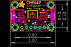

Contents
========

* [PROJ-ADAF-4821-STAN-01>Adafruit TMP117 PCB](#proj-adaf-4821-stan-01adafruit-tmp117-pcb)
	* [Images](#images)
	* [Interactive BOM](#interactive-bom)
	* [OOMP Parts](#oomp-parts)
	* [Tags](#tags)
  
![][im]
# PROJ-ADAF-4821-STAN-01>Adafruit TMP117 PCB

- ID: PROJ-ADAF-4821-STAN-01
- Hex ID: PRA4821
- Name: Adafruit TMP117 PCB
- Description: 

## Images
  
  

|eagleImage|
| :---: |
||

## Interactive BOM

- Interactive BOM page: [ibom.html](kicad/bom/ibom.html)

## OOMP Parts
  

|OOMP Parts|
| :---: |
|<table><tr><td></td><td> C1</td><td>[CAPC-0603-X-NF100-V50 SMD (0603) 100 nF Capacitor (Ceramic) 50v](https://github.com/oomlout/oomlout_OOMP_parts/tree/main/CAPC-0603-X-NF100-V50/)</td><td>[C6N100](https://github.com/oomlout/oomlout_OOMP_parts/tree/main/CAPC-0603-X-NF100-V50/)</td></tr></table>|
|<table><tr><td></td><td> C2</td><td>[CAPC-0805-X-UF10-V25 SMD (0805) 10 uF Capacitor (Ceramic) 25v](https://github.com/oomlout/oomlout_OOMP_parts/tree/main/CAPC-0805-X-UF10-V25/)</td><td>[C85U010](https://github.com/oomlout/oomlout_OOMP_parts/tree/main/CAPC-0805-X-UF10-V25/)</td></tr></table>|
|UNMATCHED-UNMATCHED-X-UNMATCHED-01, CONN3, 895.0, 350.0, 90,CONN3, STEMMA_I2C_QT, JST_SH4, microbuilder, (895, 350), R90|
|UNMATCHED-UNMATCHED-X-UNMATCHED-01, CONN4, 105.0, 350.0, 270,CONN4, STEMMA_I2C_QT, JST_SH4, microbuilder, (105, 350), R270|
|UNMATCHED-UNMATCHED-X-UNMATCHED-01, D1, 140.0, 495.0, 90,D1, GREEN, CHIPLED_0603_NOOUTLINE, microbuilder, (140, 495), R90|
|UNMATCHED-UNMATCHED-X-UNMATCHED-01, JP1, 500.0, 100.0, 0,JP1, 1X06_ROUND_70, microbuilder, (500, 100), R0|
|RESE-0603-X-UNMATCHED-01, R1, 270.0, 460.0, 270,R1, 0603-NO, microbuilder, (270, 460), R270|
|RESE-UNMATCHED-X-O103-01, R3, 705.0, 355.0, 90,R3, 10K, RESPACK_4X0603, microbuilder, (705, 355), R90|
|UNMATCHED-UNMATCHED-X-UNMATCHED-01, SJ1, 236.0, 278.0, M0,SJ1, SOLDERJUMPER_ARROW_NOPASTE, microbuilder, (236, 278), MR0|
|UNMATCHED-UNMATCHED-X-UNMATCHED-01, X1, 500.0, 350.0, 180,X1, TMP117_WSON, WSON-6, adafruit_sensor, (500, 350), R180|

## Tags

- hexID: PRA4821
- oompType: PROJ
- oompSize: ADAF
- oompColor: 4821
- oompDesc: STAN
- oompIndex: 01
- oompName: Adafruit TMP117 PCB
- sources: All source files from https://github.com/adafruit/Adafruit-TMP117-PCB (source licence details in srcLicense.md)
- linkBuyPage: http://www.adafruit.com/products/4821
- oompPart: CAPC-0603-X-NF100-V50, C1, 500.0, 425.0, 0
- oompPart: CAPC-0805-X-UF10-V25, C2, 285.0, 220.0, 0
- oompPart: UNMATCHED-UNMATCHED-X-UNMATCHED-01, CONN3, 895.0, 350.0, 90
- oompPart: UNMATCHED-UNMATCHED-X-UNMATCHED-01, CONN4, 105.0, 350.0, 270
- oompPart: UNMATCHED-UNMATCHED-X-UNMATCHED-01, D1, 140.0, 495.0, 90
- oompPart: SKIP-UNMATCHED-X-UNMATCHED-01, FID3, 305.0, 340.0, 0
- oompPart: SKIP-UNMATCHED-X-UNMATCHED-01, FID4, 780.0, 655.0, 0
- oompPart: UNMATCHED-UNMATCHED-X-UNMATCHED-01, JP1, 500.0, 100.0, 0
- oompPart: RESE-0603-X-UNMATCHED-01, R1, 270.0, 460.0, 270
- oompPart: RESE-UNMATCHED-X-O103-01, R3, 705.0, 355.0, 90
- oompPart: UNMATCHED-UNMATCHED-X-UNMATCHED-01, SJ1, 236.0, 278.0, M0
- oompPart: SKIP-UNMATCHED-X-UNMATCHED-01, U$1, 100.0, 600.0, 0
- oompPart: SKIP-UNMATCHED-X-UNMATCHED-01, U$17, 900.0, 600.0, 0
- oompPart: SKIP-UNMATCHED-X-UNMATCHED-01, U$19, 100.0, 100.0, 0
- oompPart: SKIP-UNMATCHED-X-UNMATCHED-01, U$21, 900.0, 100.0, 0
- oompPart: UNMATCHED-UNMATCHED-X-UNMATCHED-01, X1, 500.0, 350.0, 180
- rawPart: C1, 0.1uF, 0603-NO, microbuilder, (500, 425), R0
- rawPart: C2, 10uF, 0805-NO, microbuilder, (285, 220), R0
- rawPart: CONN3, STEMMA_I2C_QT, JST_SH4, microbuilder, (895, 350), R90
- rawPart: CONN4, STEMMA_I2C_QT, JST_SH4, microbuilder, (105, 350), R270
- rawPart: D1, GREEN, CHIPLED_0603_NOOUTLINE, microbuilder, (140, 495), R90
- rawPart: FID3, FIDUCIAL_1MM, FIDUCIAL_1MM, microbuilder, (305, 340), R0
- rawPart: FID4, FIDUCIAL_1MM, FIDUCIAL_1MM, microbuilder, (780, 655), R0
- rawPart: JP1, 1X06_ROUND_70, microbuilder, (500, 100), R0
- rawPart: R1, 0603-NO, microbuilder, (270, 460), R270
- rawPart: R3, 10K, RESPACK_4X0603, microbuilder, (705, 355), R90
- rawPart: SJ1, SOLDERJUMPER_ARROW_NOPASTE, microbuilder, (236, 278), MR0
- rawPart: U$1, MOUNTINGHOLE2.5, MOUNTINGHOLE_2.5_PLATED, microbuilder, (100, 600), R0
- rawPart: U$17, MOUNTINGHOLE2.5, MOUNTINGHOLE_2.5_PLATED, microbuilder, (900, 600), R0
- rawPart: U$19, MOUNTINGHOLE2.5, MOUNTINGHOLE_2.5_PLATED, microbuilder, (100, 100), R0
- rawPart: U$21, MOUNTINGHOLE2.5, MOUNTINGHOLE_2.5_PLATED, microbuilder, (900, 100), R0
- rawPart: X1, TMP117_WSON, WSON-6, adafruit_sensor, (500, 350), R180

[im]: eagleImage_450.png
