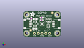
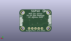
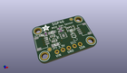

Contents
========

* [PROJ-ADAF-4829-STAN-01>Adafruit SGP40 PCB](#proj-adaf-4829-stan-01adafruit-sgp40-pcb)
	* [Images](#images)
	* [Interactive BOM](#interactive-bom)
	* [OOMP Parts](#oomp-parts)
	* [Tags](#tags)
  
![][im]
# PROJ-ADAF-4829-STAN-01>Adafruit SGP40 PCB

- ID: PROJ-ADAF-4829-STAN-01
- Hex ID: PRA4829
- Name: Adafruit SGP40 PCB
- Description: 

## Images
  
  

|eagleImage|kicadPcb3dFront|kicadPcb3dBack|kicadPcb3d|
| :---: | :---: | :---: | :---: |
|||||

## Interactive BOM

- Interactive BOM page: [ibom.html](kicad/bom/ibom.html)

## OOMP Parts
  

|OOMP Parts|
| :---: |
|CAPE-0805-X-UNMATCHED-01, C4, 7.874, 5.715, 0,C4, 10uF, 0805-NO, microbuilder, (0.31, 0.225), R0|
|CAPE-0805-X-UNMATCHED-01, C5, 8.128, 12.191999999999998, 0,C5, 10uF, 0805-NO, microbuilder, (0.32, 0.48), R0|
|CAPE-0603-X-NF100-01, C6, 12.446, 11.557, 0,C6, 0.1uF, 0603-NO, microbuilder, (0.49, 0.455), R0|
|UNMATCHED-UNMATCHED-X-UNMATCHED-01, CONN3, 22.86, 8.889999999999999, 90,CONN3, STEMMA_I2C_QT, JST_SH4, microbuilder, (0.9, 0.35), R90|
|UNMATCHED-UNMATCHED-X-UNMATCHED-01, CONN4, 2.54, 8.889999999999999, 270,CONN4, STEMMA_I2C_QT, JST_SH4, microbuilder, (0.1, 0.35), R270|
|UNMATCHED-UNMATCHED-X-UNMATCHED-01, D1, 3.556, 12.572999999999999, 90,D1, Green, CHIPLED_0603_NOOUTLINE, microbuilder, (0.14, 0.495), R90|
|UNMATCHED-UNMATCHED-X-UNMATCHED-01, JP3, 12.7, 2.54, 0,JP3, 1X05_ROUND_70, microbuilder, (0.5, 0.1), R0|
|UNMATCHED-UNMATCHED-X-UNMATCHED-01, Q2, 16.891, 7.492999999999999, 90,Q2, BSS138, SOT363, microbuilder, (0.665, 0.295), R90|
|RESE-0603-X-UNMATCHED-01, R1, 12.446, 13.208, 0,R1, 4.7ohm, 0603-NO, microbuilder, (0.49, 0.52), R0|
|<table><tr><td></td><td> R2</td><td>[RESE-0603-X-O103-01 SMD (0603) 10k Ohm Resistor](https://github.com/oomlout/oomlout_OOMP_parts/tree/main/RESE-0603-X-O103-01/)</td><td>[R6103](https://github.com/oomlout/oomlout_OOMP_parts/tree/main/RESE-0603-X-O103-01/)</td></tr></table>|
|RESE-UNMATCHED-X-O103-01, R3, 17.145, 11.43, 180,R3, 10K, RESPACK_4X0603, microbuilder, (0.675, 0.45), R180|
|UNMATCHED-UNMATCHED-X-UNMATCHED-01, U1, 8.128, 9.017, 0,U1, AP2112-3.3K, SOT23-5, microbuilder, (0.32, 0.355), R0|
|UNMATCHED-UNMATCHED-X-UNMATCHED-01, X1, 12.7, 8.889999999999999, 0,X1, SGP40, SGP30, microbuilder, (0.5, 0.35), R0|

## Tags

- hexID: PRA4829
- oompType: PROJ
- oompSize: ADAF
- oompColor: 4829
- oompDesc: STAN
- oompIndex: 01
- oompName: Adafruit SGP40 PCB
- sources: All source files from https://github.com/adafruit/Adafruit-SGP40-PCB (source licence details in srcLicense.md)
- linkBuyPage: http://www.adafruit.com/products/4829
- oompPart: CAPE-0805-X-UNMATCHED-01, C4, 7.874, 5.715, 0
- oompPart: CAPE-0805-X-UNMATCHED-01, C5, 8.128, 12.191999999999998, 0
- oompPart: CAPE-0603-X-NF100-01, C6, 12.446, 11.557, 0
- oompPart: UNMATCHED-UNMATCHED-X-UNMATCHED-01, CONN3, 22.86, 8.889999999999999, 90
- oompPart: UNMATCHED-UNMATCHED-X-UNMATCHED-01, CONN4, 2.54, 8.889999999999999, 270
- oompPart: UNMATCHED-UNMATCHED-X-UNMATCHED-01, D1, 3.556, 12.572999999999999, 90
- oompPart: SKIP-UNMATCHED-X-UNMATCHED-01, FID3, 5.08, 4.571999999999999, 0
- oompPart: SKIP-UNMATCHED-X-UNMATCHED-01, FID4, 19.558, 16.509999999999998, 0
- oompPart: UNMATCHED-UNMATCHED-X-UNMATCHED-01, JP3, 12.7, 2.54, 0
- oompPart: UNMATCHED-UNMATCHED-X-UNMATCHED-01, Q2, 16.891, 7.492999999999999, 90
- oompPart: RESE-0603-X-UNMATCHED-01, R1, 12.446, 13.208, 0
- oompPart: RESE-0603-X-O103-01, R2, 5.588, 12.446, 270
- oompPart: RESE-UNMATCHED-X-O103-01, R3, 17.145, 11.43, 180
- oompPart: SKIP-UNMATCHED-X-UNMATCHED-01, U$28, 2.54, 15.239999999999998, 0
- oompPart: SKIP-UNMATCHED-X-UNMATCHED-01, U$29, 22.86, 15.239999999999998, 0
- oompPart: SKIP-UNMATCHED-X-UNMATCHED-01, U$31, 2.54, 2.54, 0
- oompPart: SKIP-UNMATCHED-X-UNMATCHED-01, U$32, 22.86, 2.54, 0
- oompPart: UNMATCHED-UNMATCHED-X-UNMATCHED-01, U1, 8.128, 9.017, 0
- oompPart: UNMATCHED-UNMATCHED-X-UNMATCHED-01, X1, 12.7, 8.889999999999999, 0
- rawPart: C4, 10uF, 0805-NO, microbuilder, (0.31, 0.225), R0
- rawPart: C5, 10uF, 0805-NO, microbuilder, (0.32, 0.48), R0
- rawPart: C6, 0.1uF, 0603-NO, microbuilder, (0.49, 0.455), R0
- rawPart: CONN3, STEMMA_I2C_QT, JST_SH4, microbuilder, (0.9, 0.35), R90
- rawPart: CONN4, STEMMA_I2C_QT, JST_SH4, microbuilder, (0.1, 0.35), R270
- rawPart: D1, Green, CHIPLED_0603_NOOUTLINE, microbuilder, (0.14, 0.495), R90
- rawPart: FID3, FIDUCIAL_1MM, FIDUCIAL_1MM, microbuilder, (0.2, 0.18), R0
- rawPart: FID4, FIDUCIAL_1MM, FIDUCIAL_1MM, microbuilder, (0.77, 0.65), R0
- rawPart: JP3, 1X05_ROUND_70, microbuilder, (0.5, 0.1), R0
- rawPart: Q2, BSS138, SOT363, microbuilder, (0.665, 0.295), R90
- rawPart: R1, 4.7ohm, 0603-NO, microbuilder, (0.49, 0.52), R0
- rawPart: R2, 10K, 0603-NO, microbuilder, (0.22, 0.49), R270
- rawPart: R3, 10K, RESPACK_4X0603, microbuilder, (0.675, 0.45), R180
- rawPart: U$28, MOUNTINGHOLE2.5, MOUNTINGHOLE_2.5_PLATED, microbuilder, (0.1, 0.6), R0
- rawPart: U$29, MOUNTINGHOLE2.5, MOUNTINGHOLE_2.5_PLATED, microbuilder, (0.9, 0.6), R0
- rawPart: U$31, MOUNTINGHOLE2.5, MOUNTINGHOLE_2.5_PLATED, microbuilder, (0.1, 0.1), R0
- rawPart: U$32, MOUNTINGHOLE2.5, MOUNTINGHOLE_2.5_PLATED, microbuilder, (0.9, 0.1), R0
- rawPart: U1, AP2112-3.3K, SOT23-5, microbuilder, (0.32, 0.355), R0
- rawPart: X1, SGP40, SGP30, microbuilder, (0.5, 0.35), R0

[im]: kicadPcb3d_450.png
