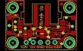

Contents
========

* [PROJ-ADAF-4836-STAN-01>Adafruit Wii Nunchuck Breakout Adapter PCB](#proj-adaf-4836-stan-01adafruit-wii-nunchuck-breakout-adapter-pcb)
	* [Images](#images)
	* [Interactive BOM](#interactive-bom)
	* [Tags](#tags)
  
![][im]
# PROJ-ADAF-4836-STAN-01>Adafruit Wii Nunchuck Breakout Adapter PCB

- ID: PROJ-ADAF-4836-STAN-01
- Hex ID: PRA4836
- Name: Adafruit Wii Nunchuck Breakout Adapter PCB
- Description: 

## Images
  
  

|eagleImage|
| :---: |
||

## Interactive BOM

- Interactive BOM page: [ibom.html](kicad/bom/ibom.html)

## Tags

- hexID: PRA4836
- oompType: PROJ
- oompSize: ADAF
- oompColor: 4836
- oompDesc: STAN
- oompIndex: 01
- oompName: Adafruit Wii Nunchuck Breakout Adapter PCB
- sources: All source files from https://github.com/adafruit/Adafruit-Wii-Nunchuck-Breakout-Adapter-PCB (source licence details in srcLicense.md)
- linkBuyPage: http://www.adafruit.com/products/4836
- oompPart: CAPC-0805-X-UF10-V25, C2, -5.6514999999999995, -6.985, 90
- oompPart: CAPC-0805-X-UF10-V25, C3, 0.254, -6.731, 270
- oompPart: UNMATCHED-UNMATCHED-X-UNMATCHED-01, CONN3, 10.16, -3.6829999999999994, 90
- oompPart: UNMATCHED-UNMATCHED-X-UNMATCHED-01, CONN4, -10.16, -3.6829999999999994, 270
- oompPart: UNMATCHED-UNMATCHED-X-UNMATCHED-01, D1, -9.143999999999998, 0.0, 90
- oompPart: SKIP-UNMATCHED-X-UNMATCHED-01, FID3, -7.302499999999999, 4.064, 0
- oompPart: SKIP-UNMATCHED-X-UNMATCHED-01, FID4, 7.302499999999999, 4.1274999999999995, 0
- oompPart: UNMATCHED-UNMATCHED-X-UNMATCHED-01, JP2, -0.254, -9.906, 0
- oompPart: UNMATCHED-UNMATCHED-X-UNMATCHED-01, Q2, 2.54, -6.858, 90
- oompPart: RESE-0603-X-O103-01, R1, -8.128, -7.302499999999999, 180
- oompPart: RESE-UNMATCHED-X-O103-01, R3, 5.334, -6.731, 90
- oompPart: SKIP-UNMATCHED-X-UNMATCHED-01, U$1, -10.16, 2.667, 0
- oompPart: SKIP-UNMATCHED-X-UNMATCHED-01, U$17, 10.16, 2.667, 0
- oompPart: SKIP-UNMATCHED-X-UNMATCHED-01, U$19, -10.16, -10.033, 0
- oompPart: SKIP-UNMATCHED-X-UNMATCHED-01, U$21, 10.16, -10.033, 0
- oompPart: UNMATCHED-UNMATCHED-X-UNMATCHED-01, U1, 0.0, 0.0, 270
- oompPart: UNMATCHED-UNMATCHED-X-UNMATCHED-01, U2, -2.667, -6.604, 270
- rawPart: 

[im]: eagleImage_450.png
