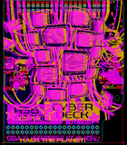

Contents
========

* [PROJ-ADAF-4863-STAN-01>Adafruit CYBERDECK PCB](#proj-adaf-4863-stan-01adafruit-cyberdeck-pcb)
	* [Images](#images)
	* [Interactive BOM](#interactive-bom)
	* [OOMP Parts](#oomp-parts)
	* [Tags](#tags)
  
![][im]
# PROJ-ADAF-4863-STAN-01>Adafruit CYBERDECK PCB

- ID: PROJ-ADAF-4863-STAN-01
- Hex ID: PRA4863
- Name: Adafruit CYBERDECK PCB
- Description: 

## Images
  
  

|eagleImage|
| :---: |
||

## Interactive BOM

- Interactive BOM page: [ibom.html](kicad/bom/ibom.html)

## OOMP Parts
  

|OOMP Parts|
| :---: |
|<table><tr><td></td><td> C1</td><td>[CAPC-0805-X-UF10-V25 SMD (0805) 10 uF Capacitor (Ceramic) 25v](https://github.com/oomlout/oomlout_OOMP_parts/tree/main/CAPC-0805-X-UF10-V25/)</td><td>[C85U010](https://github.com/oomlout/oomlout_OOMP_parts/tree/main/CAPC-0805-X-UF10-V25/)</td></tr></table>|
|<table><tr><td></td><td> C34</td><td>[CAPC-0805-X-UF10-V25 SMD (0805) 10 uF Capacitor (Ceramic) 25v](https://github.com/oomlout/oomlout_OOMP_parts/tree/main/CAPC-0805-X-UF10-V25/)</td><td>[C85U010](https://github.com/oomlout/oomlout_OOMP_parts/tree/main/CAPC-0805-X-UF10-V25/)</td></tr></table>|
|UNMATCHED-UNMATCHED-X-UNMATCHED-01, CONN1, 62.230000000000004, 43.561, 90,CONN1, STEMMA_I2C_QT, JST_SH4, microbuilder, (2.45, 1.715), R90|
|UNMATCHED-UNMATCHED-X-UNMATCHED-01, CONN3, 2.794, 43.561, 270,CONN3, STEMMA_I2C_QT, JST_SH4, microbuilder, (0.11, 1.715), R270|
|UNMATCHED-UNMATCHED-X-UNMATCHED-01, D1, 12.572999999999999, 32.9565, 270,D1, 3.6V, SOD-323, microbuilder, (0.495, 1.2975), R270|
|UNMATCHED-UNMATCHED-X-UNMATCHED-01, D2, 52.45099999999999, 35.433, 90,D2, 3.6V, SOD-323, microbuilder, (2.065, 1.395), R90|
|ERROR, NEOPIX JST PH, 0, 0, 0,NEOPIX, JST, PH, 3, JSTPH3, microbuilder, (0.185, 1.335), R90|
|<table><tr><td></td><td> R7</td><td>[RESE-0603-X-O102-01 SMD (0603) 1k Ohm Resistor](https://github.com/oomlout/oomlout_OOMP_parts/tree/main/RESE-0603-X-O102-01/)</td><td>[R6102](https://github.com/oomlout/oomlout_OOMP_parts/tree/main/RESE-0603-X-O102-01/)</td></tr></table>|
|<table><tr><td></td><td> R8</td><td>[RESE-0603-X-O102-01 SMD (0603) 1k Ohm Resistor](https://github.com/oomlout/oomlout_OOMP_parts/tree/main/RESE-0603-X-O102-01/)</td><td>[R6102](https://github.com/oomlout/oomlout_OOMP_parts/tree/main/RESE-0603-X-O102-01/)</td></tr></table>|
|UNMATCHED-UNMATCHED-X-UNMATCHED-01, RPI1, 26.669999999999998, 6.985, M180,RPI1, RASPBERRYPI_BPLUS_IDC, 2X20, adafruit_sbc, (1.05, 0.275), MR180|
|UNMATCHED-UNMATCHED-X-UNMATCHED-01, RPI3, 32.5755, 73.3289999, 0,RPI3, RASPBERRYPI_BPLUS_2X20_THMSMT_TOP, RASPI_2X20_THMSMT_TOP, adafruit_sbc, (1.2825, 2.8869685), R0|
|ERROR, SENSE JST PH, 0, 0, 0,SENSE, JST, PH, 3, JSTPH3, microbuilder, (2.38, 1.365), R270|
|UNMATCHED-UNMATCHED-X-UNMATCHED-01, SJ1, 11.049, 38.4175, 0,SJ1, SOLDERJUMPER_2WAY_OPEN_NOPASTE, microbuilder, (0.435, 1.5125), R0|

## Tags

- hexID: PRA4863
- oompType: PROJ
- oompSize: ADAF
- oompColor: 4863
- oompDesc: STAN
- oompIndex: 01
- oompName: Adafruit CYBERDECK PCB
- sources: All source files from https://github.com/adafruit/Adafruit-CYBERDECK-PCB (source licence details in srcLicense.md)
- linkBuyPage: http://www.adafruit.com/products/4863
- oompPart: CAPC-0805-X-UF10-V25, C1, 54.22899999999999, 35.687, 90
- oompPart: CAPC-0805-X-UF10-V25, C34, 10.731499999999999, 32.829499999999996, 270
- oompPart: UNMATCHED-UNMATCHED-X-UNMATCHED-01, CONN1, 62.230000000000004, 43.561, 90
- oompPart: UNMATCHED-UNMATCHED-X-UNMATCHED-01, CONN3, 2.794, 43.561, 270
- oompPart: UNMATCHED-UNMATCHED-X-UNMATCHED-01, D1, 12.572999999999999, 32.9565, 270
- oompPart: UNMATCHED-UNMATCHED-X-UNMATCHED-01, D2, 52.45099999999999, 35.433, 90
- oompPart: SKIP-UNMATCHED-X-UNMATCHED-01, FID1, 1.778, 2.794, 0
- oompPart: SKIP-UNMATCHED-X-UNMATCHED-01, FID2, 1.651, 70.10399999999998, 0
- oompPart: SKIP-UNMATCHED-X-UNMATCHED-01, FID3, 51.56199999999999, 2.794, 0
- oompPart: ERROR, NEOPIX JST PH, 0, 0, 0
- oompPart: RESE-0603-X-O102-01, R7, 11.4935, 35.8775, 0
- oompPart: RESE-0603-X-O102-01, R8, 53.2765, 32.638999999999996, 180
- oompPart: UNMATCHED-UNMATCHED-X-UNMATCHED-01, RPI1, 26.669999999999998, 6.985, M180
- oompPart: UNMATCHED-UNMATCHED-X-UNMATCHED-01, RPI3, 32.5755, 73.3289999, 0
- oompPart: ERROR, SENSE JST PH, 0, 0, 0
- oompPart: UNMATCHED-UNMATCHED-X-UNMATCHED-01, SJ1, 11.049, 38.4175, 0
- rawPart: C1, 10uF, 0805-NO, microbuilder, (2.135, 1.405), R90
- rawPart: C34, 10uF, 0805-NO, microbuilder, (0.4225, 1.2925), R270
- rawPart: CONN1, STEMMA_I2C_QT, JST_SH4, microbuilder, (2.45, 1.715), R90
- rawPart: CONN3, STEMMA_I2C_QT, JST_SH4, microbuilder, (0.11, 1.715), R270
- rawPart: D1, 3.6V, SOD-323, microbuilder, (0.495, 1.2975), R270
- rawPart: D2, 3.6V, SOD-323, microbuilder, (2.065, 1.395), R90
- rawPart: FID1, FIDUCIAL_1MM, FIDUCIAL_1MM, microbuilder, (0.07, 0.11), R0
- rawPart: FID2, FIDUCIAL_1MM, FIDUCIAL_1MM, microbuilder, (0.065, 2.76), R0
- rawPart: FID3, FIDUCIAL_1MM, FIDUCIAL_1MM, microbuilder, (2.03, 0.11), R0
- rawPart: NEOPIX, JST, PH, 3, JSTPH3, microbuilder, (0.185, 1.335), R90
- rawPart: R7, 1K, 0603-NO, microbuilder, (0.4525, 1.4125), R0
- rawPart: R8, 1K, 0603-NO, microbuilder, (2.0975, 1.285), R180
- rawPart: RPI1, RASPBERRYPI_BPLUS_IDC, 2X20, adafruit_sbc, (1.05, 0.275), MR180
- rawPart: RPI3, RASPBERRYPI_BPLUS_2X20_THMSMT_TOP, RASPI_2X20_THMSMT_TOP, adafruit_sbc, (1.2825, 2.8869685), R0
- rawPart: SENSE, JST, PH, 3, JSTPH3, microbuilder, (2.38, 1.365), R270
- rawPart: SJ1, SOLDERJUMPER_2WAY_OPEN_NOPASTE, microbuilder, (0.435, 1.5125), R0

[im]: eagleImage_450.png
