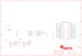

Contents
========

* [PRA4863 > Adafruit](#pra4863--adafruit)
	* [Schematic](#schematic)
	* [Interactive BOM](#interactive-bom)
	* [OOMP Parts](#oomp-parts)
	* [Images](#images)
	* [Tags](#tags)
  
![][im]
# PRA4863 > Adafruit

- ID: PROJ-ADAF-4863-STAN-01
- Hex ID: PRA4863
- Name: Adafruit
- Description: Adafruit
- Long Link: [http://oom.lt/PROJ-ADAF-4863-STAN-01](http://oom.lt/PROJ-ADAF-4863-STAN-01)
- Short Link: [http://oom.lt/PRA4863](http://oom.lt/PRA4863)

## Schematic
  

## Interactive BOM

- Interactive BOM page: [ibom.html](https://htmlpreview.github.io/?https://github.com/oomlout/oomlout_OOMP_projects/blob/main/PROJ-ADAF-4863-STAN-01/kicad/bom/ibom.html)

## OOMP Parts
  

|OOMP Parts|
| :---: |
|C1,CAPC-0805-X-UF10-V10,C1,10uF,CAP_CERAMIC0805-NOOUTLINE,0805-NO,Ceramic Capacitors,,|
|C34,CAPC-0805-X-UF10-V10,C34,10uF,CAP_CERAMIC0805-NOOUTLINE,0805-NO,Ceramic Capacitors,,|
|CONN1,UNMATCHED-UNMATCHED-X-UNMATCHED-01,CONN1,STEMMA_I2C_QT,STEMMA_I2C_QT,JST_SH4,,,|
|CONN3,UNMATCHED-UNMATCHED-X-UNMATCHED-01,CONN3,STEMMA_I2C_QT,STEMMA_I2C_QT,JST_SH4,,,|
|D1,DIOD-S323-X-UNMATCHED-01,D1,3.6V,DIODE-ZENERSOD323,SOD-323,Zener Diode,,|
|D2,DIOD-S323-X-UNMATCHED-01,D2,3.6V,DIODE-ZENERSOD323,SOD-323,Zener Diode,,|
|NEOPIX,UNMATCHED-UNMATCHED-X-UNMATCHED-01,FID1,FIDUCIAL_1MM,FIDUCIAL_1MM,FIDUCIAL_1MM,Fiducial Alignment Points,EXCLUDE,|
|R7,RESE-0603-X-O102-01,FID2,FIDUCIAL_1MM,FIDUCIAL_1MM,FIDUCIAL_1MM,Fiducial Alignment Points,EXCLUDE,|
|R8,RESE-0603-X-O102-01,FID3,FIDUCIAL_1MM,FIDUCIAL_1MM,FIDUCIAL_1MM,Fiducial Alignment Points,EXCLUDE,|
|RPI1,UNMATCHED-UNMATCHED-X-UNMATCHED-01,NEOPIX,JST PH 3,CON_JST_PH_3PIN,JSTPH3,,,|
|RPI3,UNMATCHED-UNMATCHED-X-UNMATCHED-01,R7,1K,RESISTOR_0603_NOOUT,0603-NO,Resistors,,|
|SENSE,UNMATCHED-UNMATCHED-X-UNMATCHED-01,R8,1K,RESISTOR_0603_NOOUT,0603-NO,Resistors,,|

## Images
  
  

|kicadPcb3d|kicadPcb3dFront|kicadPcb3dBack|eagleImage|eagleSchemImage|
| :---: | :---: | :---: | :---: | :---: |
||||||

## Tags

- hexID: PRA4863
- oompType: PROJ
- oompSize: ADAF
- oompColor: 4863
- oompDesc: STAN
- oompIndex: 01
- oompName: Adafruit CYBERDECK PCB
- sources: All source files from https://github.com/adafruit/Adafruit-CYBERDECK-PCB (source licence details in srcLicense.md)
- linkBuyPage: http://www.adafruit.com/products/4863
- oompID: PROJ-ADAF-4863-STAN-01
- oompParts: C1,CAPC-0805-X-UF10-V10
- oompParts: C34,CAPC-0805-X-UF10-V10
- oompParts: CONN1,UNMATCHED-UNMATCHED-X-UNMATCHED-01
- oompParts: CONN3,UNMATCHED-UNMATCHED-X-UNMATCHED-01
- oompParts: D1,DIOD-S323-X-UNMATCHED-01
- oompParts: D2,DIOD-S323-X-UNMATCHED-01
- oompParts: NEOPIX,UNMATCHED-UNMATCHED-X-UNMATCHED-01
- oompParts: R7,RESE-0603-X-O102-01
- oompParts: R8,RESE-0603-X-O102-01
- oompParts: RPI1,UNMATCHED-UNMATCHED-X-UNMATCHED-01
- oompParts: RPI3,UNMATCHED-UNMATCHED-X-UNMATCHED-01
- oompParts: SENSE,UNMATCHED-UNMATCHED-X-UNMATCHED-01
- rawParts: C1,10uF,CAP_CERAMIC0805-NOOUTLINE,0805-NO,Ceramic Capacitors,,
- rawParts: C34,10uF,CAP_CERAMIC0805-NOOUTLINE,0805-NO,Ceramic Capacitors,,
- rawParts: CONN1,STEMMA_I2C_QT,STEMMA_I2C_QT,JST_SH4,,,
- rawParts: CONN3,STEMMA_I2C_QT,STEMMA_I2C_QT,JST_SH4,,,
- rawParts: D1,3.6V,DIODE-ZENERSOD323,SOD-323,Zener Diode,,
- rawParts: D2,3.6V,DIODE-ZENERSOD323,SOD-323,Zener Diode,,
- rawParts: FID1,FIDUCIAL_1MM,FIDUCIAL_1MM,FIDUCIAL_1MM,Fiducial Alignment Points,EXCLUDE,
- rawParts: FID2,FIDUCIAL_1MM,FIDUCIAL_1MM,FIDUCIAL_1MM,Fiducial Alignment Points,EXCLUDE,
- rawParts: FID3,FIDUCIAL_1MM,FIDUCIAL_1MM,FIDUCIAL_1MM,Fiducial Alignment Points,EXCLUDE,
- rawParts: NEOPIX,JST PH 3,CON_JST_PH_3PIN,JSTPH3,,,
- rawParts: R7,1K,RESISTOR_0603_NOOUT,0603-NO,Resistors,,
- rawParts: R8,1K,RESISTOR_0603_NOOUT,0603-NO,Resistors,,
- rawParts: RPI1,RASPBERRYPI_BPLUS_IDC,RASPBERRYPI_BPLUS_IDC,2X20,,,
- rawParts: RPI3,RASPBERRYPI_BPLUS_2X20_THMSMT_TOP,RASPBERRYPI_BPLUS_2X20_THMSMT_TOP,RASPI_2X20_THMSMT_TOP,,,
- rawParts: SENSE,JST PH 3,CON_JST_PH_3PIN,JSTPH3,,,
- rawParts: SJ1,,SOLDERJUMPER_2WAY,SOLDERJUMPER_2WAY_OPEN_NOPASTE,2-Way Solder Jumper,,

[im]: kicadPcb3d_450.png
