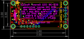
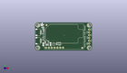
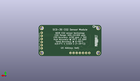
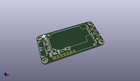

Contents
========

* [PROJ-ADAF-4867-STAN-01>Adafruit SCD 30 PCB](#proj-adaf-4867-stan-01adafruit-scd-30-pcb)
	* [Images](#images)
	* [Interactive BOM](#interactive-bom)
	* [OOMP Parts](#oomp-parts)
	* [Tags](#tags)
  
![][im]
# PROJ-ADAF-4867-STAN-01>Adafruit SCD 30 PCB

- ID: PROJ-ADAF-4867-STAN-01
- Hex ID: PRA4867
- Name: Adafruit SCD 30 PCB
- Description: 

## Images
  
  

|eagleImage|kicadPcb3dFront|kicadPcb3dBack|kicadPcb3d|
| :---: | :---: | :---: | :---: |
|||||

## Interactive BOM

- Interactive BOM page: [ibom.html](kicad/bom/ibom.html)

## OOMP Parts
  

|OOMP Parts|
| :---: |
|<table><tr><td></td><td> C1</td><td>[CAPC-0603-X-NF100-V50 SMD (0603) 100 nF Capacitor (Ceramic) 50v](https://github.com/oomlout/oomlout_OOMP_parts/tree/main/CAPC-0603-X-NF100-V50/)</td><td>[C6N100](https://github.com/oomlout/oomlout_OOMP_parts/tree/main/CAPC-0603-X-NF100-V50/)</td></tr></table>|
|CAPC-0805-X-UNMATCHED-01, C2, 7.365999999999999, 5.715, 270,C2, 10uF, 0805-NO, microbuilder, (0.29, 0.225), R270|
|CAPC-0805-X-UNMATCHED-01, C3, 13.843, 5.968999999999999, 270,C3, 10uF, 0805-NO, microbuilder, (0.545, 0.235), R270|
|UNMATCHED-UNMATCHED-X-UNMATCHED-01, CONN3, 2.667, 16.509999999999998, 270,CONN3, STEMMA_I2C_QT, JST_SH4, microbuilder, (0.105, 0.65), R270|
|UNMATCHED-UNMATCHED-X-UNMATCHED-01, CONN4, 2.667, 8.889999999999999, 270,CONN4, STEMMA_I2C_QT, JST_SH4, microbuilder, (0.105, 0.35), R270|
|UNMATCHED-UNMATCHED-X-UNMATCHED-01, D1, 6.731, 20.955, 90,D1, GREEN, CHIPLED_0603_NOOUTLINE, microbuilder, (0.265, 0.825), R90|
|<table><tr><td></td><td> JP1</td><td>[HEAD-I01-X-PI06-01 2.54 mm 6 Pin Header](https://github.com/oomlout/oomlout_OOMP_parts/tree/main/HEAD-I01-X-PI06-01/)</td><td>[H06](https://github.com/oomlout/oomlout_OOMP_parts/tree/main/HEAD-I01-X-PI06-01/)</td></tr></table>|
|UNMATCHED-UNMATCHED-X-UNMATCHED-01, Q2, 16.764, 5.715, 0,Q2, BSS138, SOT363, microbuilder, (0.66, 0.225), R0|
|<table><tr><td></td><td> R1</td><td>[RESE-0603-X-O103-01 SMD (0603) 10k Ohm Resistor](https://github.com/oomlout/oomlout_OOMP_parts/tree/main/RESE-0603-X-O103-01/)</td><td>[R6103](https://github.com/oomlout/oomlout_OOMP_parts/tree/main/RESE-0603-X-O103-01/)</td></tr></table>|
|RESE-UNMATCHED-X-O103-01, R3, 21.081999999999997, 6.223, 180,R3, 10K, RESPACK_4X0603, microbuilder, (0.83, 0.245), R180|
|UNMATCHED-UNMATCHED-X-UNMATCHED-01, U2, 10.668, 7.492999999999999, 270,U2, AP2112K-3.3, SOT23-5, microbuilder, (0.42, 0.295), R270|
|UNMATCHED-UNMATCHED-X-UNMATCHED-01, X1, 26.162, 12.572999999999999, 270,X1, SCD30, SCD30, adafruit_sensor, (1.03, 0.495), R270|

## Tags

- hexID: PRA4867
- oompType: PROJ
- oompSize: ADAF
- oompColor: 4867
- oompDesc: STAN
- oompIndex: 01
- oompName: Adafruit SCD 30 PCB
- sources: All source files from https://github.com/adafruit/Adafruit-SCD-30-PCB (source licence details in srcLicense.md)
- linkBuyPage: http://www.adafruit.com/products/4867
- oompPart: CAPC-0603-X-NF100-V50, C1, 10.921999999999999, 4.953, 0
- oompPart: CAPC-0805-X-UNMATCHED-01, C2, 7.365999999999999, 5.715, 270
- oompPart: CAPC-0805-X-UNMATCHED-01, C3, 13.843, 5.968999999999999, 270
- oompPart: UNMATCHED-UNMATCHED-X-UNMATCHED-01, CONN3, 2.667, 16.509999999999998, 270
- oompPart: UNMATCHED-UNMATCHED-X-UNMATCHED-01, CONN4, 2.667, 8.889999999999999, 270
- oompPart: UNMATCHED-UNMATCHED-X-UNMATCHED-01, D1, 6.731, 20.955, 90
- oompPart: SKIP-UNMATCHED-X-UNMATCHED-01, FID3, 42.037, 2.413, 0
- oompPart: SKIP-UNMATCHED-X-UNMATCHED-01, FID4, 10.287, 22.987, 0
- oompPart: HEAD-I01-X-PI06-01, JP1, 48.26, 12.7, 90
- oompPart: UNMATCHED-UNMATCHED-X-UNMATCHED-01, Q2, 16.764, 5.715, 0
- oompPart: RESE-0603-X-O103-01, R1, 7.492999999999999, 18.541999999999998, 90
- oompPart: RESE-UNMATCHED-X-O103-01, R3, 21.081999999999997, 6.223, 180
- oompPart: SKIP-UNMATCHED-X-UNMATCHED-01, U$1, 2.54, 22.86, 0
- oompPart: SKIP-UNMATCHED-X-UNMATCHED-01, U$17, 48.26, 22.86, 0
- oompPart: SKIP-UNMATCHED-X-UNMATCHED-01, U$19, 2.54, 2.54, 0
- oompPart: SKIP-UNMATCHED-X-UNMATCHED-01, U$21, 48.26, 2.54, 0
- oompPart: UNMATCHED-UNMATCHED-X-UNMATCHED-01, U2, 10.668, 7.492999999999999, 270
- oompPart: UNMATCHED-UNMATCHED-X-UNMATCHED-01, X1, 26.162, 12.572999999999999, 270
- rawPart: C1, 0.1uF, 0603-NO, microbuilder, (0.43, 0.195), R0
- rawPart: C2, 10uF, 0805-NO, microbuilder, (0.29, 0.225), R270
- rawPart: C3, 10uF, 0805-NO, microbuilder, (0.545, 0.235), R270
- rawPart: CONN3, STEMMA_I2C_QT, JST_SH4, microbuilder, (0.105, 0.65), R270
- rawPart: CONN4, STEMMA_I2C_QT, JST_SH4, microbuilder, (0.105, 0.35), R270
- rawPart: D1, GREEN, CHIPLED_0603_NOOUTLINE, microbuilder, (0.265, 0.825), R90
- rawPart: FID3, FIDUCIAL_1MM, FIDUCIAL_1MM, microbuilder, (1.655, 0.095), R0
- rawPart: FID4, FIDUCIAL_1MM, FIDUCIAL_1MM, microbuilder, (0.405, 0.905), R0
- rawPart: JP1, 1X06_ROUND_70, microbuilder, (1.9, 0.5), R90
- rawPart: Q2, BSS138, SOT363, microbuilder, (0.66, 0.225), R0
- rawPart: R1, 10K, 0603-NO, microbuilder, (0.295, 0.73), R90
- rawPart: R3, 10K, RESPACK_4X0603, microbuilder, (0.83, 0.245), R180
- rawPart: U$1, MOUNTINGHOLE2.5, MOUNTINGHOLE_2.5_PLATED, microbuilder, (0.1, 0.9), R0
- rawPart: U$17, MOUNTINGHOLE2.5, MOUNTINGHOLE_2.5_PLATED, microbuilder, (1.9, 0.9), R0
- rawPart: U$19, MOUNTINGHOLE2.5, MOUNTINGHOLE_2.5_PLATED, microbuilder, (0.1, 0.1), R0
- rawPart: U$21, MOUNTINGHOLE2.5, MOUNTINGHOLE_2.5_PLATED, microbuilder, (1.9, 0.1), R0
- rawPart: U2, AP2112K-3.3, SOT23-5, microbuilder, (0.42, 0.295), R270
- rawPart: X1, SCD30, SCD30, adafruit_sensor, (1.03, 0.495), R270
- oompID: PROJ-ADAF-4867-STAN-01

[im]: kicadPcb3d_450.png
