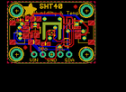

Contents
========

* [PROJ-ADAF-4885-STAN-01>Adafruit SHT40 PCB](#proj-adaf-4885-stan-01adafruit-sht40-pcb)
	* [Images](#images)
	* [Interactive BOM](#interactive-bom)
	* [Tags](#tags)
  
![][im]
# PROJ-ADAF-4885-STAN-01>Adafruit SHT40 PCB

- ID: PROJ-ADAF-4885-STAN-01
- Hex ID: PRA4885
- Name: Adafruit SHT40 PCB
- Description: 

## Images
  
  

|eagleImage|
| :---: |
||

## Interactive BOM

- Interactive BOM page: [ibom.html](kicad/bom/ibom.html)

## Tags

- hexID: PRA4885
- oompType: PROJ
- oompSize: ADAF
- oompColor: 4885
- oompDesc: STAN
- oompIndex: 01
- oompName: Adafruit SHT40 PCB
- sources: All source files from https://github.com/adafruit/Adafruit-SHT40-PCB (source licence details in srcLicense.md)
- linkBuyPage: http://www.adafruit.com/products/4885

[im]: eagleImage_450.png
