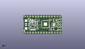
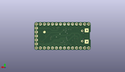
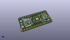

Contents
========

* [PROJ-ADAF-4888-STAN-01>Adafruit ItsyBitsy RP2040 PCB](#proj-adaf-4888-stan-01adafruit-itsybitsy-rp2040-pcb)
	* [Images](#images)
	* [Interactive BOM](#interactive-bom)
	* [Tags](#tags)
  
![][im]
# PROJ-ADAF-4888-STAN-01>Adafruit ItsyBitsy RP2040 PCB

- ID: PROJ-ADAF-4888-STAN-01
- Hex ID: PRA4888
- Name: Adafruit ItsyBitsy RP2040 PCB
- Description: 

## Images
  
  

|eagleImage|kicadPcb3dFront|kicadPcb3dBack|kicadPcb3d|
| :---: | :---: | :---: | :---: |
|||||

## Interactive BOM

- Interactive BOM page: [ibom.html](kicad/bom/ibom.html)

## Tags

- hexID: PRA4888
- oompType: PROJ
- oompSize: ADAF
- oompColor: 4888
- oompDesc: STAN
- oompIndex: 01
- oompName: Adafruit ItsyBitsy RP2040 PCB
- sources: All source files from https://github.com/adafruit/Adafruit-ItsyBitsy-RP2040-PCB (source licence details in srcLicense.md)
- linkBuyPage: http://www.adafruit.com/products/4888
- oompID: PROJ-ADAF-4888-STAN-01
- oompParts: C2,UNMATCHED-UNMATCHED-UNMATCHED-UNMATCHED-UNMATCHED
- oompParts: C3,UNMATCHED-UNMATCHED-UNMATCHED-UNMATCHED-UNMATCHED
- oompParts: C4,UNMATCHED-UNMATCHED-UNMATCHED-UNMATCHED-UNMATCHED
- oompParts: C6,UNMATCHED-UNMATCHED-UNMATCHED-UNMATCHED-UNMATCHED
- oompParts: C8,UNMATCHED-UNMATCHED-UNMATCHED-UNMATCHED-UNMATCHED
- oompParts: C10,UNMATCHED-UNMATCHED-UNMATCHED-UNMATCHED-UNMATCHED
- oompParts: C11,UNMATCHED-UNMATCHED-UNMATCHED-UNMATCHED-UNMATCHED
- oompParts: C12,UNMATCHED-UNMATCHED-UNMATCHED-UNMATCHED-UNMATCHED
- oompParts: C13,UNMATCHED-UNMATCHED-UNMATCHED-UNMATCHED-UNMATCHED
- oompParts: C16,UNMATCHED-UNMATCHED-UNMATCHED-UNMATCHED-UNMATCHED
- oompParts: C19,UNMATCHED-UNMATCHED-UNMATCHED-UNMATCHED-UNMATCHED
- oompParts: C20,UNMATCHED-UNMATCHED-UNMATCHED-UNMATCHED-UNMATCHED
- oompParts: D1,UNMATCHED-UNMATCHED-UNMATCHED-UNMATCHED-UNMATCHED
- oompParts: D2,UNMATCHED-UNMATCHED-UNMATCHED-UNMATCHED-UNMATCHED
- oompParts: D3,UNMATCHED-UNMATCHED-UNMATCHED-UNMATCHED-UNMATCHED
- oompParts: IC1,UNMATCHED-UNMATCHED-UNMATCHED-UNMATCHED-UNMATCHED
- oompParts: IC3,UNMATCHED-UNMATCHED-UNMATCHED-UNMATCHED-UNMATCHED
- oompParts: JP1,UNMATCHED-UNMATCHED-UNMATCHED-UNMATCHED-UNMATCHED
- oompParts: JP2,UNMATCHED-UNMATCHED-UNMATCHED-UNMATCHED-UNMATCHED
- oompParts: JP4,UNMATCHED-UNMATCHED-UNMATCHED-UNMATCHED-UNMATCHED
- oompParts: L,UNMATCHED-UNMATCHED-UNMATCHED-UNMATCHED-UNMATCHED
- oompParts: LED1,UNMATCHED-UNMATCHED-UNMATCHED-UNMATCHED-UNMATCHED
- oompParts: R1,UNMATCHED-UNMATCHED-UNMATCHED-UNMATCHED-UNMATCHED
- oompParts: R2,UNMATCHED-UNMATCHED-UNMATCHED-UNMATCHED-UNMATCHED
- oompParts: R3,UNMATCHED-UNMATCHED-UNMATCHED-UNMATCHED-UNMATCHED
- oompParts: R4,UNMATCHED-UNMATCHED-UNMATCHED-UNMATCHED-UNMATCHED
- oompParts: R5,UNMATCHED-UNMATCHED-UNMATCHED-UNMATCHED-UNMATCHED
- oompParts: R6,UNMATCHED-UNMATCHED-UNMATCHED-UNMATCHED-UNMATCHED
- oompParts: R7,UNMATCHED-UNMATCHED-UNMATCHED-UNMATCHED-UNMATCHED
- oompParts: R11,UNMATCHED-UNMATCHED-UNMATCHED-UNMATCHED-UNMATCHED
- oompParts: SW2,UNMATCHED-UNMATCHED-UNMATCHED-UNMATCHED-UNMATCHED
- oompParts: SW3,UNMATCHED-UNMATCHED-UNMATCHED-UNMATCHED-UNMATCHED
- oompParts: TP1,UNMATCHED-UNMATCHED-UNMATCHED-UNMATCHED-UNMATCHED
- oompParts: U1,UNMATCHED-UNMATCHED-UNMATCHED-UNMATCHED-UNMATCHED
- oompParts: U2,UNMATCHED-UNMATCHED-UNMATCHED-UNMATCHED-UNMATCHED
- oompParts: X3,UNMATCHED-UNMATCHED-UNMATCHED-UNMATCHED-UNMATCHED
- oompParts: Y1,UNMATCHED-UNMATCHED-UNMATCHED-UNMATCHED-UNMATCHED
- rawParts: C2,1uF,CAP_CERAMIC_0603MP,_0603MP,Ceramic Capacitors,,,
- rawParts: C3,0.1uF,CAP_CERAMIC_0402NO,_0402NO,Ceramic Capacitors,,,
- rawParts: C4,0.1uF,CAP_CERAMIC_0402NO,_0402NO,Ceramic Capacitors,,,
- rawParts: C6,10µF,CAP_CERAMIC0805-NOOUTLINE,0805-NO,Ceramic Capacitors,,,
- rawParts: C8,10µF,CAP_CERAMIC0805-NOOUTLINE,0805-NO,Ceramic Capacitors,,,
- rawParts: C10,0.1uF,CAP_CERAMIC_0402NO,_0402NO,Ceramic Capacitors,,,
- rawParts: C11,1uF,CAP_CERAMIC_0603MP,_0603MP,Ceramic Capacitors,,,
- rawParts: C12,0.1uF,CAP_CERAMIC_0402NO,_0402NO,Ceramic Capacitors,,,
- rawParts: C13,0.1uF,CAP_CERAMIC_0402NO,_0402NO,Ceramic Capacitors,,,
- rawParts: C16,0.1uF,CAP_CERAMIC_0402NO,_0402NO,Ceramic Capacitors,,,
- rawParts: C19,22pF,CAP_CERAMIC_0402NO,_0402NO,Ceramic Capacitors,,,
- rawParts: C20,22pF,CAP_CERAMIC_0402NO,_0402NO,Ceramic Capacitors,,,
- rawParts: D1,NSR0320,DIODESOD-323F,SOD-323F,Diode,,,
- rawParts: D2,NSR0320,DIODESOD-323F,SOD-323F,Diode,,,
- rawParts: D3,NSR0320,DIODESOD-323F,SOD-323F,Diode,,,
- rawParts: IC1,74HCT1G125DBV,74AHC1G125DCK,SC70-5,Single Bus Buffer Gate with 3-State Output,,0,
- rawParts: IC3,RP2040_QFN56,RP2040_QFN56,QFN56_7MM_REDUCEDEPAD,,,,
- rawParts: JP1,,HEADER-1X570MIL,1X05_ROUND_70,PIN HEADER,,,
- rawParts: JP2,,HEADER-1X14,1X14_ROUND70,,,,
- rawParts: JP4,,HEADER-1X14,1X14_ROUND70,,,,
- rawParts: L,RED,LED0603_NOOUTLINE,CHIPLED_0603_NOOUTLINE,LED,,,
- rawParts: LED1,WS2812B_SK6805_1515,WS2812B_SK6805_1515,SK6805_1515,,,,
- rawParts: R1,10K,RESISTOR_0402NO,_0402NO,Resistors,,,
- rawParts: R2,10k,RESISTOR_0402NO,_0402NO,Resistors,,,
- rawParts: R3,22,RESISTOR_0402NO,_0402NO,Resistors,,,
- rawParts: R4,22,RESISTOR_0402NO,_0402NO,Resistors,,,
- rawParts: R5,10K,RESISTOR_0402NO,_0402NO,Resistors,,,
- rawParts: R6,1K,RESISTOR_0402NO,_0402NO,Resistors,,,
- rawParts: R7,1K,RESISTOR_0402NO,_0402NO,Resistors,,,
- rawParts: R11,1K,RESISTOR_0402NO,_0402NO,Resistors,,,
- rawParts: SW2,KMR2,SWITCH_TACT_SMT4.6X2.8,BTN_KMR2_4.6X2.8,SMT Tact Switches,,,
- rawParts: SW3,KMR2,SWITCH_TACT_SMT4.6X2.8,BTN_KMR2_4.6X2.8,SMT Tact Switches,,,
- rawParts: TP1,,TESTPOINTROUND1.5MMNO,TESTPOINT_ROUND_1.5MM_NO,Test Point,,,
- rawParts: U$34,FIDUCIAL_1MM,FIDUCIAL_1MM,FIDUCIAL_1MM,Fiducial Alignment Points,EXCLUDE,,
- rawParts: U$35,FIDUCIAL_1MM,FIDUCIAL_1MM,FIDUCIAL_1MM,Fiducial Alignment Points,EXCLUDE,,
- rawParts: U1,GD25x16,SPIFLASH_8PIN_4X4,USON8_4X4,SOIC8 SPI Flash,,,
- rawParts: U2,AP2112K-3.3,VREG_SOT23-5,SOT23-5,SOT23-5 Fixed Voltage Regulators,,,
- rawParts: X3,microUSB,USB_MICRO_NARROW,4UCONN_20329_NARROW,USB Connectors,,,
- rawParts: Y1,12MHZ,CRYSTAL2.5X2.0,CRYSTAL_2.5X2,Crystals,,,

[im]: kicadPcb3d_450.png
