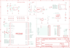

Contents
========

* [PRA4888 > Adafruit ItsyBitsy RP2040 PCB](#pra4888--adafruit-itsybitsy-rp2040-pcb)
	* [Schematic](#schematic)
	* [PCB](#pcb)
	* [Interactive BOM](#interactive-bom)
	* [OOMP Parts](#oomp-parts)
	* [Images](#images)
	* [Tags](#tags)
  
![][im]
# PRA4888 > Adafruit ItsyBitsy RP2040 PCB

- ID: PROJ-ADAF-4888-STAN-01
- Hex ID: PRA4888
- Name: Adafruit
- Description: Adafruit
- Long Link: [http://oom.lt/PROJ-ADAF-4888-STAN-01](http://oom.lt/PROJ-ADAF-4888-STAN-01)
- Short Link: [http://oom.lt/PRA4888](http://oom.lt/PRA4888)

## Schematic
  

## PCB
  

## Interactive BOM

- Interactive BOM page: [ibom.html](https://htmlpreview.github.io/?https://github.com/oomlout/oomlout_OOMP_projects/blob/main/PROJ-ADAF-4888-STAN-01/kicad/bom/ibom.html)

## OOMP Parts
  

|OOMP Parts|
| :---: |
|C2 C2,CAPC-0603-X-UF1-01|
|C3 C3,CAPC-0402-X-UF1D-01|
|C4 C4,CAPC-0402-X-UF1D-01|
|[C6 CAPC-0805-X-UF10-V10 SMD (0805) 10 uF Capacitor (Ceramic) 10v](https://github.com/oomlout/oomlout_OOMP_parts/tree/main/CAPC-0805-X-UF10-V10/)|
|[C8 CAPC-0805-X-UF10-V10 SMD (0805) 10 uF Capacitor (Ceramic) 10v](https://github.com/oomlout/oomlout_OOMP_parts/tree/main/CAPC-0805-X-UF10-V10/)|
|C10 C10,CAPC-0402-X-UF1D-01|
|C11 C11,CAPC-0603-X-UF1-01|
|C12 C12,CAPC-0402-X-UF1D-01|
|C13 C13,CAPC-0402-X-UF1D-01|
|C16 C16,CAPC-0402-X-UF1D-01|
|C19 C19,CAPC-0402-X-PF22-01|
|C20 C20,CAPC-0402-X-PF22-01|
|D1 D1,DIOD-S323-X-UNMATCHED-01|
|D2 D2,DIOD-S323-X-UNMATCHED-01|
|D3 D3,DIOD-S323-X-UNMATCHED-01|
|IC1 IC1,UNMATCHED-UNMATCHED-X-UNMATCHED-01|
|IC3 IC3,UNMATCHED-UNMATCHED-X-UNMATCHED-01|
|[JP1 HEAD-I01-X-PI05-01 2.54 mm 5 Pin Header](https://github.com/oomlout/oomlout_OOMP_parts/tree/main/HEAD-I01-X-PI05-01/)|
|[JP2 HEAD-I01-X-PI14-01 2.54 mm 14 Pin Header](https://github.com/oomlout/oomlout_OOMP_parts/tree/main/HEAD-I01-X-PI14-01/)|
|[JP4 HEAD-I01-X-PI14-01 2.54 mm 14 Pin Header](https://github.com/oomlout/oomlout_OOMP_parts/tree/main/HEAD-I01-X-PI14-01/)|
|[L LEDS-0603-G-STAN-01 SMD (0603) Green LED](https://github.com/oomlout/oomlout_OOMP_parts/tree/main/LEDS-0603-G-STAN-01/)|
|LED1 LED1,LEDS-UNMATCHED-RGB-K2812-01|
|[R1 RESE-0402-X-O103-01 SMD (0402) 10k Ohm Resistor](https://github.com/oomlout/oomlout_OOMP_parts/tree/main/RESE-0402-X-O103-01/)|
|[R2 RESE-0402-X-O103-01 SMD (0402) 10k Ohm Resistor](https://github.com/oomlout/oomlout_OOMP_parts/tree/main/RESE-0402-X-O103-01/)|
|R3 R3,RESE-0402-X-O220-01|
|R4 R4,RESE-0402-X-O220-01|
|[R5 RESE-0402-X-O103-01 SMD (0402) 10k Ohm Resistor](https://github.com/oomlout/oomlout_OOMP_parts/tree/main/RESE-0402-X-O103-01/)|
|[R6 RESE-0402-X-O102-01 SMD (0402) 1k Ohm Resistor](https://github.com/oomlout/oomlout_OOMP_parts/tree/main/RESE-0402-X-O102-01/)|
|[R7 RESE-0402-X-O102-01 SMD (0402) 1k Ohm Resistor](https://github.com/oomlout/oomlout_OOMP_parts/tree/main/RESE-0402-X-O102-01/)|
|[R11 RESE-0402-X-O102-01 SMD (0402) 1k Ohm Resistor](https://github.com/oomlout/oomlout_OOMP_parts/tree/main/RESE-0402-X-O102-01/)|
|SW2 SW2,UNMATCHED-UNMATCHED-X-UNMATCHED-01|
|SW3 SW3,UNMATCHED-UNMATCHED-X-UNMATCHED-01|
|TP1 TP1,UNMATCHED-UNMATCHED-X-UNMATCHED-01|
|U1 U1,UNMATCHED-UNMATCHED-X-UNMATCHED-01|
|U2 U2,VREG-SO235-X-KAP2112K-V33D|
|X3 X3,UNMATCHED-UNMATCHED-X-UNMATCHED-01|
|Y1 Y1,UNMATCHED-UNMATCHED-X-UNMATCHED-01|

## Images
  
  

|kicadPcb3d|kicadPcb3dFront|kicadPcb3dBack|eagleImage|eagleSchemImage|
| :---: | :---: | :---: | :---: | :---: |
||||||

## Tags

- hexID: PRA4888
- oompType: PROJ
- oompSize: ADAF
- oompColor: 4888
- oompDesc: STAN
- oompIndex: 01
- oompName: Adafruit ItsyBitsy RP2040 PCB
- sources: All source files from https://github.com/adafruit/Adafruit-ItsyBitsy-RP2040-PCB (source licence details in srcLicense.md)
- linkBuyPage: http://www.adafruit.com/products/4888
- oompID: PROJ-ADAF-4888-STAN-01
- oompParts: C2,CAPC-0603-X-UF1-01
- oompParts: C3,CAPC-0402-X-UF1D-01
- oompParts: C4,CAPC-0402-X-UF1D-01
- oompParts: C6,CAPC-0805-X-UF10-V10
- oompParts: C8,CAPC-0805-X-UF10-V10
- oompParts: C10,CAPC-0402-X-UF1D-01
- oompParts: C11,CAPC-0603-X-UF1-01
- oompParts: C12,CAPC-0402-X-UF1D-01
- oompParts: C13,CAPC-0402-X-UF1D-01
- oompParts: C16,CAPC-0402-X-UF1D-01
- oompParts: C19,CAPC-0402-X-PF22-01
- oompParts: C20,CAPC-0402-X-PF22-01
- oompParts: D1,DIOD-S323-X-UNMATCHED-01
- oompParts: D2,DIOD-S323-X-UNMATCHED-01
- oompParts: D3,DIOD-S323-X-UNMATCHED-01
- oompParts: IC1,UNMATCHED-UNMATCHED-X-UNMATCHED-01
- oompParts: IC3,UNMATCHED-UNMATCHED-X-UNMATCHED-01
- oompParts: JP1,HEAD-I01-X-PI05-01
- oompParts: JP2,HEAD-I01-X-PI14-01
- oompParts: JP4,HEAD-I01-X-PI14-01
- oompParts: L,LEDS-0603-G-STAN-01
- oompParts: LED1,LEDS-UNMATCHED-RGB-K2812-01
- oompParts: R1,RESE-0402-X-O103-01
- oompParts: R2,RESE-0402-X-O103-01
- oompParts: R3,RESE-0402-X-O220-01
- oompParts: R4,RESE-0402-X-O220-01
- oompParts: R5,RESE-0402-X-O103-01
- oompParts: R6,RESE-0402-X-O102-01
- oompParts: R7,RESE-0402-X-O102-01
- oompParts: R11,RESE-0402-X-O102-01
- oompParts: SW2,UNMATCHED-UNMATCHED-X-UNMATCHED-01
- oompParts: SW3,UNMATCHED-UNMATCHED-X-UNMATCHED-01
- oompParts: TP1,UNMATCHED-UNMATCHED-X-UNMATCHED-01
- oompParts: U1,UNMATCHED-UNMATCHED-X-UNMATCHED-01
- oompParts: U2,VREG-SO235-X-KAP2112K-V33D
- oompParts: X3,UNMATCHED-UNMATCHED-X-UNMATCHED-01
- oompParts: Y1,UNMATCHED-UNMATCHED-X-UNMATCHED-01
- rawParts: C2,1uF,CAP_CERAMIC_0603MP,_0603MP,Ceramic Capacitors,,,
- rawParts: C3,0.1uF,CAP_CERAMIC_0402NO,_0402NO,Ceramic Capacitors,,,
- rawParts: C4,0.1uF,CAP_CERAMIC_0402NO,_0402NO,Ceramic Capacitors,,,
- rawParts: C6,10µF,CAP_CERAMIC0805-NOOUTLINE,0805-NO,Ceramic Capacitors,,,
- rawParts: C8,10µF,CAP_CERAMIC0805-NOOUTLINE,0805-NO,Ceramic Capacitors,,,
- rawParts: C10,0.1uF,CAP_CERAMIC_0402NO,_0402NO,Ceramic Capacitors,,,
- rawParts: C11,1uF,CAP_CERAMIC_0603MP,_0603MP,Ceramic Capacitors,,,
- rawParts: C12,0.1uF,CAP_CERAMIC_0402NO,_0402NO,Ceramic Capacitors,,,
- rawParts: C13,0.1uF,CAP_CERAMIC_0402NO,_0402NO,Ceramic Capacitors,,,
- rawParts: C16,0.1uF,CAP_CERAMIC_0402NO,_0402NO,Ceramic Capacitors,,,
- rawParts: C19,22pF,CAP_CERAMIC_0402NO,_0402NO,Ceramic Capacitors,,,
- rawParts: C20,22pF,CAP_CERAMIC_0402NO,_0402NO,Ceramic Capacitors,,,
- rawParts: D1,NSR0320,DIODESOD-323F,SOD-323F,Diode,,,
- rawParts: D2,NSR0320,DIODESOD-323F,SOD-323F,Diode,,,
- rawParts: D3,NSR0320,DIODESOD-323F,SOD-323F,Diode,,,
- rawParts: IC1,74HCT1G125DBV,74AHC1G125DCK,SC70-5,Single Bus Buffer Gate with 3-State Output,,0,
- rawParts: IC3,RP2040_QFN56,RP2040_QFN56,QFN56_7MM_REDUCEDEPAD,,,,
- rawParts: JP1,,HEADER-1X570MIL,1X05_ROUND_70,PIN HEADER,,,
- rawParts: JP2,,HEADER-1X14,1X14_ROUND70,,,,
- rawParts: JP4,,HEADER-1X14,1X14_ROUND70,,,,
- rawParts: L,RED,LED0603_NOOUTLINE,CHIPLED_0603_NOOUTLINE,LED,,,
- rawParts: LED1,WS2812B_SK6805_1515,WS2812B_SK6805_1515,SK6805_1515,,,,
- rawParts: R1,10K,RESISTOR_0402NO,_0402NO,Resistors,,,
- rawParts: R2,10k,RESISTOR_0402NO,_0402NO,Resistors,,,
- rawParts: R3,22,RESISTOR_0402NO,_0402NO,Resistors,,,
- rawParts: R4,22,RESISTOR_0402NO,_0402NO,Resistors,,,
- rawParts: R5,10K,RESISTOR_0402NO,_0402NO,Resistors,,,
- rawParts: R6,1K,RESISTOR_0402NO,_0402NO,Resistors,,,
- rawParts: R7,1K,RESISTOR_0402NO,_0402NO,Resistors,,,
- rawParts: R11,1K,RESISTOR_0402NO,_0402NO,Resistors,,,
- rawParts: SW2,KMR2,SWITCH_TACT_SMT4.6X2.8,BTN_KMR2_4.6X2.8,SMT Tact Switches,,,
- rawParts: SW3,KMR2,SWITCH_TACT_SMT4.6X2.8,BTN_KMR2_4.6X2.8,SMT Tact Switches,,,
- rawParts: TP1,,TESTPOINTROUND1.5MMNO,TESTPOINT_ROUND_1.5MM_NO,Test Point,,,
- rawParts: U$34,FIDUCIAL_1MM,FIDUCIAL_1MM,FIDUCIAL_1MM,Fiducial Alignment Points,EXCLUDE,,
- rawParts: U$35,FIDUCIAL_1MM,FIDUCIAL_1MM,FIDUCIAL_1MM,Fiducial Alignment Points,EXCLUDE,,
- rawParts: U1,GD25x16,SPIFLASH_8PIN_4X4,USON8_4X4,SOIC8 SPI Flash,,,
- rawParts: U2,AP2112K-3.3,VREG_SOT23-5,SOT23-5,SOT23-5 Fixed Voltage Regulators,,,
- rawParts: X3,microUSB,USB_MICRO_NARROW,4UCONN_20329_NARROW,USB Connectors,,,
- rawParts: Y1,12MHZ,CRYSTAL2.5X2.0,CRYSTAL_2.5X2,Crystals,,,

[im]: kicadPcb3d_450.png
