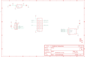

Contents
========

* [PRA4899 > Adafruit SPI Flash SD Card PCB](#pra4899--adafruit-spi-flash-sd-card-pcb)
	* [Schematic](#schematic)
	* [PCB](#pcb)
	* [Interactive BOM](#interactive-bom)
	* [OOMP Parts](#oomp-parts)
	* [Images](#images)
	* [Tags](#tags)
  
![][im]
# PRA4899 > Adafruit SPI Flash SD Card PCB

- ID: PROJ-ADAF-4899-STAN-01
- Hex ID: PRA4899
- Name: Adafruit
- Description: Adafruit
- Long Link: [http://oom.lt/PROJ-ADAF-4899-STAN-01](http://oom.lt/PROJ-ADAF-4899-STAN-01)
- Short Link: [http://oom.lt/PRA4899](http://oom.lt/PRA4899)

## Schematic
  

## PCB
  

## Interactive BOM

- Interactive BOM page: [ibom.html](https://htmlpreview.github.io/?https://github.com/oomlout/oomlout_OOMP_projects/blob/main/PROJ-ADAF-4899-STAN-01/kicad/bom/ibom.html)

## OOMP Parts
  

|OOMP Parts|
| :---: |
|[CAPC-0603-X-NF100-V50  SMD (0603) 100 nF Capacitor (Ceramic) 50v  C1](https://github.com/oomlout/oomlout_OOMP_parts/tree/main/CAPC-0603-X-NF100-V50/)|
|[CAPC-0805-X-UF10-V10  SMD (0805) 10 uF Capacitor (Ceramic) 10v  C3, C4](https://github.com/oomlout/oomlout_OOMP_parts/tree/main/CAPC-0805-X-UF10-V10/)|
|[HEAD-I01-X-PI07-01  2.54 mm 7 Pin Header  JP2](https://github.com/oomlout/oomlout_OOMP_parts/tree/main/HEAD-I01-X-PI07-01/)|
|[RESE-0603-X-O103-01  SMD (0603) 10k Ohm Resistor  R1](https://github.com/oomlout/oomlout_OOMP_parts/tree/main/RESE-0603-X-O103-01/)|
|UNMATCHED-UNMATCHED-X-UNMATCHED-01 U3, U5|
|VREG-SO235-X-KAP2112K-V33D U4|

## Images
  
  

|bominteractivefront|bominteractiveback|kicadPcb3d|kicadPcb3dFront|kicadPcb3dBack|eagleImage|eagleSchemImage|
| :---: | :---: | :---: | :---: | :---: | :---: | :---: |
||||||||

## Tags

- hexID: PRA4899
- oompType: PROJ
- oompSize: ADAF
- oompColor: 4899
- oompDesc: STAN
- oompIndex: 01
- oompName: Adafruit SPI Flash SD Card PCB
- sources: All source files from https://github.com/adafruit/Adafruit-SPI-Flash-SD-Card-PCB (source licence details in srcLicense.md)
- linkBuyPage: http://www.adafruit.com/products/4899
- oompID: PROJ-ADAF-4899-STAN-01
- oompParts: C1,CAPC-0603-X-NF100-V50
- oompParts: C3,CAPC-0805-X-UF10-V10
- oompParts: C4,CAPC-0805-X-UF10-V10
- oompParts: JP2,HEAD-I01-X-PI07-01
- oompParts: R1,RESE-0603-X-O103-01
- oompParts: U3,UNMATCHED-UNMATCHED-X-UNMATCHED-01
- oompParts: U4,VREG-SO235-X-KAP2112K-V33D
- oompParts: U5,UNMATCHED-UNMATCHED-X-UNMATCHED-01
- rawParts: C1,0.1uF,CAP_CERAMIC0603_NO,0603-NO,Ceramic Capacitors,,
- rawParts: C3,10uF,CAP_CERAMIC0805-NOOUTLINE,0805-NO,Ceramic Capacitors,,
- rawParts: C4,10uF,CAP_CERAMIC0805-NOOUTLINE,0805-NO,Ceramic Capacitors,,
- rawParts: FID2,FIDUCIAL_1MM,FIDUCIAL_1MM,FIDUCIAL_1MM,Fiducial Alignment Points,EXCLUDE,
- rawParts: FID3,FIDUCIAL_1MM,FIDUCIAL_1MM,FIDUCIAL_1MM,Fiducial Alignment Points,EXCLUDE,
- rawParts: JP2,,HEADER-1X770MIL,1X07_ROUND_70,PIN HEADER,,
- rawParts: R1,10K,RESISTOR_0603_NOOUT,0603-NO,Resistors,,
- rawParts: U$16,MOUNTINGHOLE2.5,MOUNTINGHOLE2.5,MOUNTINGHOLE_2.5_PLATED,Mounting Hole,EXCLUDE,
- rawParts: U$17,MOUNTINGHOLE2.5,MOUNTINGHOLE2.5,MOUNTINGHOLE_2.5_PLATED,Mounting Hole,EXCLUDE,
- rawParts: U3,74HC4050D,74HC4050DTSSOP,TSSOP16,6-channel level shifter,,
- rawParts: U4,AP2112K-3.3,VREG_SOT23-5,SOT23-5,SOT23-5 Fixed Voltage Regulators,,
- rawParts: U5,XTSD,SMT_SDCARD_8PIN,LGA8_8X6,SOIC8 SPI Flash,,

[im]: kicadPcb3d_450.png
