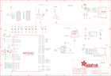

Contents
========

* [PRA4900 > Adafruit](#pra4900--adafruit)
	* [Schematic](#schematic)
	* [Interactive BOM](#interactive-bom)
	* [OOMP Parts](#oomp-parts)
	* [Images](#images)
	* [Tags](#tags)
  
![][im]
# PRA4900 > Adafruit

- ID: PROJ-ADAF-4900-STAN-01
- Hex ID: PRA4900
- Name: Adafruit
- Description: Adafruit
- Long Link: [http://oom.lt/PROJ-ADAF-4900-STAN-01](http://oom.lt/PROJ-ADAF-4900-STAN-01)
- Short Link: [http://oom.lt/PRA4900](http://oom.lt/PRA4900)

## Schematic
  

## Interactive BOM

- Interactive BOM page: [ibom.html](https://htmlpreview.github.io/?https://github.com/oomlout/oomlout_OOMP_projects/blob/main/PROJ-ADAF-4900-STAN-01/kicad/bom/ibom.html)

## OOMP Parts
  

|OOMP Parts|
| :---: |
|C1,CAPC-0805-X-UF10-V10,C1,10uF,CAP_CERAMIC0805-NOOUTLINE,0805-NO,Ceramic Capacitors,,|
|C2,CAPC-0603-X-UF1-01,C2,1uF,CAP_CERAMIC0603_NO,0603-NO,Ceramic Capacitors,,|
|C7,CAPC-0402-X-NF100-01,C7,0.1uF,CAP_CERAMIC_0402NO,_0402NO,Ceramic Capacitors,,|
|C8,CAPC-0805-X-UF10-V10,C8,10uF,CAP_CERAMIC0805-NOOUTLINE,0805-NO,Ceramic Capacitors,,|
|C9,CAPC-0402-X-NF100-01,C9,0.1uF,CAP_CERAMIC_0402NO,_0402NO,Ceramic Capacitors,,|
|C10,CAPC-0603-X-UF1-01,C10,1uF,CAP_CERAMIC0603_NO,0603-NO,Ceramic Capacitors,,|
|C11,CAPC-0402-X-NF100-01,C11,0.1uF,CAP_CERAMIC_0402NO,_0402NO,Ceramic Capacitors,,|
|C12,CAPC-0603-X-UF1-01,C12,1uF,CAP_CERAMIC0603_NO,0603-NO,Ceramic Capacitors,,|
|C13,CAPC-0402-X-NF100-01,C13,0.1uF,CAP_CERAMIC_0402NO,_0402NO,Ceramic Capacitors,,|
|C14,CAPC-0402-X-NF100-01,C14,0.1uF,CAP_CERAMIC_0402NO,_0402NO,Ceramic Capacitors,,|
|C16,CAPC-0402-X-NF100-01,C16,0.1uF,CAP_CERAMIC_0402NO,_0402NO,Ceramic Capacitors,,|
|C17,CAPC-0402-X-NF100-01,C17,0.1uF,CAP_CERAMIC_0402NO,_0402NO,Ceramic Capacitors,,|
|C19,CAPC-0402-X-UNMATCHED-01,C19,22pF,CAP_CERAMIC_0402NO,_0402NO,Ceramic Capacitors,,|
|C20,CAPC-0402-X-UNMATCHED-01,C20,22pF,CAP_CERAMIC_0402NO,_0402NO,Ceramic Capacitors,,|
|CONN1,UNMATCHED-UNMATCHED-X-UNMATCHED-01,CONN1,STEMMA_I2C_QTSKINNY,STEMMA_I2C_QTSKINNY,JST_SH4_SKINNY,,,|
|D1,DIOD-S323-X-UNMATCHED-01,D1,  NSR0320,DIODE_SOD323MINI,SOD-323_MINI,Diode,,|
|D2,DIOD-S323-X-UNMATCHED-01,D2,  NSR0320,DIODE_SOD323MINI,SOD-323_MINI,Diode,,|
|IC2,UNMATCHED-UNMATCHED-X-UNMATCHED-01,IC2,RP2040_QFN56,RP2040_QFN56,QFN56_7MM_REDUCEDEPAD,,,|
|JP1,HEAD-I01-X-PI07-01,JP1,,HEADER-1X7_CASTEL,1X07_CASTEL,PIN HEADER,,|
|JP2,UNMATCHED-UNMATCHED-X-UNMATCHED-01,JP2,,JUMPER-2SMD-NO,SJ_2S-NO,Jumper,,|
|JP3,HEAD-I01-X-PI07-01,JP3,,HEADER-1X7_CASTEL,1X07_CASTEL,PIN HEADER,,|
|LED1,UNMATCHED-UNMATCHED-X-UNMATCHED-01,LED1,WS2812B_SK6805_1515,WS2812B_SK6805_1515,SK6805_1515,,,|
|R3,RESE-0402-X-O103-01,R3,10K,RESISTOR_0402NO,_0402NO,Resistors,,|
|R6,RESE-0402-X-O102-01,R6,1K,RESISTOR_0402NO,_0402NO,Resistors,,|
|R9,RESE-0402-X-O103-01,R9,10K,RESISTOR_0402NO,_0402NO,Resistors,,|
|R12,RESE-0402-X-UNMATCHED-01,R12,5.1K,RESISTOR_0402NO,_0402NO,Resistors,,|
|R13,RESE-0402-X-UNMATCHED-01,R13,5.1K,RESISTOR_0402NO,_0402NO,Resistors,,|
|R14,RESE-0402-X-O21-01,R14,27,RESISTOR_0402NO,_0402NO,Resistors,,|
|R15,RESE-0402-X-O21-01,R15,27,RESISTOR_0402NO,_0402NO,Resistors,,|
|R16,RESE-0402-X-O102-01,R16,1K,RESISTOR_0402NO,_0402NO,Resistors,,|
|SW1,UNMATCHED-UNMATCHED-X-UNMATCHED-01,SW1,KMR2,SWITCH_TACT_SMT4.6X2.8,BTN_KMR2_4.6X2.8,SMT Tact Switches,,|
|SW2,UNMATCHED-UNMATCHED-X-UNMATCHED-01,SW2,KMR2,SWITCH_TACT_SMT4.6X2.8,BTN_KMR2_4.6X2.8,SMT Tact Switches,,|
|TP3,UNMATCHED-UNMATCHED-X-UNMATCHED-01,TP3,,TESTPOINTROUND1.5MMNO,TESTPOINT_ROUND_1.5MM_NO,Test Point,,|
|TP4,UNMATCHED-UNMATCHED-X-UNMATCHED-01,TP4,,TESTPOINTROUND1.5MMNO,TESTPOINT_ROUND_1.5MM_NO,Test Point,,|
|U1,VREG-SO235-X-KAP2112K-V33D,U$6,FIDUCIAL_1MM,FIDUCIAL_1MM,FIDUCIAL_1MM,Fiducial Alignment Points,EXCLUDE,|
|U5,UNMATCHED-UNMATCHED-X-UNMATCHED-01,U$8,FIDUCIAL_1MM,FIDUCIAL_1MM,FIDUCIAL_1MM,Fiducial Alignment Points,EXCLUDE,|
|X2,UNMATCHED-UNMATCHED-X-UNMATCHED-01,U1,AP2112K-3.3,VREG_SOT23-5,SOT23-5,SOT23-5 Fixed Voltage Regulators,,|
|Y1,UNMATCHED-UNMATCHED-X-UNMATCHED-01,U5,8MB QSPI Flash,SPIFLASH_8PIN_4X4,USON8_4X4,SOIC8 SPI Flash,,|

## Images
  
  

|kicadPcb3d|kicadPcb3dFront|kicadPcb3dBack|eagleImage|eagleSchemImage|
| :---: | :---: | :---: | :---: | :---: |
||||||

## Tags

- hexID: PRA4900
- oompType: PROJ
- oompSize: ADAF
- oompColor: 4900
- oompDesc: STAN
- oompIndex: 01
- oompName: Adafruit QT Py RP2040 PCB
- sources: All source files from https://github.com/adafruit/Adafruit-QT-Py-RP2040-PCB (source licence details in srcLicense.md)
- linkBuyPage: http://www.adafruit.com/products/4900
- oompID: PROJ-ADAF-4900-STAN-01
- oompParts: C1,CAPC-0805-X-UF10-V10
- oompParts: C2,CAPC-0603-X-UF1-01
- oompParts: C7,CAPC-0402-X-NF100-01
- oompParts: C8,CAPC-0805-X-UF10-V10
- oompParts: C9,CAPC-0402-X-NF100-01
- oompParts: C10,CAPC-0603-X-UF1-01
- oompParts: C11,CAPC-0402-X-NF100-01
- oompParts: C12,CAPC-0603-X-UF1-01
- oompParts: C13,CAPC-0402-X-NF100-01
- oompParts: C14,CAPC-0402-X-NF100-01
- oompParts: C16,CAPC-0402-X-NF100-01
- oompParts: C17,CAPC-0402-X-NF100-01
- oompParts: C19,CAPC-0402-X-UNMATCHED-01
- oompParts: C20,CAPC-0402-X-UNMATCHED-01
- oompParts: CONN1,UNMATCHED-UNMATCHED-X-UNMATCHED-01
- oompParts: D1,DIOD-S323-X-UNMATCHED-01
- oompParts: D2,DIOD-S323-X-UNMATCHED-01
- oompParts: IC2,UNMATCHED-UNMATCHED-X-UNMATCHED-01
- oompParts: JP1,HEAD-I01-X-PI07-01
- oompParts: JP2,UNMATCHED-UNMATCHED-X-UNMATCHED-01
- oompParts: JP3,HEAD-I01-X-PI07-01
- oompParts: LED1,UNMATCHED-UNMATCHED-X-UNMATCHED-01
- oompParts: R3,RESE-0402-X-O103-01
- oompParts: R6,RESE-0402-X-O102-01
- oompParts: R9,RESE-0402-X-O103-01
- oompParts: R12,RESE-0402-X-UNMATCHED-01
- oompParts: R13,RESE-0402-X-UNMATCHED-01
- oompParts: R14,RESE-0402-X-O21-01
- oompParts: R15,RESE-0402-X-O21-01
- oompParts: R16,RESE-0402-X-O102-01
- oompParts: SW1,UNMATCHED-UNMATCHED-X-UNMATCHED-01
- oompParts: SW2,UNMATCHED-UNMATCHED-X-UNMATCHED-01
- oompParts: TP3,UNMATCHED-UNMATCHED-X-UNMATCHED-01
- oompParts: TP4,UNMATCHED-UNMATCHED-X-UNMATCHED-01
- oompParts: U1,VREG-SO235-X-KAP2112K-V33D
- oompParts: U5,UNMATCHED-UNMATCHED-X-UNMATCHED-01
- oompParts: X2,UNMATCHED-UNMATCHED-X-UNMATCHED-01
- oompParts: Y1,UNMATCHED-UNMATCHED-X-UNMATCHED-01
- rawParts: C1,10uF,CAP_CERAMIC0805-NOOUTLINE,0805-NO,Ceramic Capacitors,,
- rawParts: C2,1uF,CAP_CERAMIC0603_NO,0603-NO,Ceramic Capacitors,,
- rawParts: C7,0.1uF,CAP_CERAMIC_0402NO,_0402NO,Ceramic Capacitors,,
- rawParts: C8,10uF,CAP_CERAMIC0805-NOOUTLINE,0805-NO,Ceramic Capacitors,,
- rawParts: C9,0.1uF,CAP_CERAMIC_0402NO,_0402NO,Ceramic Capacitors,,
- rawParts: C10,1uF,CAP_CERAMIC0603_NO,0603-NO,Ceramic Capacitors,,
- rawParts: C11,0.1uF,CAP_CERAMIC_0402NO,_0402NO,Ceramic Capacitors,,
- rawParts: C12,1uF,CAP_CERAMIC0603_NO,0603-NO,Ceramic Capacitors,,
- rawParts: C13,0.1uF,CAP_CERAMIC_0402NO,_0402NO,Ceramic Capacitors,,
- rawParts: C14,0.1uF,CAP_CERAMIC_0402NO,_0402NO,Ceramic Capacitors,,
- rawParts: C16,0.1uF,CAP_CERAMIC_0402NO,_0402NO,Ceramic Capacitors,,
- rawParts: C17,0.1uF,CAP_CERAMIC_0402NO,_0402NO,Ceramic Capacitors,,
- rawParts: C19,22pF,CAP_CERAMIC_0402NO,_0402NO,Ceramic Capacitors,,
- rawParts: C20,22pF,CAP_CERAMIC_0402NO,_0402NO,Ceramic Capacitors,,
- rawParts: CONN1,STEMMA_I2C_QTSKINNY,STEMMA_I2C_QTSKINNY,JST_SH4_SKINNY,,,
- rawParts: D1,  NSR0320,DIODE_SOD323MINI,SOD-323_MINI,Diode,,
- rawParts: D2,  NSR0320,DIODE_SOD323MINI,SOD-323_MINI,Diode,,
- rawParts: IC2,RP2040_QFN56,RP2040_QFN56,QFN56_7MM_REDUCEDEPAD,,,
- rawParts: JP1,,HEADER-1X7_CASTEL,1X07_CASTEL,PIN HEADER,,
- rawParts: JP2,,JUMPER-2SMD-NO,SJ_2S-NO,Jumper,,
- rawParts: JP3,,HEADER-1X7_CASTEL,1X07_CASTEL,PIN HEADER,,
- rawParts: LED1,WS2812B_SK6805_1515,WS2812B_SK6805_1515,SK6805_1515,,,
- rawParts: R3,10K,RESISTOR_0402NO,_0402NO,Resistors,,
- rawParts: R6,1K,RESISTOR_0402NO,_0402NO,Resistors,,
- rawParts: R9,10K,RESISTOR_0402NO,_0402NO,Resistors,,
- rawParts: R12,5.1K,RESISTOR_0402NO,_0402NO,Resistors,,
- rawParts: R13,5.1K,RESISTOR_0402NO,_0402NO,Resistors,,
- rawParts: R14,27,RESISTOR_0402NO,_0402NO,Resistors,,
- rawParts: R15,27,RESISTOR_0402NO,_0402NO,Resistors,,
- rawParts: R16,1K,RESISTOR_0402NO,_0402NO,Resistors,,
- rawParts: SW1,KMR2,SWITCH_TACT_SMT4.6X2.8,BTN_KMR2_4.6X2.8,SMT Tact Switches,,
- rawParts: SW2,KMR2,SWITCH_TACT_SMT4.6X2.8,BTN_KMR2_4.6X2.8,SMT Tact Switches,,
- rawParts: TP3,,TESTPOINTROUND1.5MMNO,TESTPOINT_ROUND_1.5MM_NO,Test Point,,
- rawParts: TP4,,TESTPOINTROUND1.5MMNO,TESTPOINT_ROUND_1.5MM_NO,Test Point,,
- rawParts: U$6,FIDUCIAL_1MM,FIDUCIAL_1MM,FIDUCIAL_1MM,Fiducial Alignment Points,EXCLUDE,
- rawParts: U$8,FIDUCIAL_1MM,FIDUCIAL_1MM,FIDUCIAL_1MM,Fiducial Alignment Points,EXCLUDE,
- rawParts: U1,AP2112K-3.3,VREG_SOT23-5,SOT23-5,SOT23-5 Fixed Voltage Regulators,,
- rawParts: U5,8MB QSPI Flash,SPIFLASH_8PIN_4X4,USON8_4X4,SOIC8 SPI Flash,,
- rawParts: X2,USB Type C,USB_C,USB_C_CUSB31-CFM2AX-01-X,USB Type-C USB 2.0 Connector,,
- rawParts: Y1,12MHZ,CRYSTAL2.5X2.0,CRYSTAL_2.5X2,Crystals,,

[im]: kicadPcb3d_450.png
