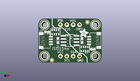
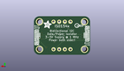
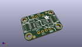

Contents
========

* [PROJ-ADAF-4903-STAN-01>Adafruit ISO1540 PCB](#proj-adaf-4903-stan-01adafruit-iso1540-pcb)
	* [Images](#images)
	* [Interactive BOM](#interactive-bom)
	* [OOMP Parts](#oomp-parts)
	* [Tags](#tags)
  
![][im]
# PROJ-ADAF-4903-STAN-01>Adafruit ISO1540 PCB

- ID: PROJ-ADAF-4903-STAN-01
- Hex ID: PRA4903
- Name: Adafruit ISO1540 PCB
- Description: 

## Images
  
  

|eagleImage|kicadPcb3dFront|kicadPcb3dBack|kicadPcb3d|
| :---: | :---: | :---: | :---: |
|||||

## Interactive BOM

- Interactive BOM page: [ibom.html](kicad/bom/ibom.html)

## OOMP Parts
  

|OOMP Parts|
| :---: |
|<table><tr><td></td><td> C1</td><td>[CAPC-0603-X-NF100-V50 SMD (0603) 100 nF Capacitor (Ceramic) 50v](https://github.com/oomlout/oomlout_OOMP_parts/tree/main/CAPC-0603-X-NF100-V50/)</td><td>[C6N100](https://github.com/oomlout/oomlout_OOMP_parts/tree/main/CAPC-0603-X-NF100-V50/)</td></tr></table>|
|<table><tr><td></td><td> C2</td><td>[CAPC-0603-X-NF100-V50 SMD (0603) 100 nF Capacitor (Ceramic) 50v](https://github.com/oomlout/oomlout_OOMP_parts/tree/main/CAPC-0603-X-NF100-V50/)</td><td>[C6N100](https://github.com/oomlout/oomlout_OOMP_parts/tree/main/CAPC-0603-X-NF100-V50/)</td></tr></table>|
|UNMATCHED-UNMATCHED-X-UNMATCHED-01, CONN3, 2.54, 8.889999999999999, 270,CONN3, STEMMA_I2C_QT, JST_SH4, microbuilder, (0.1, 0.35), R270|
|UNMATCHED-UNMATCHED-X-UNMATCHED-01, CONN4, 22.86, 8.889999999999999, 90,CONN4, STEMMA_I2C_QT, JST_SH4, microbuilder, (0.9, 0.35), R90|
|UNMATCHED-UNMATCHED-X-UNMATCHED-01, D1, 21.843999999999998, 5.334, 270,D1, GREEN, CHIPLED_0603_NOOUTLINE, microbuilder, (0.86, 0.21), R270|
|UNMATCHED-UNMATCHED-X-UNMATCHED-01, D2, 3.556, 12.446, 90,D2, GREEN, CHIPLED_0603_NOOUTLINE, microbuilder, (0.14, 0.49), R90|
|<table><tr><td></td><td> JP1</td><td>[HEAD-I01-X-PI04-01 2.54 mm 4 Pin Header](https://github.com/oomlout/oomlout_OOMP_parts/tree/main/HEAD-I01-X-PI04-01/)</td><td>[H04](https://github.com/oomlout/oomlout_OOMP_parts/tree/main/HEAD-I01-X-PI04-01/)</td></tr></table>|
|<table><tr><td></td><td> JP2</td><td>[HEAD-I01-X-PI04-01 2.54 mm 4 Pin Header](https://github.com/oomlout/oomlout_OOMP_parts/tree/main/HEAD-I01-X-PI04-01/)</td><td>[H04](https://github.com/oomlout/oomlout_OOMP_parts/tree/main/HEAD-I01-X-PI04-01/)</td></tr></table>|
|RESE-UNMATCHED-X-O103-01, R1, 6.858, 12.318999999999999, 0,R1, 10K, RESPACK_4X0603, microbuilder, (0.27, 0.485), R0|
|RESE-UNMATCHED-X-O103-01, R2, 18.541999999999998, 5.460999999999999, 180,R2, 10K, RESPACK_4X0603, microbuilder, (0.73, 0.215), R180|
|UNMATCHED-UNMATCHED-X-UNMATCHED-01, X1, 12.7, 8.889999999999999, 270,X1, ISO154X, SOIC8_150MIL, adafruit_power, (0.5, 0.35), R270|

## Tags

- hexID: PRA4903
- oompType: PROJ
- oompSize: ADAF
- oompColor: 4903
- oompDesc: STAN
- oompIndex: 01
- oompName: Adafruit ISO1540 PCB
- sources: All source files from https://github.com/adafruit/Adafruit-ISO1540-PCB (source licence details in srcLicense.md)
- linkBuyPage: http://www.adafruit.com/products/4903
- oompID: PROJ-ADAF-4903-STAN-01
- oompPart: CAPC-0603-X-NF100-V50, C1, 17.525999999999996, 8.889999999999999, 270
- oompPart: CAPC-0603-X-NF100-V50, C2, 7.874, 8.889999999999999, 270
- oompPart: UNMATCHED-UNMATCHED-X-UNMATCHED-01, CONN3, 2.54, 8.889999999999999, 270
- oompPart: UNMATCHED-UNMATCHED-X-UNMATCHED-01, CONN4, 22.86, 8.889999999999999, 90
- oompPart: UNMATCHED-UNMATCHED-X-UNMATCHED-01, D1, 21.843999999999998, 5.334, 270
- oompPart: UNMATCHED-UNMATCHED-X-UNMATCHED-01, D2, 3.556, 12.446, 90
- oompPart: SKIP-UNMATCHED-X-UNMATCHED-01, FID3, 5.460999999999999, 0.9524999999999999, 0
- oompPart: SKIP-UNMATCHED-X-UNMATCHED-01, FID4, 19.685, 16.294099999999997, 0
- oompPart: HEAD-I01-X-PI04-01, JP1, 12.7, 2.54, 180
- oompPart: HEAD-I01-X-PI04-01, JP2, 12.7, 15.239999999999998, 0
- oompPart: RESE-UNMATCHED-X-O103-01, R1, 6.858, 12.318999999999999, 0
- oompPart: RESE-UNMATCHED-X-O103-01, R2, 18.541999999999998, 5.460999999999999, 180
- oompPart: SKIP-UNMATCHED-X-UNMATCHED-01, U$1, 2.54, 15.239999999999998, 0
- oompPart: SKIP-UNMATCHED-X-UNMATCHED-01, U$17, 22.86, 15.239999999999998, 0
- oompPart: SKIP-UNMATCHED-X-UNMATCHED-01, U$19, 2.54, 2.54, 0
- oompPart: SKIP-UNMATCHED-X-UNMATCHED-01, U$21, 22.86, 2.54, 0
- oompPart: UNMATCHED-UNMATCHED-X-UNMATCHED-01, X1, 12.7, 8.889999999999999, 270
- rawPart: C1, 0.1uF, 0603-NO, microbuilder, (0.69, 0.35), R270
- rawPart: C2, 0.1uF, 0603-NO, microbuilder, (0.31, 0.35), R270
- rawPart: CONN3, STEMMA_I2C_QT, JST_SH4, microbuilder, (0.1, 0.35), R270
- rawPart: CONN4, STEMMA_I2C_QT, JST_SH4, microbuilder, (0.9, 0.35), R90
- rawPart: D1, GREEN, CHIPLED_0603_NOOUTLINE, microbuilder, (0.86, 0.21), R270
- rawPart: D2, GREEN, CHIPLED_0603_NOOUTLINE, microbuilder, (0.14, 0.49), R90
- rawPart: FID3, FIDUCIAL_1MM, FIDUCIAL_1MM, microbuilder, (0.215, 0.0375), R0
- rawPart: FID4, FIDUCIAL_1MM, FIDUCIAL_1MM, microbuilder, (0.775, 0.6415), R0
- rawPart: JP1, 1X04_ROUND, microbuilder, (0.5, 0.1), R180
- rawPart: JP2, 1X04_ROUND, microbuilder, (0.5, 0.6), R0
- rawPart: R1, 10K, RESPACK_4X0603, microbuilder, (0.27, 0.485), R0
- rawPart: R2, 10K, RESPACK_4X0603, microbuilder, (0.73, 0.215), R180
- rawPart: U$1, MOUNTINGHOLE2.5, MOUNTINGHOLE_2.5_PLATED, microbuilder, (0.1, 0.6), R0
- rawPart: U$17, MOUNTINGHOLE2.5, MOUNTINGHOLE_2.5_PLATED, microbuilder, (0.9, 0.6), R0
- rawPart: U$19, MOUNTINGHOLE2.5, MOUNTINGHOLE_2.5_PLATED, microbuilder, (0.1, 0.1), R0
- rawPart: U$21, MOUNTINGHOLE2.5, MOUNTINGHOLE_2.5_PLATED, microbuilder, (0.9, 0.1), R0
- rawPart: X1, ISO154X, SOIC8_150MIL, adafruit_power, (0.5, 0.35), R270

[im]: kicadPcb3d_450.png
