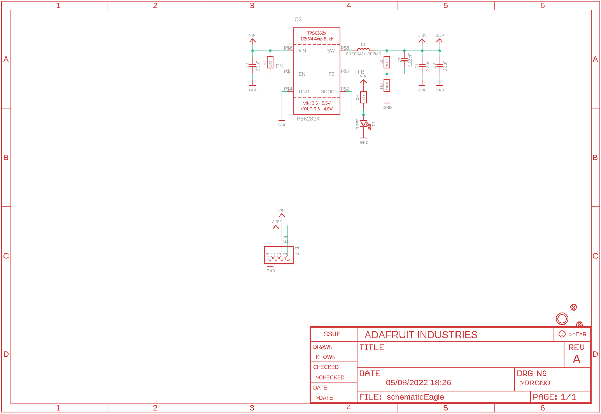
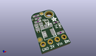
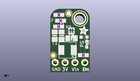
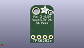
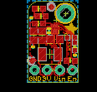
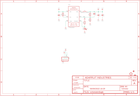

Contents
========

* [PRA4920 > Adafruit](#pra4920--adafruit)
	* [Schematic](#schematic)
	* [Interactive BOM](#interactive-bom)
	* [OOMP Parts](#oomp-parts)
	* [Images](#images)
	* [Tags](#tags)
  
![][im]
# PRA4920 > Adafruit

- ID: PROJ-ADAF-4920-STAN-01
- Hex ID: PRA4920
- Name: Adafruit
- Description: Adafruit
- Long Link: [http://oom.lt/PROJ-ADAF-4920-STAN-01](http://oom.lt/PROJ-ADAF-4920-STAN-01)
- Short Link: [http://oom.lt/PRA4920](http://oom.lt/PRA4920)

## Schematic
  

## Interactive BOM

- Interactive BOM page: [ibom.html](https://htmlpreview.github.io/?https://github.com/oomlout/oomlout_OOMP_projects/blob/main/PROJ-ADAF-4920-STAN-01/kicad/bom/ibom.html)

## OOMP Parts
  

|OOMP Parts|
| :---: |
|C1,CAPC-0805-X-UF22-01,C1,22uF,CAP_CERAMIC0805-NOOUTLINE,0805-NO,Ceramic Capacitors,,|
|C2,CAPC-0805-X-UF22-01,C2,22uF,CAP_CERAMIC0805-NOOUTLINE,0805-NO,Ceramic Capacitors,,|
|C3,CAPC-0805-X-UF22-01,C3,22uF,CAP_CERAMIC0805-NOOUTLINE,0805-NO,Ceramic Capacitors,,|
|C4,CAPC-0603-X-UNMATCHED-01,C4,120pF,CAP_CERAMIC0603_NO,0603-NO,Ceramic Capacitors,,|
|D1,LEDS-0603-G-STAN-01,D1,green,LED0603_NOOUTLINE,CHIPLED_0603_NOOUTLINE,LED,,|
|IC2,UNMATCHED-UNMATCHED-X-UNMATCHED-01,FID1,FIDUCIAL_1MM,FIDUCIAL_1MM,FIDUCIAL_1MM,Fiducial Alignment Points,EXCLUDE,|
|JP1,HEAD-I01-X-PI04-01,FID2,FIDUCIAL_1MM,FIDUCIAL_1MM,FIDUCIAL_1MM,Fiducial Alignment Points,EXCLUDE,|
|L1,UNMATCHED-UNMATCHED-X-UNMATCHED-01,IC2,TPS6282X,TPS6282X,VSON_6,,,|
|R1,RESE-0603-X-O1003-01,JP1,,HEADER-1X4ROUND,1X04_ROUND,PIN HEADER,,|
|R2,RESE-0603-X-O4503-01,L1,SDER041H-2R2MS,INDUCTOR_SRP0415,INDUCTOR_4X4MM_SRP0415,Inductors,,|
|R3,RESE-0603-X-O1003-01,R1,100K,RESISTOR_0603_NOOUT,0603-NO,Resistors,,|
|R4,RESE-0603-X-O103-01,R2,450K,RESISTOR_0603_NOOUT,0603-NO,Resistors,,|

## Images
  
  

|kicadPcb3d|kicadPcb3dFront|kicadPcb3dBack|eagleImage|eagleSchemImage|
| :---: | :---: | :---: | :---: | :---: |
||||||

## Tags

- hexID: PRA4920
- oompType: PROJ
- oompSize: ADAF
- oompColor: 4920
- oompDesc: STAN
- oompIndex: 01
- oompName: Adafruit TPS62827 PCB
- sources: All source files from https://github.com/adafruit/Adafruit-TPS62827-PCB (source licence details in srcLicense.md)
- linkBuyPage: http://www.adafruit.com/products/4920
- oompID: PROJ-ADAF-4920-STAN-01
- oompParts: C1,CAPC-0805-X-UF22-01
- oompParts: C2,CAPC-0805-X-UF22-01
- oompParts: C3,CAPC-0805-X-UF22-01
- oompParts: C4,CAPC-0603-X-UNMATCHED-01
- oompParts: D1,LEDS-0603-G-STAN-01
- oompParts: IC2,UNMATCHED-UNMATCHED-X-UNMATCHED-01
- oompParts: JP1,HEAD-I01-X-PI04-01
- oompParts: L1,UNMATCHED-UNMATCHED-X-UNMATCHED-01
- oompParts: R1,RESE-0603-X-O1003-01
- oompParts: R2,RESE-0603-X-O4503-01
- oompParts: R3,RESE-0603-X-O1003-01
- oompParts: R4,RESE-0603-X-O103-01
- rawParts: C1,22uF,CAP_CERAMIC0805-NOOUTLINE,0805-NO,Ceramic Capacitors,,
- rawParts: C2,22uF,CAP_CERAMIC0805-NOOUTLINE,0805-NO,Ceramic Capacitors,,
- rawParts: C3,22uF,CAP_CERAMIC0805-NOOUTLINE,0805-NO,Ceramic Capacitors,,
- rawParts: C4,120pF,CAP_CERAMIC0603_NO,0603-NO,Ceramic Capacitors,,
- rawParts: D1,green,LED0603_NOOUTLINE,CHIPLED_0603_NOOUTLINE,LED,,
- rawParts: FID1,FIDUCIAL_1MM,FIDUCIAL_1MM,FIDUCIAL_1MM,Fiducial Alignment Points,EXCLUDE,
- rawParts: FID2,FIDUCIAL_1MM,FIDUCIAL_1MM,FIDUCIAL_1MM,Fiducial Alignment Points,EXCLUDE,
- rawParts: IC2,TPS6282X,TPS6282X,VSON_6,,,
- rawParts: JP1,,HEADER-1X4ROUND,1X04_ROUND,PIN HEADER,,
- rawParts: L1,SDER041H-2R2MS,INDUCTOR_SRP0415,INDUCTOR_4X4MM_SRP0415,Inductors,,
- rawParts: R1,100K,RESISTOR_0603_NOOUT,0603-NO,Resistors,,
- rawParts: R2,450K,RESISTOR_0603_NOOUT,0603-NO,Resistors,,
- rawParts: R3,100K,RESISTOR_0603_NOOUT,0603-NO,Resistors,,
- rawParts: R4,10k,RESISTOR_0603MP,_0603MP,Resistors,,
- rawParts: U$9,MOUNTINGHOLE2.5,MOUNTINGHOLE2.5,MOUNTINGHOLE_2.5_PLATED,Mounting Hole,EXCLUDE,

[im]: kicadPcb3d_450.png
