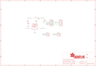

Contents
========

* [PRA4978 > Adafruit NeoKey Breakout PCB](#pra4978--adafruit-neokey-breakout-pcb)
	* [Schematic](#schematic)
	* [PCB](#pcb)
	* [Interactive BOM](#interactive-bom)
	* [OOMP Parts](#oomp-parts)
	* [Images](#images)
	* [Tags](#tags)
  
![][im]
# PRA4978 > Adafruit NeoKey Breakout PCB

- ID: PROJ-ADAF-4978-STAN-01
- Hex ID: PRA4978
- Name: Adafruit
- Description: Adafruit
- Long Link: [http://oom.lt/PROJ-ADAF-4978-STAN-01](http://oom.lt/PROJ-ADAF-4978-STAN-01)
- Short Link: [http://oom.lt/PRA4978](http://oom.lt/PRA4978)

## Schematic
  

## PCB
  

## Interactive BOM

- Interactive BOM page: [ibom.html](https://htmlpreview.github.io/?https://github.com/oomlout/oomlout_OOMP_projects/blob/main/PROJ-ADAF-4978-STAN-01/kicad/bom/ibom.html)

## OOMP Parts
  

|OOMP Parts|
| :---: |
|[CAPC-0603-X-UF1-V25  SMD (0603) 1 uF Capacitor (Ceramic) 25v  C1](https://github.com/oomlout/oomlout_OOMP_parts/tree/main/CAPC-0603-X-UF1-V25/)|
|[DIOD-S323-X-K4148-01  SMD (SOD-323) Diode  D1](https://github.com/oomlout/oomlout_OOMP_parts/tree/main/DIOD-S323-X-K4148-01/)|
|[HEAD-I01-X-PI05-01  2.54 mm 5 Pin Header  JP1, JP3](https://github.com/oomlout/oomlout_OOMP_parts/tree/main/HEAD-I01-X-PI05-01/)|
|[HEAD-I01-X-PI02-01  2.54 mm 2 Pin Header  JP2, JP4](https://github.com/oomlout/oomlout_OOMP_parts/tree/main/HEAD-I01-X-PI02-01/)|
|[LEDS-3535-RGB-K2812-01  SMD (3535) Smart Controller (WS2812B) RGB LED  LED1](https://github.com/oomlout/oomlout_OOMP_parts/tree/main/LEDS-3535-RGB-K2812-01/)|
|UNMATCHED-UNMATCHED-X-UNMATCHED-01 SW1|

## Images
  
  

|kicadPcb3d|kicadPcb3dFront|kicadPcb3dBack|eagleImage|eagleSchemImage|
| :---: | :---: | :---: | :---: | :---: |
||||||

## Tags

- hexID: PRA4978
- oompType: PROJ
- oompSize: ADAF
- oompColor: 4978
- oompDesc: STAN
- oompIndex: 01
- oompName: Adafruit NeoKey Breakout PCB
- sources: All source files from https://github.com/adafruit/Adafruit-NeoKey-Breakout-PCB (source licence details in srcLicense.md)
- linkBuyPage: http://www.adafruit.com/products/4978
- oompID: PROJ-ADAF-4978-STAN-01
- oompParts: C1,CAPC-0603-X-UF1-V25
- oompParts: D1,DIOD-S323-X-K4148-01
- oompParts: JP1,HEAD-I01-X-PI05-01
- oompParts: JP2,HEAD-I01-X-PI02-01
- oompParts: JP3,HEAD-I01-X-PI05-01
- oompParts: JP4,HEAD-I01-X-PI02-01
- oompParts: LED1,LEDS-3535-RGB-K2812-01
- oompParts: SW1,UNMATCHED-UNMATCHED-X-UNMATCHED-01
- rawParts: C1,1uF,CAP_CERAMIC0603_NO,0603-NO,Ceramic Capacitors,,
- rawParts: D1,1N4148,DIODESOD-323,SOD-323,Diode,,
- rawParts: FID3,FIDUCIAL_1MM,FIDUCIAL_1MM,FIDUCIAL_1MM,Fiducial Alignment Points,EXCLUDE,
- rawParts: FID4,FIDUCIAL_1MM,FIDUCIAL_1MM,FIDUCIAL_1MM,Fiducial Alignment Points,EXCLUDE,
- rawParts: JP1,,HEADER-1X570MIL,1X05_ROUND_70,PIN HEADER,,
- rawParts: JP2,,HEADER-1X2ROUND,1X02_ROUND,PIN HEADER,,
- rawParts: JP3,,HEADER-1X570MIL,1X05_ROUND_70,PIN HEADER,,
- rawParts: JP4,,HEADER-1X2ROUND,1X02_ROUND,PIN HEADER,,
- rawParts: LED1,WS2812B_SK6812E,WS2812B_SK6812E,NEO3535_REVERSE,,,
- rawParts: SW1,,SWITCH_PUSHBUTTON_KAILH_SOCKET,KAILH_SOCKET,Buttons,,

[im]: kicadPcb3d_450.png
