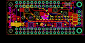

Contents
========

* [PROJ-ADAF-4979-STAN-01>Adafruit NeoKey FeatherWing PCB](#proj-adaf-4979-stan-01adafruit-neokey-featherwing-pcb)
	* [Images](#images)
	* [Interactive BOM](#interactive-bom)
	* [OOMP Parts](#oomp-parts)
	* [Tags](#tags)
  
![][im]
# PROJ-ADAF-4979-STAN-01>Adafruit NeoKey FeatherWing PCB

- ID: PROJ-ADAF-4979-STAN-01
- Hex ID: PRA4979
- Name: Adafruit NeoKey FeatherWing PCB
- Description: 

## Images
  
  

|eagleImage|
| :---: |
||

## Interactive BOM

- Interactive BOM page: [ibom.html](kicad/bom/ibom.html)

## OOMP Parts
  

|OOMP Parts|
| :---: |
|CAPC-0603-X-UNMATCHED-01, C1, 28.066999999999997, 6.35, 180,C1, 1uF, 0603-NO, microbuilder, (1.105, 0.25), R180|
|<table><tr><td></td><td> C2</td><td>[CAPC-0805-X-UF10-V25 SMD (0805) 10 uF Capacitor (Ceramic) 25v](https://github.com/oomlout/oomlout_OOMP_parts/tree/main/CAPC-0805-X-UF10-V25/)</td><td>[C85U010](https://github.com/oomlout/oomlout_OOMP_parts/tree/main/CAPC-0805-X-UF10-V25/)</td></tr></table>|
|UNMATCHED-UNMATCHED-X-UNMATCHED-01, CONN1, 2.54, 11.43, 270,CONN1, STEMMA_I2C_QT, JST_SH4, microbuilder, (0.1, 0.45), R270|
|UNMATCHED-UNMATCHED-X-UNMATCHED-01, JP1, 48.26, 11.43, M90,JP1, 1X04_ROUND, microbuilder, (1.9, 0.45), MR90|
|UNMATCHED-UNMATCHED-X-UNMATCHED-01, JP5, 20.32, 19.049999999999997, M0,JP5, 1X12_ROUND, microbuilder, (0.8, 0.75), MR0|
|UNMATCHED-UNMATCHED-X-UNMATCHED-01, JP6, 25.4, 3.8099999999999996, M180,JP6, 1X16_ROUND, microbuilder, (1, 0.15), MR180|
|UNMATCHED-UNMATCHED-X-UNMATCHED-01, LED1, 15.875, 6.476999999999999, M0,LED1, WS2812B_SK6812E, NEO3535_REVERSE, microbuilder, (0.625, 0.255), MR0|
|UNMATCHED-UNMATCHED-X-UNMATCHED-01, LED2, 34.798, 6.476999999999999, M0,LED2, WS2812B_SK6812E, NEO3535_REVERSE, microbuilder, (1.37, 0.255), MR0|
|UNMATCHED-UNMATCHED-X-UNMATCHED-01, MS1, 50.8, 0.0, M0,MS1, FEATHERWING_NODIM, FEATHERWING_NODIM, microbuilder, (2, 0), MR0|
|<table><tr><td></td><td> R1</td><td>[RESE-0603-X-O104-01 SMD (0603) 100k Ohm Resistor](https://github.com/oomlout/oomlout_OOMP_parts/tree/main/RESE-0603-X-O104-01/)</td><td>[R6104](https://github.com/oomlout/oomlout_OOMP_parts/tree/main/RESE-0603-X-O104-01/)</td></tr></table>|
|<table><tr><td></td><td> R2</td><td>[RESE-0603-X-O104-01 SMD (0603) 100k Ohm Resistor](https://github.com/oomlout/oomlout_OOMP_parts/tree/main/RESE-0603-X-O104-01/)</td><td>[R6104](https://github.com/oomlout/oomlout_OOMP_parts/tree/main/RESE-0603-X-O104-01/)</td></tr></table>|
|UNMATCHED-UNMATCHED-X-UNMATCHED-01, SJ1, 45.466, 7.619999999999999, 0,SJ1, SOLDERJUMPER_CLOSEDWIRE, microbuilder, (1.79, 0.3), R0|
|UNMATCHED-UNMATCHED-X-UNMATCHED-01, SJ2, 45.466, 10.033, 0,SJ2, SOLDERJUMPER_CLOSEDWIRE, microbuilder, (1.79, 0.395), R0|
|UNMATCHED-UNMATCHED-X-UNMATCHED-01, SJ3, 45.466, 12.7, 0,SJ3, SOLDERJUMPER_CLOSEDWIRE, microbuilder, (1.79, 0.5), R0|
|UNMATCHED-UNMATCHED-X-UNMATCHED-01, SW1, 34.925, 11.43, M0,SW1, MX, KAILH_SOCKET, adafruit_electromech, (1.375, 0.45), MR0|
|UNMATCHED-UNMATCHED-X-UNMATCHED-01, SW2, 15.875, 11.43, M0,SW2, MX, KAILH_SOCKET, adafruit_electromech, (0.625, 0.45), MR0|
|UNMATCHED-UNMATCHED-X-UNMATCHED-01, SW3, 40.64, 20.32, 180,SW3, SPST_TACTILE_RA, adafruit_electromech, (1.6, 0.8), R180|

## Tags

- hexID: PRA4979
- oompType: PROJ
- oompSize: ADAF
- oompColor: 4979
- oompDesc: STAN
- oompIndex: 01
- oompName: Adafruit NeoKey FeatherWing PCB
- sources: All source files from https://github.com/adafruit/Adafruit-NeoKey-FeatherWing-PCB (source licence details in srcLicense.md)
- linkBuyPage: http://www.adafruit.com/products/4979
- oompPart: CAPC-0603-X-UNMATCHED-01, C1, 28.066999999999997, 6.35, 180
- oompPart: CAPC-0805-X-UF10-V25, C2, 7.619999999999999, 10.795, 270
- oompPart: UNMATCHED-UNMATCHED-X-UNMATCHED-01, CONN1, 2.54, 11.43, 270
- oompPart: SKIP-UNMATCHED-X-UNMATCHED-01, FID1, 45.211999999999996, 18.415, 0
- oompPart: SKIP-UNMATCHED-X-UNMATCHED-01, FID2, 1.397, 5.08, 0
- oompPart: UNMATCHED-UNMATCHED-X-UNMATCHED-01, JP1, 48.26, 11.43, M90
- oompPart: UNMATCHED-UNMATCHED-X-UNMATCHED-01, JP5, 20.32, 19.049999999999997, M0
- oompPart: UNMATCHED-UNMATCHED-X-UNMATCHED-01, JP6, 25.4, 3.8099999999999996, M180
- oompPart: UNMATCHED-UNMATCHED-X-UNMATCHED-01, LED1, 15.875, 6.476999999999999, M0
- oompPart: UNMATCHED-UNMATCHED-X-UNMATCHED-01, LED2, 34.798, 6.476999999999999, M0
- oompPart: UNMATCHED-UNMATCHED-X-UNMATCHED-01, MS1, 50.8, 0.0, M0
- oompPart: RESE-0603-X-O104-01, R1, 42.291, 10.033, 270
- oompPart: RESE-0603-X-O104-01, R2, 25.780999999999995, 12.953999999999999, 270
- oompPart: UNMATCHED-UNMATCHED-X-UNMATCHED-01, SJ1, 45.466, 7.619999999999999, 0
- oompPart: UNMATCHED-UNMATCHED-X-UNMATCHED-01, SJ2, 45.466, 10.033, 0
- oompPart: UNMATCHED-UNMATCHED-X-UNMATCHED-01, SJ3, 45.466, 12.7, 0
- oompPart: UNMATCHED-UNMATCHED-X-UNMATCHED-01, SW1, 34.925, 11.43, M0
- oompPart: UNMATCHED-UNMATCHED-X-UNMATCHED-01, SW2, 15.875, 11.43, M0
- oompPart: UNMATCHED-UNMATCHED-X-UNMATCHED-01, SW3, 40.64, 20.32, 180
- rawPart: C1, 1uF, 0603-NO, microbuilder, (1.105, 0.25), R180
- rawPart: C2, 10uF, 0805-NO, microbuilder, (0.3, 0.425), R270
- rawPart: CONN1, STEMMA_I2C_QT, JST_SH4, microbuilder, (0.1, 0.45), R270
- rawPart: FID1, FIDUCIAL_1MM, FIDUCIAL_1MM, microbuilder, (1.78, 0.725), R0
- rawPart: FID2, FIDUCIAL_1MM, FIDUCIAL_1MM, microbuilder, (0.055, 0.2), R0
- rawPart: JP1, 1X04_ROUND, microbuilder, (1.9, 0.45), MR90
- rawPart: JP5, 1X12_ROUND, microbuilder, (0.8, 0.75), MR0
- rawPart: JP6, 1X16_ROUND, microbuilder, (1, 0.15), MR180
- rawPart: LED1, WS2812B_SK6812E, NEO3535_REVERSE, microbuilder, (0.625, 0.255), MR0
- rawPart: LED2, WS2812B_SK6812E, NEO3535_REVERSE, microbuilder, (1.37, 0.255), MR0
- rawPart: MS1, FEATHERWING_NODIM, FEATHERWING_NODIM, microbuilder, (2, 0), MR0
- rawPart: R1, 100K, 0603-NO, microbuilder, (1.665, 0.395), R270
- rawPart: R2, 100K, 0603-NO, microbuilder, (1.015, 0.51), R270
- rawPart: SJ1, SOLDERJUMPER_CLOSEDWIRE, microbuilder, (1.79, 0.3), R0
- rawPart: SJ2, SOLDERJUMPER_CLOSEDWIRE, microbuilder, (1.79, 0.395), R0
- rawPart: SJ3, SOLDERJUMPER_CLOSEDWIRE, microbuilder, (1.79, 0.5), R0
- rawPart: SW1, MX, KAILH_SOCKET, adafruit_electromech, (1.375, 0.45), MR0
- rawPart: SW2, MX, KAILH_SOCKET, adafruit_electromech, (0.625, 0.45), MR0
- rawPart: SW3, SPST_TACTILE_RA, adafruit_electromech, (1.6, 0.8), R180

[im]: eagleImage_450.png
