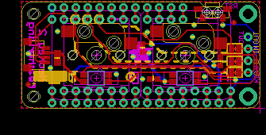
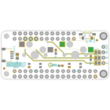
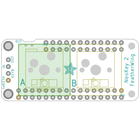
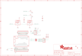

Contents
========

* [PRA4979 > Adafruit NeoKey FeatherWing PCB](#pra4979--adafruit-neokey-featherwing-pcb)
	* [Schematic](#schematic)
	* [PCB](#pcb)
	* [Interactive BOM](#interactive-bom)
	* [OOMP Parts](#oomp-parts)
	* [Images](#images)
	* [Tags](#tags)
  
![][im]
# PRA4979 > Adafruit NeoKey FeatherWing PCB

- ID: PROJ-ADAF-4979-STAN-01
- Hex ID: PRA4979
- Name: Adafruit
- Description: Adafruit
- Long Link: [http://oom.lt/PROJ-ADAF-4979-STAN-01](http://oom.lt/PROJ-ADAF-4979-STAN-01)
- Short Link: [http://oom.lt/PRA4979](http://oom.lt/PRA4979)

## Schematic
  

## PCB
  

## Interactive BOM

- Interactive BOM page: [ibom.html](https://htmlpreview.github.io/?https://github.com/oomlout/oomlout_OOMP_projects/blob/main/PROJ-ADAF-4979-STAN-01/kicad/bom/ibom.html)

## OOMP Parts
  

|OOMP Parts|
| :---: |
|[CAPC-0603-X-UF1-V25  SMD (0603) 1 uF Capacitor (Ceramic) 25v  C1](https://github.com/oomlout/oomlout_OOMP_parts/tree/main/CAPC-0603-X-UF1-V25/)|
|[CAPC-0805-X-UF10-V10  SMD (0805) 10 uF Capacitor (Ceramic) 10v  C2](https://github.com/oomlout/oomlout_OOMP_parts/tree/main/CAPC-0805-X-UF10-V10/)|
|HEAD-I01-X-UNMATCHED-01 CONN1|
|[HEAD-I01-X-PI04-01  2.54 mm 4 Pin Header  JP1](https://github.com/oomlout/oomlout_OOMP_parts/tree/main/HEAD-I01-X-PI04-01/)|
|[HEAD-I01-X-PI12-01  2.54 mm 12 Pin Header  JP5](https://github.com/oomlout/oomlout_OOMP_parts/tree/main/HEAD-I01-X-PI12-01/)|
|[HEAD-I01-X-PI16-01  2.54 mm 16 Pin Header  JP6](https://github.com/oomlout/oomlout_OOMP_parts/tree/main/HEAD-I01-X-PI16-01/)|
|[LEDS-3535-RGB-K2812-01  SMD (3535) Smart Controller (WS2812B) RGB LED  LED1, LED2](https://github.com/oomlout/oomlout_OOMP_parts/tree/main/LEDS-3535-RGB-K2812-01/)|
|UNMATCHED-UNMATCHED-X-UNMATCHED-01 MS1, SW1, SW2, SW3|
|RESE-0603-X-O1003-01 R1, R2|

## Images
  
  

|bominteractivefront|bominteractiveback|kicadPcb3d|kicadPcb3dFront|kicadPcb3dBack|eagleImage|eagleSchemImage|
| :---: | :---: | :---: | :---: | :---: | :---: | :---: |
||||||||

## Tags

- hexID: PRA4979
- oompType: PROJ
- oompSize: ADAF
- oompColor: 4979
- oompDesc: STAN
- oompIndex: 01
- oompName: Adafruit NeoKey FeatherWing PCB
- sources: All source files from https://github.com/adafruit/Adafruit-NeoKey-FeatherWing-PCB (source licence details in srcLicense.md)
- linkBuyPage: http://www.adafruit.com/products/4979
- oompID: PROJ-ADAF-4979-STAN-01
- oompParts: C1,CAPC-0603-X-UF1-V25
- oompParts: C2,CAPC-0805-X-UF10-V10
- oompParts: CONN1,HEAD-I01-X-UNMATCHED-01
- oompParts: JP1,HEAD-I01-X-PI04-01
- oompParts: JP5,HEAD-I01-X-PI12-01
- oompParts: JP6,HEAD-I01-X-PI16-01
- oompParts: LED1,LEDS-3535-RGB-K2812-01
- oompParts: LED2,LEDS-3535-RGB-K2812-01
- oompParts: MS1,UNMATCHED-UNMATCHED-X-UNMATCHED-01
- oompParts: R1,RESE-0603-X-O1003-01
- oompParts: R2,RESE-0603-X-O1003-01
- oompParts: SW1,UNMATCHED-UNMATCHED-X-UNMATCHED-01
- oompParts: SW2,UNMATCHED-UNMATCHED-X-UNMATCHED-01
- oompParts: SW3,UNMATCHED-UNMATCHED-X-UNMATCHED-01
- rawParts: C1,1uF,CAP_CERAMIC0603_NO,0603-NO,Ceramic Capacitors,,
- rawParts: C2,10uF,CAP_CERAMIC0805-NOOUTLINE,0805-NO,Ceramic Capacitors,,
- rawParts: CONN1,STEMMA_I2C_QT,STEMMA_I2C_QT,JST_SH4,,,
- rawParts: FID1,FIDUCIAL_1MM,FIDUCIAL_1MM,FIDUCIAL_1MM,Fiducial Alignment Points,EXCLUDE,
- rawParts: FID2,FIDUCIAL_1MM,FIDUCIAL_1MM,FIDUCIAL_1MM,Fiducial Alignment Points,EXCLUDE,
- rawParts: JP1,,HEADER-1X4ROUND,1X04_ROUND,PIN HEADER,,
- rawParts: JP5,,HEADER-1X12,1X12_ROUND,,,
- rawParts: JP6,,HEADER-1X16ROUND,1X16_ROUND,PIN HEADER,,
- rawParts: LED1,WS2812B_SK6812E,WS2812B_SK6812E,NEO3535_REVERSE,,,
- rawParts: LED2,WS2812B_SK6812E,WS2812B_SK6812E,NEO3535_REVERSE,,,
- rawParts: MS1,FEATHERWING_NODIM,FEATHERWING_NODIM,FEATHERWING_NODIM,,,
- rawParts: R1,100K,RESISTOR_0603_NOOUT,0603-NO,Resistors,,
- rawParts: R2,100K,RESISTOR_0603_NOOUT,0603-NO,Resistors,,
- rawParts: SJ1,,SOLDERJUMPERCLOSED,SOLDERJUMPER_CLOSEDWIRE,SMD Solder JUMPER,,
- rawParts: SJ2,,SOLDERJUMPERCLOSED,SOLDERJUMPER_CLOSEDWIRE,SMD Solder JUMPER,,
- rawParts: SJ3,,SOLDERJUMPERCLOSED,SOLDERJUMPER_CLOSEDWIRE,SMD Solder JUMPER,,
- rawParts: SW1,MX,SWITCH_PUSHBUTTON_KAILH_SOCKET,KAILH_SOCKET,Buttons,,
- rawParts: SW2,MX,SWITCH_PUSHBUTTON_KAILH_SOCKET,KAILH_SOCKET,Buttons,,
- rawParts: SW3,,SWITCH_SPST_TACT_RA,SPST_TACTILE_RA,Switch - SPST,,

[im]: kicadPcb3d_450.png
