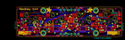

Contents
========

* [PROJ-ADAF-4980-STAN-01>Adafruit NeoKey 1x4 PCB](#proj-adaf-4980-stan-01adafruit-neokey-1x4-pcb)
	* [Images](#images)
	* [Interactive BOM](#interactive-bom)
	* [Tags](#tags)
  
![][im]
# PROJ-ADAF-4980-STAN-01>Adafruit NeoKey 1x4 PCB

- ID: PROJ-ADAF-4980-STAN-01
- Hex ID: PRA4980
- Name: Adafruit NeoKey 1x4 PCB
- Description: 

## Images
  
  

|eagleImage|
| :---: |
||

## Interactive BOM

- Interactive BOM page: [ibom.html](kicad/bom/ibom.html)

## Tags

- hexID: PRA4980
- oompType: PROJ
- oompSize: ADAF
- oompColor: 4980
- oompDesc: STAN
- oompIndex: 01
- oompName: Adafruit NeoKey 1x4 PCB
- sources: All source files from https://github.com/adafruit/Adafruit-NeoKey-1x4-PCB (source licence details in srcLicense.md)
- linkBuyPage: http://www.adafruit.com/products/4980
- oompPart: CAPC-0603-X-UNMATCHED-01, C1, 63.8175, 8.8265, 90
- oompPart: CAPC-0805-X-UF10-V25, C2, 60.959999999999994, 8.128, 0
- oompPart: CAPC-0805-X-UF10-V25, C3, 54.546499999999995, 8.382, 270
- oompPart: CAPC-0603-X-NF100-V50, C4, 58.1025, 11.43, 0
- oompPart: CAPC-0603-X-UNMATCHED-01, C5, 50.35549999999999, 8.1915, 0
- oompPart: CAPC-0603-X-UNMATCHED-01, C6, 24.3205, 5.7785, 270
- oompPart: CAPC-0603-X-UNMATCHED-01, C7, 6.604, 8.762999999999998, 90
- oompPart: UNMATCHED-UNMATCHED-X-UNMATCHED-01, CONN3, 2.54, 7.619999999999999, 270
- oompPart: UNMATCHED-UNMATCHED-X-UNMATCHED-01, CONN4, 73.66, 7.619999999999999, 90
- oompPart: UNMATCHED-UNMATCHED-X-UNMATCHED-01, D2, 74.3585, 17.0815, 90
- oompPart: SKIP-UNMATCHED-X-UNMATCHED-01, FID1, 71.374, 20.447, 0
- oompPart: SKIP-UNMATCHED-X-UNMATCHED-01, FID2, 1.3335, 12.2555, 0
- oompPart: UNMATCHED-UNMATCHED-X-UNMATCHED-01, IC2, 39.49699999999999, 8.128, 180
- oompPart: UNMATCHED-UNMATCHED-X-UNMATCHED-01, IC3, 61.340999999999994, 4.6354999999999995, 0
- oompPart: UNMATCHED-UNMATCHED-X-UNMATCHED-01, JP1, 38.099999999999994, 19.685, 180
- oompPart: UNMATCHED-UNMATCHED-X-UNMATCHED-01, JP5, 38.099999999999994, 1.9049999999999998, M0
- oompPart: UNMATCHED-UNMATCHED-X-UNMATCHED-01, LED1, 66.675, 5.715, M0
- oompPart: UNMATCHED-UNMATCHED-X-UNMATCHED-01, LED2, 47.751999999999995, 5.715, M0
- oompPart: UNMATCHED-UNMATCHED-X-UNMATCHED-01, LED3, 28.575, 5.715, M0
- oompPart: UNMATCHED-UNMATCHED-X-UNMATCHED-01, LED4, 9.652, 5.715, M0
- oompPart: UNMATCHED-UNMATCHED-X-UNMATCHED-01, Q2, 14.985999999999999, 8.254999999999999, 90
- oompPart: RESE-0603-X-O103-01, R1, 74.3585, 15.620999999999999, 0
- oompPart: RESE-0603-X-O103-01, R2, 57.975500000000004, 5.842, 0
- oompPart: RESE-UNMATCHED-X-O103-01, R3, 14.858999999999998, 4.064, 0
- oompPart: RESE-0603-X-O103-01, R7, 20.193, 6.731, 180
- oompPart: UNMATCHED-UNMATCHED-X-UNMATCHED-01, SJ2, 40.513, 12.446, 90
- oompPart: UNMATCHED-UNMATCHED-X-UNMATCHED-01, SJ3, 38.480999999999995, 12.446, 90
- oompPart: UNMATCHED-UNMATCHED-X-UNMATCHED-01, SJ4, 33.591499999999996, 8.762999999999998, 180
- oompPart: UNMATCHED-UNMATCHED-X-UNMATCHED-01, SJ5, 33.7185, 6.731, 180
- oompPart: UNMATCHED-UNMATCHED-X-UNMATCHED-01, SW1, 9.524999999999999, 10.795, M0
- oompPart: UNMATCHED-UNMATCHED-X-UNMATCHED-01, SW2, 28.575, 10.795, M0
- oompPart: UNMATCHED-UNMATCHED-X-UNMATCHED-01, SW3, 47.625, 10.795, M0
- oompPart: UNMATCHED-UNMATCHED-X-UNMATCHED-01, SW4, 66.675, 10.795, M0
- oompPart: UNMATCHED-UNMATCHED-X-UNMATCHED-01, TP5, 23.4315, 8.4455, 0
- oompPart: UNMATCHED-UNMATCHED-X-UNMATCHED-01, TP6, 21.081999999999997, 8.4455, 0
- oompPart: UNMATCHED-UNMATCHED-X-UNMATCHED-01, TP7, 25.8445, 8.4455, 0
- oompPart: SKIP-UNMATCHED-X-UNMATCHED-01, U$3, 57.15, 19.049999999999997, 0
- oompPart: SKIP-UNMATCHED-X-UNMATCHED-01, U$17, 19.049999999999997, 19.049999999999997, 0
- oompPart: SKIP-UNMATCHED-X-UNMATCHED-01, U$19, 57.15, 2.54, 0
- oompPart: SKIP-UNMATCHED-X-UNMATCHED-01, U$21, 19.049999999999997, 2.54, 0
- oompPart: UNMATCHED-UNMATCHED-X-UNMATCHED-01, U2, 57.34049999999999, 8.6995, 0
- rawPart: 

[im]: eagleImage_450.png
